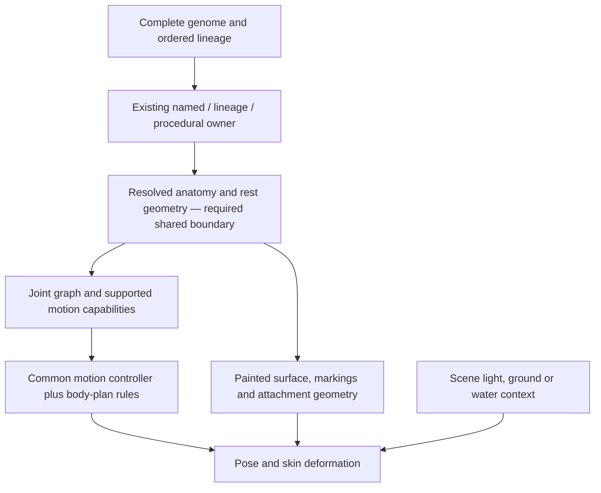

# Creature animation — shared anatomy and motion contract

Matches code as of 2026-09-14. C2 source **61512b3a** passes the independently enumerated
87 pair contacts and 64 three/four-owner junctions at all five native poses. All three masters
retain zero changed rest channels; CPU update p95 is 0.80/0.90/0.40 ms (Civet/fox/procedural).
This is coverage and update-time evidence, not whole-motion acceptance. Full posed images still
show hard cut/overlap edges and stretched paint. No new ten-second articulated capture is qualified.
See [current evidence](audits/C2_DEFORMING_SEAMS_20260914/native-hinges-03/report.json) and
[combined review](audits/CROSS_PACKAGE_PROGRESS_20260914/README.md).

The target is fluid whole-body motion for named and procedural land, air, aquatic and rooted life
in seeded biome arenas. Preserve the actual painted anatomy, stable joint inventories and recipe
identity. Blender projection is abandoned for the browser; retain the turnaround/canid master for
a later engine port. No 3D or texture-finisher pass belongs to this track.

Art Kit v4.3 and supplied Motion/Sound v1 are approved; no wording changes are pending in this batch.
Arena template v1 is accepted. Wild v4.3 mechanical intake is complete; Nick owns final image acceptance.
GSAP 3.15.0, the Pixi 8 seeded emitter and one deterministic atlas per creature are the runtime/tooling
boundary. The incompatible @pixi/particle-emitter is removed. Atlas core 0.3.9/CLI 0.3.0 use sorted,
hash-bound copies, four-pixel padding, one-pixel extrusion and no timestamps. Originals remain intact.
The 2048 atlas, 40 drawable and 8% contact bounds are unchanged. Claude owns motion/, effects/,
battle2/, soundkit/, worldlife/ and their tests; this lane consumes those modules read-only.

## Current presentation priority — Nick, September 8

Landing now targets a large cohesive static painting, as shown in the explicitly selected
[Living Worlds reference](audits/MIDGAME_ART_DIRECTION_20260908/02-inhabited-worlds.png). Multiple
flora/fauna may inhabit the painting, but live landing motion is not needed now. Compendium retains
the same individual/species identity; articulated 2D battle motion with suggested depth is the next
animation presentation target. The common anatomy/skin contract below therefore remains necessary
for battle variety, with landing articulation deferred. This replaces the earlier implied priority
of animating every resident in the vista. It does not convert a flat painting into a complete rig.

Author complete organism assets and the environment with shared resolved identity/material/light
metadata; flatten their matched landing composition while retaining the separate source assets.
Existing collection, healing/properties and classification data stay independent of image pixels.
[Recorded decision and bounded pilot](audits/STATIC_LANDING_PORTRAIT_20260908/DIRECTION_DECISION.md).

## Current implementation and the missing boundary

The hash-bound Civet and fox records plus one painter-observed procedural quadruped have real
parts, deterministic atlases and native rest parity. The procedural material observer reports the
skin actually painted (translucent in the proof), not a fur fallback. The rig loads original-pixel
parts, composes inherited joint transforms, constrains planted contact and applies seam geometry.
PoseTarget rotations use the record's names; root offsets are body-length units. The frame adapter
collects a full pose before applying it. It has not been adopted by Claude's live battle scene here.

Candidate07 adds boundary strips and multi-owner point closures to existing drawables. A closure
uses opaque original descendant ink and collapses at rest. The native gate independently enumerates
contacts and point junctions; it does not assess natural texture flow or the whole moving silhouette.
Hard cut edges, overlap artifacts and stretched paint remain visible. Numeric coverage is insufficient.

The production gap remains a resolved anatomy/parts record emitted by every actual winning painter
and a shape-qualified skin/controller consuming it. Only three quadruped proof records exist; the
fourteen published motion templates are not fourteen functioning painter integrations. Unsupported
anatomy refuses or uses the explicitly labelled portrait fallback. No per-seed image generation or
per-creature motion-curve edits are part of this design. See the
[coverage inventory](audits/C2_DEFORMING_SEAMS_20260914/FAMILY_COVERAGE.md).

## Authoritative documents and source order

- [SPECIES_AND_GENOME](SPECIES_AND_GENOME.md) describes the pinned genes, descriptors, named Earth
  overlay and lineage rules. Its raw trait tables describe the genome vocabulary, not guaranteed
  modern drawing geometry.
- [PROCEDURAL_CHARACTERISTICS](PROCEDURAL_CHARACTERISTICS.md) is the non-Earth trait/pass map Nick
  recalled. Its B15/hdGenesFor assessments are dated legacy observations; its current V2 routing
  overlay and actual source take precedence for a new adapter.
- [ART_DIRECTION](ART_DIRECTION.md) folds in the Earth fauna/botanical bibles, per-family anatomy
  rules and supplied painted sheets. The sheets establish richness and recognizable organisms;
  they do not contain every joint, hidden surface, gait or generated variation.
- [BIOME_ATLAS](BIOME_ATLAS.md) selects scene/ecology context. Its coarse fauna families are not a
  skeleton taxonomy. Scene placement and medium must not rewrite the encountered organism.
- [Exact source inventory](audits/CIVET_PAINTED_PARTS_20260908/SOURCE_TAXONOMY.md) records the dated
  precedence, source hashes, type fields and pre-existing conflicts for Claude.

Current winning route:

`speciespainter.ts` tries `resolveOverrideCanvas` before its lineage-selected HD fallback.
`speciesoverrides.ts` preserves exact kingdom/name ownership, then reviewed lineage and procedural
precedence. Named `CANON` entries precede fauna tables; specialized fauna painters precede generic
quadruped specs. Quadrupeds themselves can select later whole-form mammal, pinniped or glider
owners. Unreviewed fauna lineages retain their compatibility route; Sea Turtle and Great White
Shark must not silently migrate. `speciesVisualKey` binds the complete genome, not just seed/name.

## One rig format, several body-plan adapters

These are required capabilities, not completed runtime coverage. Each adapter emits only anatomy
actually supported by its winning owner. Variable appendage arrays replace assumptions about two
arms, four legs or one tail. Bilateral symmetry is optional: odd limb counts and radial arrays are
valid when the resolved anatomy has them.

| Resolved anatomy | Reusable parts/joints | Motion rules that differ |
| --- | --- | --- |
| Grounded quadruped or multi-legged alien | torso/spine, neck/head, repeated hip/knee/ankle or shoulder/elbow/wrist chains, optional tail | Stance/swing phases by limb role and pair index; foot support and body weight transfer; species joint limits and proportions |
| Biped/primate or grasping arms | pelvis/torso, two support chains, independent arm/hand chains, neck/head | Balance over support feet; arms reach or react independently rather than inheriting leg gait |
| Arthropod/myriapod/crustacean | segmented trunk, variable jointed leg array, antennae/claws, optional wings | Segment-relative phase offsets, appropriate support groups, claw/antenna secondary motion; no mammalian knees by default |
| Feathered bird | spine/neck/head, wing shoulder/elbow/wrist and feather fan, legs/talons, tail | Flap/fold/glide/perch only when supported; flightless bird does not flap to fly; swimmer uses its supported paddling posture |
| Bat or gliding mammal | mammalian torso and limbs, finger-supported membrane or patagium | Membrane follows its support joints; a glider is not automatically a powered flier |
| Flying insect | thorax/abdomen, actual wing count, wing roots, six legs when resolved | Wing stroke and body stabilization; legs tuck/land with their own timing |
| Fish/eel/ribbon swimmer | axial chain, caudal fin, named dorsal/pectoral/pelvic fins as present | Tail/body wave, fin steering and roll; body depth and flexibility control amplitude; no planted-foot solver |
| Cetacean/sirenian/pinniped | axial body, fluke or flippers as actually drawn, head/neck constraints | Distinguish fluke stroke from fish tail stroke; pinniped land and water use different supported motions on the same anatomy |
| Amphibian/water-associated reptile | preserved limb/shell/body plan and optional tail | Ground support, swimming strokes and waterline transitions share identity; being near water does not turn it into a fish |
| Serpentine/gastropod | continuous axial or foot/body chain; sensory appendages as present | Traveling bend or contraction; no invented arms or leg cycle |
| Cephalopod/tentacled/radial | mantle/body plus independently rooted flexible chains, actual appendage count | Tentacle waves, curl/extension and supported propulsion; radial indexing instead of fore/hind leg assumptions |
| Jelly/soft colonial/sessile fauna | bell/volume controls, flexible fringe, or fixed substrate root | Pulse and current response; fixed organisms do not acquire locomotion |
| Flora and alien growth | rooted stem/trunk/branch graph, leaf/frond/pod attachments | Wind/current bending along supporting structures; roots stay attached; no animal skeleton imposed on a plant |

A creature can support several media. Use explicit capabilities such as ground support, powered
flight, gliding, swimming, surface paddling or sessile current response, derived from resolved
anatomy and reviewed species rules. The scene chooses among those capabilities; it does not infer
all of them from a name containing “flying” or from a broad aquatic biome. Flying Gurnard display
fins, Flying Fish gliding fins, bat wings and bird wings are distinct cases.

## Required resolved record

The future versioned `ResolvedCreatureRig` boundary must carry:

1. **Identity and provenance:** detached complete genome, ordered lineage, exact visual key,
   winning owner/spec/version, source bindings and the normalized art-fit transform. Reject
   unsupported descriptors/accessors before invoking arbitrary getters. No new RNG draw.
2. **Anatomy graph:** stable part and joint IDs, parent IDs, semantic roles, repeat/side/segment
   indices, rest transforms, attachment frames, lengths/radii, bend directions and joint limits.
   Topology comes from generated anatomy; a zero-limb organism emits no walking-leg chains.
3. **Skin and paint:** generated mesh/path surfaces, local material coordinates, bounded joint
   weights, overlap/depth order and the hidden patches needed for the supported view. One shared
   skin/light treatment must hide joints without erasing species-specific masses or markings.
4. **Contact and movement capabilities:** actual foot/claw/fin/tentacle contact patches, support
   sets, allowed media, propulsion axis, hinge versus flexible-chain behavior and available clips.
5. **Resource and fallback contract:** bounded vertex/texture ownership, validated asset hashes,
   supported view/quality tier, exact rest pose and a reasoned static fallback when incomplete.

The existing `torso.ts` Tube/Frame surface already provides spine position, tangent, radius and
surface coordinates for applicable families. Expose the actual owner’s generated geometry instead
of fitting a generic skeleton after rasterization. D-ART-83 remains binding: share the anatomical
vocabulary, preserve each species’ actual values. The same seed/complete genome must reconstruct
the same rest anatomy, markings, attachments and rig recipe across devices and save/load.

## How motion scales across variations

Animate semantic controls such as head look, torso compression, support shift, reach, wing stroke,
axial wave and reaction. A family adapter maps these into its available joints. Retargeting uses
actual lengths and rest angles, so a short leg and a stilt leg do not move through the same pixels.
A two-bone solver can hold an endpoint or reach a target; a longer flexible chain distributes a
traveling bend. Membranes follow their support joints; jelly bells need volume/pulse controls.
These operations share a controller and graph format, while preserving biological differences.

Use separate phase curves for head, chest, hips, appendages and tail. Reaction, attack, breathing,
flight and swimming cannot be the same recoil curve with a different button label. Tail and loose
surfaces follow rather than moving in lockstep. A gait must actually lift/place supported feet;
a planted reaction should instead preserve its contact patches. Do not claim walking from a mesh
that freezes every lower leg, or fluidity merely from changed pixel counts.

Pose sampling is a pure function of validated rig, explicit clip state/time and motion policy.
Controller clocks stay outside generation. World movement/capture/combat outcomes remain with
their gameplay owners; animation reflects outcomes and never awards rewards or mutates lineage.
Reduced motion/Effects off/hidden and disposal use the existing policy boundary and exact static
rest. Dense lists remain static; animated detail or scene owners must have measured mobile budgets,
one scheduling owner, deterministic cancellation and complete buffer/texture retirement.

## Making the creature part of the painting

Paint and motion must share geometry. Markings attach to body-local surface coordinates, with
continuous fur/feather/scale direction and overlapping muscle masses across joints. Author reusable
family materials and supported parts; derive per-genome geometry, colors and marks deterministically.
Do not ask the generator for a new animal or animation sheet for every seed.

Match scene light direction, diffuse highlight width, reflected ground/water color, contrast and
edge softness at the animal’s scale. Contact shadows, narrow water occlusion and appropriate
foreground overlap belong to the same scene owner. Reflections require actual composition/material
support. Preserve natural Earth colors and seeded alien palettes; a scene grade must not substitute
for richer underlying painting or unify all species into one body. Review both close portrait and
actual phone/landscape scale. The supplied sheets remain the quality reference, not proof that
an extracted texture or rendered bone solver has reached that quality.

## Existing conflicts that must not be silently repaired

Modern `planFor` uses raw locomotion modulo 18, including for extremophiles whose descriptors use
`EX_LOCO` modulo 9. It ignores raw `limbs`, `eyes`, `trait`, `habitat` and `x` for plan selection.
Thus some current descriptors and drawings disagree. Swimming indices 4/13 select fish before
body preservation. Body14 plus glider selects a bird with no four-wing option; other body14 routes
to an open-wing insect. Modern quadruped leg-pair counts come from body/locomotion, and radial fauna
has ten arms. The old descriptor/HD fallback rules do not override those current routes.

Record these as presentation conflicts for a separately scoped correction. Do not resize/reorder
trait pools, re-roll genomes, rewrite inherited identity or silently “fix” anatomy as a side effect
of animation. Preserve the actual static owner when a faithful adapter is not qualified. Global
D-9e biome/generation coverage remains open; this architecture does not repair it.

## Remaining acceptance sequence

1. Remove visible joint/overlap distortions while preserving exact rest, real clips and anatomical bounds.
2. Recheck independent contact/junction coverage and full posed shapes, then ten-second Civet, fox and
   procedural captures with the accepted arena, shared timing and zero per-creature curve edits.
3. Complete battle2 frame-adapter integration in its owning lane; measure staged-turn behavior and
   frame pacing, not just CPU update duration. Existing portrait-fallback captures remain labelled.
4. Add actual painter-owned parts and records family by family, with material/identity parity and
   explicit unsupported anatomy. The next approved families are bird, fish, insect and reptile.
5. Review new media and family reuse at each required stop. Phone animation budget remains unqualified.

Historical failures, commands and receipts remain in audits/C2_* and the chronological roadmap archive.
They explain the repairs; they do not override the current qualification above.
