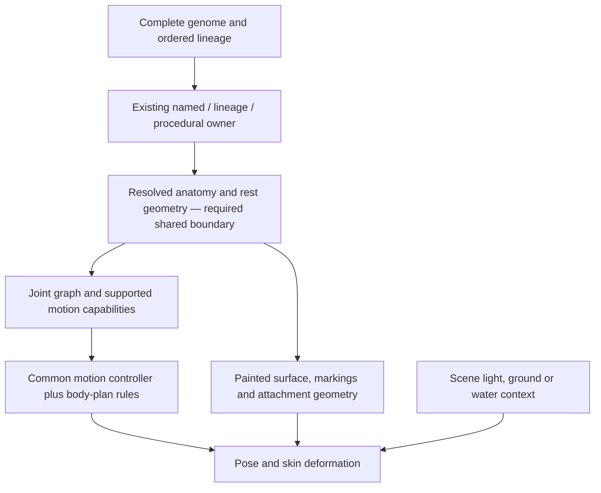

# Creature animation — shared anatomy and motion contract

**Pack2 / material observer, September13:** CONTRACTS.md§§2/5/6 fixes C2's joint vocabulary
and Claude engine surfaces. The observer now reports the selected alien skin before its coat
fallback, matching actual paint routing; named Earth anatomy and draw commands unchanged.
Tests and scope: [C2 prerequisite](audits/C2_MATERIAL_OBSERVER_20260913/README.md). Old captured
records remain historical; the next procedural proof emits a fresh corrected record. No rig,
new capture or integration of Claude's four engines is claimed.

**Current September12 direction:** arena template v1 accepted, Wild shapes/phases accepted
but the first palette rejected. v4.3 is now adopted and one three-phase repaint awaits Nick's
image review at audits/WILD_V43_PROOF_20260913 before the parts-rig turn.
Motion frozen paragraphs are approved; revised world-life Motion Kit received verbatim on September13.
Use §§3–6 resolved body-card/timing rules and report gaps when building. No named-anatomy
fields were invented. @pixi/particle-emitter removed; [seeded-battle-emitter.ts](port/v2/apps/game/src/seeded-battle-emitter.ts)
uses the existing Pixi8 ParticleContainer, recipe seed and absolute elapsed time. Tested in
Node against real Pixi objects; browser rendering/performance and battle wiring are pending.
This supersedes the earlier tooling compatibility/pending-frozen-approval text below.

**Motion Kit v1 intake — September13:** [MOTION_KIT.md](MOTION_KIT.md) is the supplied world-life
revision, committed verbatim in8a2dfdc0. Its PROPOSED labels remain source text; Nick has approved
v1 and its frozen paragraphs. Compile the parts-rig body card from the winning painter's
resolved anatomy using §§3–6, including mass-scaled timings; report missing fields rather than
reading named Earth genes. The initial record-gap audit remains at
[audits/MOTION_SOUND_KITS_20260912/ADOPTION.md](audits/MOTION_SOUND_KITS_20260912/ADOPTION.md).
C1 now awaits review of the repainted Wild phases. No runtime animation change in this batch.
Claude owns motion/, effects/, battle2/, soundkit/, worldlife/ and their tests.

**Current browser track — matches code as of 2026-09-12:** Blender projection remains
abandoned; retain turnaround/canid masters for the later engine port. The continuous-mesh
[quadruped attempt](audits/CIVET_2D_PROOF_20260912/README.md) preserves exact rest pixels but
fails shape at clip extremes. Native fb008d58 provides ten-second, 60 fps labelled
whole-portrait fallback captures; these do not qualify articulated motion. No normal-game
battle animation changed.

**Tooling configured September 12:** game-app GSAP 3.15.0 owns the forthcoming shared pose
curves through paused timelines and explicit time. @pixi/particle-emitter 5.0.10 is pinned for
travel/impact, with its Pixi 6/7 peer boundary and seeded-time integration unresolved against
Pixi 8.19.0. No direct runtime attachment yet. The [atlas command](port/v2/tools/creature-animation/rig-atlas.mjs)
uses CLI 0.3.0/core 0.3.9 with sorted, hash-checked copies, 4 px padding and 1 px extrusion,
exactly one atlas, no timestamps; only synthetic parts have been packed. PNG masters remain
immutable; optimize copies only. [Current tooling contract](UI_TOOLCHAIN.md).

**Current direction, art candidates await acceptance:** Nick approved v4.2 from d2b8d8cd
with FAR opaque, MID/NEAR on magenta (no extracted masks), shared ground y=0.78 and Effects
anchor JSON. The [six painted candidates](audits/ARENA_EFFECTS_V42_PROOF_20260912/README.md)
are saved; active kit updated, frozen style/4E unchanged. Stop before staging until Nick
accepts the three plates and Wild sequence. Then parts-rig Civet versus Platypus in this
procedural Earth arena, followed by ten-second captures for Civet, fox and procedural control.
The previous proposed continuous-mesh repair is superseded. Share strong pose curves with
60 fps tweening, easing, anticipation, overshoot and secondary motion (phone budget 30 fps).
Use battle-context seeds and compiler-filled home-world cards, never the clock; wild home,
guardian lair/One signature, seeded alternating duel hosts. Phone composes without a finisher;
desktop may finish. Preserve originals. Full compiler, tempo and framing contract is in the
proposal. Authored parts remain hash-bound asset data; procedural parts follow the winning
painter. No per-creature clip edits, new 3D projection or texture-finisher passes.
Do not infer universal family coverage, hidden-surface reconstruction or accepted motion.

**Nick's September 12 approved order:** v4 at `6f5c396e` is approved. ART_KIT §9
now limits first authoring to the Earth temperate plate, six Earth cut-outs and five
family references, then the measured engine painting. Inspect first cut-outs for
Atlas frames/dark backgrounds and stop with a proposed v4.1 sentence if present.
Keep 4E turnaround unchanged. After painting acceptance, the [Animation and battle
track](audits/CLAUDE_FULL_REVIEW_20260910/CODEX_HANDOFF.md#animation-and-battle-track)
(Civet proof, family masters/textures/clips and staged turns) precedes full-library
rollout. Effects now await the separately proposed v4.2 class above. This order supersedes
earlier full-library-first or v4-awaiting-approval language below.

Matches the source inventory as of **2026-09-08 local**. Nick’s requirement is a shared procedural
animation system for land, flying and aquatic life, including generated variations and descendants.
This reference describes the required architecture and the explicitly limited implementation below.
It is not a claim that every family is rigged or that the current game has articulated locomotion.

## Standalone desert ambience study — September 9

Nick requested a preview animating one local AI desert painting. The [12-second media study](audits/LOCAL_AI_DESERT_MOTION_20260909/README.md)
adds camera drift, dust and screen-space heat haze to the unchanged PNG. Source remains flattened;
creatures stay in fixed poses. No layer extraction, anatomy mapping, universal rig or game adapter
was implemented. This scoped preview does not replace the static-landing priority below. The native
loop and preview-control evidence is separate from game or physical-phone qualification.

## Current presentation priority — Nick, September 8

Landing now targets a large cohesive static painting, as shown in the explicitly selected
[Living Worlds reference](audits/MIDGAME_ART_DIRECTION_20260908/02-inhabited-worlds.png). Multiple
flora/fauna may inhabit the painting, but live landing motion is not needed now. Compendium retains
the same individual/species identity; articulated 2D battle motion with suggested depth is the next
animation presentation target. The common anatomy/skin contract below therefore remains necessary
for battle variety, with landing articulation deferred. This replaces the earlier implied priority
of animating every resident in the vista. It does not convert a flat painting into a complete rig.

Author complete organism assets and the environment with shared resolved identity/material/light
metadata; flatten their matched landing composition while retaining the separate source assets.
Existing collection, healing/properties and classification data stay independent of image pixels.
[Recorded decision and bounded pilot](audits/STATIC_LANDING_PORTRAIT_20260908/DIRECTION_DECISION.md).

## Current implementation and the missing boundary

The game already resolves a complete immutable genome into a named, lineage-owned or procedural
whole-form painter. Those painters draw anatomy directly into a flattened Canvas2D image. They do
not yet publish a common joint graph, separate hidden surfaces or animation-ready skin.
The Wolf/Civet authoring studies are specific experimental assets. A generated parts atlas is not
a solution for the combinatorial creature population. No per-seed image-generation job or manually
authored animation per creature is part of this architecture.

`port/v2/tools/creature-animation/kinematics.ts` is the first isolated mathematical foundation:
shared joint/transform/chain operations over supplied geometry. It is tooling, not a native game
adapter or qualified gait set. Its focused test results belong to
`audits/CIVET_PAINTED_PARTS_20260908/`. It does not decide an organism’s anatomy from raw genes,
change genomes or make the existing flattened painters animation-ready by itself.

The missing production boundary is **one resolved anatomy record emitted by the actual winning
painter owner and consumed by both painted geometry and its rig**. Never maintain a second loose
name-to-skeleton classifier that can disagree with the body the player sees.

## Authoritative documents and source order

- [SPECIES_AND_GENOME](SPECIES_AND_GENOME.md) describes the pinned genes, descriptors, named Earth
  overlay and lineage rules. Its raw trait tables describe the genome vocabulary, not guaranteed
  modern drawing geometry.
- [PROCEDURAL_CHARACTERISTICS](PROCEDURAL_CHARACTERISTICS.md) is the non-Earth trait/pass map Nick
  recalled. Its B15/hdGenesFor assessments are dated legacy observations; its current V2 routing
  overlay and actual source take precedence for a new adapter.
- [ART_DIRECTION](ART_DIRECTION.md) folds in the Earth fauna/botanical bibles, per-family anatomy
  rules and supplied painted sheets. The sheets establish richness and recognizable organisms;
  they do not contain every joint, hidden surface, gait or generated variation.
- [BIOME_ATLAS](BIOME_ATLAS.md) selects scene/ecology context. Its coarse fauna families are not a
  skeleton taxonomy. Scene placement and medium must not rewrite the encountered organism.
- [Exact source inventory](audits/CIVET_PAINTED_PARTS_20260908/SOURCE_TAXONOMY.md) records the dated
  precedence, source hashes, type fields and pre-existing conflicts for Claude.

Current winning route:

`speciespainter.ts` tries `resolveOverrideCanvas` before its lineage-selected HD fallback.
`speciesoverrides.ts` preserves exact kingdom/name ownership, then reviewed lineage and procedural
precedence. Named `CANON` entries precede fauna tables; specialized fauna painters precede generic
quadruped specs. Quadrupeds themselves can select later whole-form mammal, pinniped or glider
owners. Unreviewed fauna lineages retain their compatibility route; Sea Turtle and Great White
Shark must not silently migrate. `speciesVisualKey` binds the complete genome, not just seed/name.

## One rig format, several body-plan adapters

These are required capabilities, not completed runtime coverage. Each adapter emits only anatomy
actually supported by its winning owner. Variable appendage arrays replace assumptions about two
arms, four legs or one tail. Bilateral symmetry is optional: odd limb counts and radial arrays are
valid when the resolved anatomy has them.

| Resolved anatomy | Reusable parts/joints | Motion rules that differ |
| --- | --- | --- |
| Grounded quadruped or multi-legged alien | torso/spine, neck/head, repeated hip/knee/ankle or shoulder/elbow/wrist chains, optional tail | Stance/swing phases by limb role and pair index; foot support and body weight transfer; species joint limits and proportions |
| Biped/primate or grasping arms | pelvis/torso, two support chains, independent arm/hand chains, neck/head | Balance over support feet; arms reach or react independently rather than inheriting leg gait |
| Arthropod/myriapod/crustacean | segmented trunk, variable jointed leg array, antennae/claws, optional wings | Segment-relative phase offsets, appropriate support groups, claw/antenna secondary motion; no mammalian knees by default |
| Feathered bird | spine/neck/head, wing shoulder/elbow/wrist and feather fan, legs/talons, tail | Flap/fold/glide/perch only when supported; flightless bird does not flap to fly; swimmer uses its supported paddling posture |
| Bat or gliding mammal | mammalian torso and limbs, finger-supported membrane or patagium | Membrane follows its support joints; a glider is not automatically a powered flier |
| Flying insect | thorax/abdomen, actual wing count, wing roots, six legs when resolved | Wing stroke and body stabilization; legs tuck/land with their own timing |
| Fish/eel/ribbon swimmer | axial chain, caudal fin, named dorsal/pectoral/pelvic fins as present | Tail/body wave, fin steering and roll; body depth and flexibility control amplitude; no planted-foot solver |
| Cetacean/sirenian/pinniped | axial body, fluke or flippers as actually drawn, head/neck constraints | Distinguish fluke stroke from fish tail stroke; pinniped land and water use different supported motions on the same anatomy |
| Amphibian/water-associated reptile | preserved limb/shell/body plan and optional tail | Ground support, swimming strokes and waterline transitions share identity; being near water does not turn it into a fish |
| Serpentine/gastropod | continuous axial or foot/body chain; sensory appendages as present | Traveling bend or contraction; no invented arms or leg cycle |
| Cephalopod/tentacled/radial | mantle/body plus independently rooted flexible chains, actual appendage count | Tentacle waves, curl/extension and supported propulsion; radial indexing instead of fore/hind leg assumptions |
| Jelly/soft colonial/sessile fauna | bell/volume controls, flexible fringe, or fixed substrate root | Pulse and current response; fixed organisms do not acquire locomotion |
| Flora and alien growth | rooted stem/trunk/branch graph, leaf/frond/pod attachments | Wind/current bending along supporting structures; roots stay attached; no animal skeleton imposed on a plant |

A creature can support several media. Use explicit capabilities such as ground support, powered
flight, gliding, swimming, surface paddling or sessile current response, derived from resolved
anatomy and reviewed species rules. The scene chooses among those capabilities; it does not infer
all of them from a name containing “flying” or from a broad aquatic biome. Flying Gurnard display
fins, Flying Fish gliding fins, bat wings and bird wings are distinct cases.

## Required resolved record

The future versioned `ResolvedCreatureRig` boundary must carry:

1. **Identity and provenance:** detached complete genome, ordered lineage, exact visual key,
   winning owner/spec/version, source bindings and the normalized art-fit transform. Reject
   unsupported descriptors/accessors before invoking arbitrary getters. No new RNG draw.
2. **Anatomy graph:** stable part and joint IDs, parent IDs, semantic roles, repeat/side/segment
   indices, rest transforms, attachment frames, lengths/radii, bend directions and joint limits.
   Topology comes from generated anatomy; a zero-limb organism emits no walking-leg chains.
3. **Skin and paint:** generated mesh/path surfaces, local material coordinates, bounded joint
   weights, overlap/depth order and the hidden patches needed for the supported view. One shared
   skin/light treatment must hide joints without erasing species-specific masses or markings.
4. **Contact and movement capabilities:** actual foot/claw/fin/tentacle contact patches, support
   sets, allowed media, propulsion axis, hinge versus flexible-chain behavior and available clips.
5. **Resource and fallback contract:** bounded vertex/texture ownership, validated asset hashes,
   supported view/quality tier, exact rest pose and a reasoned static fallback when incomplete.

The existing `torso.ts` Tube/Frame surface already provides spine position, tangent, radius and
surface coordinates for applicable families. Expose the actual owner’s generated geometry instead
of fitting a generic skeleton after rasterization. D-ART-83 remains binding: share the anatomical
vocabulary, preserve each species’ actual values. The same seed/complete genome must reconstruct
the same rest anatomy, markings, attachments and rig recipe across devices and save/load.

## How motion scales across variations

Animate semantic controls such as head look, torso compression, support shift, reach, wing stroke,
axial wave and reaction. A family adapter maps these into its available joints. Retargeting uses
actual lengths and rest angles, so a short leg and a stilt leg do not move through the same pixels.
A two-bone solver can hold an endpoint or reach a target; a longer flexible chain distributes a
traveling bend. Membranes follow their support joints; jelly bells need volume/pulse controls.
These operations share a controller and graph format, while preserving biological differences.

Use separate phase curves for head, chest, hips, appendages and tail. Reaction, attack, breathing,
flight and swimming cannot be the same recoil curve with a different button label. Tail and loose
surfaces follow rather than moving in lockstep. A gait must actually lift/place supported feet;
a planted reaction should instead preserve its contact patches. Do not claim walking from a mesh
that freezes every lower leg, or fluidity merely from changed pixel counts.

Pose sampling is a pure function of validated rig, explicit clip state/time and motion policy.
Controller clocks stay outside generation. World movement/capture/combat outcomes remain with
their gameplay owners; animation reflects outcomes and never awards rewards or mutates lineage.
Reduced motion/Effects off/hidden and disposal use the existing policy boundary and exact static
rest. Dense lists remain static; animated detail or scene owners must have measured mobile budgets,
one scheduling owner, deterministic cancellation and complete buffer/texture retirement.

## Making the creature part of the painting

Paint and motion must share geometry. Markings attach to body-local surface coordinates, with
continuous fur/feather/scale direction and overlapping muscle masses across joints. Author reusable
family materials and supported parts; derive per-genome geometry, colors and marks deterministically.
Do not ask the generator for a new animal or animation sheet for every seed.

Match scene light direction, diffuse highlight width, reflected ground/water color, contrast and
edge softness at the animal’s scale. Contact shadows, narrow water occlusion and appropriate
foreground overlap belong to the same scene owner. Reflections require actual composition/material
support. Preserve natural Earth colors and seeded alien palettes; a scene grade must not substitute
for richer underlying painting or unify all species into one body. Review both close portrait and
actual phone/landscape scale. The supplied sheets remain the quality reference, not proof that
an extracted texture or rendered bone solver has reached that quality.

## Existing conflicts that must not be silently repaired

Modern `planFor` uses raw locomotion modulo 18, including for extremophiles whose descriptors use
`EX_LOCO` modulo 9. It ignores raw `limbs`, `eyes`, `trait`, `habitat` and `x` for plan selection.
Thus some current descriptors and drawings disagree. Swimming indices 4/13 select fish before
body preservation. Body14 plus glider selects a bird with no four-wing option; other body14 routes
to an open-wing insect. Modern quadruped leg-pair counts come from body/locomotion, and radial fauna
has ten arms. The old descriptor/HD fallback rules do not override those current routes.

Record these as presentation conflicts for a separately scoped correction. Do not resize/reorder
trait pools, re-roll genomes, rewrite inherited identity or silently “fix” anatomy as a side effect
of animation. Preserve the actual static owner when a faithful adapter is not qualified. Global
D-9e biome/generation coverage remains open; this architecture does not repair it.

## Bounded implementation and acceptance sequence

1. Complete the source-backed owner inventory and generic mathematical foundation. **This batch.**
2. Add the shared resolved-geometry record to one existing winning painter with exact static
   parity, using Civet only as the first real fixture. Reject disconnected/unsupported painted
   parts before runtime integration. **Not implemented by the present atlas.**
3. Qualify one land, one flying and one aquatic owner through the same interface, then a flexible
   or radial case. Use contrasting proportions/counts within each, not three copies of one rig.
4. Expand an explicit coverage ledger across named owners, modern procedural plans, HD fallback,
   reviewed and protected lineages. Every route says animated-supported or exact-static-fallback.
5. Integrate the qualified shared recipe across existing Compendium/Chronicle/Planetside owners
   with unchanged identity and accepted controls/placement. No engine migration is implied.

Required evidence includes actual visible articulation, nonempty supported contacts, lengths and
joint limits, continuous first/last phase boundaries, rest restoration, seam/occlusion review,
negative controls that freeze/collapse/detach parts, diverse morphology extremes and unchanged
full-genome/share/save identity. Test wing folds, swimming direction and amphibious transitions
in their actual supported view. A correct solver on synthetic joints is necessary mathematical
proof, not a native art/motion certificate. Full admission, physical devices, native-heap budgets,
human fluidity/painting review and all prior ROADMAP blockers remain open.

Civet proof started September12: audits/CIVET_ANIMATION_PROOF_20260912 contains one unreviewed
4E turnaround from accepted Civet/Atlas, compiled card and exact frozen paragraph. The bridge
now exports the actual QUAD2_SPEC.Civet/viverrid owner with full genome/source proportions;
20 tests PASS, including swapped-identity/proportion controls. First private Blender master
and token render pending. Family gene bounds, local-finisher texture pass, clips and Pixi turn
remain unfinished; no claim of completed animation. Rain E source8b01e38c and evidenceaaacfd6f
are signed,50 ahead upstream/161 ahead cacheddevelop, zero behind. No GitHub/Claude sync.

## Civet stop — first two token renders fail visual review

Source d4fe8037 built the first connected Civet master; correctionc9202c71 clamped UV samples
and recorded explicit reference calibration. Both Blender5.2.1LTS/Metal runs completed,
but neither meets the accepted Civet appearance: large unpainted back/pink seams first;
stretched fur, remaining pink seams and proportion drift second. Both renders/receipts and
private master hashes retained. No local texture-finisher pass or rendered clip set ran;
no staged Pixi turn, gene-driven family bounds or universal animation coverage claimed.

A larger Civet-only shape/UV rework is pending Nick's approval under AGENTS.md: "Ask Nick
before starting a materially larger exploratory or rework loop." The concrete question
covers a corrected shape/UV layout, then one texture-finisher pass, clips and browser turn.
Do not silently resume more model/render attempts while that question is pending.

Universal coverage requires reusable family templates with source-owned anatomy and tested
proportion bounds, including plant-specific stem/branch/leaf motion. The current fixed Civet
candidate and six-Earth compiler are not that coverage; unsupported forms keep static fallbacks.
The requested family architecture must be established during the correction, not inferred
from a single posed Civet. No phone Klein retries. Smaller finisher evaluation and second
weather ladder remain queued per Nick's order; no delivery engineering before phone result.
Rain E activation8b01e38c/browser evidenceaaacfd6f remains accepted and unchanged.
