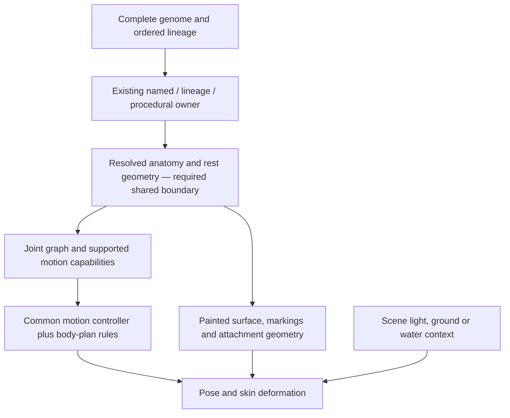

# Creature animation — shared anatomy and motion contract

**Painted desktop delivery — Nick’s September20 decision, PROGRAM.md§6.** Accepted
painted masters use full-film rig p95 ≤3.5ms on desktop, explicitly selected as the
painted-desktop review tier. Canonical boundary24/interior56 meshes remain unchanged.
Per-clip2ms readings remain recorded as diagnostics for this tier; the existing strict
2ms phone/painter gate remains unchanged. D1 phones continue using retained originals.
Geometry, exact rest,0.25px contact and split root-continuity gates remain mandatory.
Current delivery: audits/VISION_P1_DESKTOP_DELIVERY_20260920/README.md.
Final canonical captures: Crab4.0ms / Freshwater2.4ms / Mud3.6ms / Vent3.6ms full-film rig
p95; retained split-guard Coconut3.0ms. Freshwater and Coconut PASS the desktop gate;
Crab/Mud/Vent remain CPU leaf reds, with films and sheets delivered and no unchanged retry.
All geometry/contact/rest/continuity checks pass, zero refused frames.310 frozen input/writer
files unchanged. IC-3 writers are now frozen: no intake, painting, P2 or roster until IC-4
passes the five accepted fits. Older CPU decision-pending notes below
are historical measurements, superseded by this explicit tier decision.

**Declared hidden anatomy — matches code September 20, 2026.** Nick accepted P1 Coconut
Crab generation01; its six visible legs are correct under the species count law. The final
walking pair is present but hidden, not absent. `cf.anatomy-presence/v2.hidden` explicitly
names brachyuran `leg3Far`/`leg3Near`; no missing landmark creates a declaration. All joints
remain in the exact inventory. Offline inference mirrors pair2 vectors about the body axis
through a root extrapolated by pair2−pair1 root spacing, preserving pair2 segment lengths
1:1. Admission checks those inferred coordinates and flags six hidden joints; only their
paint-alpha proximity checks are exempt. Ordinary coordinate/bone bounds remain unchanged.
Hidden joints own no part/atlas entry and no positive skin weight. Intake and runtime reject
hidden paint ownership; six visible chains enter contact solving. No declaration preserves
the old eight-contact graph and arithmetic. This is ownership validation, not an automatic
silhouette verifier capable of discovering undeclared hidden limbs.

P1 master stays 1254 square with delivered RGBA unchanged; source art and margins are accepted.
Current fit04 has21 visible parts and exact atlas/rest reconstruction. Fit02 native review
revealed a Far-claw tip fragment;873pixels are reassigned from body to claw, with no master,
landmark or neighboring-limb change. The initial film retains CPU/root-continuity leaf reds. Nick authorized
measured brachyuran contact limits after faint required−50.0539666° versus the old−35°.
The expanded ten-subject ledger (five painter crabs and five accepted paintings, all rows
and presentation) measures maximum absolute Knee63.4567921° / Foot93.9460409°, both
on painted Freshwater faint. The approved ceil((max+10°)/5°)×5° rule now gives
contactLimitsDeg ±75° Knee / ±105° Foot across the family. Coconut72px is retained as
an insensitive negative; Freshwater40px admits and46px rejects on the Knee contact limit. Raw limitsDeg stays ±35° and
raw clips are unchanged. No contact/geometry/CPU gate, painted landmark or source pixel moves.
The old faint limit red is resolved. The first native film has zero contact/seam/limit
refusals and exact pixel rest, but approach p95=2.00ms and capture rig p95=2.90ms fail <2ms;
faint root-step continuity is9.104px versus8.095px stride. These remain leaf findings.
Final mask-corrected native02 has zero contact/seam/limit refusals and exact RGBA rest.
Its approach p95=2.10ms, recorded rig p95=3.20ms and the same faint root-step continuity
remain leaf reds. Film/sheet are delivered; animationReady remains false. Roster holds.
Evidence: `audits/VISION_P1_COCONUT_20260920/hidden-01/README.md`.

**Consolidated P1 intake, September20.** Nick explicitly declares Crab leg3Near, Freshwater
and Mud leg3Far hidden behind the claw. Shared template inference preserves complete joint
inventories with no hidden paint/contact. Current fits: intake-02 Crab01, Freshwater03, Mud01;
intake-01 Vent01; Coconut hidden-01 fit04. Freshwater03 reassigns52,115 body-fringe labels
outside its observed body outline; all existing limb labels, master channels and visible
landmarks stay unchanged. Earlier masks and failed pin-repair diagnostic remain evidence.
The tessellator nearest-ink search now covers the requested cell diagonal, preserving
the first-found result for existing meshes and enabling boundary48 candidates.
CPU series completed30 requested entries /17 distinct bindings. Boundary48 gives full-film
p95 of1.3/1.7/1.2/1.3ms for Coconut/Crab/Freshwater/Mud; Vent boundary48 refuses painted
support convergence, so no film CPU exists. No painted-tier gate is selected.
The complete six-subject60Hz native root ledger measures non-gait maximum0.0160022634
anatomical motion-scale units per sample; +10%, rounded upward1e-6 yields0.017603.
The shared root guard uses this scaled bound for brachyuran non-gait rows, stride for gait
rows including both transition edges, and unchanged stride behavior for other templates.
All six normal traces pass; all six actual doubled faint-recovery keys refuse. No production
key/clip/solver change. Historical native continuity reds above are now diagnosed by this
split guard; original films/reports are retained. CPU remains Nick’s decision.
Next: intake compiler before further painting/P2/roster. Claude owns registration/labels,
Codex shared writers. The five accepted paintings are regression truth, not proof of
automatic intake. Every required hand step is a compiler bug.
Packet: audits/VISION_P1_CONSOLIDATED_20260920/README.md.

> Matches D1 delivery code, 2026-09-19: `creature-delivery.ts` reads retained PNG originals by full identity and expected hash, otherwise returns the verified painter. It has no inference, worker, GPU or rig dependency. Selection of a finish is explicit; proof usage does not adopt artwork into production. Evidence: `audits/ANATOMY_SINGLE_RUN_20260919/R8/README.md`.

**Current stance/contact contract — matches code September 19, 2026. R3-S accepted.**
Shared per-template/action stances select all, hind or no quadruped contacts; only planted
chains enter IK. Lifted legs retain authored keys and the raw-clip guard. Brachyuran keeps
all visible contacts; undeclared presence retains historical behavior. Stage travel zeros solver root
dx without changing stored clip keys. Gaits retain paired solver root/stance travel with
explicit lift phases. Civet’s regenerated binding releases nine conflicting non-contact
pins while preserving weights, topology and atlas. Candidate-10 and earlier bindings remain.

Measured planted-fold maxima are Knee 86.5368918°, Ankle 94.1469004°, Paw 80.5685150°.
Quadruped contactLimitsDeg is ±100°/±105°/±95° respectively: ceil((max absolute + 10°)/5°)×5°.
Brachyuran uses the measured contact ranges above; other templates default to limitsDeg.
The raw 169-action library and limits are unchanged.
The final 13,286-sample six-subject strict sweep has zero throw classes; five crabs are
bit-identical to R2c′ and Civet’s maximum planted drift is 0.165257 px. Native rest changes
zero RGBA channels. Crouch ×15 rejects on limits, ×3 remains a documented insensitive
control, and all-four-planted bite rejects on compression. Gates remain 0.25 px, <2 ms and
exact rest. [Acceptance and retained controls](audits/ANATOMY_SINGLE_RUN_20260919/R3-S/README.md).

**R4 — matches code September19,2026.** Typed posed-fold errors support explicit
refusal:hold presentation with retained first/last/count diagnostics and continued action
time; strict evidence remains default. Other errors propagate. Legacy PoseTarget now needs
sample/flush and delegates to the existing frame collector. Native reviews schedule every
full row including faint. CPU/T1/held-flora films remain labelled leaf reds, never admission.
Actual R3 T1 traces pass for all five crabs; Civet retains a vertical21.5px root-step leaf red
(0.017142585 image units versus0.00804873 stride), despite green planted-foot checks.

**R3 — matches code September19,2026.** Five admitted crab profiles select pinch through
the generic melee alias and expose contactJoint/contactPhase=strike. Unbound crustaceans
remain unsupported; Coconut remains ground-only. Explicit stage travel holds completed
approach displacement through transitions, subtracting local gait translation when placing
the rig. Contact solver stage mode and stance targets remain unchanged. Root continuity
is measured against one source stride;42–57px reset controls fail.

**R2d — matches code September19,2026.** Optional rigidParentFrame painted groups
follow an observed published parent attachment and preserve local authored rotation/shape.
Missing parent/source anchors refuse; current Persimmon-04 refuses at branch-0-foliage.
No regenerated foliage binding was admitted. Existing source/CPU reds remain; this leaf red
does not stop R3. [Evidence](audits/ANATOMY_SINGLE_RUN_20260919/R2d/README.md).

**Single-run measurement update — matches code September19,2026.** R1c Civet adapter
hashes match candidate10. Five retained planted poses reproduce its painted-paw contour
numbers; current alert/walk/dodge all exceed upper reach without the compatibility solver's
root accommodation. Evidence: audits/ANATOMY_SINGLE_RUN_20260919/R1c/civet.json.
Native rows now record swing-foot displacement / lower-leg length, painted carapace dy and
per-sample normal passes. R1c CPU switches exist only in an isolated diagnostic build;
shipped BodyCard ignores them. No solver/clip/threshold change in R1c. Current run order and
stop conditions supersede the older bounded-review handoff below; see the single-run ledger.

Current September19 evidence is [the accumulated anatomy packet](audits/ANATOMY_SINGLE_RUN_20260919/README.md).
The R3-S six-subject strict sweep passes13,286samples, exact rest and five-crab R2c′ identity;
Civet worst planted drift is0.165257px. Root continuity is separate: Civet still steps36.15px
in the full presentation. Five crabs preserve source perspective contacts, and selector melee
reaches pinch/contactJoint with strike contact. R4 native refusals hold only typed pose-folds.

The one nine-subject full-row capture and five finished-crab equality films are complete.
The existing accepted model finishes at masked0.35/one step; originals remain immutable,
conservation and texture-only rebind controls pass. Q1 has two separate painted open-gape
candidates on the review sheet. No numeric result is visual acceptance. Film and per-clip
CPU tails are separate: Civet/Coconut and all three plants retain CPU leaves. Persimmon still
has84disturb folds and169presentation folds;13held samples are retained in native review.
R2d parent-frame groups exist, but its missing observed parent attachment refuses regeneration.

R5–R7 current fixtures are hash-verified and independent of historical audits; ordinary/capture
RGBA parity and prefix initial-state admission are strict. Marks do not add structures;
Pyrosome is one tube with190marks. Fiddler exposes six real quadratic legs and asymmetric
claws but no fabricated fourth pair/elbows. Split receipts distinguish observed/welded/independent
boundaries. Rendered root controls pass for trunk-only motion and reject actual root translation.
Exact recording attribution remains separate from creator profile names, including legacy reads.

The census contains1,250cases:1,237raster passes,13legacy fallthroughs,54topology emissions;
compiler outcomes5complete,1incomplete and48unsupported. Current missing profiles number53
(8observed). The requested historical58 roster is exhausted:5existing crab fit/bind/films,
53explicit source-fit refusals,15family sheets,0new visual qualifications. Source/fit outcomes:
[roster ledger](audits/ANATOMY_SINGLE_RUN_20260919/roster/native-01/report.json).
D1 native retained-PNG/painter-fallback delivery passes for five crabs with zero inference,
workers or GPU access. Both phone Glass canaries retain instrument reds; no physical phone
qualification is claimed. Raw169-action limits, source pixels, kits and admission thresholds
remain unchanged except the explicitly authorized planted-only contact limits above.

[Count-preserving anatomy](audits/COUNTED_ANATOMY_20260916/README.md), matches code as of
September 16, 2026: radial and cephalopod records can declare actual arm/tentacle counts in
`cf.anatomy-presence/v2`. One shared expander feeds motion and rig admission; no missing
landmarks are synthesized. The painters publish ten radial arms or eight cephalopod arms
plus the squid's two feeding tentacles, with unchanged drawing commands. Repeated motion
uses shared family curves, and cephalopod impact follows the appendage that actually lashes.
The 64-joint and 40-part/2048px atlas budgets remain. All94 supported count combinations
pass1,222 clips/147,862 synthetic pose samples;20 oversized combinations refuse. This closes
a count/curve contract gap, not painted fitting or phone qualification. Complete masks/body
landmarks, other variable topologies and the58 unmatched named-species structures remain.

[Animation library and shared deformation review](audits/ANIMATION_COMPLETION_20260916/README.md),
matches code as of September 16, 2026: 169 family actions now have complete-clip limit,
determinism and GSAP parity checks (40,729 synthetic samples). Eight additional physical
motions bring the anatomy selector to32 rows, including actual hoof kicks, body strikes
and fish tail sweeps. Explicit anatomical absence is shared by compiler and rig intake.
All631 named fauna still have exact profiles:578 have candidate moves;53 require new body
structures. A candidate is not a fitted or visually accepted species. Broad marine/crust/
sessile labels no longer silently borrow fish/spider/radial bones.

The shared skin solver retains its established fast projection and invokes a bounded
active-set repair only for unresolved folds. No creature-specific motion attenuation or
solver setting was added. Whole-library painted checks exposed fish cast/dodge/victory
folds and the difference between pure and Float32-rendered geometry; failed controls are
retained. Native films, per-action frames, source hashes and timing limitations are in the
review folder. Some timings exceed the2ms goal; this is not universal or phone qualification.
Originals, approved artwork, kits, combat results and seeded generation are unchanged.

[Seeded painted biome encounter](audits/PAINTED_BIOME_ENCOUNTER_20260916/README.md),
matches code September 16: three painted quadrupeds now share an 18-second, three-turn
clearing study. The encounter seed selects scenery placement and turn order over the accepted
Earth temperate FAR/MID/NEAR template and compiled Earth card. All three bodies animate;
shared hitstop freezes them together. Native-02 passes 3,243 source-join/body-frame samples,
replay and mouth-contact checks; 60 fps, 0.8/1.0/0.9 ms creature-update p95 on this Mac.
The ground band now describes space above the registered floor, and mirrored contact uses
the same source jaw before screen reflection. Negative controls retain the old failures.
This is seeded painted-template composition, not newly inferred biome art. Damage is scripted
presentation data, not the combat resolver. Automatic fitting, planted-paw contact, sound,
ordinary-game squad wiring, other painted families/biomes and physical-phone qualification
remain separate. No new painting, model run, kit change or original-asset edit.

[Painted variation motion review](audits/PAINTED_VARIATION_MOTION_20260916/README.md) now
animates the approved seed10271 painting, a second10271 painting and crystalline10032.
Independent hash-bound authored observations feed one shared quadruped template; no creature
clip overrides. All three pass exact rest/final rest,484individual and601blended pose samples,
full-motion framing and36connected leg parts. Native captures run about60fps at1.3/1.6/1.7ms
rig-update p95 on this Mac. Alpha-preserving intake, frame clipping and wrong-limb paint islands
are repaired with negative controls;12focused tests and root validation pass. New candidate
art still needs kit intake/visual acceptance. This does not establish automatic fitting,
planted contact, hidden views, other painted families, ordinary gameplay or phone qualification.
Kit, accepted originals and the source genomes remain unchanged. Preview uses one player,
visible still/error fallback and a loopback server with byte-range support.

Matches code as of 2026-09-16. The actual rig now uses a family-neutral joint evaluator
(`skeleton-pose.mjs`) with a supplied joint graph, exact landmark inventory and body axis.
It snapshots the owner data, inherits local rotations/offsets, applies root translation once,
and rejects malformed poses before publication. Quadruped hash/asset/shape admission remains
unchanged. The loader and parts intake now admit all fourteen closed family contracts through
`family-record.mjs`; unknown/mismatched inventories still refuse. The legacy seam-bridge owner
remains quadruped-only. See [family intake evidence](audits/UNIVERSAL_FAMILIES_20260916/README.md):
910 bound comparisons, fourteen deterministic atlas controls, 137 tool tests and 45 focused
tests. Calibration geometry is not painted-family qualification. Four actual painter owners
now expose partial drawn topology, preserving real appendage counts and visible/absent parts.
Count-aware radial/cephalopod motion now accepts v2 declarations. Other variable topologies
and completed painter masks/landmarks remain required.

[Procedural motion iteration](audits/PROCEDURAL_BATTLE_ITERATION_20260916/README.md) adds
three real generated genomes (10032,10052,10271), with painter-emitted landmarks/masks/materials,
zero observation drift and one lossless atlas each. Shared genome-aware body cards and smooth
review transitions pass484 individual plus601 assembled native samples per creature, exact rest
and final rest, and separated-mesh negative controls. All three recorded about60fps/0.4ms rig
update p95. This covers only current four-leg/banded-tail observation support, not every family.
The habitat diagnostic now subtracts compiled hitstop from locomotion, poses and body travel;
both turn roles freeze identically and1,202 source-join/medium-containment samples pass. Its
latest fish/bird updates are0.9/0.6ms p95.36 focused tests,typecheck/root validation pass. These
remain diagnostic tools; normal gameplay is not yet wired. Fine silhouette aliasing, source
shadow deformation, planted contact, other painter owners and phone qualification remain open.

[Habitat battle and Frog repair](audits/HABITAT_BATTLE_20260916/README.md) now adds a local
source-hashed motion snapshot under Nick's September16 repair instruction. Explicit absence
admits the actual23-joint adult Frog without tail/ears; missing mandatory anatomy still refuses.
Authored fish resolves aquatic/swim. Smooth skin has an explicit material mapping. Frontal
bird wings use a source-derived rotation basis; actual source masks, shared curves and root-only
offsets remain authoritative. A new open-wing bird candidate is not accepted art.
The mixed water/air scene passes1,200 source-join/full-body containment samples and records a
10.101600-second/606-frame film at about60fps, fish/bird update p951.1/0.6ms. Final bird and
Frog native proofs preserve exact rest/final rest and pass484 sampled poses each. Frog update
p951.6ms; final bird0.5ms. The physical-habitat compiler uses source capabilities, liquid chemistry
and seeded home/visitor rules, refusing unsupported habitats rather than substituting a biome.
All43 biome routing controls are not43 qualified art scenes. Opponent-facing flight, Frog ground
contact, variable-count procedural records, independent fish accessory fins, ordinary-game wiring
and phone qualification remain open. No accepted master, kit, sibling worktree or GitHub change.

[Facing study](audits/BATTLE_FACING_20260916/README.md) adds an opt-in two-combatant diagnostic:
the Platypus uses a hash-bound 17-part continuous-skin rig and right-side shared turn/contact
sampling. The [throat repair](audits/BATTLE_THROAT_JOIN_20260916/README.md) corrects the remaining
chin notch with a lower source-view fit into preserved neck/chest paint. Seventeen hash-bound
attachment ribbons follow published head/body triangles and pass native alpha coverage at 601
times; the previous image fails the same coverage evaluator. Original visible joins on Civet,
fox and procedural quadruped, plus the Platypus in each pairing, pass the dense motion scan.
Head replacement suppresses only head-subtree parts. Ear/jaw details remain on shared tracks;
front/profile transitions and a painted open-mouth interior remain unsupported. Captured stills
now replay the action after recording cleanup; the old reset-order discrepancy is retained.
The generic attachment evaluator has synthetic controls for all fourteen family vocabularies,
not full painted-family coverage. No ordinary-game promotion, phone or final visual acceptance.
Selected-left-rig timing still excludes the added head/right rig; use whole-frame evidence and
separate future inclusive per-creature qualification.
[Impact polish](audits/BATTLE_IMPACT_POLISH_20260916/README.md) projects the existing flash envelope
onto the receiving rig with a pooled brightness filter and a softer scene flash. Target selection
is side-based, independent of anatomy. Twelve non-flash pose PNGs and all three turn plans retain
exact bytes; native wrong-actor and arena-contrast controls pass. The neutral filter is disabled.
This is diagnostic presentation only, with unchanged head fit, motion and original artwork.
The quadruped observer also refuses extra leg pairs instead of overwriting fore/hind records;
ordinary six/eight-legged painting remains available.

[Universal animation evidence](audits/UNIVERSAL_ANIMATION_20260916/README.md) covers all 14 actual
motion templates, 161 action entries and 4,644 sampled poses. Thirteen family records are
synthetic fixtures, not painted-family coverage. 121 tool tests, 20 focused rig/observer tests,
both TypeScript checks and root validation pass. The new native regression retains exact
rest/final-rest equality and all 30 prior C2 pose PNG bytes. Ten-second diagnostics capture
Civet/fox/procedural at 60.003/60.002/59.903 fps, with inclusive CPU p95 1.4/1.7/0.9 ms.
Clean signed-source qualification and Nick's whole-motion acceptance remain pending.

Continuous source-painted skin, separate limb surfaces, shared body attachments, painted-paw
constraints and the bounded shape solver remain the C2 foundation. The
[prior C2 audit](audits/C2_CONTINUOUS_SKIN_20260916/README.md) retains its exact source snapshots,
failed controls and six review ZIPs. The universal batch is an addendum to that snapshot.

The target is fluid whole-body motion for named and procedural land, air, aquatic and rooted life
in seeded biome arenas. Preserve the actual painted anatomy, stable joint inventories and recipe
identity. Blender projection is abandoned for the browser; retain the turnaround/canid master for
a later engine port. No 3D or texture-finisher pass belongs to this track.

The [universal animation plan](audits/C2_CONTINUOUS_SKIN_20260916/UNIVERSAL_ANIMATION_PLAN.md)
uses a shared runtime and anatomy-specific templates, supplied by each winning painter's actual
resolved record. Family bounds, extreme generated bodies and reuse proofs qualify coverage;
the Civet proof does not turn one quadruped rig into a universal skeleton.

Art Kit v4.3 and supplied Motion/Sound v1 are approved. Nick's supplied free-audio handoff
and explicit CC BY attribution approval supersede the source-only execution stop; kit bytes
remain unchanged. The old wording proposal is not a pending permission request.
Arena template v1 is accepted. Wild v4.3 mechanical intake is complete; Nick owns final image acceptance.
GSAP 3.15.0, the Pixi 8 seeded emitter and one deterministic atlas per creature are the runtime/tooling
boundary. The incompatible @pixi/particle-emitter is removed. Atlas core 0.3.9/CLI 0.3.0 use sorted,
hash-bound copies, four-pixel padding, one-pixel extrusion and no timestamps. Originals remain intact.
The 2048 atlas, 40 drawable and 8% contact bounds are unchanged. Claude owns motion/, effects/,
battle2/, soundkit/, worldlife/ and their tests; this lane consumes those modules read-only.

## Whole-body action and looking — September 15

The painted pose is the rest reference, not a limit on the animal's behavior.
`creature-rig-performance.ts` consumes compiled players for every record-named joint,
samples transitions at explicit command time and publishes one complete frame. Sparse
joints reset and root offsets remain root-only. Nine actual Civet/fox/procedural idle,
melee and hit actions match the pinned read-only GSAP producer; 30/60/120 Hz controls
exercise transition parity. No species-specific motion curves were added.

`creature-rig-aim.ts` solves in-view gaze from source-bound eye/forward points and the
actual ancestor pivots, preserving body/limb action. It refuses malformed/out-of-bound
input and requests a body turn or another view when its chain/source coverage cannot
reach a target. These are outcomes for a future controller to satisfy, not completed
turn animations. All three actual proof records still lack gaze/view declarations;
no alternate-view rigs or ordinary-game consumers are integrated. Native12 passes the three
records' geometry/contact/source-join gates with the actual Wasm backend. Unprofiled Motion06
meets 60 fps and the strict <2 ms update budget for all three; numeric admission does not qualify
whole-motion appearance. Clean signed-source qualification and human motion review remain pending.
The September 15 controller evidence remains in `audits/C_PACKAGE_COMPLETION_20260915`;
the live September 16 audit owns skin and capture status.

## Current presentation priority — Nick, September 8

Landing now targets a large cohesive static painting, as shown in the explicitly selected
[Living Worlds reference](audits/MIDGAME_ART_DIRECTION_20260908/02-inhabited-worlds.png). Multiple
flora/fauna may inhabit the painting, but live landing motion is not needed now. Compendium retains
the same individual/species identity; articulated 2D battle motion with suggested depth is the next
animation presentation target. The common anatomy/skin contract below therefore remains necessary
for battle variety, with landing articulation deferred. This replaces the earlier implied priority
of animating every resident in the vista. It does not convert a flat painting into a complete rig.

Author complete organism assets and the environment with shared resolved identity/material/light
metadata; flatten their matched landing composition while retaining the separate source assets.
Existing collection, healing/properties and classification data stay independent of image pixels.
[Recorded decision and bounded pilot](audits/STATIC_LANDING_PORTRAIT_20260908/DIRECTION_DECISION.md).

## Current implementation and the missing boundary

The hash-bound Civet and fox records plus one painter-observed procedural quadruped supply real
parts and deterministic atlases. The procedural observer reports the material actually painted
(translucent in the retained proof), not a fur fallback. Source PNGs and on-disk atlas bytes,
accepted anatomy, part order, depth layers and Motion Kit curves remain unchanged. The decoder's
disposable sampling texture has the bounded internal guard described below.

`build-paint-skin.mjs` constructs a conforming alpha-adaptive field and clips each displayed part
to its original atlas rectangle. Every rendered triangle retains its actual originating field face;
a shared interpolation-vertex cache is not sufficient provenance for the solver's face inventory.
`split-skin-branches.mjs` separates distal near/far limbs by the record's ownership. It shares
proximal axial/upper-limb skin attachments derived from all nonzero source-alpha boundaries,
including attachments whose bones are siblings. Skin topology and bone ancestry are different
relationships. Distinct limbs and distal limb/body overlaps remain separate; coincident image
coordinates do not authorize welding them. This replaces the root-plane and ancestry-only rules.
`source-join-continuity.mjs` independently checks these boundaries in the actual published meshes.

`paw-contact-pins.mjs` samples the lowest nonzero-alpha texel in each original paw column, including
fringe, and pins every supporting field vertex to that paw's unchanged transform. Conflicting paw
owners refuse; source perspective and authored raised-paw offsets remain. Weights diffuse along
anatomical topology, with a bounded sparse influence inventory and preserved contact constraints.
No controller clock, new RNG draw or creature-specific motion edit supplies these constraints.

`compiled-skin-field.mjs` snapshots normalized positions and sparse weights once, then reads fresh
joint matrices once per joint on every frame. It writes private scratch at destination precision;
malformed matrices and overflow refuse before publication. `arap-skin.mjs` uses four local passes,
four symmetric global sweeps per pass and target weight 0.35. Its orientation projection has a
64-pass budget and a 0.12 area-ratio target; unresolved flips refuse. Those are fixed mechanism
settings, not visual acceptance thresholds. Asset declarations cannot tune the orientation profile.
Exact-rest/rigid handling still checks triangle orientation, and thin nonzero triangles receive the
same fold admission as larger triangles. The solver starts from the current pose, not the last frame.

`seam-sampling-guard.mjs` derives a one-texel guard only across sewn opaque internal cuts whose
source samples have the same skin-field basis. The default atlas decoder copies the adjacent
owner's exact opaque RGBA into transparent filter space or available packing padding, retaining
all original PNG bytes, frames, owned texels and geometry. External silhouettes, nonopaque paint
and separate-limb/depth boundaries are excluded. It draws the original bitmap once and writes only
guard runs, avoiding a full translucent RGBA round-trip. The derived texture is disposable;
source-owned masks still drive the oracles. Native12 retains zero changed rest channels before
and after motion for all three records. The retained procedural strike control improves alpha
192/191 to 255/255 at the same two internal-cut samples; this is sampling repair, not repainted art.

`creature-rig.ts` composes record-named joint transforms, applies the field/shape solver, checks each
part, then publishes the complete geometry. `creature-rig-frame.ts` collects PoseTarget updates and
`creature-rig-performance.ts` owns explicit-time playback. Rotations use the record's joint names;
offsets are body-length units and the pinned GSAP producer forwards displacement only to root.
The isolated arena proof uses this complete-frame path for attack and hit roles. Its explicit-time
contact owner blends the admitted ground correction through the existing approach/return windows,
and the subject retains one seeded idle across both roles and hitstop holds. Grounded contact and
the 8% compression bound remain exact. Adoption by the ordinary battle scene remains separate;
the study is not a production route.

Native qualification measures exact rendered rest before/after motion, current-producer poses,
actual deformed paw contours as well as bones, fold admission and source joins. Creature update
cost includes producer sampling, support/contact solving and geometry publication; rig-only
publication is reported separately. The strict p95 budget remains <2 ms, including live captures.
`deformation-quality.mjs` separately reports area, edge stretch and anisotropy on triangles touching
source alpha; it cannot grant art acceptance. Ten-second captures must additionally prove live
frame pacing, encoded duration/frame count, choreography phases and moving appendages. The capture
runner binds the candidate manifest, complete source inventory and actual served program/asset
bytes and routes to its prior native gate before opening the browser. Dirty diagnostic receipts
cannot stand in for a clean committed qualification. The preceding C2 Native12 passes all three dense gates with
the actual Wasm normal-pass leaf: 4,844 / 4,840 / 4,840 completed normal passes for Civet / fox /
procedural, with no robust fallbacks. Unprofiled Motion06 delivers all three ten-second diagnostic
films at 60 fps and update p95 1.6 / 1.7 / 0.9 ms. The next steps are human motion review and,
once signing works, unchanged clean signed-source gates and captures. No further optimization
loop is planned; final qualification and visual acceptance remain pending.
The universal batch repeats these gates on the shared evaluator and preserves all 30 pose PNGs.
See both audits for the exact source snapshots and retained failed attempts.

The production gap remains a resolved anatomy/parts record emitted by every actual winning painter
and a shape-qualified skin/controller consuming it. Only three quadruped proof records exist; the
fourteen published motion templates are not fourteen functioning painter integrations. Unsupported
anatomy refuses or uses the explicitly labelled portrait fallback. No per-seed image generation or
per-creature motion-curve edits are part of this design. See the
[current family readiness](audits/UNIVERSAL_ANIMATION_20260916/FAMILY_COVERAGE.json) and the
[earlier coverage inventory](audits/C2_DEFORMING_SEAMS_20260914/FAMILY_COVERAGE.md).

## Authoritative documents and source order

- [SPECIES_AND_GENOME](SPECIES_AND_GENOME.md) describes the pinned genes, descriptors, named Earth
  overlay and lineage rules. Its raw trait tables describe the genome vocabulary, not guaranteed
  modern drawing geometry.
- [PROCEDURAL_CHARACTERISTICS](PROCEDURAL_CHARACTERISTICS.md) is the non-Earth trait/pass map Nick
  recalled. Its B15/hdGenesFor assessments are dated legacy observations; its current V2 routing
  overlay and actual source take precedence for a new adapter.
- [ART_DIRECTION](ART_DIRECTION.md) folds in the Earth fauna/botanical bibles, per-family anatomy
  rules and supplied painted sheets. The sheets establish richness and recognizable organisms;
  they do not contain every joint, hidden surface, gait or generated variation.
- [BIOME_ATLAS](BIOME_ATLAS.md) selects scene/ecology context. Its coarse fauna families are not a
  skeleton taxonomy. Scene placement and medium must not rewrite the encountered organism.
- [Exact source inventory](audits/CIVET_PAINTED_PARTS_20260908/SOURCE_TAXONOMY.md) records the dated
  precedence, source hashes, type fields and pre-existing conflicts for Claude.

Current winning route:

`speciespainter.ts` tries `resolveOverrideCanvas` before its lineage-selected HD fallback.
`speciesoverrides.ts` preserves exact kingdom/name ownership, then reviewed lineage and procedural
precedence. Named `CANON` entries precede fauna tables; specialized fauna painters precede generic
quadruped specs. Quadrupeds themselves can select later whole-form mammal, pinniped or glider
owners. Unreviewed fauna lineages retain their compatibility route; Sea Turtle and Great White
Shark must not silently migrate. `speciesVisualKey` binds the complete genome, not just seed/name.

## Universal architecture and variation gates — September 16

Nick explicitly requires shared anatomy-driven animation, not a collection of species fixes.
The current implementation and the remaining work must retain these boundaries:

1. The winning painter emits what it actually drew: graph, named joint roles, proportions,
   parts, materials, contacts, weapon observations and explicit absence. Authored paintings
   have hash-bound fitted records. Those observations may differ per master; clip code and
   numerical solvers must not branch on a creature's name, seed or asset hash.
2. Templates supply reusable actions relative to anatomy, body length, mass and medium.
   The capability selector admits only observed weapons and required joints. A broad habitat
   label is not a skeleton. Missing/unknown body structures refuse or use an explicitly
   labelled presentation fallback; they must not manufacture spider legs, teeth or wings.
3. The shared skin pipeline handles joints, connected surfaces, independent overlapping
   appendages and source-pixel conservation. A defect found on one creature gets a retained
   failing control and checks on other families/proportions. Keep exact rest, deterministic
   seek, signed triangle orientation, source joins and unchanged hard contact handles.
4. Remaining expansion is record-described topology: variable limb/arm/segment counts,
   absent appendages, asymmetric bodies, shells, worms, gastropod feet, crustacean claws,
   sessile bodies, aquatic mammal flukes and independent accessory fins. The current14 fixed
   graphs do not yet cover all of these. Do not alter a species profile solely to raise a
   coverage number. Extend the producer and rig contract together, then emit actual painter
   records and fit paintings before claiming a body type supported.
5. Qualification crosses shape, proportions, material, appendage presence, locomotion,
   medium and attack. Check every clip and transition, both facings, extreme legal poses,
   multiple seeded procedural bodies, physical attack contacts and named Earth exceptions.
   Illegal combinations must fail. Synthetic joints prove contracts, not painted movement.
   Final visual approval and physical iPhone performance remain separate gates.

Current evidence is in ANIMATION_COMPLETION_20260916. The old fold projection and unsafe
weapon/absence controls remain executable. The full named roster has58 unresolved topology
identities, and the other573 are candidate-library coverage, not573 finished animated masters.

## One rig format, several body-plan adapters

These are required capabilities, not completed runtime coverage. Each adapter emits only anatomy
actually supported by its winning owner. Variable appendage arrays replace assumptions about two
arms, four legs or one tail. Bilateral symmetry is optional: odd limb counts and radial arrays are
valid when the resolved anatomy has them.

| Resolved anatomy | Reusable parts/joints | Motion rules that differ |
| --- | --- | --- |
| Grounded quadruped or multi-legged alien | torso/spine, neck/head, repeated hip/knee/ankle or shoulder/elbow/wrist chains, optional tail | Stance/swing phases by limb role and pair index; foot support and body weight transfer; species joint limits and proportions |
| Biped/primate or grasping arms | pelvis/torso, two support chains, independent arm/hand chains, neck/head | Balance over support feet; arms reach or react independently rather than inheriting leg gait |
| Arthropod/myriapod/crustacean | segmented trunk, variable jointed leg array, antennae/claws, optional wings | Segment-relative phase offsets, appropriate support groups, claw/antenna secondary motion; no mammalian knees by default |
| Feathered bird | spine/neck/head, wing shoulder/elbow/wrist and feather fan, legs/talons, tail | Flap/fold/glide/perch only when supported; flightless bird does not flap to fly; swimmer uses its supported paddling posture |
| Bat or gliding mammal | mammalian torso and limbs, finger-supported membrane or patagium | Membrane follows its support joints; a glider is not automatically a powered flier |
| Flying insect | thorax/abdomen, actual wing count, wing roots, six legs when resolved | Wing stroke and body stabilization; legs tuck/land with their own timing |
| Fish/eel/ribbon swimmer | axial chain, caudal fin, named dorsal/pectoral/pelvic fins as present | Tail/body wave, fin steering and roll; body depth and flexibility control amplitude; no planted-foot solver |
| Cetacean/sirenian/pinniped | axial body, fluke or flippers as actually drawn, head/neck constraints | Distinguish fluke stroke from fish tail stroke; pinniped land and water use different supported motions on the same anatomy |
| Amphibian/water-associated reptile | preserved limb/shell/body plan and optional tail | Ground support, swimming strokes and waterline transitions share identity; being near water does not turn it into a fish |
| Serpentine/gastropod | continuous axial or foot/body chain; sensory appendages as present | Traveling bend or contraction; no invented arms or leg cycle |
| Cephalopod/tentacled/radial | mantle/body plus independently rooted flexible chains, actual appendage count | Tentacle waves, curl/extension and supported propulsion; radial indexing instead of fore/hind leg assumptions |
| Jelly/soft colonial/sessile fauna | bell/volume controls, flexible fringe, or fixed substrate root | Pulse and current response; fixed organisms do not acquire locomotion |
| Flora and alien growth | rooted stem/trunk/branch graph, leaf/frond/pod attachments | Wind/current bending along supporting structures; roots stay attached; no animal skeleton imposed on a plant |

A creature can support several media. Use explicit capabilities such as ground support, powered
flight, gliding, swimming, surface paddling or sessile current response, derived from resolved
anatomy and reviewed species rules. The scene chooses among those capabilities; it does not infer
all of them from a name containing “flying” or from a broad aquatic biome. Flying Gurnard display
fins, Flying Fish gliding fins, bat wings and bird wings are distinct cases.

## Required resolved record

The future versioned `ResolvedCreatureRig` boundary must carry:

1. **Identity and provenance:** detached complete genome, ordered lineage, exact visual key,
   winning owner/spec/version, source bindings and the normalized art-fit transform. Reject
   unsupported descriptors/accessors before invoking arbitrary getters. No new RNG draw.
2. **Anatomy graph:** stable part and joint IDs, parent IDs, semantic roles, repeat/side/segment
   indices, rest transforms, attachment frames, lengths/radii, bend directions and joint limits.
   Topology comes from generated anatomy; a zero-limb organism emits no walking-leg chains.
3. **Skin and paint:** generated mesh/path surfaces, local material coordinates, bounded joint
   weights, overlap/depth order and the hidden patches needed for the supported view. One shared
   skin/light treatment must hide joints without erasing species-specific masses or markings.
4. **Contact and movement capabilities:** actual foot/claw/fin/tentacle contact patches, support
   sets, allowed media, propulsion axis, hinge versus flexible-chain behavior and available clips.
5. **Resource and fallback contract:** bounded vertex/texture ownership, validated asset hashes,
   supported view/quality tier, exact rest pose and a reasoned static fallback when incomplete.

The existing `torso.ts` Tube/Frame surface already provides spine position, tangent, radius and
surface coordinates for applicable families. Expose the actual owner’s generated geometry instead
of fitting a generic skeleton after rasterization. D-ART-83 remains binding: share the anatomical
vocabulary, preserve each species’ actual values. The same seed/complete genome must reconstruct
the same rest anatomy, markings, attachments and rig recipe across devices and save/load.

## How motion scales across variations

Animate semantic controls such as head look, torso compression, support shift, reach, wing stroke,
axial wave and reaction. A family adapter maps these into its available joints. Retargeting uses
actual lengths and rest angles, so a short leg and a stilt leg do not move through the same pixels.
A two-bone solver can hold an endpoint or reach a target; a longer flexible chain distributes a
traveling bend. Membranes follow their support joints; jelly bells need volume/pulse controls.
These operations share a controller and graph format, while preserving biological differences.

Use separate phase curves for head, chest, hips, appendages and tail. Reaction, attack, breathing,
flight and swimming cannot be the same recoil curve with a different button label. Tail and loose
surfaces follow rather than moving in lockstep. A gait must actually lift/place supported feet;
a planted reaction should instead preserve its contact patches. Do not claim walking from a mesh
that freezes every lower leg, or fluidity merely from changed pixel counts.

Pose sampling is a pure function of validated rig, explicit clip state/time and motion policy.
Controller clocks stay outside generation. World movement/capture/combat outcomes remain with
their gameplay owners; animation reflects outcomes and never awards rewards or mutates lineage.
Reduced motion/Effects off/hidden and disposal use the existing policy boundary and exact static
rest. Dense lists remain static; animated detail or scene owners must have measured mobile budgets,
one scheduling owner, deterministic cancellation and complete buffer/texture retirement.

## Making the creature part of the painting

Paint and motion must share geometry. Markings attach to body-local surface coordinates, with
continuous fur/feather/scale direction and overlapping muscle masses across joints. Author reusable
family materials and supported parts; derive per-genome geometry, colors and marks deterministically.
Do not ask the generator for a new animal or animation sheet for every seed.

Match scene light direction, diffuse highlight width, reflected ground/water color, contrast and
edge softness at the animal’s scale. Contact shadows, narrow water occlusion and appropriate
foreground overlap belong to the same scene owner. Reflections require actual composition/material
support. Preserve natural Earth colors and seeded alien palettes; a scene grade must not substitute
for richer underlying painting or unify all species into one body. Review both close portrait and
actual phone/landscape scale. The supplied sheets remain the quality reference, not proof that
an extracted texture or rendered bone solver has reached that quality.

### Finished textures (R9) — matches code as of 2026-09-19
A finished texture is a new retained original whose alpha equals the painter master byte for byte;
`build-authored-parts.mjs` accepts it as `textureFile` (RGB only; admission, labels and geometry keep
reading the painter master; differing alpha refuses) and `prepare-observed-crabs.mjs --finished=DIR`
rebuilds fits whose `parts` and `paintSkin` are byte-identical to the painter fits (only
`atlasSha256`/`bindingHash` differ). First evidence and the full contract:
`audits/ANATOMY_COMPLETION_20260917/crab-finish-01/README.md`; engine side in `LOCAL_AI_GENERATION.md`.

## Existing conflicts that must not be silently repaired

Modern `planFor` uses raw locomotion modulo 18, including for extremophiles whose descriptors use
`EX_LOCO` modulo 9. It ignores raw `limbs`, `eyes`, `trait`, `habitat` and `x` for plan selection.
Thus some current descriptors and drawings disagree. Swimming indices 4/13 select fish before
body preservation. Body14 plus glider selects a bird with no four-wing option; other body14 routes
to an open-wing insect. Modern quadruped leg-pair counts come from body/locomotion, and radial fauna
has ten arms. The old descriptor/HD fallback rules do not override those current routes.

Record these as presentation conflicts for a separately scoped correction. Do not resize/reorder
trait pools, re-roll genomes, rewrite inherited identity or silently “fix” anatomy as a side effect
of animation. Preserve the actual static owner when a faithful adapter is not qualified. Global
D-9e biome/generation coverage remains open; this architecture does not repair it.

## Remaining acceptance sequence

1. Resolve continuous-skin face coverage and visible attachment/shape defects without changing the
   accepted source paint, anatomical limits, contact constraints or motion curves.
2. Qualify the exact candidate on all three records: rendered rest, actual field faces/source joins,
   source-contour contact, current-producer dense motion and the unchanged creature update budget.
3. Deliver source-bound ten-second Civet, fox and procedural films in the accepted arena, with live
   pacing and independently decoded media evidence. Numeric admission does not replace image review;
   historical whole-portrait fallback films remain explicitly labelled.
4. Complete ordinary battle integration in its owning lane, then add actual painter-owned parts and
   records family by family. Bird, fish, insect and reptile follow the quadruped proof; template
   availability alone does not establish painter, view or motion coverage.
5. Review new media and family reuse at each required stop. Phone animation performance still needs
   a sustained device measurement; neither a Node microbenchmark nor a Mac CPU result supplies it.

Historical failures, commands and receipts remain in audits/C2_* and the chronological roadmap archive.
They explain the repairs; they do not override the live candidate and qualification status above.

## R9 texture class — matches code as of 2026-09-19

Desktop finishing uses the existing kit worker at strength 0.35, one step, a shared prompt and recipe-derived seed. Four-pixel alpha/ownership bands and outside pixels are protected; alpha is copied exactly. Conservation reports per-label components, boundary gradient (minimum ratio 0.95), CIE76 and luminance SSIM. Finished rebind copies no geometry changes and independently recompiles painter/finished skin for equality. Original painter records and files remain immutable. Numeric/native and visual evidence is pending in the R9 packet.

R9 evidence now complete: five conserved finishes reproduce native painter geometry rows
exactly; normal refusals0/restChanged0. The combined sheet and per-part color metrics are
in audits/ANATOMY_SINGLE_RUN_20260919/R9/. Coconut’s finished-film 2.00ms remains a CPU
leaf red; textures and Q1 art candidates await the single final visual review.

R5/R6 source integrity: test-owned current records are hash-verified before compilation;
mirroring is an explicit detached fixture transformation. Exact full RGBA replay includes
initial supported context state. Source marks remain provenance and do not increase body
counts. Fiddler’s six curved legs and unequal pincers are observed without fabricated
elbows or a fourth pair. Split receipts report observed, welded and independent excluded
boundaries separately; source geometry and solver arithmetic are unchanged.

Flora remainder exception: prepare-flora’s tiny trunk polygon is a declaration placeholder;
the explicitly named remainder owns every otherwise unclaimed source pixel. It is not a
trunk silhouette or inferred anatomy. Exact reconstruction guards missing/duplicate/color
changes; a missing remainder owner is refused.

### Declared folded legs — matches code 2026-09-21

`cf.anatomy-presence/v2.folded?: string[]` is an explicit species declaration; omission
means `[]`. Folded legs are present and painted, never inferred, and cannot also be hidden
or absent. The shared inventory validates template leg names and preserves all geometry,
paint, joint and contact requirements. Unlike hidden, folded removes no contact chain.
Accepted Crab/Mud/Vent fits now have standalone compiler `presence.json` inputs; their
sealed records and binding bytes remain unchanged. Exact declarations and focused controls:
`audits/INTAKE_FOLDED_DECLARATIONS_20260921/README.md`. IC-3 is frozen again.

### Stage-mode support readout — matches code 2026-09-21

Stage-owned gait contact no longer adds local stride to stance targets; solver/default
travel is unchanged. This minimum correction does not infer the arena displacement.
`readCreatureRigContactSupport(rig,joint)` exposes the actual last-published painted
support in normalized source coordinates, not the joint or predicted LBS position.
Refusal preserves its prior value; unpublished/disposed/non-support queries return null.
Evidence: audits/SOLVER_STAGE_SUPPORT_20260921/README.md.

### Stage displacement — matches code 2026-09-21

`ContactPhase.stageDisplacement?: number` is signed stage translation in measured body-length units. For `travel:stage`, each planted target (including its painted-support target) recedes by that displacement times `scaleLength`; root dx remains zero, swing targets retain their existing path. Missing displacement preserves prior behavior; solver travel ignores it. Non-finite stage values refuse. No reach/limit threshold changes. The adapter must convert actual stage translation to local source coordinates before dividing by the same scaleLength.

### Whole-cycle stage cadence — matches code 2026-09-21

`createStrideCadence` in creature-stage-travel.ts preserves an arena-composed target distance and takes measured body length in arena pixels plus the authored gait duration. N=ceil(abs(distance/bodyLength)/0.2); each full cycle advances distance/N and each half-cycle defines a stance window. Sample outputs separate world pixels from signed stance-local body lengths. The native harness cadence entry exercises the actual rig and painted supports. Battle2 is absent on openai/mac: its caller integration remains a Claude handoff, including removal of the obsolete scaleLength division at the context boundary. No contact limits, clip keys or solver default path changes.

Cadence qualification is **S2 RED** on the retained Freshwater Crab at0.0716501458 body lengths (154ms, leg0Far reach refusal). Crab/Coconut native passes do not generalize the0.2 ceiling into a universal capacity. The helper is not admitted for E1 integration. Packet: `audits/STAGE_CADENCE_20260921/NATIVE_ROWS.md`. No production solver defaults or thresholds changed.

### Reach-derived cadence — matches code 2026-09-22

`measureStanceReach(record, supports)` in creature-stance-reach.ts measures the authored approach at121 phases in both travel directions against the unchanged family solver,24 bisections to the first sampled refusal, rounded down to1e-6 body lengths. The result is computed once and passed as `stanceReachBodyLengths` to createStrideCadence; each full cycle advances at most twice that bound. It is sampled admission, not arbitrary-pose certification; native proof remains required. In stage mode only, declared folded legs use body-relative targets and report `space:body`; arena measurement excludes holder translation for those contacts. No fold inference from bone length or undeclared loop evidence. Solver-mode arithmetic, thresholds, masks and bindings unchanged.

Source-join probe correction,2026-09-22: neighboring spatial bins are searched after original candidates to retain existing source edges that reconstruct just across a bin boundary. Geometry and barycentric/seam tolerances are unchanged. Brown Bear guardian comparison fit: audits/VISION_D2_GUARDIAN_20260921/fit-01; native CPU/independent compiler admission remain unqualified.
