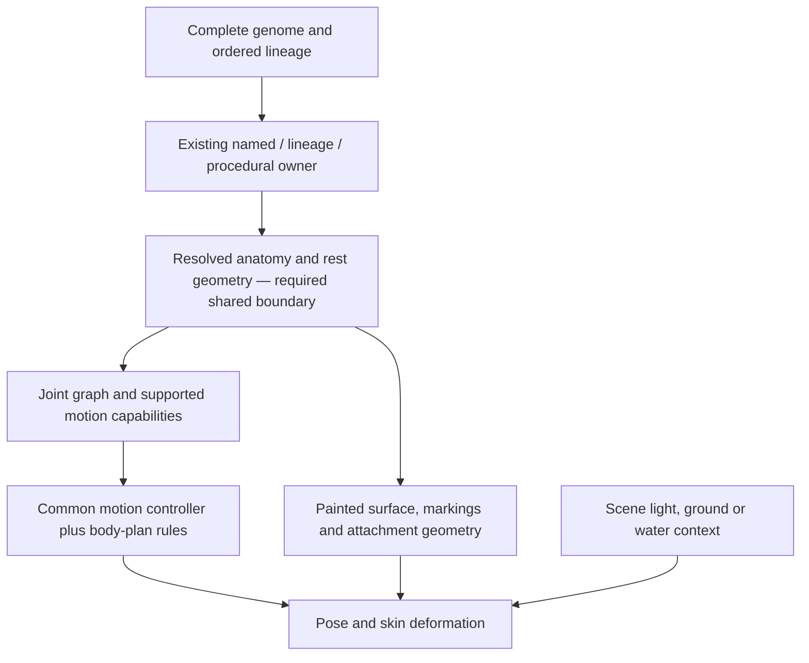

# Creature animation — shared anatomy and motion contract

**Bittern approach diagnostic — matches evidence 2026-10-02.** The painter and AI-finished rigs both refuse three folded triangles at the exact native approach phase604.1000000000004ms of the612ms gait. Their geometry is byte-identical; source/publication replay over282 forward, reverse and repeated seeks, plus14 loaded-rig publications using both RGBA atlases, reproduces the same outcome and preserves the last publication on refusal. The historical painter film sampled37passing approach times; the finished film sampled the narrow failing phase. This is a deterministic phase-dependent fold, not an established texture or seeking-order defect. Both variants remain held for that interval; the historical painter-film PASS is retained. No runtime change, guard relaxation or native retry. Evidence: `audits/C183_BITTERN_FOLD_20261002/README.md`, `replay.json` and `runtime-parity.json` in that audit.

**Snowy Owl native diagnostic — matches evidence 2026-09-27.** Exact stage idle+faint425.5333ms reproduces two near-foot/shin folds while the standalone same-time clip passes (C91). C93 wider sampling finds10 baseline stage failures and7 nearby standalone native-seed failures, so this is not solely additive idle. Early idle fade clears the exact instant but still fails nearby; local-chain weight candidate worsens it. Both rejected; no runtime/default/limit change or native rerun. Five interval outcome controls and corrected exact stage-clock arithmetic are in `audits/FAINT_COMPOSITION_C93_20260927`; prior evidence remains. Hyrax exhaustive tail diagnostic stays RED; actual game intent remains bite/claw.

**Reviewed optional absence — matches tooling 2026-09-27.** `reviewed-presence.mjs` admits one exact master/subject/prompt-bound adult tailless-quadruped review to the existing v2 presence shape. It requires independent canonical tailless evidence and explicit visual/context review; stale sources, species inheritance and mandatory-leg removal refuse. C89 removes Hyrax's four false tail joints with other BodyCard parts identical, but its unchanged full-family tail-clip diagnostic remains RED. No anatomy/native admission, hidden/folded inference or wingless-caste policy follows. Evidence: `audits/PRESENCE_C89_20260927`.

**Full battle evidence — matches code 2026-09-25.** The native battle2 proof records the complete planned script, with a ten-second minimum, into `battle-full.webm`. It retains every live frame's turn/phase/clock/CPU data and all capture refusals; independent checks require every positive-duration phase, the complete live/encoded endpoints and the existing proportional57fps encoded floor/750ms padding. This is capture integrity, not uninterrupted60fps or visual admission. Previous `battle-10s.webm` studies remain scoped to ten seconds even when their still sets include later turns. Evidence: `audits/ART_BATTLE_FOCUS_20260925/full-battle-capture-01/`.

**Authored paint continuity — matches code 2026-09-25.** The offline observed-surface builder can weld explicit `paintBoundaryPairs` that each match one real source adjacency. This keeps an interior torso ownership patch continuous without welding independent near/far limbs. Unknown, duplicate, missing or conflicting declarations refuse; default and all-boundary behavior stay unchanged. The Cougar packet independently checks the declared seam and rejects the old unwelded hole. Existing accepted bindings are untouched.

**Planted faint excursion — matches code 2026-09-25.** A land/amphibious quadruped faint now compiles one constant torso gain from its observed four-leg geometry. The planner samples the complete canonical curve, retains a 10% angular authoring reserve inside the unchanged contact limits, and scales root translation plus root/pelvis/spine/chest rotations together. Timing, feet, head/neck/tail/limb tracks and secondary curves are unchanged. A full excursion that fits keeps its exact old timeline; absent bend direction keeps the old preview and still refuses in contact admission. This is a motion proposal, never a rig certificate: actual painted-support, skin, source-rest and native gates remain authoritative. Cougar passes 19 action rows plus 1,675 presentation samples after source-label ownership and the review clock correction; six S2 controls remain byte-identical. Evidence and all failures: `audits/ART_BATTLE_FOCUS_20260925/cougar-repair-03/`.

**Skin kernel execution — matches code 2026-10-02.** The optional WASM skin pass retains ordered neighbor additions and moves independent x/y rotation/RHS arithmetic into SIMD lanes; fixed iterations and robust JavaScript fallback are unchanged. The active orientation projector preserves its original step for the first topology-sized group of visits, then uses half steps inside the same total visit budget. This settles the captured Centipede approach oscillation; JavaScript owner, admission reference and C leaf use identical arithmetic. Hard pins, area floors, half-target stopping, final ARAP/published-paint refusal and motion/contact constraints are unchanged. The orientation repair's six source/generated artifacts and the subsequent sweep's four artifacts match their signed native candidates exactly. The production regression restores the old scalar to reproduce the real folded target and exhausted budget, and verifies exact WASM/JavaScript state, preserved safe-pose output and actual published paint. The SIMD successor is byte-identical across all 56 captured/adjacent targets and 1,792 published-part checks; 17 leaf tests and the nine-test library owner pass. Its one 4× native pair records 789 live frames, zero refusals, CPU p95 8.7 ms and three CPU samples above 16.667 ms (maximum 23.3 ms); strict all-pair 60 fps and iPhone acceptance remain open. All 18 named stills match the prior corrected film bytes; an existing Chimpanzee victory paint defect remains visually held. One native run per candidate is not an isolated speed benchmark. Current evidence: `audits/C132_C12_REPAIR_20261002/PROMOTION.md` and `audits/C132_C12_SIMD_20261002/promotion.json`. Earlier exact execution/profile evidence stays in `audits/ART_BATTLE_FOCUS_20260925/centipede-kernel-01/`; raw CDP samples preserve per-module/caller attribution.

**Observed adult insect flight — matches code 2026-09-25.** The body card preserves its explicit source habitat. The mandibulate-insect register continues to default to ground for undeclared castes/life stages. Its documented adult-flight path now reaches the existing anatomy attack selector only with a source aerial fly/glide declaration, the flight gait and both observed unfolded wing owners. Missing declaration, missing wings, folded wings, blank provenance and unrelated flightless species still refuse. Dragonfly candidate evidence: `audits/ART_BATTLE_FOCUS_20260925/dragonfly-repair-03/`; the earlier ground film is not flight acceptance. No family limits, contact tolerances or solver settings changed.

**Translucent arm motion — matches code 2026-09-25.** Radial arm indices are projected onto their observed attachment sides; an index no longer invents left/right orientation. Translucent arm chains use the existing dimensionless length/depth amplitude profile to distribute bending, with every joint still animated. Contacts, solver settings, family limits and authored source pixels are unchanged. The native battle proof accepts explicit per-side, recipe-hash-bound weapon declarations through the existing anatomy validator and refuses a declared attack failure instead of falling back. Candidate evidence: `audits/ART_BATTLE_FOCUS_20260925/jellyfish-repair-03/`; runtime admission and picker smoke remain Claude's integration step.

**Battle-stage roster, presentation and wet arena (Claude lane) — matches code as of September 24, 2026 (this block only; it does not cover motion, and every other block keeps its own date).** All 17 painted archetypes play on the battle stage as paint-skin parts rigs: Crab, Coconut Crab, Freshwater Crab, Mud Crab, Vent Crab, Civet, Salmon, Eagle, Beetle, Python, Tree Frog, Chimpanzee, Starfish, Tarantula, Octopus, Fruit Bat and Centipede. The list is `BATTLE2_PARTS_FITS` in `port/v2/apps/game/src/battle2-archetypes.ts`, generated by `port/v2/tools/morph/build-card-masters.mjs` from the same list as the Compendium card (`battle2-archetypes.test.ts` fails on drift). `battle2-wiring.ts` loads a parts rig for any record whose Earth name has a registered fit (`BATTLE2_ASSETS.partsFits`), when the asset loader supplies raw bytes; a failed load is reported and falls back to the fixture rig. `battle2/library-arena.test.ts` loads each archetype's fit directly and has it fight a portrait opponent as attacker, with its own compiled anatomy attack, and as target at 30 Hz with zero rig refusals.

Presentation is one rule, `combatantPresentation` in `port/v2/apps/game/src/battle2/stage.ts`, used both as the stage's own default and by the app wiring. It applies the mass rule (a guardian instead fills `GUARDIAN_FRAME_FILL` with its tallest pose), then caps width at `COMBATANT_WIDTH_FRACTION_MAX` (0.42 of the frame, `battle2/arena.ts`; guardians exempt), then, given its stand line and a rig that reports its extent, keeps the tallest pose (rest reach above the foot plus the measured rise) `COMBATANT_TOP_MARGIN` (0.02 of the frame) inside the top edge. The app wiring (and the native proof harness) centres each painted box on its stand with `standCentreShift` (stage.ts), by shifting the stands the stage and choreography read; the stage itself still places the foot at `stand.x`. With `fitToBand`, `selectHabitatArena` in `battle2/habitat-arena.ts` gives an air or water body taller than `BAND_FILL` (0.9) of its band a `fit` factor below 1 that shrinks it to that height; the wiring multiplies it into the presentation scale. The wet arena is the `BattleStage` option `water: { surfaceY, side? }`: it draws the `WATER_BANDS` depth bands behind the combatants; a full lake hides the dry near plate, while a swimmer facing a ground fighter gets only its own half and the near plate stays. `lakeArenaWorld` supplies the lake world. Stage file ownership: `port/v2/apps/game/src/battle2/README.md` (its table matches code as of 2026-09-19 and does not yet describe this presentation rule or the wet arena).

How each body plan moves is Codex's motion-anatomy program: `audits/MOTION_ANATOMY_20260923/CODEX_PROMPT.md`. The current `battle2/library-arena.test.ts` owner requires zero rig refusals. Its corrected 2026-10-02 run passes all nine tests: all 38 card archetypes publish their attacker/target sequences at 30 Hz, and the SCALE SWEEP passes every four-turn bout at 0.85×, 1× and 1.15× (114 archetype/scale cases), including Centipede. The sweep now supplies each record-bound weapon declaration and propagates compilation errors; it verifies 342 actual anatomical stage attacks, forward movement and 342 returns home, with no generic fallback. A mismatched declaration refuses. Evidence: `audits/C132_LIBRARY_SCALE_ATTACK_20261002`. No expected-refusal exception remains or was added. These deterministic outcomes use portrait opponents and selected ordinals, not every verb, both attack facings or every real pair; they do not certify native 4× performance or visual acceptance.

Final audit scope: the six gait passes are ground-only projections; Eagle/Bat compiled aerial realm currently frees their contacts. The corrected-context audit leaves 47 FAIL and 229 UNMEASURED rows, including Bear contact gaps and unrepresented effectors. Python strike/constrict and world-path following remain unqualified. See `audits/MOTION_ANATOMY_20260923/FINDINGS.md` and `CLAUDE_REQUESTS.md` in that packet. Native review includes 17 admitted films, maximum measured per-rig p95 3.299999952316284 ms; compact timing does not close Centipede’s original-program fold refusal.

**Candidate body routing — matches code 2026-09-24.** All 53 previously empty Earth-fauna presentation profiles now reference existing specialized templates. Sea Squirt uses sessile-filter, Salp/Pyrosome colonial-filter and Fiddler Crab brachyuran; all other routes follow the existing target register. Explicit `needsObservedFit` retains all 53 in the coverage ledger: zero new painted admissions. Habitat, weapons, accepted bindings, anatomical counts and solver limits are unchanged. Packet: `audits/MOTION_FOLLOWUP_20260924/ITEM7.md`. No new art was commissioned.

Final audit scope: the six gait passes are ground-only projections; Eagle/Bat compiled aerial realm currently frees their contacts. The corrected-context audit leaves 47 FAIL and 229 UNMEASURED rows, including Bear contact gaps and unrepresented effectors. Python strike/constrict and world-path following remain unqualified. See `audits/MOTION_ANATOMY_20260923/FINDINGS.md` and `CLAUDE_REQUESTS.md` in that packet. Native review includes 17 admitted films, maximum measured per-rig p95 3.299999952316284 ms; the later 2026-09-24 compact-crawl fix removes the stacked vertical body bob and passes the read-only Claude stage reproduction at 0.85×/1×/1.15× with zero refusals. The absent local `library-arena.test.ts` prevents removing its pin here; its exact removal patch is retained with the fix for Claude’s same-commit integration. These are CPU rig/stage checks, not a new native film or integrated certification. See `audits/MOTION_FOLLOWUP_20260924/ITEM5.md`.

**Motion anatomy — matches code 2026-09-24.** Dakk accepted the thirteen sprint art selections. The M0 specification and M2 baseline cover18 rigs/234 offered actions in `audits/MOTION_ANATOMY_20260923`. Serpent/fish approach curves now use64 phase keys, with explicit phase ownership preventing secondary material lag from delaying the tail twice. Actual waveform measurements, exact-rest and zero-changed-channel proofs, films and retained failures are in that packet. The contact owner uses family timing tables for insect tripod, arachnid tetrapod, bird walking, primate/bat hindfeet and compact myriapod metachrony: duty .65 and .20-cycle successive leg-pair lag for Centipede. Knuckle/wing-wrist support and starfish tube feet remain unrepresented; a hindfoot pass is not full gait qualification. Quadruped/crab timing and every sealed contact/solver threshold remain unchanged.

Insect exact rigid-support iterative-refusal recovery is independent of its stance/travel declaration; other recovery remains restricted to explicitly declared source-step families. Legacy crab/quadruped refusal boundaries remain intact, including the unchanged Freshwater reach bound. The five-regression packet `audits/MOTION_FIVE_REDS_20260924` records the rejected broad-rigidity candidate and the passing final targeted checks. Freshwater measures .070494 forward/backward against the unchanged .07165014577259474 sealed forward bound. Six S2 receipts/support sequences remain byte-identical. The art override gate and its mutation controls pass on the full42-art+5-transitive closure; prototype validation uses an approved direct call with no gate relaxation. New CLI record writers normalize repository-relative source paths before sealing and reject repository escapes; historical records/bindings are untouched. `port/v2/tools/creature-animation/intake-authored.mjs` is the portable sprint writer.

World path-following, actual S-neck recruitment/constriction and Bear guardian stage qualification remain blocked by missing stage/history/topology evidence. The stage was not edited. The accepted Python head is a sibling of the axial chain, so a root lunge is not proof of neck extension. Rectilinear belly-skin transport, octopus sucker contacts and starfish tube-foot propulsion are not represented and must not receive a false anatomy PASS. Claude owns the exact integration requests in the packet; no current-source I5/PR43 or release claim follows.

**Python open-pose proof and ground framing — matches code 2026-09-23.** The source-preserving repair of the old coiled painting exposed incompatible moving cut boundaries. Dakk authorized one corrected open-pose master; the new candidate has13 manual owners,12 required source joins and no excluded cut boundaries. Selected candidate02/static02 passes12×121 action samples plus968 presentation samples, exact geometry rest and source-pixel rest0. Native20260923-python-open-native-03 has0/0 refusals,602 live/605 encoded frames,1268 passing dense containment observations and per-rig p950.5/0.5ms. Its local dirty-source authority is explicitly listed in audits/PYTHON_OPEN_POSE_20260923/source-manifest.json; it is not a clean-source certificate.

The local native proof’s ground presentation now fits the complete published moving envelope against the viewport around the unchanged source ground registration, including measured camera extrema and a5% presentation reserve. An optional groundViewport input leaves legacy helper callers unchanged. The tighter ground reduction is shared across roles to preserve the original combatantScale mass ratios; height and foot-offset receipts use the final scale. Water/air fitting, motion, runtime solver, viewport/habitat gates, source pixels and numerical CPU limits are unchanged.21 focused geometry controls pass, including retained clipping and unequal-role-size negative controls. Both superseded native attempts and the expected-value test correction remain in the packet. All accepted prior bindings and S2 inputs are unchanged. The wide battle view is small, delivered safe margins/fringe miss the prompt, and family poses remain stylized; Dakk retains full-film art acceptance. No production roster or PR43 claim.

**Compact Centipede anatomy — matches code 2026-09-23.** Explicit myriapod presence may declare 14 walking leg pairs plus one ultimate pair. The `myriapod-rigid-trunk-v1` variant has 63 real joints, 28 two-link walking chains and 31 source-authored fixed sockets; sockets add no pose channels. It retains one rigid painted trunk rather than the legacy eight-segment wave. Admission and motion use the same socket origins, with exact inventory, finite-coordinate and source-alpha validation. The original 64-joint/32-part ceilings and numerical motion/contact bounds remain unchanged. Records without the explicit count keep the legacy model. The packet-local compiler assigns observed proximal-limb and antenna/mandible influences within 32 actual texture parts, preserving raster, UVs, topology, inherited pins and the standard solver profile.

Its explicit `contactStance.swingLift: 'toward-socket'` convention retracts both projected leg rows toward their source sockets with the existing swing amplitude; omission retains screen-up swing. The shared painted-contact selector preserves runtime normalized per-corner arithmetic and strict tie ordering, and the intake writer uses the same selected vertex for contact locks. The independent static paint observer is unchanged. This repairs a pixel-sum/normalized-sum tie mismatch without editing accepted bindings or loosening painted-point tolerances.

**Support candidates and compact reaction cadence — matches code 2026-09-23.** `createFamilyContactSolver` preserves successful endpoint iterations and the existing endpoint-only analytic fallback. After an iterative refusal in a family explicitly declaring source-step travel, or an excessive painted residual, mixed supports may try one provisional rest-support geometric candidate from the complete authored/travel-adjusted pose. All active chains are solved before the original weighted painted supports are measured together. Every nonzero contributor, including foreign joints, remains in that measurement; mixed supports are not reclassified as rigid. Actual anatomical endpoints, joint limits, the existing 8% motion-scale compression cap, `1e-8` normalized endpoint bound and `0.25` source-pixel painted bound still decide admission. A failed candidate retains the original iterative refusal and its candidate cause.

The compact model explicitly declares `contactStance.travelSubsteps: {hit:2,dodge:2,tame:2}`. Only these declared source-step actions and value 2 are accepted. Each nonzero compiled interval receives two equal signed foot substeps; a completed translated clip’s existing presentation return step is also subdivided. The original body expression `base + stride * progress` is cached before subdivision, preserving root travel arithmetic, source waypoint times and total displacement. Lift/retraction amplitudes, blend weights, easing residuals and numerical gates remain unchanged; other actions, zero-travel holds and stage-owned travel retain their prior cadence. This is an explicit action cadence model; it does not choose step counts from measured reach. Source snapshots, focused controls, rejected attempts and final measured evidence live in `audits/ARCHETYPE_FINISH_20260923/12-myriapod`. Candidate13/fit11 passes static08:12 actions ×121 samples plus822 presentation samples, exact source-pixel rest0. Native `20260923-centipede-native-02` passes the local diagnostic with0/0 dense and live refusals,602 live frames over10016.3ms, and desktop per-rig p952.8000000715255737/1.8000000715255737ms against3.5ms; whole-stage p95 is4.200000047683716ms. The encoded film has606 frames at1024×576 over10.100962s. Final S2 replay retains six byte-identical receipts,13286 identical support samples and12 unchanged protected inputs. Dakk’s art review remains separate: the requested8% horizontal safe margin is missed, painterly sockets/internal joints are authored estimates, the trunk is explicitly rigid, and each ultimate appendage has one controller despite visible bends. These are local source-specific technical results, not production roster integration, clean-source Compendium certification or a PR #43 claim.

The local battle2 native proof sizes the rest image from every positive alpha byte through `positive-alpha-box.mjs`; transparent RGB is excluded, but alpha 1–8 paint is retained. This is an observation-only sizing fix: source bytes, ground registration, mass-class formula, shared placement/render scale and final published-mesh containment/CPU gates are unchanged. The retained Centipede key contains 178,726 positive-alpha pixels; the prior >8 sizing rule omitted 38,320 of them and measured a 460-pixel height instead of the full 1,148-pixel extent. Native01 stopped at viewport containment before film/CPU measurement. Its refusal and the focused sizing controls remain in the item12 packet. The fresh native02 run on this corrected harness passes all1174 dense published-mesh samples and the602-frame live capture under the unchanged containment and per-rig CPU gates; no rejected alpha bytes were deleted or hidden.

**Arachnid support policy — matches code 2026-09-23.** Optional `contactStance.hind` names complete existing chains and rejects empty, duplicate, unknown or unresolved groups; omission keeps historical selection. Arachnid cast/victory use posterior pairs3/4, dodge releases contact, standalone hit/tame reuse the existing tetrapod source-step planner, and faint stays grounded. Numerical limits, solver reach/compression bounds and painted tolerances are unchanged. A planar-root experiment was tested and retired: it could not admit the nearly straight painted leg at peak victory within the original cap. Its complete source and evidence remain in `audits/ARCHETYPE_FINISH_20260923/09-arachnid/planar-prototype`. The corrected source painting has an actual articulated leg and a newly authored fit. Final production is exactly the earlier policy-only source; Tarantula fit03/static04 passes13 actions×121+896 presentation with exact rest0; native20260923-tarantula-native-01 has0/0 refusals and per-rig p950.7999999523162842/1ms. Final S2 retains all6subjects/13286support samples byte-identically. Source anatomy approximations, every rejected attempt and art margins remain documented. No production roster or PR43 certification is claimed.

**Chimpanzee source-fit repair — matches code 2026-09-23.** Primate dodge releases its two leg contacts in accord with the existing unplanted stage dodge; other stance policies and all numerical bounds remain unchanged. The retained original painting has corrected near-haunch ownership and an explicitly occluded far-hip estimate. Fit02 passes13 actions×121 +886 presentation samples, exact rest0; native20260923-chimpanzee-native-01 has0/0 refusals, per-rig p950.7000000476837158/0.8999999761581421ms. No solver or accepted binding changed. Full source authorities, failed attempts, film, sheet and art limitations: `audits/ARCHETYPE_FINISH_20260923/07-primate`. No production roster or PR43 claim.

**Tree Frog adhesive pad support — matches code 2026-09-23.** Optional source-record `geometry.contactPads` (cf.terminal-pad-support/v1, adhesive) declares exact observed terminal pad points. Admission checks source alpha/inventory; rigid pinned rendered triangles supply their actual positions. The bounded analytic planner preserves anatomical bend, bone lengths, original joint limits/compression and0.25px drift. Old records retain the old path. Native battle2 passes matching solved targets to atomic pending-Float32 paint admission; rejected targets do not publish. Older generic reviews explicitly reject this new mode. This point-anchor model makes no whole-foot terrain-clearance claim. Hopper bite/cast/victory use hind support, dodge is airborne, faint keeps four contacts, standalone hit/tame use signed source steps. Tree Frog fit05 passes12 actions×121 +850 presentation samples and exact rest0; native20260923-tree-frog-native-02 has0/0 refusals, per-rig p950.6000000238418579/0.8999999761581421ms. S2 six receipts/13286 samples remain byte-identical. All prompts, art discrepancies, failed attempts and source hashes: `audits/ARCHETYPE_FINISH_20260923/06-hopper`. No production roster or PR43 claim.

**Beetle contact repair — matches code 2026-09-23.** Insect cast/victory use hind support and dodge releases legs with raw-limit/finite validation. Canonical standalone hit/tame clips pair compiled signed root travel with tripod steps and final fade return; external clocks preserve prior stance and external displacement remains subject to reach checks. Stage-owned travel stays separate. Rigid endpoint-only supports may use the existing analytical fallback after iterative refusal, under unchanged numerical bounds; both refusal causes remain. Accepted bindings and S2 inputs are unchanged. Beetle fit04 passes13 actions,869 presentation samples and exact rest0; native20260923-beetle-native-01 has0/0 refusals, per-rig p950.7000000476837158/0.8999999761581421ms. S2 six receipts/13286 support samples are byte-identical. Full prompts, hashes, failed attempts, film and sheet: `audits/ARCHETYPE_FINISH_20260923/04-insect`. Art margin discrepancy remains for Dakk; no PR43 claim.

**Eagle orientation and intake, matches code2026-09-22:** optional forward/active WASM orientation kernels preserve the existing Float64 operation order, fixed pins, signed-area floors, queue ordering, iteration budgets and refusal outcomes; unsupported or failed kernels fall back to the original JS path. Complete old/new Eagle state/output comparisons and S2 replay are in audits/ARCHETYPE_REPAIRS_20260922/03-biped-bird. Six S2 receipts and13286 support samples are byte-identical, with11555 checked orientation invocations. The offline mesh writer accepts optional explicit refinement rectangles bounded by the image and no coarser than global steps; omitted/empty refinement retains the old default bytes. Accepted canonical meshes and S2 inputs remain untouched. Eagle fit12 uses40/80 global steps without local refinement, manually observed tail/wing/leg labels, unchanged source RGBA and explicit presence. All14 actions plus presentation and exact rest pass; native20260922-eagle-native-07 records0/0 refusals and per-rig p950.7000000476837158/0.8000000715255737ms against3.5ms. The packet retains every failed candidate, film, sheet, prompt, source hash and negative control. Native sizing refusals now identify time, turn and side without changing gates.

**Local archetype stage, matches code2026-09-22:** tools/battle2-proof owns a bounded unmorphed native review using local battle2/effects/soundkit dependencies. Explicit stage scales feed rendering, placement, half-widths and cadence; optional injected timing reports shared pose sampling and per-rig update costs. Full published mesh sweeps size water/air presentations under unchanged habitat bands, then fresh final rigs and live film verify containment/refusals. Canonical wet worlds use an explicitly procedural water overlay. Morph/guardian requests refuse in this diagnostic. Salmon passes14static rows, exact rest,0native refusals and desktop per-rig1.5/1.100000023841858ms p95; audits/ARCHETYPE_REPAIRS_20260922/02-fish owns hashes/film/sheet. No accepted binding, S2 input, numerical limit or solver changed in that Salmon batch.

**Local repair source, matches code as of2026-09-22:** Dakk authorized the named archetype sprint and repairs in audits/ARCHETYPE_REPAIRS_20260922/AUTHORITY.md. The six supporting battle2/effects modules listed in01-i5/source-import-receipt.json are now present locally from committed5154c64f6f5fe0b9a75bc3f7a51e7da56b6b2e7f for existing current-producer proofs. They are not reachable from the game entry. This does not claim full battle-stage integration or completion of failed archetypes. Only unused motion declarations were removed to satisfy strict compilation; family definitions, solver behavior and limits remain unchanged. Accepted inputs and S2 sentinels stay protected.

**Painted desktop delivery — Dakk’s September20 decision, PROGRAM.md§6.** Accepted
painted masters use full-film rig p95 ≤3.5ms on desktop, explicitly selected as the
painted-desktop review tier. Canonical boundary24/interior56 meshes remain unchanged.
Per-clip2ms readings remain recorded as diagnostics for this tier; the existing strict
2ms phone/painter gate remains unchanged. D1 phones continue using retained originals.
Geometry, exact rest,0.25px contact and split root-continuity gates remain mandatory.
Current delivery: audits/VISION_P1_DESKTOP_DELIVERY_20260920/README.md.
Final canonical captures: Crab4.0ms / Freshwater2.4ms / Mud3.6ms / Vent3.6ms full-film rig
p95; retained split-guard Coconut3.0ms. Freshwater and Coconut PASS the desktop gate;
Crab/Mud/Vent remain CPU leaf reds, with films and sheets delivered and no unchanged retry.
All geometry/contact/rest/continuity checks pass, zero refused frames.310 frozen input/writer
files unchanged. IC-3 writers are now frozen: no intake, painting, P2 or roster until IC-4
passes the five accepted fits. Older CPU decision-pending notes below
are historical measurements, superseded by this explicit tier decision.

**Declared hidden anatomy — matches code September 20, 2026.** Dakk accepted P1 Coconut
Crab generation01; its six visible legs are correct under the species count law. The final
walking pair is present but hidden, not absent. `cf.anatomy-presence/v2.hidden` explicitly
names brachyuran `leg3Far`/`leg3Near`; no missing landmark creates a declaration. All joints
remain in the exact inventory. Offline inference mirrors pair2 vectors about the body axis
through a root extrapolated by pair2−pair1 root spacing, preserving pair2 segment lengths
1:1. Admission checks those inferred coordinates and flags six hidden joints; only their
paint-alpha proximity checks are exempt. Ordinary coordinate/bone bounds remain unchanged.
Hidden joints own no part/atlas entry and no positive skin weight. Intake and runtime reject
hidden paint ownership; six visible chains enter contact solving. No declaration preserves
the old eight-contact graph and arithmetic. This is ownership validation, not an automatic
silhouette verifier capable of discovering undeclared hidden limbs.

P1 master stays 1254 square with delivered RGBA unchanged; source art and margins are accepted.
Current fit04 has21 visible parts and exact atlas/rest reconstruction. Fit02 native review
revealed a Far-claw tip fragment;873pixels are reassigned from body to claw, with no master,
landmark or neighboring-limb change. The initial film retains CPU/root-continuity leaf reds. Dakk authorized
measured brachyuran contact limits after faint required−50.0539666° versus the old−35°.
The expanded ten-subject ledger (five painter crabs and five accepted paintings, all rows
and presentation) measures maximum absolute Knee63.4567921° / Foot93.9460409°, both
on painted Freshwater faint. The approved ceil((max+10°)/5°)×5° rule now gives
contactLimitsDeg ±75° Knee / ±105° Foot across the family. Coconut72px is retained as
an insensitive negative; Freshwater40px admits and46px rejects on the Knee contact limit. Raw limitsDeg stays ±35° and
raw clips are unchanged. No contact/geometry/CPU gate, painted landmark or source pixel moves.
The old faint limit red is resolved. The first native film has zero contact/seam/limit
refusals and exact pixel rest, but approach p95=2.00ms and capture rig p95=2.90ms fail <2ms;
faint root-step continuity is9.104px versus8.095px stride. These remain leaf findings.
Final mask-corrected native02 has zero contact/seam/limit refusals and exact RGBA rest.
Its approach p95=2.10ms, recorded rig p95=3.20ms and the same faint root-step continuity
remain leaf reds. Film/sheet are delivered; animationReady remains false. Roster holds.
Evidence: `audits/VISION_P1_COCONUT_20260920/hidden-01/README.md`.

**Consolidated P1 intake, September20.** Dakk explicitly declares Crab leg3Near, Freshwater
and Mud leg3Far hidden behind the claw. Shared template inference preserves complete joint
inventories with no hidden paint/contact. Current fits: intake-02 Crab01, Freshwater03, Mud01;
intake-01 Vent01; Coconut hidden-01 fit04. Freshwater03 reassigns52,115 body-fringe labels
outside its observed body outline; all existing limb labels, master channels and visible
landmarks stay unchanged. Earlier masks and failed pin-repair diagnostic remain evidence.
The tessellator nearest-ink search now covers the requested cell diagonal, preserving
the first-found result for existing meshes and enabling boundary48 candidates.
CPU series completed30 requested entries /17 distinct bindings. Boundary48 gives full-film
p95 of1.3/1.7/1.2/1.3ms for Coconut/Crab/Freshwater/Mud; Vent boundary48 refuses painted
support convergence, so no film CPU exists. No painted-tier gate is selected.
The complete six-subject60Hz native root ledger measures non-gait maximum0.0160022634
anatomical motion-scale units per sample; +10%, rounded upward1e-6 yields0.017603.
The shared root guard uses this scaled bound for brachyuran non-gait rows, stride for gait
rows including both transition edges, and unchanged stride behavior for other templates.
All six normal traces pass; all six actual doubled faint-recovery keys refuse. No production
key/clip/solver change. Historical native continuity reds above are now diagnosed by this
split guard; original films/reports are retained. CPU remains Dakk’s decision.
Next: intake compiler before further painting/P2/roster. Claude owns registration/labels,
Codex shared writers. The five accepted paintings are regression truth, not proof of
automatic intake. Every required hand step is a compiler bug.
Packet: audits/VISION_P1_CONSOLIDATED_20260920/README.md.

> Matches D1 delivery code, 2026-09-19: `creature-delivery.ts` reads retained PNG originals by full identity and expected hash, otherwise returns the verified painter. It has no inference, worker, GPU or rig dependency. Selection of a finish is explicit; proof usage does not adopt artwork into production. Evidence: `audits/ANATOMY_SINGLE_RUN_20260919/R8/README.md`.

**Current stance/contact contract — matches code September 19, 2026. R3-S accepted.**
Shared per-template/action stances select all, hind or no quadruped contacts; only planted
chains enter IK. Lifted legs retain authored keys and the raw-clip guard. Brachyuran keeps
all visible contacts; undeclared presence retains historical behavior. Stage travel zeros solver root
dx without changing stored clip keys. Gaits retain paired solver root/stance travel with
explicit lift phases. Civet’s regenerated binding releases nine conflicting non-contact
pins while preserving weights, topology and atlas. Candidate-10 and earlier bindings remain.

Measured planted-fold maxima are Knee 86.5368918°, Ankle 94.1469004°, Paw 80.5685150°.
Quadruped contactLimitsDeg is ±100°/±105°/±95° respectively: ceil((max absolute + 10°)/5°)×5°.
Brachyuran uses the measured contact ranges above; other templates default to limitsDeg.
The raw 169-action library and limits are unchanged.
The final 13,286-sample six-subject strict sweep has zero throw classes; five crabs are
bit-identical to R2c′ and Civet’s maximum planted drift is 0.165257 px. Native rest changes
zero RGBA channels. Crouch ×15 rejects on limits, ×3 remains a documented insensitive
control, and all-four-planted bite rejects on compression. Gates remain 0.25 px, <2 ms and
exact rest. [Acceptance and retained controls](audits/ANATOMY_SINGLE_RUN_20260919/R3-S/README.md).

**R4 — matches code September19,2026.** Typed posed-fold errors support explicit
refusal:hold presentation with retained first/last/count diagnostics and continued action
time; strict evidence remains default. Other errors propagate. Legacy PoseTarget now needs
sample/flush and delegates to the existing frame collector. Native reviews schedule every
full row including faint. CPU/T1/held-flora films remain labelled leaf reds, never admission.
Actual R3 T1 traces pass for all five crabs; Civet retains a vertical21.5px root-step leaf red
(0.017142585 image units versus0.00804873 stride), despite green planted-foot checks.

**R3 — matches code September19,2026.** Five admitted crab profiles select pinch through
the generic melee alias and expose contactJoint/contactPhase=strike. Unbound crustaceans
remain unsupported; Coconut remains ground-only. Explicit stage travel holds completed
approach displacement through transitions, subtracting local gait translation when placing
the rig. Contact solver stage mode and stance targets remain unchanged. Root continuity
is measured against one source stride;42–57px reset controls fail.

**R2d — matches code September19,2026.** Optional rigidParentFrame painted groups
follow an observed published parent attachment and preserve local authored rotation/shape.
Missing parent/source anchors refuse; current Persimmon-04 refuses at branch-0-foliage.
No regenerated foliage binding was admitted. Existing source/CPU reds remain; this leaf red
does not stop R3. [Evidence](audits/ANATOMY_SINGLE_RUN_20260919/R2d/README.md).

**Single-run measurement update — matches code September19,2026.** R1c Civet adapter
hashes match candidate10. Five retained planted poses reproduce its painted-paw contour
numbers; current alert/walk/dodge all exceed upper reach without the compatibility solver's
root accommodation. Evidence: audits/ANATOMY_SINGLE_RUN_20260919/R1c/civet.json.
Native rows now record swing-foot displacement / lower-leg length, painted carapace dy and
per-sample normal passes. R1c CPU switches exist only in an isolated diagnostic build;
shipped BodyCard ignores them. No solver/clip/threshold change in R1c. Current run order and
stop conditions supersede the older bounded-review handoff below; see the single-run ledger.

Current September19 evidence is [the accumulated anatomy packet](audits/ANATOMY_SINGLE_RUN_20260919/README.md).
The R3-S six-subject strict sweep passes13,286samples, exact rest and five-crab R2c′ identity;
Civet worst planted drift is0.165257px. Root continuity is separate: Civet still steps36.15px
in the full presentation. Five crabs preserve source perspective contacts, and selector melee
reaches pinch/contactJoint with strike contact. R4 native refusals hold only typed pose-folds.

The one nine-subject full-row capture and five finished-crab equality films are complete.
The existing accepted model finishes at masked0.35/one step; originals remain immutable,
conservation and texture-only rebind controls pass. Q1 has two separate painted open-gape
candidates on the review sheet. No numeric result is visual acceptance. Film and per-clip
CPU tails are separate: Civet/Coconut and all three plants retain CPU leaves. Persimmon still
has84disturb folds and169presentation folds;13held samples are retained in native review.
R2d parent-frame groups exist, but its missing observed parent attachment refuses regeneration.

R5–R7 current fixtures are hash-verified and independent of historical audits; ordinary/capture
RGBA parity and prefix initial-state admission are strict. Marks do not add structures;
Pyrosome is one tube with190marks. Fiddler exposes six real quadratic legs and asymmetric
claws but no fabricated fourth pair/elbows. Split receipts distinguish observed/welded/independent
boundaries. Rendered root controls pass for trunk-only motion and reject actual root translation.
Exact recording attribution remains separate from creator profile names, including legacy reads.

The census contains1,250cases:1,237raster passes,13legacy fallthroughs,54topology emissions;
compiler outcomes5complete,1incomplete and48unsupported. Current missing profiles number53
(8observed). The requested historical58 roster is exhausted:5existing crab fit/bind/films,
53explicit source-fit refusals,15family sheets,0new visual qualifications. Source/fit outcomes:
[roster ledger](audits/ANATOMY_SINGLE_RUN_20260919/roster/native-01/report.json).
D1 native retained-PNG/painter-fallback delivery passes for five crabs with zero inference,
workers or GPU access. Both phone Glass canaries retain instrument reds; no physical phone
qualification is claimed. Raw169-action limits, source pixels, kits and admission thresholds
remain unchanged except the explicitly authorized planted-only contact limits above.

[Count-preserving anatomy](audits/COUNTED_ANATOMY_20260916/README.md), matches code as of
September 16, 2026: radial and cephalopod records can declare actual arm/tentacle counts in
`cf.anatomy-presence/v2`. One shared expander feeds motion and rig admission; no missing
landmarks are synthesized. The painters publish ten radial arms or eight cephalopod arms
plus the squid's two feeding tentacles, with unchanged drawing commands. Repeated motion
uses shared family curves, and cephalopod impact follows the appendage that actually lashes.
The 64-joint and 40-part/2048px atlas budgets remain. All94 supported count combinations
pass1,222 clips/147,862 synthetic pose samples;20 oversized combinations refuse. This closes
a count/curve contract gap, not painted fitting or phone qualification. Complete masks/body
landmarks, other variable topologies and the58 unmatched named-species structures remain.

[Animation library and shared deformation review](audits/ANIMATION_COMPLETION_20260916/README.md),
matches code as of September 16, 2026: 169 family actions now have complete-clip limit,
determinism and GSAP parity checks (40,729 synthetic samples). Eight additional physical
motions bring the anatomy selector to32 rows, including actual hoof kicks, body strikes
and fish tail sweeps. Explicit anatomical absence is shared by compiler and rig intake.
All631 named fauna still have exact profiles:578 have candidate moves;53 require new body
structures. A candidate is not a fitted or visually accepted species. Broad marine/crust/
sessile labels no longer silently borrow fish/spider/radial bones.

The shared skin solver retains its established fast projection and invokes a bounded
active-set repair only for unresolved folds. No creature-specific motion attenuation or
solver setting was added. Whole-library painted checks exposed fish cast/dodge/victory
folds and the difference between pure and Float32-rendered geometry; failed controls are
retained. Native films, per-action frames, source hashes and timing limitations are in the
review folder. Some timings exceed the2ms goal; this is not universal or phone qualification.
Originals, approved artwork, kits, combat results and seeded generation are unchanged.

[Seeded painted biome encounter](audits/PAINTED_BIOME_ENCOUNTER_20260916/README.md),
matches code September 16: three painted quadrupeds now share an 18-second, three-turn
clearing study. The encounter seed selects scenery placement and turn order over the accepted
Earth temperate FAR/MID/NEAR template and compiled Earth card. All three bodies animate;
shared hitstop freezes them together. Native-02 passes 3,243 source-join/body-frame samples,
replay and mouth-contact checks; 60 fps, 0.8/1.0/0.9 ms creature-update p95 on this Mac.
The ground band now describes space above the registered floor, and mirrored contact uses
the same source jaw before screen reflection. Negative controls retain the old failures.
This is seeded painted-template composition, not newly inferred biome art. Damage is scripted
presentation data, not the combat resolver. Automatic fitting, planted-paw contact, sound,
ordinary-game squad wiring, other painted families/biomes and physical-phone qualification
remain separate. No new painting, model run, kit change or original-asset edit.

[Painted variation motion review](audits/PAINTED_VARIATION_MOTION_20260916/README.md) now
animates the approved seed10271 painting, a second10271 painting and crystalline10032.
Independent hash-bound authored observations feed one shared quadruped template; no creature
clip overrides. All three pass exact rest/final rest,484individual and601blended pose samples,
full-motion framing and36connected leg parts. Native captures run about60fps at1.3/1.6/1.7ms
rig-update p95 on this Mac. Alpha-preserving intake, frame clipping and wrong-limb paint islands
are repaired with negative controls;12focused tests and root validation pass. New candidate
art still needs kit intake/visual acceptance. This does not establish automatic fitting,
planted contact, hidden views, other painted families, ordinary gameplay or phone qualification.
Kit, accepted originals and the source genomes remain unchanged. Preview uses one player,
visible still/error fallback and a loopback server with byte-range support.

Matches code as of 2026-09-16. The actual rig now uses a family-neutral joint evaluator
(`skeleton-pose.mjs`) with a supplied joint graph, exact landmark inventory and body axis.
It snapshots the owner data, inherits local rotations/offsets, applies root translation once,
and rejects malformed poses before publication. Quadruped hash/asset/shape admission remains
unchanged. The loader and parts intake now admit all fourteen closed family contracts through
`family-record.mjs`; unknown/mismatched inventories still refuse. The legacy seam-bridge owner
remains quadruped-only. See [family intake evidence](audits/UNIVERSAL_FAMILIES_20260916/README.md):
910 bound comparisons, fourteen deterministic atlas controls, 137 tool tests and 45 focused
tests. Calibration geometry is not painted-family qualification. Four actual painter owners
now expose partial drawn topology, preserving real appendage counts and visible/absent parts.
Count-aware radial/cephalopod motion now accepts v2 declarations. Other variable topologies
and completed painter masks/landmarks remain required.

[Procedural motion iteration](audits/PROCEDURAL_BATTLE_ITERATION_20260916/README.md) adds
three real generated genomes (10032,10052,10271), with painter-emitted landmarks/masks/materials,
zero observation drift and one lossless atlas each. Shared genome-aware body cards and smooth
review transitions pass484 individual plus601 assembled native samples per creature, exact rest
and final rest, and separated-mesh negative controls. All three recorded about60fps/0.4ms rig
update p95. This covers only current four-leg/banded-tail observation support, not every family.
The habitat diagnostic now subtracts compiled hitstop from locomotion, poses and body travel;
both turn roles freeze identically and1,202 source-join/medium-containment samples pass. Its
latest fish/bird updates are0.9/0.6ms p95.36 focused tests,typecheck/root validation pass. These
remain diagnostic tools; normal gameplay is not yet wired. Fine silhouette aliasing, source
shadow deformation, planted contact, other painter owners and phone qualification remain open.

[Habitat battle and Frog repair](audits/HABITAT_BATTLE_20260916/README.md) now adds a local
source-hashed motion snapshot under Dakk's September16 repair instruction. Explicit absence
admits the actual23-joint adult Frog without tail/ears; missing mandatory anatomy still refuses.
Authored fish resolves aquatic/swim. Smooth skin has an explicit material mapping. Frontal
bird wings use a source-derived rotation basis; actual source masks, shared curves and root-only
offsets remain authoritative. A new open-wing bird candidate is not accepted art.
The mixed water/air scene passes1,200 source-join/full-body containment samples and records a
10.101600-second/606-frame film at about60fps, fish/bird update p951.1/0.6ms. Final bird and
Frog native proofs preserve exact rest/final rest and pass484 sampled poses each. Frog update
p951.6ms; final bird0.5ms. The physical-habitat compiler uses source capabilities, liquid chemistry
and seeded home/visitor rules, refusing unsupported habitats rather than substituting a biome.
All43 biome routing controls are not43 qualified art scenes. Opponent-facing flight, Frog ground
contact, variable-count procedural records, independent fish accessory fins, ordinary-game wiring
and phone qualification remain open. No accepted master, kit, sibling worktree or GitHub change.

[Facing study](audits/BATTLE_FACING_20260916/README.md) adds an opt-in two-combatant diagnostic:
the Platypus uses a hash-bound 17-part continuous-skin rig and right-side shared turn/contact
sampling. The [throat repair](audits/BATTLE_THROAT_JOIN_20260916/README.md) corrects the remaining
chin notch with a lower source-view fit into preserved neck/chest paint. Seventeen hash-bound
attachment ribbons follow published head/body triangles and pass native alpha coverage at 601
times; the previous image fails the same coverage evaluator. Original visible joins on Civet,
fox and procedural quadruped, plus the Platypus in each pairing, pass the dense motion scan.
Head replacement suppresses only head-subtree parts. Ear/jaw details remain on shared tracks;
front/profile transitions and a painted open-mouth interior remain unsupported. Captured stills
now replay the action after recording cleanup; the old reset-order discrepancy is retained.
The generic attachment evaluator has synthetic controls for all fourteen family vocabularies,
not full painted-family coverage. No ordinary-game promotion, phone or final visual acceptance.
Selected-left-rig timing still excludes the added head/right rig; use whole-frame evidence and
separate future inclusive per-creature qualification.
[Impact polish](audits/BATTLE_IMPACT_POLISH_20260916/README.md) projects the existing flash envelope
onto the receiving rig with a pooled brightness filter and a softer scene flash. Target selection
is side-based, independent of anatomy. Twelve non-flash pose PNGs and all three turn plans retain
exact bytes; native wrong-actor and arena-contrast controls pass. The neutral filter is disabled.
This is diagnostic presentation only, with unchanged head fit, motion and original artwork.
The quadruped observer also refuses extra leg pairs instead of overwriting fore/hind records;
ordinary six/eight-legged painting remains available.

[Universal animation evidence](audits/UNIVERSAL_ANIMATION_20260916/README.md) covers all 14 actual
motion templates, 161 action entries and 4,644 sampled poses. Thirteen family records are
synthetic fixtures, not painted-family coverage. 121 tool tests, 20 focused rig/observer tests,
both TypeScript checks and root validation pass. The new native regression retains exact
rest/final-rest equality and all 30 prior C2 pose PNG bytes. Ten-second diagnostics capture
Civet/fox/procedural at 60.003/60.002/59.903 fps, with inclusive CPU p95 1.4/1.7/0.9 ms.
Clean signed-source qualification and Dakk's whole-motion acceptance remain pending.

Continuous source-painted skin, separate limb surfaces, shared body attachments, painted-paw
constraints and the bounded shape solver remain the C2 foundation. The
[prior C2 audit](audits/C2_CONTINUOUS_SKIN_20260916/README.md) retains its exact source snapshots,
failed controls and six review ZIPs. The universal batch is an addendum to that snapshot.

The target is fluid whole-body motion for named and procedural land, air, aquatic and rooted life
in seeded biome arenas. Preserve the actual painted anatomy, stable joint inventories and recipe
identity. Blender projection is abandoned for the browser; retain the turnaround/canid master for
a later engine port. No 3D or texture-finisher pass belongs to this track.

The [universal animation plan](audits/C2_CONTINUOUS_SKIN_20260916/UNIVERSAL_ANIMATION_PLAN.md)
uses a shared runtime and anatomy-specific templates, supplied by each winning painter's actual
resolved record. Family bounds, extreme generated bodies and reuse proofs qualify coverage;
the Civet proof does not turn one quadruped rig into a universal skeleton.

Art Kit v4.3 and supplied Motion/Sound v1 are approved. Dakk's supplied free-audio handoff
and explicit CC BY attribution approval supersede the source-only execution stop; kit bytes
remain unchanged. The old wording proposal is not a pending permission request.
Arena template v1 is accepted. Wild v4.3 mechanical intake is complete; Dakk owns final image acceptance.
GSAP 3.15.0, the Pixi 8 seeded emitter and one deterministic atlas per creature are the runtime/tooling
boundary. The incompatible @pixi/particle-emitter is removed. Atlas core 0.3.9/CLI 0.3.0 use sorted,
hash-bound copies, four-pixel padding, one-pixel extrusion and no timestamps. Originals remain intact.
The 2048 atlas, 40 drawable and 8% contact bounds are unchanged. Claude owns motion/, effects/,
battle2/, soundkit/, worldlife/ and their tests; this lane consumes those modules read-only.

## Whole-body action and looking — September 15

The painted pose is the rest reference, not a limit on the animal's behavior.
`creature-rig-performance.ts` consumes compiled players for every record-named joint,
samples transitions at explicit command time and publishes one complete frame. Sparse
joints reset and root offsets remain root-only. Nine actual Civet/fox/procedural idle,
melee and hit actions match the pinned read-only GSAP producer; 30/60/120 Hz controls
exercise transition parity. No species-specific motion curves were added.

`creature-rig-aim.ts` solves in-view gaze from source-bound eye/forward points and the
actual ancestor pivots, preserving body/limb action. It refuses malformed/out-of-bound
input and requests a body turn or another view when its chain/source coverage cannot
reach a target. These are outcomes for a future controller to satisfy, not completed
turn animations. All three actual proof records still lack gaze/view declarations;
no alternate-view rigs or ordinary-game consumers are integrated. Native12 passes the three
records' geometry/contact/source-join gates with the actual Wasm backend. Unprofiled Motion06
meets 60 fps and the strict <2 ms update budget for all three; numeric admission does not qualify
whole-motion appearance. Clean signed-source qualification and human motion review remain pending.
The September 15 controller evidence remains in `audits/C_PACKAGE_COMPLETION_20260915`;
the live September 16 audit owns skin and capture status.

## Current presentation priority — Dakk, September 8

Landing now targets a large cohesive static painting, as shown in the explicitly selected
[Living Worlds reference](audits/MIDGAME_ART_DIRECTION_20260908/02-inhabited-worlds.png). Multiple
flora/fauna may inhabit the painting, but live landing motion is not needed now. Compendium retains
the same individual/species identity; articulated 2D battle motion with suggested depth is the next
animation presentation target. The common anatomy/skin contract below therefore remains necessary
for battle variety, with landing articulation deferred. This replaces the earlier implied priority
of animating every resident in the vista. It does not convert a flat painting into a complete rig.

Author complete organism assets and the environment with shared resolved identity/material/light
metadata; flatten their matched landing composition while retaining the separate source assets.
Existing collection, healing/properties and classification data stay independent of image pixels.
[Recorded decision and bounded pilot](audits/STATIC_LANDING_PORTRAIT_20260908/DIRECTION_DECISION.md).

## Current implementation and the missing boundary

The hash-bound Civet and fox records plus one painter-observed procedural quadruped supply real
parts and deterministic atlases. The procedural observer reports the material actually painted
(translucent in the retained proof), not a fur fallback. Source PNGs and on-disk atlas bytes,
accepted anatomy, part order, depth layers and Motion Kit curves remain unchanged. The decoder's
disposable sampling texture has the bounded internal guard described below.

`build-paint-skin.mjs` constructs a conforming alpha-adaptive field and clips each displayed part
to its original atlas rectangle. Every rendered triangle retains its actual originating field face;
a shared interpolation-vertex cache is not sufficient provenance for the solver's face inventory.
`split-skin-branches.mjs` separates distal near/far limbs by the record's ownership. It shares
proximal axial/upper-limb skin attachments derived from all nonzero source-alpha boundaries,
including attachments whose bones are siblings. Skin topology and bone ancestry are different
relationships. Distinct limbs and distal limb/body overlaps remain separate; coincident image
coordinates do not authorize welding them. This replaces the root-plane and ancestry-only rules.
`source-join-continuity.mjs` independently checks these boundaries in the actual published meshes.

`paw-contact-pins.mjs` samples the lowest nonzero-alpha texel in each original paw column, including
fringe, and pins every supporting field vertex to that paw's unchanged transform. Conflicting paw
owners refuse; source perspective and authored raised-paw offsets remain. Weights diffuse along
anatomical topology, with a bounded sparse influence inventory and preserved contact constraints.
No controller clock, new RNG draw or creature-specific motion edit supplies these constraints.

`compiled-skin-field.mjs` snapshots normalized positions and sparse weights once, then reads fresh
joint matrices once per joint on every frame. It writes private scratch at destination precision;
malformed matrices and overflow refuse before publication. `arap-skin.mjs` uses four local passes,
four symmetric global sweeps per pass and target weight 0.35. Its orientation projection has a
64-pass budget and a 0.12 area-ratio target; unresolved flips refuse. The active stage spends at
most triangle-count × 64 visits; after its first triangle-count visits, the projection step is
halved to settle repeated corrections around pinned corners. The area target and existing
half-target stopping condition stay fixed. This is the shared JavaScript/C leaf behavior as of
2026-10-02, not a retry or extra solve. Those are mechanism settings, not visual acceptance
thresholds. Asset declarations cannot tune the orientation profile.
Exact-rest/rigid handling still checks triangle orientation, and thin nonzero triangles receive the
same fold admission as larger triangles. The solver starts from the current pose, not the last frame.

`seam-sampling-guard.mjs` derives a one-texel guard only across sewn opaque internal cuts whose
source samples have the same skin-field basis. The default atlas decoder copies the adjacent
owner's exact opaque RGBA into transparent filter space or available packing padding, retaining
all original PNG bytes, frames, owned texels and geometry. External silhouettes, nonopaque paint
and separate-limb/depth boundaries are excluded. It draws the original bitmap once and writes only
guard runs, avoiding a full translucent RGBA round-trip. The derived texture is disposable;
source-owned masks still drive the oracles. Native12 retains zero changed rest channels before
and after motion for all three records. The retained procedural strike control improves alpha
192/191 to 255/255 at the same two internal-cut samples; this is sampling repair, not repainted art.

`creature-rig.ts` composes record-named joint transforms, applies the field/shape solver, checks each
part, then publishes the complete geometry. `creature-rig-frame.ts` collects PoseTarget updates and
`creature-rig-performance.ts` owns explicit-time playback. Rotations use the record's joint names;
offsets are body-length units and the pinned GSAP producer forwards displacement only to root.
The isolated arena proof uses this complete-frame path for attack and hit roles. Its explicit-time
contact owner blends the admitted ground correction through the existing approach/return windows,
and the subject retains one seeded idle across both roles and hitstop holds. Grounded contact and
the 8% compression bound remain exact. Adoption by the ordinary battle scene remains separate;
the study is not a production route.

Native qualification measures exact rendered rest before/after motion, current-producer poses,
actual deformed paw contours as well as bones, fold admission and source joins. Creature update
cost includes producer sampling, support/contact solving and geometry publication; rig-only
publication is reported separately. The strict p95 budget remains <2 ms, including live captures.
`deformation-quality.mjs` separately reports area, edge stretch and anisotropy on triangles touching
source alpha; it cannot grant art acceptance. Ten-second captures must additionally prove live
frame pacing, encoded duration/frame count, choreography phases and moving appendages. The capture
runner binds the candidate manifest, complete source inventory and actual served program/asset
bytes and routes to its prior native gate before opening the browser. Dirty diagnostic receipts
cannot stand in for a clean committed qualification. The preceding C2 Native12 passes all three dense gates with
the actual Wasm normal-pass leaf: 4,844 / 4,840 / 4,840 completed normal passes for Civet / fox /
procedural, with no robust fallbacks. Unprofiled Motion06 delivers all three ten-second diagnostic
films at 60 fps and update p95 1.6 / 1.7 / 0.9 ms. The next steps are human motion review and,
once signing works, unchanged clean signed-source gates and captures. No further optimization
loop is planned; final qualification and visual acceptance remain pending.
The universal batch repeats these gates on the shared evaluator and preserves all 30 pose PNGs.
See both audits for the exact source snapshots and retained failed attempts.

The production gap remains a resolved anatomy/parts record emitted by every actual winning painter
and a shape-qualified skin/controller consuming it. Only three quadruped proof records exist; the
fourteen published motion templates are not fourteen functioning painter integrations. Unsupported
anatomy refuses or uses the explicitly labelled portrait fallback. No per-seed image generation or
per-creature motion-curve edits are part of this design. See the
[current family readiness](audits/UNIVERSAL_ANIMATION_20260916/FAMILY_COVERAGE.json) and the
[earlier coverage inventory](audits/C2_DEFORMING_SEAMS_20260914/FAMILY_COVERAGE.md).

## Authoritative documents and source order

- [SPECIES_AND_GENOME](SPECIES_AND_GENOME.md) describes the pinned genes, descriptors, named Earth
  overlay and lineage rules. Its raw trait tables describe the genome vocabulary, not guaranteed
  modern drawing geometry.
- [PROCEDURAL_CHARACTERISTICS](PROCEDURAL_CHARACTERISTICS.md) is the non-Earth trait/pass map Dakk
  recalled. Its B15/hdGenesFor assessments are dated legacy observations; its current V2 routing
  overlay and actual source take precedence for a new adapter.
- [ART_DIRECTION](ART_DIRECTION.md) folds in the Earth fauna/botanical bibles, per-family anatomy
  rules and supplied painted sheets. The sheets establish richness and recognizable organisms;
  they do not contain every joint, hidden surface, gait or generated variation.
- [BIOME_ATLAS](BIOME_ATLAS.md) selects scene/ecology context. Its coarse fauna families are not a
  skeleton taxonomy. Scene placement and medium must not rewrite the encountered organism.
- [Exact source inventory](audits/CIVET_PAINTED_PARTS_20260908/SOURCE_TAXONOMY.md) records the dated
  precedence, source hashes, type fields and pre-existing conflicts for Claude.

Current winning route:

```mermaid
flowchart TD
    G[Complete genome and ordered lineage] --> O[Existing named / lineage / procedural owner]
    O --> A[Resolved anatomy and rest geometry — required shared boundary]
    A --> P[Painted surface, markings and attachment geometry]
    A --> R[Joint graph and supported motion capabilities]
    R --> M[Common motion controller plus body-plan rules]
    M --> S[Pose and skin deformation]
    P --> S
    E[Scene light, ground or water context] --> S
```

`speciespainter.ts` tries `resolveOverrideCanvas` before its lineage-selected HD fallback.
`speciesoverrides.ts` preserves exact kingdom/name ownership, then reviewed lineage and procedural
precedence. Named `CANON` entries precede fauna tables; specialized fauna painters precede generic
quadruped specs. Quadrupeds themselves can select later whole-form mammal, pinniped or glider
owners. Unreviewed fauna lineages retain their compatibility route; Sea Turtle and Great White
Shark must not silently migrate. `speciesVisualKey` binds the complete genome, not just seed/name.

## Universal architecture and variation gates — September 16

Dakk explicitly requires shared anatomy-driven animation, not a collection of species fixes.
The current implementation and the remaining work must retain these boundaries:

1. The winning painter emits what it actually drew: graph, named joint roles, proportions,
   parts, materials, contacts, weapon observations and explicit absence. Authored paintings
   have hash-bound fitted records. Those observations may differ per master; clip code and
   numerical solvers must not branch on a creature's name, seed or asset hash.
2. Templates supply reusable actions relative to anatomy, body length, mass and medium.
   The capability selector admits only observed weapons and required joints. A broad habitat
   label is not a skeleton. Missing/unknown body structures refuse or use an explicitly
   labelled presentation fallback; they must not manufacture spider legs, teeth or wings.
3. The shared skin pipeline handles joints, connected surfaces, independent overlapping
   appendages and source-pixel conservation. A defect found on one creature gets a retained
   failing control and checks on other families/proportions. Keep exact rest, deterministic
   seek, signed triangle orientation, source joins and unchanged hard contact handles.
4. Remaining expansion is record-described topology: variable limb/arm/segment counts,
   absent appendages, asymmetric bodies, shells, worms, gastropod feet, crustacean claws,
   sessile bodies, aquatic mammal flukes and independent accessory fins. The current14 fixed
   graphs do not yet cover all of these. Do not alter a species profile solely to raise a
   coverage number. Extend the producer and rig contract together, then emit actual painter
   records and fit paintings before claiming a body type supported.
5. Qualification crosses shape, proportions, material, appendage presence, locomotion,
   medium and attack. Check every clip and transition, both facings, extreme legal poses,
   multiple seeded procedural bodies, physical attack contacts and named Earth exceptions.
   Illegal combinations must fail. Synthetic joints prove contracts, not painted movement.
   Final visual approval and physical iPhone performance remain separate gates.

Current evidence is in ANIMATION_COMPLETION_20260916. The old fold projection and unsafe
weapon/absence controls remain executable. The full named roster has58 unresolved topology
identities, and the other573 are candidate-library coverage, not573 finished animated masters.

## One rig format, several body-plan adapters

These are required capabilities, not completed runtime coverage. Each adapter emits only anatomy
actually supported by its winning owner. Variable appendage arrays replace assumptions about two
arms, four legs or one tail. Bilateral symmetry is optional: odd limb counts and radial arrays are
valid when the resolved anatomy has them.

| Resolved anatomy | Reusable parts/joints | Motion rules that differ |
| --- | --- | --- |
| Grounded quadruped or multi-legged alien | torso/spine, neck/head, repeated hip/knee/ankle or shoulder/elbow/wrist chains, optional tail | Stance/swing phases by limb role and pair index; foot support and body weight transfer; species joint limits and proportions |
| Biped/primate or grasping arms | pelvis/torso, two support chains, independent arm/hand chains, neck/head | Balance over support feet; arms reach or react independently rather than inheriting leg gait |
| Arthropod/myriapod/crustacean | segmented trunk, variable jointed leg array, antennae/claws, optional wings | Segment-relative phase offsets, appropriate support groups, claw/antenna secondary motion; no mammalian knees by default |
| Feathered bird | spine/neck/head, wing shoulder/elbow/wrist and feather fan, legs/talons, tail | Flap/fold/glide/perch only when supported; flightless bird does not flap to fly; swimmer uses its supported paddling posture |
| Bat or gliding mammal | mammalian torso and limbs, finger-supported membrane or patagium | Membrane follows its support joints; a glider is not automatically a powered flier |
| Flying insect | thorax/abdomen, actual wing count, wing roots, six legs when resolved | Wing stroke and body stabilization; legs tuck/land with their own timing |
| Fish/eel/ribbon swimmer | axial chain, caudal fin, named dorsal/pectoral/pelvic fins as present | Tail/body wave, fin steering and roll; body depth and flexibility control amplitude; no planted-foot solver |
| Cetacean/sirenian/pinniped | axial body, fluke or flippers as actually drawn, head/neck constraints | Distinguish fluke stroke from fish tail stroke; pinniped land and water use different supported motions on the same anatomy |
| Amphibian/water-associated reptile | preserved limb/shell/body plan and optional tail | Ground support, swimming strokes and waterline transitions share identity; being near water does not turn it into a fish |
| Serpentine/gastropod | continuous axial or foot/body chain; sensory appendages as present | Traveling bend or contraction; no invented arms or leg cycle |
| Cephalopod/tentacled/radial | mantle/body plus independently rooted flexible chains, actual appendage count | Tentacle waves, curl/extension and supported propulsion; radial indexing instead of fore/hind leg assumptions |
| Jelly/soft colonial/sessile fauna | bell/volume controls, flexible fringe, or fixed substrate root | Pulse and current response; fixed organisms do not acquire locomotion |
| Flora and alien growth | rooted stem/trunk/branch graph, leaf/frond/pod attachments | Wind/current bending along supporting structures; roots stay attached; no animal skeleton imposed on a plant |

A creature can support several media. Use explicit capabilities such as ground support, powered
flight, gliding, swimming, surface paddling or sessile current response, derived from resolved
anatomy and reviewed species rules. The scene chooses among those capabilities; it does not infer
all of them from a name containing “flying” or from a broad aquatic biome. Flying Gurnard display
fins, Flying Fish gliding fins, bat wings and bird wings are distinct cases.

## Required resolved record

The future versioned `ResolvedCreatureRig` boundary must carry:

1. **Identity and provenance:** detached complete genome, ordered lineage, exact visual key,
   winning owner/spec/version, source bindings and the normalized art-fit transform. Reject
   unsupported descriptors/accessors before invoking arbitrary getters. No new RNG draw.
2. **Anatomy graph:** stable part and joint IDs, parent IDs, semantic roles, repeat/side/segment
   indices, rest transforms, attachment frames, lengths/radii, bend directions and joint limits.
   Topology comes from generated anatomy; a zero-limb organism emits no walking-leg chains.
3. **Skin and paint:** generated mesh/path surfaces, local material coordinates, bounded joint
   weights, overlap/depth order and the hidden patches needed for the supported view. One shared
   skin/light treatment must hide joints without erasing species-specific masses or markings.
4. **Contact and movement capabilities:** actual foot/claw/fin/tentacle contact patches, support
   sets, allowed media, propulsion axis, hinge versus flexible-chain behavior and available clips.
5. **Resource and fallback contract:** bounded vertex/texture ownership, validated asset hashes,
   supported view/quality tier, exact rest pose and a reasoned static fallback when incomplete.

The existing `torso.ts` Tube/Frame surface already provides spine position, tangent, radius and
surface coordinates for applicable families. Expose the actual owner’s generated geometry instead
of fitting a generic skeleton after rasterization. D-ART-83 remains binding: share the anatomical
vocabulary, preserve each species’ actual values. The same seed/complete genome must reconstruct
the same rest anatomy, markings, attachments and rig recipe across devices and save/load.

## How motion scales across variations

Animate semantic controls such as head look, torso compression, support shift, reach, wing stroke,
axial wave and reaction. A family adapter maps these into its available joints. Retargeting uses
actual lengths and rest angles, so a short leg and a stilt leg do not move through the same pixels.
A two-bone solver can hold an endpoint or reach a target; a longer flexible chain distributes a
traveling bend. Membranes follow their support joints; jelly bells need volume/pulse controls.
These operations share a controller and graph format, while preserving biological differences.

Use separate phase curves for head, chest, hips, appendages and tail. Reaction, attack, breathing,
flight and swimming cannot be the same recoil curve with a different button label. Tail and loose
surfaces follow rather than moving in lockstep. A gait must actually lift/place supported feet;
a planted reaction should instead preserve its contact patches. Do not claim walking from a mesh
that freezes every lower leg, or fluidity merely from changed pixel counts.

Pose sampling is a pure function of validated rig, explicit clip state/time and motion policy.
Controller clocks stay outside generation. World movement/capture/combat outcomes remain with
their gameplay owners; animation reflects outcomes and never awards rewards or mutates lineage.
Reduced motion/Effects off/hidden and disposal use the existing policy boundary and exact static
rest. Dense lists remain static; animated detail or scene owners must have measured mobile budgets,
one scheduling owner, deterministic cancellation and complete buffer/texture retirement.

## Making the creature part of the painting

Paint and motion must share geometry. Markings attach to body-local surface coordinates, with
continuous fur/feather/scale direction and overlapping muscle masses across joints. Author reusable
family materials and supported parts; derive per-genome geometry, colors and marks deterministically.
Do not ask the generator for a new animal or animation sheet for every seed.

Match scene light direction, diffuse highlight width, reflected ground/water color, contrast and
edge softness at the animal’s scale. Contact shadows, narrow water occlusion and appropriate
foreground overlap belong to the same scene owner. Reflections require actual composition/material
support. Preserve natural Earth colors and seeded alien palettes; a scene grade must not substitute
for richer underlying painting or unify all species into one body. Review both close portrait and
actual phone/landscape scale. The supplied sheets remain the quality reference, not proof that
an extracted texture or rendered bone solver has reached that quality.

### Finished textures (R9) — matches code as of 2026-09-19
A finished texture is a new retained original whose alpha equals the painter master byte for byte;
`build-authored-parts.mjs` accepts it as `textureFile` (RGB only; admission, labels and geometry keep
reading the painter master; differing alpha refuses) and `prepare-observed-crabs.mjs --finished=DIR`
rebuilds fits whose `parts` and `paintSkin` are byte-identical to the painter fits (only
`atlasSha256`/`bindingHash` differ). First evidence and the full contract:
`audits/ANATOMY_COMPLETION_20260917/crab-finish-01/README.md`; engine side in `LOCAL_AI_GENERATION.md`.

## Existing conflicts that must not be silently repaired

Modern `planFor` uses raw locomotion modulo 18, including for extremophiles whose descriptors use
`EX_LOCO` modulo 9. It ignores raw `limbs`, `eyes`, `trait`, `habitat` and `x` for plan selection.
Thus some current descriptors and drawings disagree. Swimming indices 4/13 select fish before
body preservation. Body14 plus glider selects a bird with no four-wing option; other body14 routes
to an open-wing insect. Modern quadruped leg-pair counts come from body/locomotion, and radial fauna
has ten arms. The old descriptor/HD fallback rules do not override those current routes.

Record these as presentation conflicts for a separately scoped correction. Do not resize/reorder
trait pools, re-roll genomes, rewrite inherited identity or silently “fix” anatomy as a side effect
of animation. Preserve the actual static owner when a faithful adapter is not qualified. Global
D-9e biome/generation coverage remains open; this architecture does not repair it.

## Remaining acceptance sequence

1. Resolve continuous-skin face coverage and visible attachment/shape defects without changing the
   accepted source paint, anatomical limits, contact constraints or motion curves.
2. Qualify the exact candidate on all three records: rendered rest, actual field faces/source joins,
   source-contour contact, current-producer dense motion and the unchanged creature update budget.
3. Deliver source-bound ten-second Civet, fox and procedural films in the accepted arena, with live
   pacing and independently decoded media evidence. Numeric admission does not replace image review;
   historical whole-portrait fallback films remain explicitly labelled.
4. Complete ordinary battle integration in its owning lane, then add actual painter-owned parts and
   records family by family. Bird, fish, insect and reptile follow the quadruped proof; template
   availability alone does not establish painter, view or motion coverage.
5. Review new media and family reuse at each required stop. Phone animation performance still needs
   a sustained device measurement; neither a Node microbenchmark nor a Mac CPU result supplies it.

Historical failures, commands and receipts remain in audits/C2_* and the chronological roadmap archive.
They explain the repairs; they do not override the live candidate and qualification status above.

## R9 texture class — matches code as of 2026-09-19

Desktop finishing uses the existing kit worker at strength 0.35, one step, a shared prompt and recipe-derived seed. Four-pixel alpha/ownership bands and outside pixels are protected; alpha is copied exactly. Conservation reports per-label components, boundary gradient (minimum ratio 0.95), CIE76 and luminance SSIM. Finished rebind copies no geometry changes and independently recompiles painter/finished skin for equality. Original painter records and files remain immutable. Numeric/native and visual evidence is pending in the R9 packet.

R9 evidence now complete: five conserved finishes reproduce native painter geometry rows
exactly; normal refusals0/restChanged0. The combined sheet and per-part color metrics are
in audits/ANATOMY_SINGLE_RUN_20260919/R9/. Coconut’s finished-film 2.00ms remains a CPU
leaf red; textures and Q1 art candidates await the single final visual review.

R5/R6 source integrity: test-owned current records are hash-verified before compilation;
mirroring is an explicit detached fixture transformation. Exact full RGBA replay includes
initial supported context state. Source marks remain provenance and do not increase body
counts. Fiddler’s six curved legs and unequal pincers are observed without fabricated
elbows or a fourth pair. Split receipts report observed, welded and independent excluded
boundaries separately; source geometry and solver arithmetic are unchanged.

Flora remainder exception: prepare-flora’s tiny trunk polygon is a declaration placeholder;
the explicitly named remainder owns every otherwise unclaimed source pixel. It is not a
trunk silhouette or inferred anatomy. Exact reconstruction guards missing/duplicate/color
changes; a missing remainder owner is refused.

### Declared folded legs — matches code 2026-09-21

`cf.anatomy-presence/v2.folded?: string[]` is an explicit species declaration; omission
means `[]`. Folded legs are present and painted, never inferred, and cannot also be hidden
or absent. The shared inventory validates template leg names and preserves all geometry,
paint, joint and contact requirements. Unlike hidden, folded removes no contact chain.
Accepted Crab/Mud/Vent fits now have standalone compiler `presence.json` inputs; their
sealed records and binding bytes remain unchanged. Exact declarations and focused controls:
`audits/INTAKE_FOLDED_DECLARATIONS_20260921/README.md`. IC-3 is frozen again.

### Stage-mode support readout — matches code 2026-09-21

Stage-owned gait contact no longer adds local stride to stance targets; solver/default
travel is unchanged. This minimum correction does not infer the arena displacement.
`readCreatureRigContactSupport(rig,joint)` exposes the actual last-published painted
support in normalized source coordinates, not the joint or predicted LBS position.
Refusal preserves its prior value; unpublished/disposed/non-support queries return null.
Evidence: audits/SOLVER_STAGE_SUPPORT_20260921/README.md.

### Stage displacement — matches code 2026-09-21

`ContactPhase.stageDisplacement?: number` is signed stage translation in measured body-length units. For `travel:stage`, each planted target (including its painted-support target) recedes by that displacement times `scaleLength`; root dx remains zero, swing targets retain their existing path. Missing displacement preserves prior behavior; solver travel ignores it. Non-finite stage values refuse. No reach/limit threshold changes. The adapter must convert actual stage translation to local source coordinates before dividing by the same scaleLength.

### Whole-cycle stage cadence — matches code 2026-09-21

`createStrideCadence` in creature-stage-travel.ts preserves an arena-composed target distance and takes measured body length in arena pixels plus the authored gait duration. N=ceil(abs(distance/bodyLength)/0.2); each full cycle advances distance/N and each half-cycle defines a stance window. Sample outputs separate world pixels from signed stance-local body lengths. The native harness cadence entry exercises the actual rig and painted supports. Battle2 is absent on openai/mac: its caller integration remains a Claude handoff, including removal of the obsolete scaleLength division at the context boundary. No contact limits, clip keys or solver default path changes.

Cadence qualification is **S2 RED** on the retained Freshwater Crab at0.0716501458 body lengths (154ms, leg0Far reach refusal). Crab/Coconut native passes do not generalize the0.2 ceiling into a universal capacity. The helper is not admitted for E1 integration. Packet: `audits/STAGE_CADENCE_20260921/NATIVE_ROWS.md`. No production solver defaults or thresholds changed.

### Conditional stationary contact authoring — matches code 2026-09-25

The body card retains a plain-JSON copy of its original contact geometry. `motion/contact-envelope.ts` uses that actual geometry to check fixed-support quadruped hit/tame curves against the existing REST contact solver at129 phases. A completely admitted original curve is returned byte-identically. Only a refused curve receives one constant torso gain, found by12 bisections with a0.9authoring reserve; head, limb and secondary keys and all timing remain unchanged. It never changes a contact/skin limit, moves a support point or bypasses actual observed-support publication. A missing/invalid source or an impossible torso-only repair retains the old preview and its eventual admission refusal. JSON-roundtripped cards compile identically.

The hit/tame/faint envelope cache is bounded to three entries per weakly held body card, keyed by the complete card and compiled curves. Provenance seed/hash are normalized only in that cache key; returned timelines preserve them. Geometry/curve changes invalidate the entry. Quadruped repair04 records15 targeted passes and unchanged S2. Proposed-stage Lizard05 removes turn-boundary stalls (max9.700000048ms at4×); Cattle05 still has34 CPU frames over1000/60ms despite15ms p95 and is not60fps. Stage faint settling is a retained Claude patch, not an edit to his reserved source.

Wall Lizard and Brown Bear now pass19/19 static actions plus presentation and exact rest in `audits/ART_BATTLE_FOCUS_20260925/quadruped-repair-04/`. Existing Civet/Impala/Marmot/Cattle hit/tame curves are byte-identical. All six S2 controls and13286support samples remain byte-identical. The same packet owns new unadmitted Lizard root-surface and Impala/Marmot/Cattle continuity candidates, unchanged source-paint mask compatibility receipts, and a separate proposed Claude choreography patch. Runtime stage integration, native/visual status and timing are stated per run in its README; static acceptance alone is not picker admission.

### Layered stage approach reach — matches code 2026-09-25

`measureLayeredStanceReach(record, supports, maximumPerStance, card)` is a separate sampled caller instrument. It combines the actual card's approach with its additive idle across 121 gait phases ×32 idle phases, checks zero displacement first, and bisects the existing stage cap eight times. The caller retains its existing0.5-body-length cap and0.9 reserve. Refusals propagate; no silent fallback grants unmeasured travel. Non-ground/chainless families return not-applicable. The old isolated `measureStanceReach`, contact/override limits, S2 inputs and accepted bindings are unchanged.

This helper is not yet wired into Claude-owned battle2. The explicit proposed adapter patch and transformed-bundle native proof live in `audits/ART_BATTLE_FOCUS_20260925/approach-envelope-01/`. Ibex's full proposed battle has0/0refusals instead of the retained26/14; this is proposal evidence, not a certificate of unmodified HEAD. Existing-library contact survey admits every applicable case, with six non-applicable; native skin/picker and full-stage travel still require integration checks. The helper's measured local initialization cost on five new quadrupeds is0.67–0.82seconds per call; it is a load-time instrument, never a per-frame function. Sampling plus reserve does not replace runtime publication guards or prove continuous-time admission.

### Reach-derived cadence — matches code 2026-09-22

`measureStanceReach(record, supports)` in creature-stance-reach.ts measures the authored approach at121 phases in both travel directions against the unchanged family solver,24 bisections to the first sampled refusal, rounded down to1e-6 body lengths. The result is computed once and passed as `stanceReachBodyLengths` to createStrideCadence; each full cycle advances at most twice that bound. It is sampled admission, not arbitrary-pose certification; native proof remains required. In stage mode only, declared folded legs use body-relative targets and report `space:body`; arena measurement excludes holder translation for those contacts. No fold inference from bone length or undeclared loop evidence. Solver-mode arithmetic, thresholds, masks and bindings unchanged.

Source-join probe correction,2026-09-22: neighboring spatial bins are searched after original candidates to retain existing source edges that reconstruct just across a bin boundary. Geometry and barycentric/seam tolerances are unchanged. Brown Bear guardian comparison fit: audits/VISION_D2_GUARDIAN_20260921/fit-01; native CPU/independent compiler admission remain unqualified.

Observed/REST contact diagnostic (matches code2026-09-22): the0.25 gate uses native record pixels. On the unchanged Brown Bear fit, endpoint-only hind-far support correction approaches a two-cycle; a diagnostic32-pass clone is not runtime policy. REST stage admission does not establish painted-surface drift≤0.25px. Dakk-declared original Mud/Vent Far chains are folded in presence.json and hash-bound record.anatomy; forward reach lifts, backward bounds do not. Runtime solver bytes unchanged. Full review: audits/BEAR_CONTACT_DIAGNOSTICS_20260922/README.md.

Painted support recovery (matches code 2026-09-23): the cached endpoint-only analytic branch retains its arithmetic and successful iterative outputs remain unchanged. After a failed iteration or excessive painted residual, a mixed model may now try one rest-support geometric candidate from the original authored/travel-adjusted pose. It must pass the complete ensemble's actual weighted-support measurement, including all nonzero foreign-joint contributions, and every original bone, joint, compression, endpoint and pixel guard. The geometric seed does not grant rigid eligibility. Original and candidate refusal causes are retained. Historical endpoint-only evidence: `audits/BEAR_RIGID_SUPPORT_IK_20260922/README.md`; current implementation, controls and scope: `audits/ARCHETYPE_FINISH_20260923/12-myriapod/support-candidate-implementation.md`.

## Caller-owned atlas lifetime — 2026-09-22

`loadCreatureRigV1` accepts `{borrowedAtlas:true}` as its optional seventh argument after the existing custom decoder. That decoder returns the caller's cached Texture. Default/false retains owned-atlas disposal. Borrowed atlas and TextureSource survive rig disposal and decoded-dimension refusal; per-rig containers, geometries and Texture wrappers still release. Ownership is captured at load. The cache must retain its texture until all borrowing rigs are disposed, then destroy it itself. Hash admission, sampling guard, solver and source art remain unchanged. See audits/BORROWED_ATLAS_20260922/README.md for controls and the ordered S2 receipt.

### Exact orientation sweep work reduction — matches code 2026-09-25

The optional forward WebAssembly leaf now skips only a previously satisfied triangle whose vertices have not changed since its last ordered evaluation. Private incidence marks affected triangles dirty on every actual Float64 coordinate change (including signed zero); each solve resets all dirty flags. Violated, degenerate and unordered constraints keep their original visits. Arithmetic, sweep order, pass count, stalled state, hard pins, limits and JS fallback remain unchanged. Artifact admission now pins a ten-i32 memory-only ABI for the added private incidence/scratch arguments.

`audits/ART_BATTLE_FOCUS_20260925/orientation-forward-02` compares3,614 Cattle and2,248 Centipede real calls bit-for-bit to the prior kernel, including pass/stall outputs. Deliberately omitted invalidation and reset both refuse before caller mutation. S2's six subjects/13,286samples stay identical. Measured private linear-memory increase is65,536bytes per Cattle rig and131,072 per Centipede rig; these figures exclude unchanged owners and other kernels. Phone/frame acceptance remains the packet's measured native result, not host microbenchmark timing.

### Grounded bird reaction authoring — matches code 2026-09-25

`motion/grounded-bird.ts` selects canonical land/amphibious biped-bird dodge/hit/tame and grounded claw curves only when the existing curve fails the unchanged REST contact probe. Melee uses the existing stage-owned travel mode. A refused short-legged claw keeps its original limb, wing, neck and horizontal-travel curves while the torso stays level (no root roll or vertical dip). A grounded dodge ducks the neck/head and uses a small leg-span translation; recoil/tame retain their joint expression with leg-span translation, and an otherwise refused recoil or tame greeting keeps its torso stationary while the original neck/head/tail expression reacts or bows. The Sandpiper greeting retains its complete neck, wing and tail curves, timing and phases; no contact allowance changes. Already admitted clips, including the shipped Eagle, remain byte-identical. Full timing and phase structure stay unchanged. Results are weakly held and cached against complete card/action/compiled inputs.

This applies only to canonical `buildTimeline` selection. The editor's `buildActionTimeline` constructor and override gates do not silently substitute these alternatives. Actual observed-support contact and skin publication still decide admission. The C15 bird-motion02 packet repairs Gull/Goose/Heron static rows to14/14. Sparrow repair03 corrects the candidate tail pivot, limits fixed-root paint to an interior patch, assigns torso remainder to the existing spine, and joins only the root/torso and proximal shoulder seams. With the level claw alternative it passes14/14 static actions, presentation and exact rest. These candidate results do not establish integrated arena admission. Rejected attempts to reshape Goose faint and change stage travel ownership remain packet-only diagnostics. The native REST-versus-observed painted-support distinction must remain explicit in every arena handoff.

### Short-legged quadruped action authoring — matches code 2026-09-25

`motion/grounded-quadruped.ts` selects canonical land/amphibious gallop and cast curves only after the original fails the unchanged REST contact probe. A single constant gain reduces root translation and root/pelvis/spine/chest rotations across the whole authored curve. Limb stride, neck/head expression, secondary motion, phases and duration remain unchanged. It probes the complete candidate, refuses to substitute when even zero torso excursion fails, and retains a ten-percent excursion reserve after bounded gain search. This reserve reduces motion; it does not change any contact or skin allowance. Passing canonical curves remain byte-identical. The weak cache has at most two action entries per card and invalidates on complete card/action/compiled-input changes.

Selection occurs only in `buildTimeline`; reviewed editor `buildActionTimeline` and override gates remain unchanged. Observed painted-support contact and skin publication still determine admission. The Salamander repair packet `audits/ART_BATTLE_FOCUS_20260925/salamander-motion-01/` takes its unchanged fit05 from17/19 to19/19 static actions and1,557 presentation samples with exact rest, while six S2 subjects/13,286 samples remain byte-identical. Its stage spacing/picker/coverage gate is separate and remains open.

C22 (2026-09-25): battle2 layered stance measurement retains the 121 gait ×32
idle lattice and 8-bit displacement grid. A failing pose now restricts the shared
candidate directly; earlier poses are rechecked at the final candidate, and any
further restriction invalidates the entire prior pass. No monotonic-contact
assumption, contact limit, stance cap, reserve or publication guard changes.
Measured desktop diagnostics and adversarial controls: audits/C22_LAYERED_REACH_20260925.

C23 (2026-09-25): `loadPinnedCreatureRigV1` accepts only a genuine object from
Claude's private generated pin registry and exact alpha/binding/atlas bytes.
It snapshots inputs, checks the pin before record access, repeats the byte
preflight, decodes the pinned alpha and shares semantic record admission plus
one private binding/skin/seam allocation tail with `loadCreatureRigV1`. The old
master-byte path remains supported. No caller hash or skip-validation flag.
Cold/controlled-worker/offline picker controls are in audits/C23_PINNED_LOADER_20260925.
The secondary battle renderer removes its own view without releasing global
Pixi resources still owned by the main game renderer. Masters remain packaged
until Claude applies the removal and remeasures the integrated pack.

C24 (2026-09-25): renderer-free `creature-rig-types.ts` owns pose, contact,
record, binding and seam shapes. Motion/contact/marking helpers import those
structural types directly; the Pixi loader re-exports existing public names for
compatibility. Strict root typechecking no longer reaches Pixi/WebGPU through
motion. Runtime output is unchanged (13-module parity receipt in C24 audit).

### Recovered selected-detail presentation — matches code as of 2026-09-26

living-species-preview.ts owns bounded whole-image breath/sway/pulse/drift for the selected Compendium portrait. It reuses the complete-genome SpeciesArtLoader portrait lease, creates no extra texture/canvas, and does not modify paint/anatomy/rig/genome/save. Hidden state pauses; reduced motion draws one static frame; Back/Close/replacement releases the ticker and image. The generated creature rig pipeline remains a separate priority.

### Automatic tail ownership candidates — matches tooling as of 2026-09-26

The audit-only contour closure in `audits/G1_TAIL_REPAIR_20260926` repairs Eagle and Sandpiper static actions and full presentations with original pixels and landmarks unchanged. Eagle remains semantically UNRESOLVED; Sandpiper passes the current native stage diagnostic at4×CPU with0/0 refusals across780 frames,7ms CPU p95 and13.206083s encoded film; this is not visual-quality or physical-phone acceptance. Grouse, Sparrow, Mongoose and Tapir retain their documented failures. This operation is not adopted before G1 coverage admission; that requires the full same-policy mutation battery. The shared offline `leaf-growth.mjs` helper now returns null for an empty mask instead of a whole-canvas polygon, with positive and intentionally broken controls. Six fresh stride/tail paintings in `G2_STRIDE_PILOT_20260926` receive unchanged author evaluation: five refusals, one Tapir static failure, no new admission.

### Selective fish seams and contact continuation — matches tooling as of 2026-09-26

Perch, Cod and Carp were review candidates in C49; Dakk rejected their tail appearance in C54, so none is admitted. Their selected weld bindings reproduce byte-exact; an audit-only extension measures the exact nonempty selected boundary inventory through every action and full presentation at the unchanged 0.0011959075927734375 px tolerance. All pass; original unwelded Perch fails with a 94.609 px gap despite its original static PASS. The existing runtime/static join contract still treats other excluded adjacencies as observations. `audits/C49_FISH_REVIEW_20260926` binds the historical native evidence, missing durable fit/film inputs, and proposed admission packet. No registry or pin rows were added. Trout/Herring remain visually refused; a physical collar-width/strain diagnostic is proposed before any weld-weight or reference change.

A bounded contact-endpoint ownership projection did not repair Grouse, Sparrow or Tapir; Mongoose already has correct endpoint ownership and was not rerun. Rejected candidates and original failures are retained in `audits/G1_FIT_CONTINUATION_C50_20260926`. Joint limits, compression, root pins and motion remain unchanged. The new G2 Robin passes static motion but remains semantically UNRESOLVED. Earlier Eagle/Sandpiper tail findings are unchanged.

### C54/C55 tail ownership — matches tooling as of 2026-09-26

The audit-only Cod gap-cover candidate restores a96-edge observed stalk/caudal attachment (Claude C55's initial gap fill had only one), with original pixels/landmarks unchanged. It passes static and native motion0/0 over707frames. Other body seams remain, previous welds turn it red, and held-out Perch/Carp/ArcticFox ownership controls refuse; no shared author/split/runtime or registry adoption occurs. Wider axial reweighting also fails additive stage victory despite static passes. Exact diagnostics and a durable Cod packet are in `audits/TAIL_STALK_C54_20260926`. The native runner now exits nonzero when its report records rig refusals, verified with a folded candidate.

Automatic chain-landmark projection retains static passes for RedFox/Marmot/Cattle, but RedFox still fails zero-displacement layered contact compression; Marmot head/Cattle hump are not established fixed. `audits/G2_QUAD_FAULTS_C54_20260926` records those limits. Generated painting throughput adds24 untouched masters in G2_THROUGHPUT_C54_20260926 for Claude's automatic per-family D24 rescore; no new playable admission.

### C56 exact-label placement — matches tooling as of 2026-09-26

`TAIL_LABELS_C56_20260926` preserves requested gap pixels directly in the existing painter-label contract, avoiding lossy single-polygon projection. Cod/Perch/Carp/ArcticFox have unchanged source pixels/recipes/landmarks and zero stolen owners; static and native motion pass at the original limits. Author output must supply the shared boundary; the current split already welds nearest anatomical joins. This supersedes the contour approach as a placement candidate, not full visual admission. Claude's independent C59 check accepts the contract with a rig-derived identity guard; the compiler now calls assertTailPair before placement and records its helper hash. Wrong tail names refuse before output. G1 integration remains separate from visual admission.

RedFox's near foreleg requires8.53%compression in the zero-travel layered sample, beyond the unchanged8%bound. Marmot/Cattle head/chest label candidates numerically pass but visually fail; no replacement is admitted. C57's repeated elbow flap began with transferred upper-leg polygon corners108–116px lateral to the bone axis; C59 isolated native surfaces also implicated knee ownership. The C59 opposite-foreleg placement correction preserves same-side longitudinal cuts and all other owners: seven generated Cougar-reference fits pass exact rest, static and native4×CPU (0/0 refusals,933–934frames,5.9–7.1ms p95), with the hanging flap removed in reviewed stills. A fixed25% moved-share guard now refuses misidentified near/far chains before output; all7 labels remain byte-identical, swapped chains refuse (audits/C63_GUARD_REVIEW_20260927). This is a specific repair candidate, not full visual/library admission. Broader nearest-segment repartition caused late frame loss and remains rejected evidence. Bobcat's850/887frame failure reproduces under profiling as expensive late ARAP/orientation deformation, not a capture-count error. Cod/Perch's two observed gill welds close the large rectangular holes; the belly sliver remains. ArcticFox source-connected remainder-island placement improves loose fragments, but the pointed shoulder remains. Raven's reaction tail split remains open. See audits/C59_REPAIR_20260926.

### Hand reference intake — matches tooling as of 2026-09-27

`authored-region-owners.mjs` maps priority-painted regions sharing a joint to one source owner, preserving every region priority and remainder identity. True-alpha intake preserves delivered RGBA and historical label bytes. Opaque merged-region intake now uses the existing `cf.keyed-part-intake/v1` with original PNG, exact keyer-output RGBA and labels hashes bound; opaque unique-owner packets retain the polygon route. Distinct joints never merge. C94 reproduces Aphid priority ownership at every pixel and exact keyed/atlas bytes; native-alpha Ant labels remain byte-identical. Eleven focused controls plus the actual reverted-selector failure are in `KEYED_REGION_C94_20260927`. This repairs intake only: Aphid remains static RED on cast/hit compression and presentation and its inherited wings are unreviewed, with no native/admission. C62 Beetle evidence remains unchanged.

Dakk-authorized new hand-reference candidates:four folded-wing birds,two separated-leg quadrupeds,two insects. All8staticPASS;4nativePASS but visible fragments remain; Pigeon media coverage and Hawk/Ant/Cricket faint limits remain red. These are explicitly manual packets on new paintings, not automatically bootstrapped references or default-pool/library admissions. Dog framing is repaired but its far-ear interpretation remains unresolved, so no hidden packet data is invented. Independent G1 positive/mutation/held-out checks precede any pool addition.

### Automatic material classification — matches tooling 2026-09-27

G1's exact pinned `springtail` profile now maps to the existing `chitin` motion vocabulary, matching its cuticular structure. This classifies integument, not painted texture, life-stage presence, wing absence, or finisher permission. Every other pinned profile and unknown-profile refusal is unchanged. C97's real removed-mapping control reproduces the original material refusal. Springtail's best reference still fails intake; fallback static PASS retains UNRESOLVED merged front-leg ownership and the original antenna/furcula visual holds. No native or admission follows. Evidence and primary material source: `audits/SPRINGTAIL_MATERIAL_C97_20260927`.

### Insect faint authoring — matches code 2026-09-27

The existing continuous faint envelope now derives chains from the family contract for both quadrupeds and insects. Insects scale root/thorax excursion only; all timing, other tracks,129-sample probe,90% angular reserve and runtime limits remain unchanged. Four failing insect packets retain all six painted contacts under the new curve; old-author negative controls still refuse. Beetle faint conservatively retargets too; its other actions remain exact. Full static/contact/presentation and native outcomes, the still-red Cicada non-faint actions, and Termite wing/body ownership fault are recorded in audits/INSECT_CONTACT_C67_20260927. No visual/reference/library admission follows from numerical PASS.

### Body seam diagnostic candidates — tooling status2026-09-27

C68 keeps source images and rig records unchanged while moving root-remainder fish pixels onto the observed axis, then joining only observed fin boundaries. Trout/Herring/Cod candidates pass full static/native and improve reviewed silhouettes; they require independent held-out/film review before author/library adoption. Arctic Fox nape candidate remains visually unresolved. Tiger/Ocelot/Fisher hairlines coincide with zero eligible opaque seam guards on mostlyalpha250–254art; D26 remains finisher-only and the sampling policy is unchanged. Evidence:audits/BODY_SEAMS_C68_20260927.

### Bird faint motion — matches code2026-09-27

The proposed biped-bird faint extension is REJECTED: Hawk/Dove improved, but the full arena owner found56Goose ARAP refusals. Production keeps the prior quadruped/insect author unchanged. Endpoint-only authoring cannot prove actual painted support or skin safety; C71 source-bound painted-support input is consumed by the grounded bird author as described below; the later C77 faint curve uses this actual input, not the rejected endpoint-only envelope. Diagnostic evidence:audits/BIRD_MOTION_C69_20260927.

### Exact repeated skin fields — matches code2026-09-27

The admitted runtime keeps one private exact Float32 target/solved-field pair per rig. Changed inputs run the unchanged full solver; all downstream guards still run. Two bounded buffers add at most640,000bytes under the existing40,000vertex limit. Donkey/Lynx pass fullnative4× capture after reuse;the original Bobcat remains868/887frames. C96 separately regenerates Bobcat with clearer leg layout: unchanged automatic author,19static actions/1702presentation samples and native4×933frames/0refusals pass; lethal-interval p9512.6ms vs historical191.2ms. Ear-tip flecks and a foreleg/chest sliver remain, so this is a performance candidate selected for review with holds, not visual/library admission or a solver change. Controls/evidence:audits/LATE_REACTION_C70_20260927 and audits/BOBCAT_LAYOUT_C96_20260927.

Upper-body diagnostic (2026-09-27): audits/QUAD_UPPER_C73_20260927 retains Marmot/Cattle chest/neck ownership candidates, both static/native green but visibly incomplete; no default author or library adoption. Red Fox refuses identically with rest and observed supports.

### Painted-support grounded birds — matches code 2026-10-02

The canonical bird author probes BodyCard.paintedContactSupports when present. The static owners, observed-mode native owners and shared arena fixture attach the same source-bound data as the stage. C75 fixes seven non-faint actions. C77 additionally authors faint only for cards with these observed supports and only when the original whole curve refuses: one root/pelvis/spine/chest rotation plus root-translation gain, 129 probe samples, 12 bisection steps and 10% reserve. This torso author preserves its input limb/head/wing/tail curves, timing, easing and all runtime limits; already-passing input curves need no torso adjustment, and unobserved faint cards keep their exact old timelines. C201 now authors the coherent canonical head/neck settling before this probe, as described below; painted contact-valid faint cards therefore retain that intentional final head change while every non-faint passing timeline remains exact. Pigeon/Vulture/Dove/Hawk pass native contact/publication with zero refusals, but neck/feather/tail ownership fragments remain visually open. Quail faint folds and Raven victory folds remain. Evidence and actual disabled-author negatives: audits/BIRD_SUPPORT_C75_20260927 and audits/BIRD_FAINT_C77_20260927.

### Continuous painted upper-body faint — matches code 2026-10-02

`motion/axial-faint.ts` authors canonical faint for land/amphibious bird and primate
cards carrying exact painted contact supports. It follows the actual head ancestry
back to the bird torso or primate root. Birds preserve the original small anticipation
nod, then ease into a coherent held head/neck pose; their torso tracks remain exact to
avoid changing wing motion. Primates keep the complete upper-body curve coherent; primate
nonterminal arm joints join that frame because upper-arm paint borders the throat.
This deliberately reduces independent neck/head and upper-arm curl during faint.
Root slump, hands, legs, wings, tails, phases, easing, duration and all limits remain;
the existing grounded author runs afterwards. Other actions, unsupported/unobserved
cards and explicit editor timelines retain their previous behavior. No painting,
fit, ownership, binding, skin solver or publication guard changes.

C172 reproduces the original native spikes on unchanged C181 Hawk/Crow/Snowy Owl
and C192 Capuchin fits. A first axial-only candidate exposed a larger primate
throat/arm gap and is retained as a negative control. The complete upper-body curve
removes that regression. Full-size software review still records pre-existing limb
openings, bird ground flecks and primate hand penetration; static publication does
not establish native performance or full visual admission. Evidence:
`audits/C172_SHARED_HEAD_SPIKE_20261002`.

### Exact keyed label intake — matches code 2026-09-27

`buildAuthoredParts` accepts `cf.keyed-part-intake/v1` for opaque originals with exact derived ownership labels. It preserves original PNG/recipe binding and runs the existing authored keyer unchanged; `keyedRgbaSha256` must match every decoded keyed channel. Native painter and priority-polygon routes are unchanged, and texture substitution remains native-painter-only. `cutKeyedParts` reuses the exact label identity/coverage/hidden-owner/conservation checks through an internal schema adapter; receipts explicitly identify keyed labels, not painter draw stages. C78 proves original Sculpin parts byte-identical, rejects changed keyed colour in a disabled-guard control, and supplies three static/native fish candidates. Grayling and prior Carp folds prevent default seam adoption. See audits/FISH_SEAMS_C78_20260927.

Native bird diagnostic parity (matches code2026-09-27): battle2-proof scripts must explicitly select supports: observed when comparing against the painted-support static owner. Omission intentionally retains rest supports and unobserved author cards. C79 reproduces Magpie's exact51rest-mode faint refusals while the same fit gives0in observed mode; Dove also clears with observed input. No global default change or visual admission. Evidence:audits/BIRD_NATIVE_INPUT_C79_20260927.

C80 fish author diagnostics (2026-09-27): audits/FISH_FOLD_C80_20260927 retains Grayling/Carp far-pectoral five-ring collar candidates and an explicit Paddlefish first-spine remainder helper. These change authored mesh/ownership only, preserving original pixels, root anchors and all runtime limits; shared split/axial defaults remain unchanged. Complete static/native evidence plus full-size caveats are required per candidate. They are not automatic roster admissions.

Painted insect feeding (matches code 2026-09-27): `motion/grounded-insect.ts` selects a canonical feeding curve only for land/amphibious insects with exact painted supports whose original curve refuses contact. One constant gain scales root translation and root/thorax rotations (129 samples, 12 search steps, 10% reserve). Passing/unobserved curves, limbs and expression, timing, editor overrides and all runtime guards remain unchanged. C85 repairs the Cicada feeding action only; cast/hit/tame compression and faint folds remain RED. A contact-only cast candidate was rejected for nine skin folds and is not live. No creature admission follows this partial repair. Evidence: audits/INSECT_CURVE_C85_20260927.

PNG card/atlas codec ownership (matches code2026-09-27): `png-stream.ts` waits for both readable EOF and native writer closure, releases reader/writer locks and propagates failures through both owners. PNG/straight-alpha bytes are unchanged. `audits/I5_PNG_STREAM_20260927` records outcome tests, two actual mutants and native parity; the I5 Back transient remains uncertified.

Card raster scratch (matches code2026-09-27): `RasterScratch` owns only fresh private padding/palette/proportion/rotation buffers and detaches their backing stores after synchronous rendering on engines with ArrayBuffer.transfer. Public composite outputs, caller masters/labels/masks and returned thumbnails remain intact. Older engines preserve GC fallback and exact output. Native reproduction shows the old post-GC three-buffer excess7,077,888bytes eliminated;120pre-change rasters remain byte-identical. Evidence:audits/I5_CARD_SCRATCH_20260927; certification remains separate.
