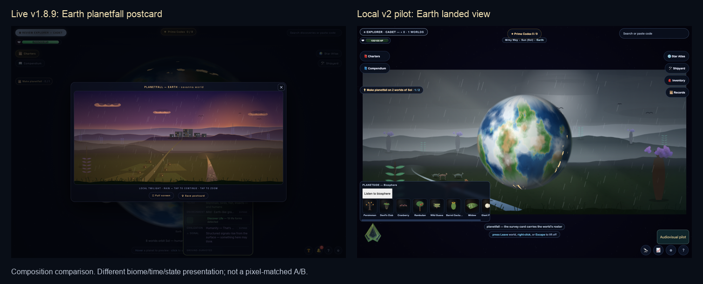
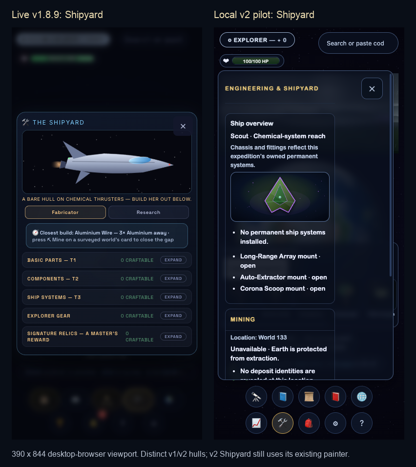

# Production versus audiovisual pilot — 2026-09-05 local

**The current pilot does not demonstrate the requested visual upgrade over production.**
The tool pipeline works, but asset quality, composition and integration remain preliminary.
Keep the existing game and its earned interaction safeguards as the foundation. Refine Phase 1;
do not treat technical verification as art acceptance or begin Phase 2.

Nick specifically reaffirmed that production required substantial work to make windows clickable
and accessible after overlay defects. That behavior is an acceptance requirement, not a styling
detail to rediscover after changing the artwork.

## What was inspected

Loaded the actual public game at <https://celestialfrontier.github.io/> in a new owned headless
Edge session, through the terminal. Its footer reported **v1.8.9, build 92098e9**. Examined the
system map, Earth survey, planetfall postcard, approach view, Shipyard and biosphere roster.
Compared the local v2 game with `?avpilot=1` and the separate `audiovisual-pilot.html` study at
branch head `7a1f3848f0d7571fd9d06956cd6910650c95b87e`. Desktop viewport: 1440×1000;
phone-sized viewport: 390×844, both DPR 1. This is desktop-browser inspection, not an iPhone test.
No desktop, existing tabs, user browser profile, REAPER project or personal save was inspected.

The comparison is qualitative: v1/v2 presentation, biome, time, roster and starter hull differ.
It is **not** a matched-state art A/B. An uncatalogued production specimen correctly refused its
detail page; no complete live-production creature portrait comparison is claimed. No audio
quality judgment, new render or certification battery was performed.

## Findings and direction

| Area | Observed difference | Recommended direction |
| --- | --- | --- |
| World composition | Production gives the planetfall vista a clear frame and foreground-to-horizon depth. The local desktop landed view places a large globe over the landscape; the phone divides attention among a narrow vista, globe, biosphere and notices. | Give orbital and surface presentation distinct focal points. Keep the rich globe for orbit/approach; make terrain and inhabitants the main subject after landing. Preserve the actual travel-state owner. |
| Environment craft | Production's twilight sky, illuminated settlement and receding terrain create a place. The pilot retains a coarse procedural landscape with a subtle atmosphere layer; its added light is insufficient to establish a substantial upgrade. | Use Blender to author coherent terrain forms, vegetation clusters, material variation and lighting layers, exported for the existing renderer. Preserve seeded ecology and recognizable silhouettes. Detail should reveal the landscape rather than obscure it with haze. |
| Ship craft | Production's ship has readable metal, glass and propulsion within a useful Shipyard panel. The pilot study's large green Scout still resembles a faceted emblem; the actual v2 Shipyard continues to show its existing painted Scout. | Improve the approved v2 hull's proportions in the chosen view, material separation, bevel lighting and restrained wear; judge it at its real display sizes and in Shipyard. Do not silently replace the approved hull/loadout identity with the different v1 ship. |
| Interface hierarchy | Production's Shipyard makes the ship and fabrication categories immediately legible. The v2 panel spends much of the first phone viewport on explanatory text and empty mounts. The pilot's sparse editorial study does not prove better gameplay presentation. | Retain the navy/glass/gold character. Give the ship, useful status and next action priority; reveal secondary detail on demand. Preserve all information and accessible panel behavior. Chrome migration stays at the front of Phase 2, after approval. |
| Creatures | The study honestly shows unchanged protected portraits and an external frame marker. It has no anatomical animation upgrade yet. | Keep protected portraits and faithful static fallbacks. Continue the full eight-family, 132/300/440 requirement; propose faithful authored movement separately, without calling frame motion creature animation. Any protected-pixel change needs its own authority. |

These observations include existing v2 presentation as well as pilot additions; they are not all
regressions introduced by B–D. Production is the quality reference, while approved v2 gameplay
decisions and new persistence remain authoritative. No legacy import door is implied.

## Interaction protections carried forward

Reuse the existing owners and checks in `PROCESS_LAWS.md`, Slice and Glass:

- Decorative backgrounds, light, particles and ship art never intercept taps. Actions retain
  semantic targets, at least 44px, and verified native outcomes.
- Windows retain one reachable Close, its reserved header space and focus return to the opener.
  A panel's own padding must not dismiss it or activate the world below.
- Training and modals retain background isolation (`inert`/`aria-hidden`), including late art
  roots. Pilot controls yield to existing panel, card, Training and modal states.
- Keyboard focus remains visible; deferred art and content refreshes do not steal focus or
  jump the reading position. Preserve native scrolling, safe areas and small-phone panel floors.
- Text contrast is judged over the final composite. Reduced-motion/effects preferences remain
  effective. Neither translucent art nor an attractive screenshot proves input safety.

One native path was sampled at 390×844: opening v2 Shipyard hid pilot controls; its sole Close
was 44×44 and owned its center hit; a trusted pointer click closed the panel and returned focus
to `dockshipyard`. This is limited positive evidence, not full overlay/accessibility acceptance.
Source review also found a possible risk: expanded pilot controls lack a height/overflow limit.
Short landscape viewports and enlarged text need the existing geometry checks when that surface
is next changed; an offscreen-control failure was not reproduced in this review.

## Evidence correction

The historical `audits/aaa-pilot-bcd-20260905/temperate-comparison.png` has empty landscape panes.
It cannot support ecology preservation or improvement. Its bytes remain as history. The fresh
[populated study capture](production-pilot-review-20260905/pilot-temperate-study.png) shows both
landscapes successfully rendered. It supports a subtle atmosphere comparison, not an accepted
graphics upgrade. Technical checkpoint records remain historical technical results.

## Recommended next bounded pass

Refine one real **Earth arrival → landed ecosystem → Shipyard** sequence to finished pilot
quality before multiplying the current visual approach. First settle scene composition; then
author the environment and ship to a shared painterly science-fiction direction. Compare the
same world, state, viewport and scale against the appropriate baseline, with existing controls
working throughout. Keep the eight-family sweep outstanding rather than substituting this scene
for it. Carry existing audio candidates into a matched listening review of this sequence:
music, environmental bed and event cues should support its pacing; their quality is still open.

No new art or product code was produced in this review. Nick's integrated-pilot approval stop
stands. Codex's next work is bounded Phase 1 refinement; Claude can review this record when Nick
wants a second opinion, without a hosted run or merge. Nick can respond to this direction in the
current task; there is no need to open another app now. Artlock CI lane, ITP save protection and
DECISIONS row 19 wording remain open.

Capture provenance, hashes, limitations and the sampled interaction are in the adjacent
`AAA_PRODUCTION_PILOT_REVIEW_20260905.json`. Only review documents and generated game captures
change in this batch; no workflow, policy, protected portrait or release changes.
