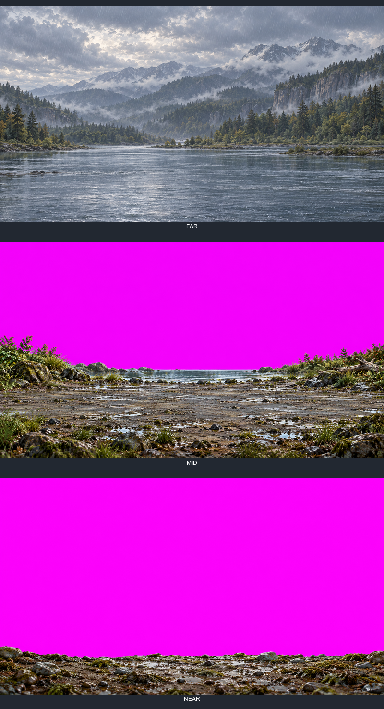
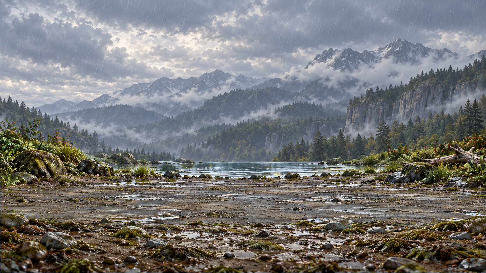
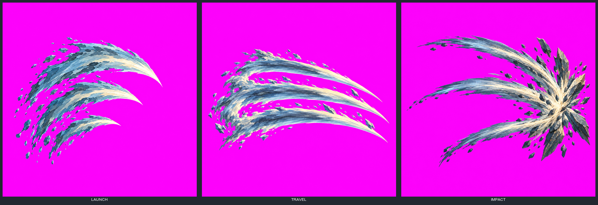
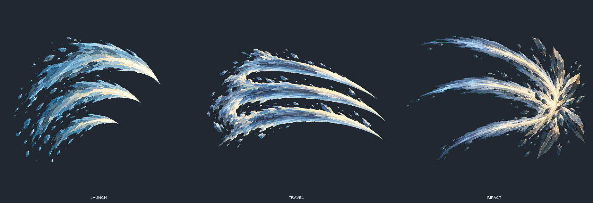

# v4.2 Earth arena and Wild sequence — art review stop

Nick approved proposal d2b8d8cd with three amendments, implemented in
[ART_KIT_v4.2.final.diff](ART_KIT_v4.2.final.diff) and the active root kit. Frozen style and
4E match their prior bytes exactly (kit-verification.json). FAR uses opaque scene output;
MID/NEAR are painted on magenta and keyed at intake, with no extraction from opaque scenes.
All layers register to normalized ground y=0.78. Sections 0/1/5/6 enumerate Arena and Effects;
Effects require per-sequence anchor JSON. Arena layers share the triptych reference; Effects
use Discovery Atlas. Both original reference SHA-256 values were verified before painting.

The named ART_KIT_V42_REVIEW_20260912.md was not present at the stated audit path or found in
Downloads. It was not read or imported; Nick's explicit written amendments govern this batch.
The final diff was shown before the six built-in imagegen calls. No rerolls, local inference,
3D renders or battle staging. Exact prompts are the six *.prompt.txt files, assembled by
prepare-prompts.py in kit order with a preserved compiler-produced Earth system card.
No system card was typed by hand. The proof battle context and deterministic seed derivation
are in arena-recipe.json; this is authoring metadata, not a claim of live arena integration.

## Review images

FAR / MID / NEAR, top to bottom:

[Full FAR](arena-far.png) · [Full MID on key](arena-mid.png) · [Full NEAR on key](arena-near.png)

Keyed layers composed over FAR, without combatants, new shadows or a finisher:

Wild / Savage Maw (source ability id maw): launch, travel, impact, left to right:

[Launch master](wild-launch.png) · [Travel master](wild-travel.png) · [Impact master](wild-impact.png)

[Anchor JSON](wild-anchors.json) records canvas size, phase order, file/hash, origin/contact
anchors and measured alpha bounds per phase. Visual anchors describe delivered pixels;
they are not a claim that the generator hit the requested percentage positions. Original
masters are retained unchanged; keying and review layouts use copies, with no PNG optimizer.

## Intake and limitations for this review

- Three plates: 1672×941; three effects: 1254×1254. All exceed the existing runtime floors.
  Requested targets were 2560×1440 and 1024 square; no upscaling to disguise delivery size.
- At x=1/3 and 2/3, y=0.78, MID alpha=255 and NEAR alpha=0. Both stands remain clear of NEAR.
  NEAR occupies about the lower fifth, rather than the requested lower tenth. Its highest
  content is at y=731/941 near the outer edge; full bounds are in intake.json.
- The existing one-pixel erode/neighbour despill keyer is used. Full-width terrain requires
  an explicit opt-in and a keyed upper field. Default organism isolation still refuses it;
  an opaque-scene mutant is refused even with the terrain flag. No saved extracted masks.
- Unresolved edge pixels: MID190; NEAR0; launch15; travel99; impact153. These are pixels for
  which the existing despill search could not find a clean interior neighbour. In particular,
  fine MID foliage still shows key contamination in the composed review. Clean-edge admission
  is not claimed; keep these flags for Nick's review, without silently tuning the accepted keyer.
- Effects were enlarged/repositioned by generation. The phases share painted materials,
  but common-canvas anchor compliance is not established. Per-phase anchors are explicitly
  recorded; their use and any normalization await the staging/art decision.
- All qualityAccepted flags remain false. Nothing here replaces accepted ordinary-game rain E.

## Checks

22 compiler/conditioning tests pass, including v3 refusal and missing/duplicate block controls;
7 contact/keyer tests pass including terrain/opaque-scene controls. TypeScript and root validate
pass. No checkout lock in unit tests and no native browser run. Initial test failures are retained:
the v3 mutation still targeted the old version marker, and a 100-pixel terrain fixture sat
exactly at the existing 98% isolation boundary. Corrected marker and 200-pixel fixture exercise
the intended refusals. Intake initially had an incorrect relative import path and montage lacked
an explicit font; paths/font were corrected before creating the review sheets. No painting retries.

## Next, only after Nick accepts this art

GSAP parts-rig Civet versus Platypus in this procedural arena, then ten-second Civet, fox and
procedural quadruped captures. Smooth 60 fps key-pose tweening, easing, anticipation, overshoot
and secondary motion; phone30fps budget. Run-up<0.5s, attack0.5–0.75s, hit~0.3s, return<0.5s;
hitstop, flash, shake, damage number, quick timing bar. Emitter5.0.10's Pixi6/7 peer boundary
with game Pixi8.19.0 remains unresolved; do not silently change pins or add a second renderer.
The pinned deterministic creature atlas tool and approved idle PNG tools remain as committed
in3404e5d3. Optimize copies only. No kit wording changes beyond approved v4.2 in this batch.
GitHub step none; PR42 parked. Weather/phone-tier follow the proof; no release or deployment.
