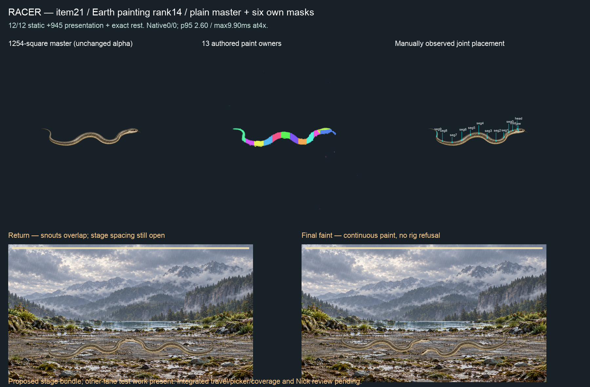

# Item21 — Racer, Earth painting rank14 (C15)

**12/12 static actions,945 presentation samples and exact rest PASS. Full proposed-stage native0/0.** Plain Racer master plus six own masks delivered. Ready/return snouts overlap, so integrated spacing/full-stage/picker remains blocked; no coverage gain or final sprint completion claimed.

## Painting and authoring

The retained P1 prompt is compiled with the species genome and serpent family inventory; `painting-plan-source.json` retains Claude's exact rank14/mustPaint row. Built-in imagegen produced three attempts. Generations01 and02 are retained and rejected for insufficient safe margins; `framing-refusals.json` records their measured alpha boxes. Generation03 is the selected1254-square plain olive-grey, slender unoverlapped S-shaped Racer with round eye, narrow head and whip tail. Additional correction followed Nick's later explicit instruction to disregard the earlier stop rule and complete the sprint; no quality gate was loosened. Exact sent prompts, output paths and hashes are retained in `tool-receipts.json`. No CLI image fallback or programmatic master alteration.

Master SHA256 `650d3a5d2fe3fe0b5fc986448a3a7818f89975642af68b51d27dac1366bc958e`. Explicit manually authored presence: all required serpent parts visible, no absent/hidden/folded list entries.13 new paint owners and joints, without Python label/joint reuse. Land habitat. `fit-01` records IC-3 intake/masks/observed split; `fit-02` additionally retains the two observed head/segment0 and jaw/segment0 paint junctions. All other continuous segment seams already pass. Old intake receipts are inherited-input history; `flat-master-weld-receipt.json` owns the new split.

Final recipe `e9dcb7f05109bf5d758eb6d7053792ea93ffc677f05978c2764fd3df5dda9335`; binding `65b8f1b06fe78167a85cb9c0687104698b0cbebc28ad8aed3535464b75fd0b91`. `static-02.json` checks all12 actions×121 and945presentation samples against unchanged published-geometry/contact/join guards; source-pixel reconstruction changes zero RGBA channels. No runtime, family, solver, limit, threshold, accepted binding or S2 edits.

## Own six masks

`markings.json` and `six-mask-sheet.png`: lengthwise striped, spotted, transverse banded, mottled, marbled and eye-spotted, in unchanged master space. Plain/iridescent have no mask. Raw tool outputs and exact prompts retained. The existing conservation writer only normalizes white RGB and multiplies generated alpha by keyed alpha: no translation, resize or hand-painted pixels. Every final mask has zero pixels outside keyed alpha, zero over-alpha, and the injected outside-pixel negative control is refused. Visual review confirms body placement, longitudinal stripes and transverse bands; these are this Racer's own masks, not replacements for the separately requested Python masks.

The initial prompt-file serializer appended a trailing LF that was NOT sent to the tool. `prompts-sent/` contains exact tool-call bytes; `exact-prompt-byte-reconciliation.json` proves the sole difference. Original serialized files, original manifest and conservation input hashes are retained unchanged. Current `markings.json` refers to the exact sent bytes; it does not relabel the old conservation run's inputs. Mask pixels and measured conservation remain byte-identical.

## Native film and limits

`native-observed-01/battle-full.webm`: Edge153.0.4234.48,4×CPU, observed-support setting, existing proposed layered-reach and faint-idle-settle bundle. This is **not** an unmodified HEAD/integrated-source certificate. It covers four complete strike/hit/dodge/faint turns,745 live/750 encoded frames over12,399.5ms.

Whole-stage p95 **2.5999999046325684ms**, maximum **9.899999976158142ms**; zero CPUframes above1000/60ms, zero intervals≥25ms (maximum16.80000000000109ms), zero left/right rig refusals.25ms is a diagnostic bin, never an allowance. Other-lane Vitest work was present in15/21 once-per-second host samples; no idle-host claim or unchanged retry. Loading/planning/stills precede capture. These are this film's measurements, not per-rig desktop3.5ms, all-pair, cold-start or iPhone acceptance.

The body remains connected and visible, but opposing heads overlap at return. Full-stage travel/spacing and the integrated picker must pass before publication. `native-summary.json` retains report/film hashes and exact measurements.

## Checks and paired next steps

Root validate PASS. Runtime source is unchanged from signed839cac0b, so no unchanged full profile/S2 rerun. Prior full profile retains two reds: parked I5 plus acquisition source-scan timeout; neither is erased by this asset packet. No push/merge/hosted/release/deploy.

Codex continues Grouse/Sandpiper and the ranked list. Capuchin rank7 requires a new tailed-primate template (current primate has no tail joints); request is in TO_CLAUDE. Claude consumes this candidate, fixes head spacing/full-stage travel, wires cards/stand-ins/arena, runs integrated picker/coverage and republishes admitted work under existing authority. Nick reviews one combined sheet when items21–30 are assembled and eventual iPhone play; no per-item approval or relay needed. C8/I5 and weekly/economy remain parked. `manifest.json` hashes retained artifacts except itself.
