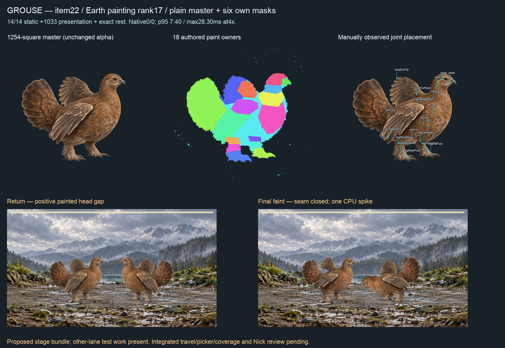

# Item22 — Grouse, Earth rank17 (C15)

**14/14 static actions, 1,033 presentation samples and exact rest PASS. Full proposed-stage film has zero rig refusals. Phone gate remains open: one CPU frame costs28.3ms at4×.** Final candidate is `fit-03`; final masks are `mask-set-03/markings.json`.

## Art and intake

The retained P1 prompt was compiled with Grouse's genome and the biped-bird part inventory. `painting-plan-source.json` preserves the rank17 mustPaint row. One generated1254-square master: plump rounded ground bird, short legs and bill, broad fannable tail, feathered feet, brown feather-form shading. Master SHA256 `712072ae73b0cc55cbffc990bdc202a11871cc1b264ab98d9a13927bbda146c8`. Exact sent prompt, compiler prompt, tool receipt and source image are retained. No programmatic master alteration.

Presence was manually authored: required parts are visible; absent/hidden/folded lists are empty. Both wings are half spread; this does not supply a separate underside flight painting.18 paint owners and19 observed joints, land habitat. A12×12 interior root patch leaves most torso ownership on the spine. IC-3 record/masks/observed split/binding writers are retained under fit01. Fit02 retains three observed torso/shoulder seams; fit03 additionally retains the root/chest and torso/near-flight source junctions. `boundaries-01.json` and both weld writers retain the actual adjacency evidence. These are named observed seams, not an all-boundary weld.

Final recipe `daa68241ea47298267bdec89e076321856f4c6550309e1f8c30188fd68113312`; binding SHA256 `2d90580791f6372e745499d8e2d79b3ebf297bd6b23296d9456b90b9d217721a`. `static-03.json` passes14 actions×121 samples plus1,033 presentation samples and exact source-pixel rest. No runtime, family, solver, contact limit, threshold, accepted binding or S2 changes.

## Six own masks and retained rejections

`mask-set-03/markings.json` is final: five masks from set02 plus mottled04. All are unchanged1254-square master coordinates; no resize/translation. White RGB normalization and generated-alpha×keyed-alpha conservation only. All six have zero outside-alpha and over-alpha pixels; the injected outside-pixel mutant is refused. Plain/iridescent have no mask. Exact sent prompt bytes (including trailing LF), hashes, tool output paths and raw files are retained.

These are regional breast markings, not full-body pigment replacements. Visual review distinguishes thin vertical stripes, spots, transverse bands, ragged mottling, branching marbling and rings. The original set was rejected for broad filled patches and foot placement. Set02's mottled version resembled spots; mottled03 again filled a continuous patch and was rejected. Mottled04 supplies separated ragged shapes; keyed clipping removes the off-body portion without moving paint. All rejected results remain. Additional corrections follow Nick's later instruction to fix the sprint rather than enforce the earlier two-attempt stop. Nick's art review remains pending.

## Full native film

`native-observed-02/battle-full.webm`, Edge153.0.4234.48,4×CPU, observed painted-foot supports, proposed layered-reach and faint-idle-settle bundle. **This does not certify unmodified HEAD or Claude's integrated source.** Four complete strike/hit/dodge/faint turns:765 live/769 encoded frames over12,732.800000000001ms. Zero left/right refusals. Whole-stage p95 `7.399999976158142ms`, max `28.299999952316284ms`. One CPU frame exceeds1000/60ms during final idle/settle at12,632.8ms; no intervals≥25ms, max interval16.80000000000109ms.25ms is a diagnostic bin, not a raised allowance. This is not per-rig desktop3.5ms or every-pair/iPhone acceptance.

Other-lane Vitest workers were active in all23 once-per-second host samples. `host-during-native-02.json` records overlap, not its causal effect or an idle-host guarantee. No unchanged retry. `native-summary.json` retains exact report/film hashes and the offending frame.

The first film passed numerically but showed an opening under the raised near wing. It remains in native01. Final fit03 closes that opening; final return shows a positive painted head gap, grounded feet and complete silhouettes in frame. Stage-wide travel, every pair and integrated picker/coverage are still unmeasured.

## Checks and paired next steps

Root validate PASS. Runtime source remains839cac0b, so no unchanged fullprofile or S2 rerun. Its last fullprofile retains two reds: parked I5 and untouched acquisition source-scan timeout. No push/merge/hosted/release/deploy.

Claude: consume fit03, mask-set03 and explicit observed supports; address final-settle CPU cost, full-stage travel and integrated picker before phone-green publication. Codex: continue Sandpiper then ranked top35, and resolve remaining motion/performance work. Nick reviews the combined items21–30 sheet and eventual iPhone build; no per-item relay needed. C8/I5 and weekly/economy stay parked. `manifest.json` hashes this packet except itself.
