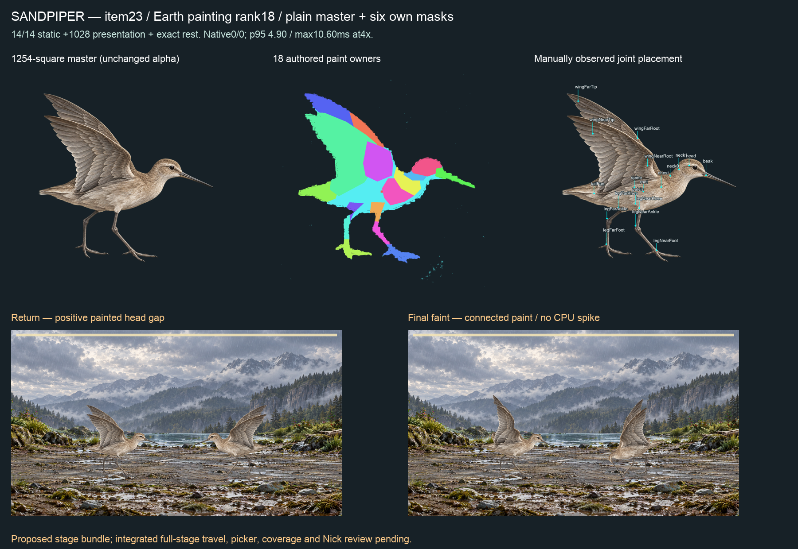

# Item23 — Sandpiper, Earth rank18 (C15)

**14/14 static actions,1,028 presentation samples and exact rest PASS. Full proposed-stage film0/0 refusals;4×CPU p954.9ms, max10.6ms, no CPU frame over1000/60ms.** Final candidate `fit-02`; six own masks in `markings.json`. Integrated full-stage travel, picker and coverage remain pending.

## Painting and authoring

Retained P1 kit prompt compiled with Sandpiper's genome and biped-bird inventory; exact sent prompt and image tool receipt retained. `painting-plan-source.json` pins Claude's rank18/mustPaint row. One1254-square brown-grey plain master: horizontal crouched shorebird body, slim probing bill about head length, two long thin legs with unwebbed toes and two visibly raised pointed wing surfaces. Feather-form shading, no baked spots/bands. This painting does not supply a separate hidden wing underside. Master SHA256 `c315307102aed608563c8caa0ed7af9a15e24f807570ac2c03a92ee496cd4358`.

Manual presence declaration has no absent/hidden/folded required parts. The exposed far shoulder is explicitly authored; unseen paint is never inferred.18 paint owners,19 new observed joints; land habitat. A tiny interior root patch leaves the main torso on the spine. `fit-01` retains record, masks, observed split and binding writers. `fit-02` retains ten named torso/root/chest, wing/body and head/neck/bill source seams, verified in `boundaries-01.json`. Between-wing and wing/tail sibling edges stay independent; incidental toe/torso flecks are not welded. No source pixels, family contract, solver, gate or limit changed.

Recipe `f384bcb635704d3d83b888c6ce9f7f862f90948cf1aad1648da90aa7d2bfc443`. Binding semantic hash `c92ef8cf8dc7f63e237b7ff9e76067b32e9eb1a36b3c16181e4bfc3f41635937`; binding file SHA256 `afa18ff5a3ac72a025f14e214124aaf8ce069f8f86a6789add5bce9ae041579c`. These are different authorities, explicitly distinguished. `static-02.json`:14 actions×121 plus1,028 continuous presentation samples; exact rest changes zero visible RGBA channels.

## Tame-motion repair

Original static01 passes13/14; tame refuses scale compression at113.333333ms and presentation at13,300ms. The original canonical tame curve and existing leg-span variant both fail the unchanged contact probe. `grounded-bird.ts` now permits its existing stationary-torso fallback for tame as well as hit. It preserves the complete original neck/head/wing/tail expression, duration and phases, creating a readable bow without forcing the planted legs shorter. The canonical selector only substitutes after the original fails; the editor/override constructor stays unchanged. This is one authored whole curve, never per-frame clamping or suppressed refusal.

Ten tests pass, including Sandpiper original-refusal/after-pass controls under REST and actual observed supports, unchanged passing birds, expression tracks, JSON transport and override separation. All six S2 subjects/13,286 samples and receipts remain byte-identical. Standalone app TypeScript and root validate PASS.

Full develop profile:5,110 passed, one failed, two expected failures and two skipped;483 test files pass, one fails, one skips. The sole failure is parked `current-producer-authorities` I5 drift. The prior acquisition timeout did not recur on this changed source; its earlier evidence remains untouched. The profile stops at npm test, so later profile owners did not run; standalone app types are separately recorded. No unchanged retry or pin/budget rebinding.

## Masks and full film

Own striped, spotted, banded, mottled, marbled and eye-spotted masks occupy the lower torso in master pixel space. Prompts and raw outputs retained exactly, including LF. Generated pixels are only white-RGB-normalized and alpha-multiplied by keyed alpha, without resize or translation. Zero outside/over-alpha pixels in all six; outside-pixel mutant refused. The composite sheet was visually reviewed: longitudinal stripes, transverse bands, spots, irregular blotches, branched veins and rings remain distinct after clipping. These are regional variants; plain/iridescent have no masks. Nick's visual acceptance remains pending.

`native-observed-01/battle-full.webm`: Edge153.0.4234.48,4×CPU, explicit observed supports, proposed layered-reach/faint-idle-settle bundle. **Not an unmodified HEAD or integrated-source certificate.** Four full strike/hit/dodge/faint turns,765 live/770 encoded frames over12,732.9ms. Zero left/right refusals; whole-stage p95 `4.899999976158142ms`, maximum `10.600000023841858ms`; zero CPU frames over1000/60ms. No intervals≥25ms; maximum16.80000000000291ms.25ms is a diagnostic bin, not a raised allowance. This is neither per-rig desktop3.5ms nor every-pair/iPhone acceptance. No other-lane test process appeared in22 host samples; that is not a global idle-host proof.

Reviewed return/faint show connected body and wing paint, grounded legs, positive bill spacing and full silhouettes within the frame. Full-stage travel and integrated picker remain open. Exact film/report hashes and measurements are in `native-summary.json`.

## Paired next steps

Claude consumes the containing signed commit, including the narrow tame repair, final fit02, six masks and explicit observed supports; then validates actual integrated full-stage motion, picker and coverage before publication. Codex continues Diving Beetle and the remaining ranked top35, and the outstanding performance work. Nick reviews the combined items21–30 sheet and eventual iPhone build; no per-item relay required. C8/I5 and weekly/economy remain parked. No push, merge, hosted attempt, release or deploy. `manifest.json` hashes the packet except itself and records source/handoff hashes.
