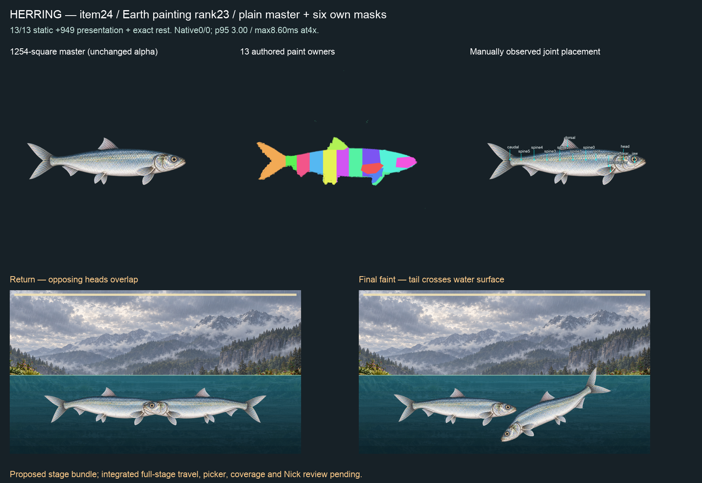

# Item24 — Herring, Earth rank23 (C15)

**13/13 static actions,949 presentation samples and exact rest PASS; full proposed-stage native0/0 refusals.** Six own masks conserved. Stage visual gate remains open: heads overlap at return and the fainted tail crosses above the water band. No picker or coverage admission claimed.

## Art and anatomy

The retained P1 kit prompt was compiled with Herring's exact genome and fish part inventory. `painting-plan-source.json` pins Claude's rank23/mustPaint row. First painting rejected for insufficient margins, misplaced far pectoral/extra posterior top fin and a stray colored fragment. Second correction improved framing but retained wrong fin anatomy. Both masters/prompts/receipts remain. Third generation uses the previously painted Pike only as a paired-fin visibility/composition reference, with a fresh silver-blue Herring painting: small terminal mouth, large eye, single mid-back dorsal, deep fork tail, two distinct pectorals and pelvic pair. No source pixels, labels, joints or binding reused. The extra correction follows Nick's later explicit direction to fix the sprint rather than stop after the old two-attempt limit.

Selected1254-square plain master SHA256 `3abc568beb996e694c78736854a216222dc5cfae47d39494a4f6ba7e84b5494f`. Silver/blue reflective form shading and scales, no baked spots or stripes. The visible silhouette at alpha>127 has bounds(111,485)–(1134,789), but retained low-alpha specks expand nonzero-alpha bounds to(107,53)–(1192,941), recorded in alpha-extents.json. Thus the whole nonzero-alpha image does NOT meet the requested clear margin. No source alpha was erased or threshold raised to hide this. Master cleanup remains an art gate alongside the two stage findings; this is a rigged candidate, not final visual acceptance.

Manually authored presence: all required fish parts visible; absent/hidden/folded lists empty.13 new paint owners and13 observed joints. Pelvic pair and anal follow their containing body segment, while both pectorals have distinct joints. Explicit aquatic habitat. `fit-01` retains IC-3 record/masks/observed split/binding receipts. `fit-02` uses the existing flat-master boundary-preservation option, retaining seven observed excluded boundaries in addition to12 ancestral joins. No source-coordinate changes, hidden paint invention, solver/gate/limit or accepted-binding changes. The receipt identifies inherited old intake evidence separately from the new split.

Recipe `023c9266a43cb6b07a0410afb20fcaf12ad74b80ff114b388e79537f249a224e`; binding semantic hash `6ef91e54b455d597b66f248f84c98d14383846d789dc7eaa303d83194097f4b7`; binding file SHA256 `8085508a199142d29313cb56730c9aea14815f4fcb4bd9bd3adc008aaffb2abc`. `static-01.json` passes13 actions×121,949 continuous presentation samples and exact source-pixel rest.

## Masks and film

`markings.json` retains striped, spotted, banded, mottled, marbled and eye-spotted masks, exact prompt bytes including LF, raw tool outputs and SHA256s. Plain/iridescent have no mask. Unchanged1254-square master space; white RGB normalization and generated-alpha×keyed-alpha only, no translation/resize. All six have zero outside-alpha/over-alpha pixels and the outside-pixel mutant is refused. Composite review distinguishes all six patterns; some flank markings extend onto visible fins/gill cover as shown. No hidden automatic anatomical exclusion.

`native-observed-01/battle-full.webm`: Edge153.0.4234.48,4×CPU, water world, proposed layered-reach/faint-idle-settle bundle. **Not unmodified HEAD or integrated-source certification.** Four complete bite/hit/dodge/faint turns,707 live/711 encoded frames over11,766.2ms. Zero left/right refusals; whole-stage p95 `3ms`, maximum `8.600000023841858ms`; no CPU frames above1000/60ms and no intervals≥25ms (maximum16.80000000000109ms).25ms is a diagnostic bin, not an allowance. No other-lane test process in18 samples; no global idle-host claim. This does not establish per-rig desktop3.5ms, every-pair or iPhone acceptance.

Return and faint paint remain connected, but opposing heads overlap at return and the tilted faint tail rises above the liquid surface. These are retained visual failures despite the numerical native result. Claude must resolve source-paint spacing/full-stage travel and aquatic containment before publication. Film/report hashes and exact statistics are in `native-summary.json`.

## Checks and paired next steps

Root validate PASS. Shared runtime remains signed0e9fcf18; no repeated fullprofile/S2. Latest fullprofile is5,110 passed with sole parked I5 failure; S2six/13,286 and app types passed in23-sandpiper. C8 and weekly/economy remain parked. No push/merge/hosted/release/deploy.

Claude consumes this signed candidate, fixes the two stage visual failures, then wires and checks integrated picker/coverage before republishing. Codex continues Wild Horse and remaining top35; Capuchin and closed-shell Diving Beetle await explicit template capabilities requested in TO_CLAUDE. Nick reviews the combined items21–30 sheet and eventual iPhone build, without per-item relay. `manifest.json` hashes all packet files except itself.
