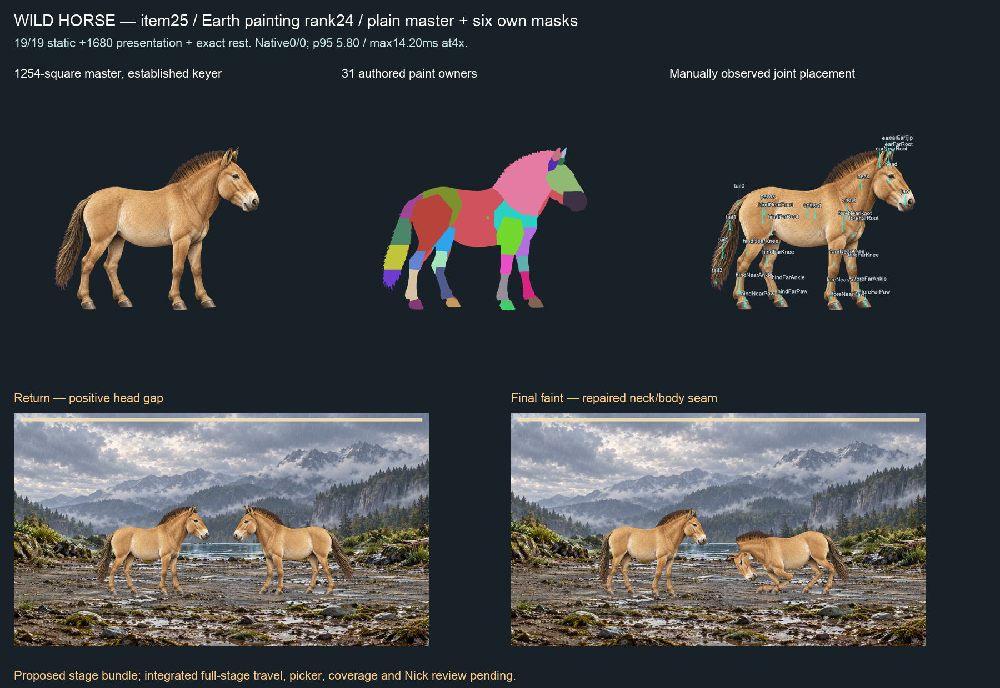

# Item25 — Wild Horse / Earth rank24 (C15)

**Final fit-05 passes19/19 static actions,1,680 presentation samples and exact source-pixel rest. Full proposed-stage native02 has zero refusals and no CPU frame over1000/60ms at4×.** Six own masks conserved. Integrated full-stage travel, picker, coverage and Nick's visual review remain open; this candidate is not a coverage admission.

## Painting and authored anatomy

Retained P1 kit prompt compiled from Wild Horse's exact genome and quadruped inventory. painting-plan-source.json pins Claude's mustPaint/rank24 requirements. Generation01 rejected for small margins, dark stockings/back stripe and unexpected transparent output; master, prompt and receipt retained. Generation02 is a1254-square opaque magenta source: plain dun fur, upright brush mane, single hooves, long head/arched neck, coarse tail. Coat shading is retained without baked markings. The established unchanged key/despill path produces alpha bounds(184,265)–(1109,1001). No source pixels were repainted by code. Master SHA256 `3fea7a6e9ee2a421b39f516a42b1e9bfc4be10093ead8639182250a5bfb6e407`.

Presence is explicitly authored: all required parts visible; absent/hidden/folded empty.31 fresh paint owners and31 observed joints, four leg/hoof chains and two ears; no borrowed labels/joints. IC-3 record, authored masks, observed split and binding receipts are retained in fits01–05. Static02 refused my phrase “short hair” as unsupported material. authoring-01.json and old records retain it; corrected authoring names the actually painted short fur, retaining the material gate. No biology, solver, contact limit, family contract, accepted binding or S2 change.

Fit04 uses the tiny root/spine paint join; native01 passed numbers but exposed a sharp neck/body boundary during faint. Fit05 additionally joins the observed neck/spine paint boundary. Its receipt records zero source-coordinate changes. Ears/legs/tail keep independent surfaces. The second film shows continuous neck/body paint; head stays separated from its opponent at return. It is a diagnostic proposed stage using the retained layered-reach/faint-idle-settle changes, **not unmodified HEAD or integrated-source certification**.

Recipe `a87a3ed8146e1176b9c6dbfefd9e5e0a0f6321c8b69d4a2f9e993488cc799600`; binding semantic hash `733ca2e2c0db21d9c750bf7103c47062baec01a35841491a15aa0527f5e5055d`; binding file SHA256 `6ad01389d82a5c3359626b3d950f5d8756b54c8bd89c6c59656fd3c230ac2fc2`. static-05.json passes19 actions×121,1,680 continuous presentation samples, exact rest and unchanged reconstructed visible RGBA.

## Six masks and native film

Six fresh imagegen outputs with exact LF prompt bytes and tool receipts: stripes, spots, bands, mottling, marble veins and eye rings. Final composites distinguish all six; stripes include body/neck stripes plus leg bands as the ranking requires for Zebra. The other patterns cover the whole eligible silhouette and can cross mane/hooves as shown. No automatic anatomical exclusions. Plain and iridescent have no mask. Each remains1254-square, white normalized, generated alpha multiplied by keyed alpha; zero outside-alpha/over-alpha pixels, and the seeded outside pixel is refused.

Root markings.json retains its original fit02 recipe. **Use fit-05/markings.json**: own-mask-conservation-05.mjs proves identical source/keyed bytes and independently checks each unchanged mask against fit05. mask-compatibility-05.json explicitly records old/new recipes and hashes; it does not rewrite historical conservation or generation receipts.

native-observed-02/battle-full.webm, exact Edge153.0.4234.48 at4×CPU, four complete turns:933 live/936 encoded frames over15,532.7ms; left/right refusals0/0; stage p95 `5.799999952316284ms`, max `14.199999928474426ms`, zero CPU frames above1000/60ms. No frame intervals≥25ms; maximum `16.80000000000291ms` (25ms is a diagnostic bin, not an allowance). No other-lane node/test process observed in26 samples; no global idle-host assertion. This whole-stage run does not establish isolated desktop3.5ms, every-pair or iPhone acceptance. Exact film/report hashes in native-summary-02.json; native01 and original seam evidence remain.

## Checks and paired next steps

Root validate PASS. Runtime remains0e9fcf18; no unchanged fullprofile/S2 repetition. Latest fullprofile5110pass/soleparkedI5red and S2six/13286byte-identical are in23-sandpiper. C8 and weekly/economy parked. No push/merge/hosted/release/deploy.

Claude: consume fit05 and its mask manifest, reconcile proposed stage changes, verify full-stage travel and integrated picker/coverage before republishing. Codex: continue Salamander/Eel and remaining ranked top35; await closed-beetle and tailed-primate capabilities, preserve all failures. Nick: review the combined21–30 sheet and eventual iPhone build; no per-item relay. manifest.json hashes every packet file except itself.
