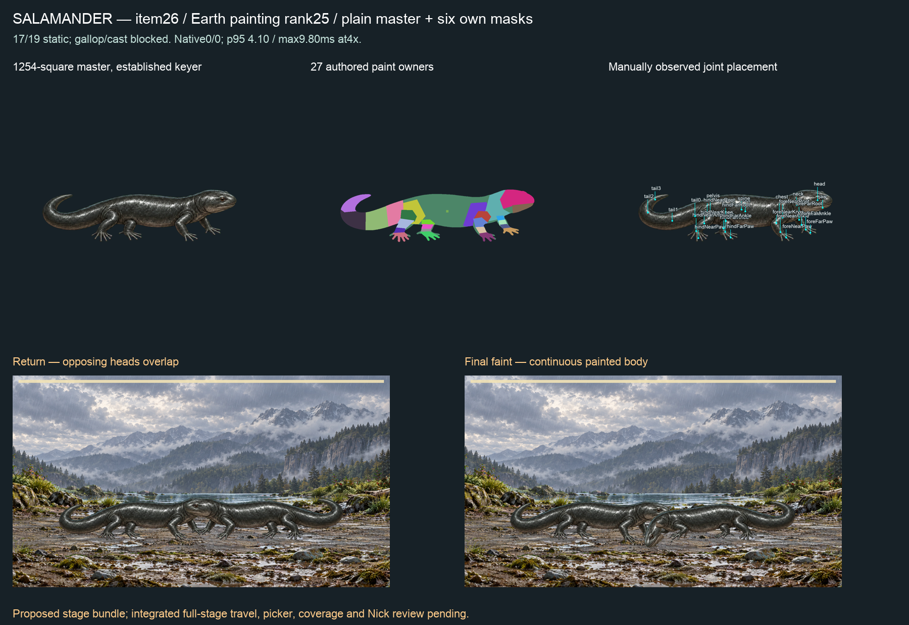

# Item26 — Salamander / Earth rank25 (C15)

**Candidate remains BLOCKED from picker admission:17/19 static actions, gallop/cast refusals and overlapping heads at return.** Full proposed native film has zero refusals and zero CPU frames above1000/60ms at4×. Six own masks pass conservation. No new coverage credit.

## Painting and intake

P1 prompt compiled with the species genome and quadruped inventory minus explicitly absent external ears. Four short splayed limbs, blunt head, rounded body-length tail, moist smooth dark skin. Generation01 rejected for baked mottling, margins and hind toes;02 improved coat but retained margin/toe problems;03 fresh style-only repaint corrected toe anatomy but transparent output retained background specks (alpha-extents.json);04 opaque magenta correction selected. All outputs/prompts/receipts retained. Extra corrections follow Nick's later direction to fix the sprint rather than the superseded two-attempt stop. No procedural master repaint or source-pixel reuse. Fourth master's actual keyed bounds(148,542)–(1112,803), no old speck-filled alpha reused.

Master SHA256 `9a9701c7b127da311b031082f29c66b8c5b01cd94d3fae4f154275a95d5f6235`. Five toes on both hindfeet and four on both forefeet manually inspected. Presence absent external-ears, hidden/folded empty; no inferred absence.27 newly authored owners and27 observed joints. No gills: Axolotl/Olm/Blind Salamander remain caveats per ranked plan.

Intake01 refused hindFar leg/torso proportion. The initial hip point sat midway into the visible upper hind limb; reinspection moved only that joint from581,710 to its proximal attachment582,698. Change receipt and old authoring retained; minimum0.25 unchanged. Habitat corrected to existing realm/source schema. Static03 then refused material phrase “smooth moist … skin”; corrected “moist” to “wet”, which the existing slick-material parser recognizes. No material gate changes. Fit05 is the final record/split after two named observed root/spine and neck/spine paint joins; zero source-coordinate changes, no solver/limit or accepted-binding edits.

Recipe `712c584bdd51bc0c585f4f8ae059faa8d9b7f0fcdc531f7841c46c054ed1f2e2`; binding semantic `7aa464e78ed643d5ebe63496297c5db6ef5a2082696b38df36434537c92a73d9`; binding fileSHA `db731fe504b30ed0ac48e127559ed2a28238c812ae13946a8ba15bed95758aff`. Exact independent visible source-RGBA rest reconstruction passes. static-05.json has17/19 green rows; gallop first refuses foreNear two-bone reach at73.7ms, cast first refuses scale compression at372.75ms. Continuous presentation stops at7700ms during gallop with foreNearPaw177.46548319158083° outside the unchanged limit. Detailed original poses/errors and source hashes retained. These are real motion defects, not waived by the actual species' passing battle script.

## Masks and native evidence

markings.json binds six fresh imagegen outputs and exact prompt LF bytes: thin stripes, fire-salamander-like irregular spots, wide bands, lobed mottling, fine marble veins and open eye rings.1254-square master space, no resize/translation; generated alpha×keyed alpha, white normalization only. Zero outside-alpha/over-alpha pixels and seeded outside pixel refused. All key-alpha pixels eligible, including limbs; no automatic exclusion. Plain/iridescent have no mask. Composite sheet visually reviewed; broad bands cross feet as shown.

native-observed-01 uses the retained proposed layered-reach/faint-idle-settle bundle, exact Edge153.0.4234.48,4×CPU, observed painted supports. **Not unmodified HEAD or integrated-source certification.** Four complete actual-species turns:872live/876encoded over14,516.1ms,0/0refusals; whole-stage p95 `4.100000023841858ms`, max `9.799999952316284ms`, zero frames over1000/60ms and no intervals≥25ms (max16.80000000000291ms;25ms diagnostic only). No other-lane work in25samples, no global idle-host claim. No isolated desktop3.5ms or every-pair/iPhone acceptance inferred. Native-summary pins the film/report hashes.

Paint is continuous in reviewed return/faint frames, but opposing heads overlap at return. Claude must repair source-paint spacing and full-stage travel before publication. Static gallop/cast also remain open; do not wire this candidate as accepted.

## Checks and paired next steps

Root validate PASS. Shared runtime0e9fcf18 unchanged, no repeatedfullprofile/S2. Latest5110pass/soleparkedI5red and S2six/13286byte-identical remain23-sandpiper's scoped evidence. No GitHub write/merge/release/deploy. C8/economy parked.

Codex repairs the short-legged gallop/cast motion without changing contact/skin limits, then continues Eel and ranking. Claude keeps this candidate out of the picker, fixes overlapping return spacing and integrates eligible signed candidates with picker/coverage checks. Nick reviews the combined21–30 art sheet and eventual iPhone build; no relay/per-item approval. manifest.json pins every packet file except itself.
