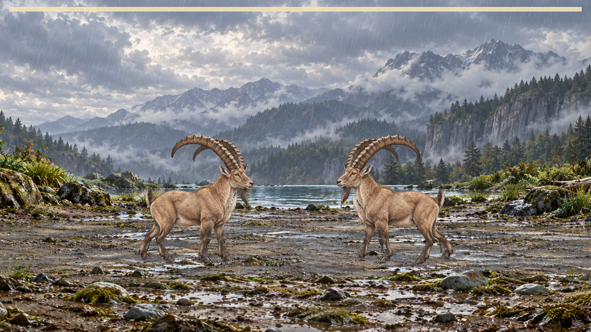

# Additive idle + approach: measured reach repair

**Implemented helper and ready-to-apply Claude adapter patch; not integrated into battle2.**
The native proof bundles the explicit proposed replacement without editing the reserved source.
`transform-provenance.json` pins original/proposed adapter bytes and patch; every native report
pins the actual runtime/helper/asset inputs. The report's source HEAD alone does NOT certify this
transformed bundle. No contact, stance cap, override threshold, accepted binding or S2 input changed.

## Cause and repair

The old adapter measured six isolated approach poses. Playback adds idle underneath them.
`diagnosis.json` reproduces49 Cougar,44 Bear,219 Ibex,0 Wolf and45 Otter composite cadence refusals
on3872 samples per case. Pure approach, pure cadence and zero-displacement composites all pass.
Cougar's concrete failing control is approach287.3666667ms +half-period idle +0.085634765625body-length
displacement; isolated gait passes, composite refuses the unchanged scale-compression limit.

`measureLayeredStanceReach` tests121 gait phases ×32 idle phases at constant displacement, refuses
an invalid zero-displacement composite, and bisects eight times below the caller's existing0.5cap.
The adapter keeps its existing0.9reserve. It uses the actual caller card/supports and propagates
refusals instead of silently deleting cadence and enabling an unmeasured legacy run-up. The old
`measureStanceReach` contract is unchanged. Neither sampled reach nor margin proves continuous
motion; every actual pose still goes through the contact and skin publication guards.

Five independently shifted gait/idle studies, with four shorter-walk fractions, each pass9652samples.
Raw admitted reaches: Cougar0.072265625, Bear0.068359375, Ibex0.04296875, Wolf0.234375,
Otter0.146484375. Stage takes90% of those values. Local measurement loads were735.174,690.379,
669.173,823.098 and760.992ms respectively. `proposal.json` retains unrounded values.

The seventeen-entry library contact survey (`library-02.json`) has11 applicable positive results
and6 non-ground/chainless not-applicable results, no refusal. This is NOT a skin/picker film sweep.
Centipede's measured initialization is2698.432ms locally, the largest; do not run this helper in a
frame callback. Claude should retain a source/card/support-bound result for a loaded rig and
schedule admission while loading, never omit checks to hide the load cost. No phone load-time
claim is made. No caching or build-pinned reach authority is invented in this patch.

## Native outcomes (Edge, 4× CPU)

| Run ID | script captured ms | live/encoded frames | stage CPU p95 ms | frame interval p95 ms | refusals L/R |
|---|---:|---:|---:|---:|---|
| native-ibex-01 |15532.7|931/935|5.5|16.8|0/0|
| native-cougar-03 |15532.7|931/935|6.600000023841858|16.8|0/0|

Both cover all four turns through return/idle/faint. Ibex formerly had26/14 and Cougar0/11.
Films are each run's `battle-full.webm`; exact report/film/helper hashes are in `results.json`.
Ibex approach/return/faint stays connected and has a visible head gap. Cougar paint stays
connected but ready/return heads overlap. These tests do not establish full-stage travel or
continuous60fps; no raised allowance, no admitted coverage gain, no picker PASS.

## Validation and retained refusals

- Full develop profile:481 passed files/1 failed/1 skipped;5092 passed tests/1 failed/2 expected
  failures/2 skipped. The sole failure remains historical I5 current producer authority. Profile
  stops there; later profile stages were not run and no whole-profile PASS is claimed.
- Standalone app TypeScript check PASS; root validate PASS with50-probe fingerprint unchanged.
- Regression tests retain the isolated-gait false-green as a failing control; independent shifted
  native-choreography phases pass on Ibex/Wolf without changing the guard. Cap/card mismatch refuse.
-90 source-closure files are byte-identical to the last S2 execution (`s2-source-identity.json`);
  the new unused helper is outside that graph. No unchanged S2 battery was repeated.
- `git apply --check` accepts `parts-rig-layered-reach.patch` against this lane's reserved source.
  Claude must reconcile his current adapter by exact bytes, preserve support selection and all
  current stage changes, then validate his actual integrated source before admission.
- First library runner failed because bundling the registry relocated its pngjs require; retained
  source/log. The corrected runner uses a source-hashed registry snapshot; no product/input change.
- One read used the wrong cwd and failed before reading the survey; no measurement was retried.
- native-cougar-02 accidentally used Wolf actor labels, produced0/0 over a different script length,
  and is retained as INVALID FOR COUGAR ACCEPTANCE. Corrected Cougar actor input is native-cougar-03.
- No new certificate/epoch, v1 rebind, push, merge, hosted run or deployment.

## Paired next steps

Codex continues candidate skin/static motion repairs and ranked art; this signed packet completes
only the layered reach helper and proposed adapter repair. Claude consumes the helper and patch,
removes the old isolated six-phase estimate, keeps failed candidates out of the picker, fixes
actual painted ready/return spacing and full-stage travel, then checks native/picker on his
integrated source. Retain the measured load cost and schedule/cache only against complete input
identity. Nick reviews the two ten-item sheets and eventual iPhone build; no other-app relay is
needed. C8/I5, weekly/economy/C19/C20 remain parked under C15.
