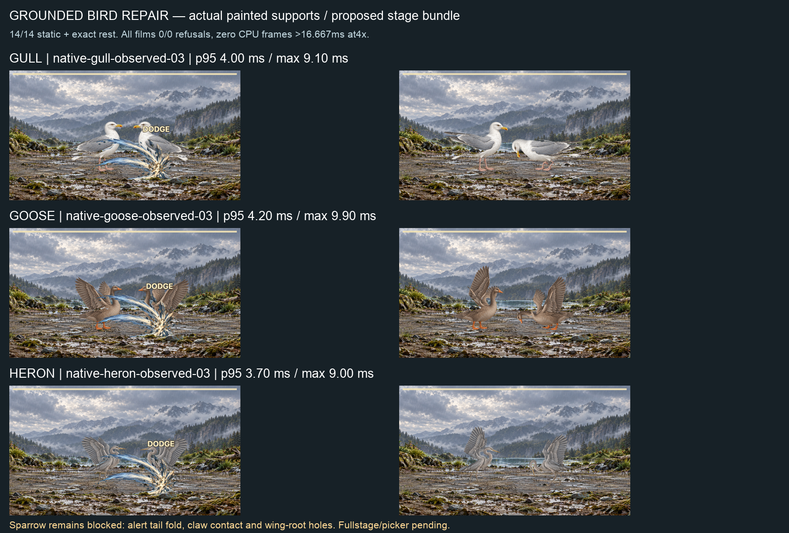

# Grounded bird reaction repair — 2026-09-25

Gull, Goose and Heron now pass all14 static actions/presentation/exact rest and full observed-painted-support native films. Sparrow improves to12/14 but remains blocked. **These are proposed-stage diagnostics, not live-library, integrated picker or coverage admission.** Use the previously delivered layered-reach + faint-idle-settle stage proposals only; the additional faint-travel patches in THIS packet are rejected.

## Final source

`motion/grounded-bird.ts` authors canonical grounded biped-bird dodge/hit/tame only when the original curve fails the unchanged REST contact probe. The grounded dodge ducks its neck/head with a small leg-span translation. Goose hit/tame retain their joint expression with leg-span translation. Sparrow's otherwise refused recoil keeps a stationary torso while its neck/head/tail react. This avoids shrinking the entire dodge into an almost-motionless2.6% version. All timing and phases stay unchanged; no species table, changed support, contact/skin limit or solver change.

Already admitted reactions, including Eagle, stay byte-identical. Actual observed-support static and runtime skin guards independently decide admission. The weakly held cache keys the complete card/action/compiled inputs. Canonical `buildTimeline` selects these variants; the editor/override `buildActionTimeline` retains its supplied action, including a refusal. Eight tests prove the repaired curves, original negative controls, Eagle preservation, JSON transport and unchanged override constructor behavior. App TypeScript PASS.

**Faint is NOT retargeted in final source.** Experimental gains0.8958251953125 and the smaller correction were rejected: the former produces3faint/5presentation folds and the latter passes individual rows but still5presentation folds. Original-binding control also stays red. The native0/0 on the first rejected curve never supersedes its static failure. Both source versions and experimental test/source receipts remain separate historical artifacts.

## Final candidate authority

`final-candidates.json` names each exact recipe/binding hash and final static report. Gull uses original12-gull/fit03; Heron original16-heron/fit01. Goose uses THIS packet's `goose-fit-04`: only the two explicitly declared shoulder/neck feather junctions are joined. Its six own masks conserve exactly with zero outside/over-alpha pixels (`mask-compatibility-04.json`); painter pixels, old prompts and original generation provenance are unchanged. No historical mask samples were relabelled.

Goosefit03 with additional body/wing welds is rejected: flight, peck, claw, hit and victory fold; presentation also red. All prior fits are retained. Sparrowfit01 still refuses alert at136.166667ms (one tail fold) and claw at238.888889ms (compression), with old visible wing-root holes. Do not admit Sparrow.

## Contact model diagnosis — required Claude integration choice

The arena defaults to anatomical rest-point supports for most rigs. Static admission uses actual painted supports. Goose's unchanged faint refuses under the arena rest-point model: native-goose01 ends0/60 (57live refusal events), legNearFoot45.1467645727°. The retained241pose diagnosis finds74REST refusals and0OBSERVED refusals. Changing faint travel ownership is **not** a cure: it gives83REST refusals and0OBSERVED. Its assertion refusal and later evidence-writing diagnostic are retained; do NOT apply either `rejected-*-faint-travel.patch` or use native-faint-owned-runner.

The existing harness already accepts `script.supports:'observed'` and passes it to `createPartsRig({contactSupports:'observed',binding})`. Final scripts explicitly use that actual painted-foot model, with unchanged guards. No runtime default or fallback is changed. Claude must select/validate observed supports for these candidates when wiring them; the prior REST film does not certify that path. This resolves Goose without altering its original faint curve. Its proximal feather junctions remain connected in the final stills.

## Final native films — exact Edge,4× CPU

All three runs use the existing proposed layered-reach and faint-idle-settle bundle, with final original faint motion and observed painted supports. Films are `<run>/battle-full.webm`. Exact media/report hashes and per-frame evidence are in `native-summary-final.json` and each report.

| Run | CPU p95 ms | Maximum CPU ms | Live/encoded | Captured ms | Refusals |
|---|---:|---:|---:|---:|---|
| native-gull-observed-03 |4|9.100000023841858|765/769|12732.8|0/0|
| native-goose-observed-03 |4.200000047683716|9.900000095367432|780/783|12982.7|0/0|
| native-heron-observed-03 |3.700000047683716|9|780/784|12982.9|0/0|

Every final film has zero CPUframes over1000/60ms and zero frame intervals≥25ms; maximum interval is16.8ms (reported exact values in summary).25ms is only a diagnostic bin, never an allowance. These are full-script stage measurements, with planning/stills/loading outside the capture; not cold-start, per-rig desktop3.5ms, every-pair, actual iPhone or integrated source certificates. Full-stage travel and picker checks remain Claude-owned. No heavy host work ran concurrently with the measured native batches.

## Verification / retained failures

- Full develop:5108passed,1failed,2expected failures,2skipped;483passed files,1failed,1skipped. Sole historical I5 authority red; no later profile stages/whole-profile green. No push/merge eligibility.
- S2 six subjects/13286samples and receipts byte-identical. After rejecting faint experiments,92 source-closure files are restored byte-identically to that tested source (`restored-source-identity.json`); no unchanged full battery repeated.
- Root validate and app TypeScript PASS. Tests on the rejected faint experiment are labelled historical, never final extra passes.
- First contact study used a historical Eagle fit with an unsupported old family tag; it refused before a complete report. The corrected study uses the currently shipped fit12. Both scripts/logs retained.
- Sparrow's first recoil alternative with translated torso refused; final stationary-torso neck recoil passes. The original failing test and before-source are retained.
- Goose static05 was red when native02 started; that film is retained as a diagnostic-only comparison and never acceptance. It demonstrates a nativeREST0/0 can coexist with observed-support skin folds. Subsequent source reversion and actual-support selection resolve this by using the already passing canonical faint, not by weakening either gate.
- No source edits in Claude's reserved battle2 modules. No v1/certificate epoch, old-sample rebind, GitHub write, release or deploy.

## Paired next steps

Codex continues Sparrow ownership/claw and the remaining ranked art, masks and specialized templates; Cattle and Centipede performance defects remain open. Claude consumes final source and named candidate fits, retains the existing two proposed stage patches, explicitly wires observed painted supports for these birds, validates full travel/picker on his integrated source, and republishes only admitted candidates. Reject this packet's faint curve/travel experiments. Nick reviews sheets and eventual iPhone play; no app-switch relay required. C8/I5, weekly/economy/C19/C20 remain parked.
