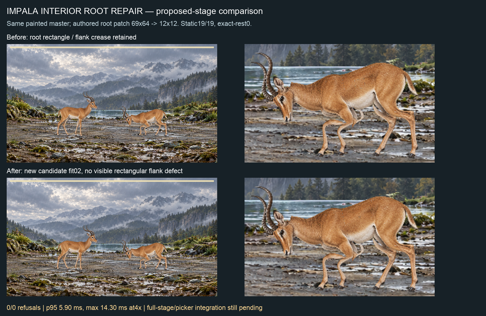

# Interior root ownership — Impala repair, Cattle rejected control

Signed-source parent8ca08a17; only new unadmitted candidate artifacts change. Same original painted masters, explicit presence, anatomical landmarks and all other authoring polygons. `authored-change.json` records the exact source hashes and manual edits: Impala69×64 and Cattle44×43 fixed root patches become12×12, with remaining torso still spine-owned. All old fits remain immutable. No new painting or altered contact/skin allowance.

## Impala repaired

Use `impala-fit-02`. Recipe `58c3ed14e316b21d18ab2e2bac292277bf2caeef26a7d32af9c783ce8e5899d2`; binding `12c7b2d5975e97ff9c08e61fb1501332bf16c1a0f463e84d282fd578c3f95436`. Named root/spine weld remains. `impala-static-02.json` passes19/19 actions, presentation and exact rest, zero changed source RGBA channels. `mask-compatibility.json` freshly checks its own six unchanged masks against the identical keyed painting: zero outside/over-alpha pixels. New manifest states the new recipe; historical generation measurements are not rebound.

`native-impala-01` uses the exact proposed layered-reach and faint-settle stage transforms retained in quadruped-repair04. It is not a certificate for unmodified HEAD or Claude's source. Full15532.7ms,933live/937encoded frames,0/0 refusals. Whole-stage CPU at4×: p955.900000095367432ms, max14.299999952316284ms, zeroCPUframes over1000/60ms, maximum frame interval16.80000000000291ms and zero intervals≥25ms. Exact hashes and metadata in `native-summary.json`; film `native-impala-01/battle-full.webm`. Before/after faint stills show the rectangular flank defect removed. Positive head gap remains. Full-stage travel, integrated picker and coverage still need Claude's actual-source checks; no every-pair or iPhone claim.

## Cattle change rejected

`cattle-fit-02` is NOT a replacement for quadruped-repair04/cattle-fit-02. Static17/19: cast refuses177.65ms with12folds; victory139ms with11folds. Presentation refuses16650ms with20folds. Exact rest alone stillpasses, showing why rest cannot admit motion. No native run consumed on this rejected candidate. Keep the signed repair04 fit; its34over-budget frames remain an open performance defect. Six-mask conservation proves only unchanged painting/mask compatibility, not rig admission.

## Validation and handoff

Root validate passes. Runtime/source, tests, accepted bindings and S2 inputs are unchanged from signed8ca08a17; no unchanged full develop or S2 battery repeated. That source's full develop remains5100pass/soleI5red, not push eligible. All candidate inputs, intermediate outputs, static refusals, exact masks/prompt provenance and full native source hashes retained. No C8/v1/epoch/GitHub write.

Codex continues Cattle performance and bird motion/skin, then remaining ranked art/masks/templates. Claude should consume the repaired Impala candidate together with both stage patches, check full travel and picker on the integrated source, then republish under his authority. Do not consume the rejected Cattle candidate. Nick reviews the sheet; no app-switch relay required. C8/economy/C19/C20 remain parked.
