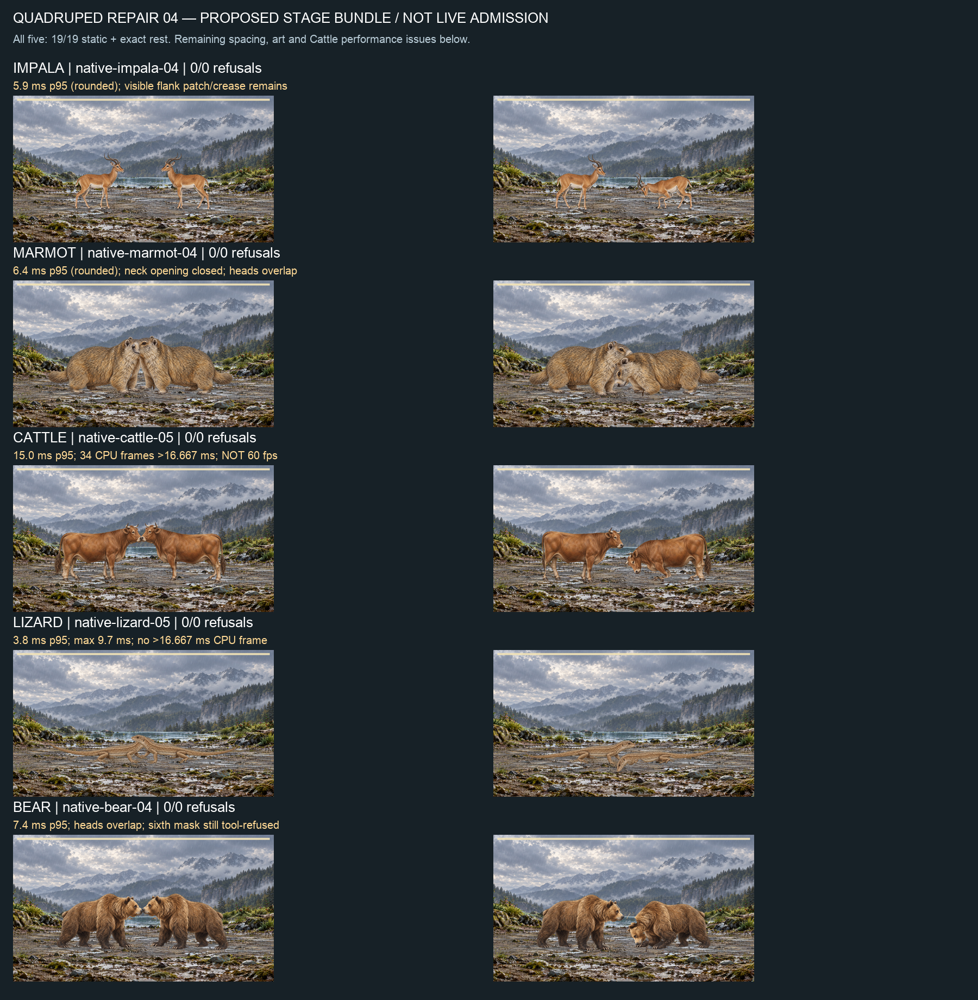

# Quadruped contact, paint seams and turn-change stalls — 2026-09-25

This packet repairs five candidate rigs and stationary motion authoring. It does **not** admit them to the live library. Native films use the proposed layered-reach adapter from signed `412e2cf2` **and** the proposed faint compositor retained here. Claude-owned battle2 files remain untouched. These are transformed-bundle diagnostics, never a certificate for unmodified HEAD or anthropic/mac.

## Implemented source

BodyCard retains the original JSON contact geometry. The new stationary contact author checks quadruped hit/tame against the unchanged REST solver at129 phases. Original passing curves remain byte-identical. Only refused curves receive one constant torso gain (12 bisections,0.9 authoring reserve), with all limb/head/secondary keys and timing preserved. Invalid source or impossible torso-only repair still refuses at actual admission. Observed painted-support static publication independently checks the result. No solver, contract, allowance or support point changes.

A WeakMap owns at most three envelope entries per card (hit/tame/faint), keyed by complete card and compiled curve inputs. Only the provenance seed/hash is normalized after the curves are compiled. Returned timeline seed/hash remain truthful; geometry or curve changes invalidate the cache. This reuses measurements made while loading the rig instead of recomputing during turn changes. Controls compare changed seeds, mutable geometry and mutable amplitude against fresh compilation. Passing Civet/Impala/Marmot/Cattle stationary curves stay byte-identical.

## Candidate outputs

`final-candidates.json` names every final fit, exact recipe and binding hash, static run and film run. All five have19/19 rows ×121 samples, presentation PASS and exact rest (zero changed source RGBA channels):

| Candidate | Fit | Static run | Presentation samples |
|---|---|---|---:|
| Impala | impala-fit-02 | impala-static-02 |1684|
| Marmot | marmot-fit-02 | marmot-static-02 |1701|
| Cattle | cattle-fit-02 | cattle-static-02 |1674|
| Wall Lizard | lizard-fit-03 | lizard-static-03 |1465|
| Brown Bear | ../14-brown-bear/fit-02 | bear-static-03 |1700|

Lizard's former whole-image root remainder contaminated knee/ankle controls: the new authored12×12 interior root patch assigns the remainder to spine, with one named root/spine continuity join. Impala adds the same named join. Marmot joins five individually declared connected interior seams, closing its neck opening. Cattle replaces a blanket weld with19 explicitly declared connected pairs, leaving independent opposite limbs and tail/leg adjacency independent. All originals and intermediate fits remain. Brown Bear binding is unchanged.

`mask-compatibility.json` verifies six existing own masks for each changed candidate: same mask/master/keyed bytes, nonempty, zero outside alpha or over alpha. Lizard's changed recipe has an explicitly new manifest; original generation provenance is retained, never rebound. Bear still has five usable masks and the previously recorded eye-mask tool refusal; this packet supplies no sixth mask.

## Proposed stage repair, for Claude

Apply/reconcile `faint-idle-settle.patch`, using `choreography-proposal-02.txt` and its source hashes. The proposal fades underlying idle during faint and smoothly settles into the exact final reaction pose over the final min(120ms,20% of clip). The existing secondary tail reset otherwise jumps0.0753982236865rad at840ms. Final control log proves zero held-faint pose drift, end jump1.2852056298e-11, and121 ordinary nonfaint samples byte-identical. The fade-only first proposal is rejected and retained because it left that tail jump.

## Full native films, exact Edge,4× CPU

All named films are `<run>/battle-full.webm`; hashes, complete per-frame clocks, phases, CPU costs, refusal counters, encoded metadata and source/transformation receipts are retained. All final runs have0/0 refusals.

| Run | Whole-stage CPU p95 ms | Scope |
|---|---:|---|
| native-impala-04 |5.899999976158142|pre-cache; visible flank patch/crease remains|
| native-marmot-04 |6.399999976158142|pre-cache; neck opening closed, heads overlap|
| native-bear-04 |7.399999976158142|pre-cache; heads overlap|
| native-cattle-05 |15|final cache;911 live/913 encoded frames,15549.4ms captured|
| native-lizard-05 |3.799999952316284|final cache;841 live/845 encoded,13999.4ms captured|

`native-timing-review.json` retains the pre-cache timing evidence. Ready-phase spikes prompted the cache repair. `native-cache-timing-review.json` retains changed-source measurements: Lizard maximum CPU9.700000047683716ms, **zero frames above1000/60ms**, zero intervals≥25ms, maximum frame interval16.80000000000291ms. Cattle maximum41.89999997615814ms, **34 frames above1000/60ms**,20 intervals≥25ms, max interval50ms. Cattle's remaining over-budget frames are action/hitstop/impact/idle, not ready. The25ms bin is diagnostic only, never a new allowance. **Cattle is NOT60fps; a15ms p95 is insufficient.** Other final04 films have not been retimed on the cache change; no extrapolated claim.

Spacing and full-stage travel remain Claude-owned acceptance work. No integrated picker, coverage, every-pair60fps, iPhone or desktop per-rig3.5ms claim. The sheet is a visual defect review, not an acceptance badge.

## Verification and failures retained

- Final develop profile:5100 passed,1 failed,2 expected failures,2 skipped;482 passed files,1 failed,1 skipped. Sole failure is historical I5 current-producer authority; profile stopped there. C8 remains parked, v1 untouched. No whole-profile green, merge or push eligibility.
- Targeted cache/contact/stance tests15/15 PASS; app TypeScript PASS. Root validate PASS,50-probe legacy fingerprint unchanged.
- Final S2 six subjects/13286 samples and receipts byte-identical (`s2-cache/s2/identity.json`). No accepted binding or sentinel changed.
- First stationary geometric-envelope study rejected because it altered already-admitted Civet and excessively shrank Lizard. Actual-contact conditional authoring replaces it.
- First weld continuity declaration used the wrong schema, corrected before acceptance and retained as `paint-boundary-continuity-before-schema-correction.json`; helper receipt and later corrected declaration have separate provenance.
- Native batch03 Impala/Marmot/Cattle failed before browser launch on copied mask-relative paths. Corrected manifests retain old copies and new path receipts; no image bytes changed. Lizard03 has0/14 faint refusals and remains rejected. Original Cattle01/profile02 fail frame-loss acceptance.
- Preparation/read commands using port/v2 as cwd failed before reading/editing intended root paths; corrected absolute-path commands did not overwrite measurements. The first sheet command used system Python without Pillow; bundled Python generated the sheet. No failed browser attempt is erased.
- No new painting, certificate epoch, old-sample rebind, GitHub write, release or deploy.

## Paired next steps

Codex continues Impala ownership/crease and Cattle skin cost, then bird motion/skin and ranked art, masks and specialized templates. Claude consumes these signed helpers/candidate fits, reconciles both proposed stage patches, resolves actual painted spacing/full-stage travel and validates his integrated picker/native source before admission or dev republication. Keep failing creatures out of the stage. Nick reviews sheets and the eventual iPhone build; no app-switch relay is needed. C8/I5, weekly/economy/C19/C20 remain parked.
