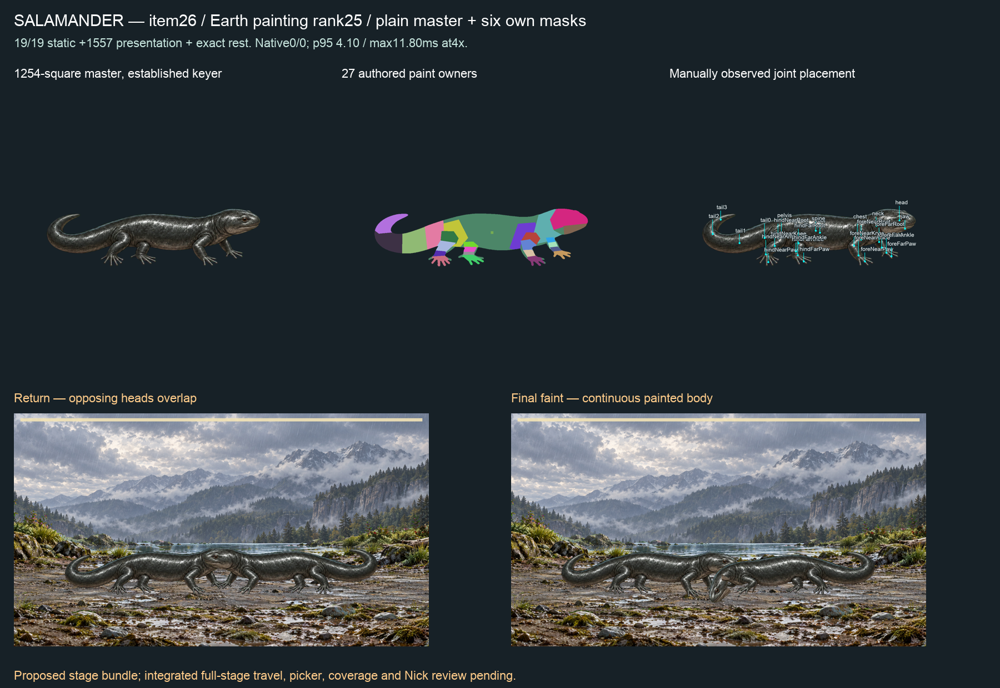

# Salamander motion repair01 — C15

**Unchanged item26 fit05 now passes19/19 static actions,1,557 continuous presentation samples and exact source-pixel rest.** Full proposed-stage film0/0, no CPU frames above1000/60ms at4×. Stage spacing remains visibly wrong; no integrated picker/coverage admission.

## Cause and final change

Original item26 gallop exceeds front-leg reach73.7ms and its continuous presentation exceeds foreNearPaw rotation at7700ms; cast exceeds compression372.75ms. probe.json independently reproduces original failures against both REST and observed paint supports and shows smaller torso excursions fit without moving those supports.

New canonical grounded-quadruped.ts handles land/amphibious gallop/cast only. It retains passing curves byte-for-byte; after an original contact refusal, it probes a constant whole-curve gain for root translation and root/pelvis/spine/chest rotation, with129 samples and12 bounded bisection steps, then reduces the fitted gain by10 percent for excursion headroom. If zero torso excursion cannot fit, it returns the original refusal-producing action. No contact, compression, skin, deformation, solver or family limit changes. Limb stride, head/neck expression, secondary tracks, timing and phases remain exactly authored. Gains measured for this record: gallop0.67939453125, cast0.8841796875 (curves.json). Their bodyMs/durationMs remain420/804 and610/994.

The selector is called from canonical buildTimeline only. Editor buildActionTimeline and override gates retain original requested curves. Weak cache is bounded to two actions per body card and keyed by complete card/action/compiled inputs; seed remains true returned provenance. No accepted painting/binding or source pixel edits.

## Verification

Seven new tests prove original failure/after pass against both support kinds at241 samples, identical expressive tracks/timing, JSON transport, cache invalidation and seed provenance; four previously passing quads stay byte-identical. Eighteen existing contact-envelope/grounded-bird tests also pass. The first combined test command had a test-file creation path error (nestedport/v2 path fromport/v2 cwd), so its18 tests are only existing-suite coverage; new tests were then created at the correct path and run once in targeted-new-02.log. No missing-test PASS is claimed.

S2 six subjects/13,286 samples and receipts are byte-identical, instrument unchanged. Standalone app TypeScript and root validate pass. Full develop profile:5,117pass,1failed,2expectedfail,2skipped;484filespass,1fail,1skip. Sole failure is parked current-producer-authorities I5 drift. The profile stops at npm test; later profile owners did not run. No unchanged retry, v1 edits, rebind or epoch attempt.

static-01.json runs actual GSAP/contact/compiled skin:19/19×121,1,557 presentation samples, exact rest, zero changed reconstructed visible RGBA. It uses the same recipe `712c584bdd51bc0c585f4f8ae059faa8d9b7f0fcdc531f7841c46c054ed1f2e2` and binding fileSHA `db731fe504b30ed0ac48e127559ed2a28238c812ae13946a8ba15bed95758aff` as item26. Its original six masks/manifest remain valid and unchanged in26-salamander.

## Film and open stage finding

native-observed-01 is a fresh full film on changed motion source with retained proposed layered-reach/faint-idle-settle bundle, **not unmodified HEAD or integrated-source certification**. Exact Edge153.0.4234.48,4×CPU, observed paint supports, four complete actual-species turns.872live/877encoded frames,14,516.1ms;0/0refusals; whole-stage p95 `4.100000023841858ms`, max `11.799999952316284ms`, zero CPU frames above1000/60ms, no intervals≥25ms, max16.80000000000291ms.25ms diagnostic bin is not an allowance. No other-lane work in26samples, not a global idle-host proof. Not isolated desktop3.5ms, everypair or iPhone acceptance. Native-summary pins exact film/report hashes and source capture.

Reviewed return/faint remain connected but opposing heads overlap. That stage defect remains Claude's integration task and blocks publication despite motion numerical passes. The film uses actual species actions; repaired alternative gallop/cast have full static/presentation evidence, not a claim that this battle script visibly performs every alternative action.

## Paired next steps

Claude consumes this repair plus signed item26 fit05/six masks, reconciles proposed stage patches, repairs source-paint spacing/full-stage travel and runs integrated picker/coverage before publishing. Codex continues Eel and ranked painting intake, then remaining art/performance gates. Nick reviews combined21–30 sheet and eventual iPhone playtest; no relay required. C8/economy parked. No push/merge/hosted/release/deploy; manifest.json pins packet and changed source/reference files.
