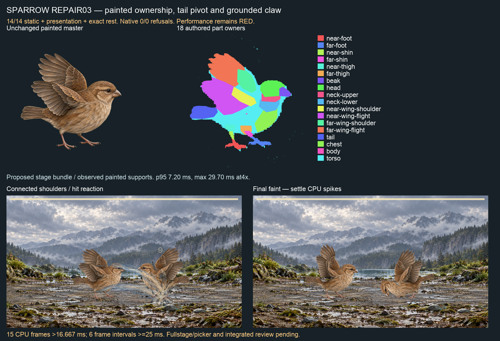

# Sparrow ownership and grounded claw repair — 2026-09-25

Use `fit-02`:14/14 static actions,1,039 presentation samples and exact rest PASS (`static-04.json`). The native film has zero rig refusals and closes the former large shoulder holes, but **performance remains red**. No picker, integrated coverage, complete-stage or continuous60fps claim.

## Candidate and motion

The original master/presence bytes are retained in `authoring-01`. The new18-part candidate gives the fixed root only a12×12 interior patch, assigns the remaining torso to the existing spine joint and places the tail pivot at its visible proximal attachment390,745 rather than the feather tip189,727. `fit-02` joins only the root/torso patch and the two proximal wing/torso feather junctions. Independent wings, legs and distal overlap edges remain independent. No painter pixel, family contract, solver, stance, threshold or accepted binding changes.

The original alert tail fold is gone. The remaining claw compression was reproduced with stage-owned melee travel in `contact-study-02.json`. `grounded-bird.ts` now chooses a level grounded claw only when the original fails the unchanged REST support probe: original limb/wing/neck and horizontal travel curves, timing, phases and duration are retained; root roll and vertical dip are neutral. Passing Gull/Goose/Heron/Eagle claws remain byte-identical. The direct editor/override constructor remains unchanged, and actual observed-support contact/skin gates still decide admission. No per-frame suppression or gate loosening. The existing per-card cache now holds at most four applicable action IDs.

Exact candidate recipe `2d5c2c9c57d689a2859006fe73857905ffe3bac54ff101c3cafc4278bf806d28`; binding `441dd0d18b6112cc27e93272e20d5ab1187e378639288aa385a6b020043433d7`. Six own mask bytes and original exact prompts are referenced by `fit-02/markings.json`, freshly checked against the unchanged keyed painting (`mask-compatibility.json`): zero outside/over-alpha pixels. Historical samples and original generation provenance remain untouched.

## Native run: native-observed-01

Exact Edge153.0.4234.48,4× CPU, existing observed painted-foot supports, existing layered-reach + faint-idle-settle PROPOSED stage bundle. This is not an unmodified HEAD or Claude integrated-source certificate. Full four-turn peck/hit/dodge/faint film: [battle-full.webm](native-observed-01/battle-full.webm). Claw is covered by the full static row, not this peck film.

- Zero left/right rig refusals;759 live /763 encoded frames,12,732.800000000001ms capture.
- Whole-stage CPU p95 **7.199999928474426ms**, maximum **29.699999928474426ms**.
- **15 CPU frames exceed1000/60ms**, all in final faint settling. Six intervals≥25ms, maximum33.39999999999782ms.25ms is a diagnostic bin, not an allowance. Phone-tier smoothness is NOT green.
-24 once-per-second host observations found no other-lane node/Vitest/Vite process; this does not certify all host activity or exclude shorter work. No other heavy Codex task overlapped the film. Planning/loading/stills occur before capture; not cold-start, per-rig desktop3.5ms or actual iPhone acceptance.
- Reviewed impact/return/faint stills: large former shoulder holes closed; paint stays connected. Nick's art review and Claude's integrated full-stage/picker gates remain pending.

Exact report, film hashes and every over-budget frame are in `native-summary.json`; all source hashes are in the native report.

## Verification and all retained refusals

Nine grounded-bird tests PASS, including original refusal controls, unchanged passing birds/limb curves, JSON transport and override separation. App TypeScript and root validate PASS. S2 six subjects/13,286 samples and receipts byte-identical (`s2-checks/s2/identity.json`).

Full develop: **5,108 passed,2 failed,2 expected failures,2 skipped**;482 files passed,2 failed,1 skipped. Reds: parked historical I5 producer-authority mismatch, and an unchanged acquisition source-scan test timed out at5,000ms (measured6,784ms). Claude's five Vitest workers were observed immediately after that profile, a possible contention explanation only; no evidence proves cause. No repeated battery, unchanged test retry or increased timeout. No whole-profile green, push or merge eligibility.

`static-01` retains the claw refusal after ownership repair; `static-02` passes after motion repair. `static-03` refused a missing schema in the added continuity declaration before action samples; the malformed JSON is retained and `static-04` validates the corrected declaration plus all three joins. `contact-study-01` omitted stage-owned melee travel and is labelled diagnosis-only; study02 uses the actual travel mode. Initial Vitest shell redirection failed before the test launched; the corrected command ran once. `retained-preparation-errors.md` records these errors. No family or solver change follows from any refusal.

## Paired next steps

Codex continues the ranked art and motion/performance program; Sparrow's final faint settle joins Cattle/Centipede on the CPU defect list. Claude can consume this signed candidate and source, explicitly select observed supports, review the existing stage proposals and fix final-settle cost before claiming phone-tier green or publishing a complete rig. Run the integrated picker/full-stage/coverage checks on the actual integrated source. Nick reviews the sheet and eventual iPhone build; no app relay required. C8/I5, weekly/economy/C19/C20 remain parked. No GitHub write, release or deployment.
