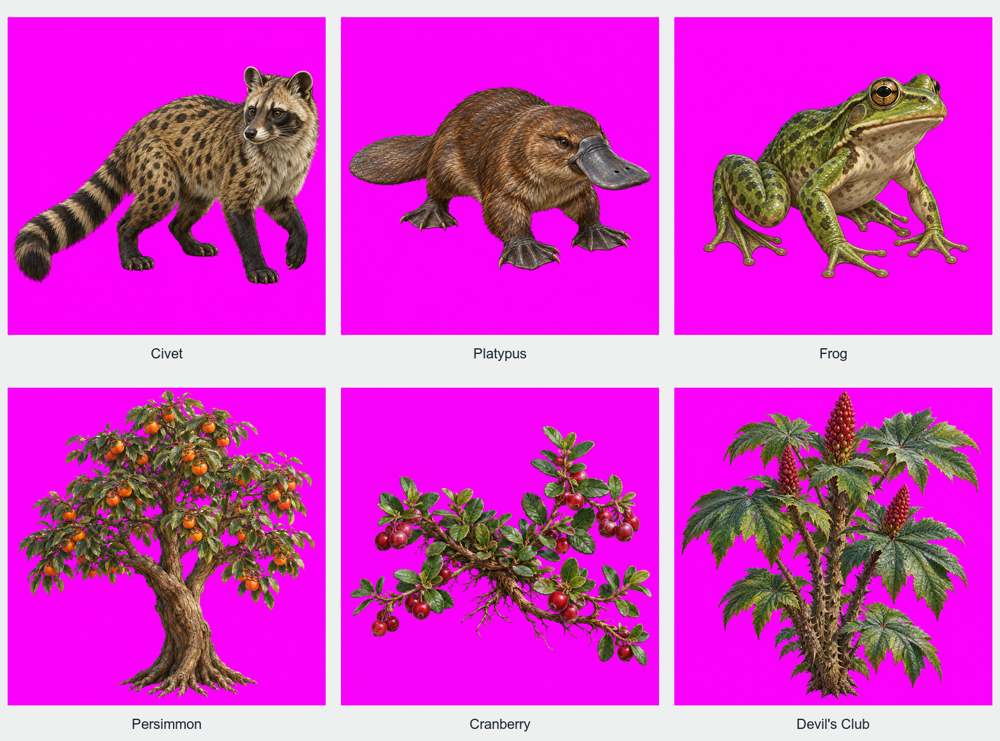
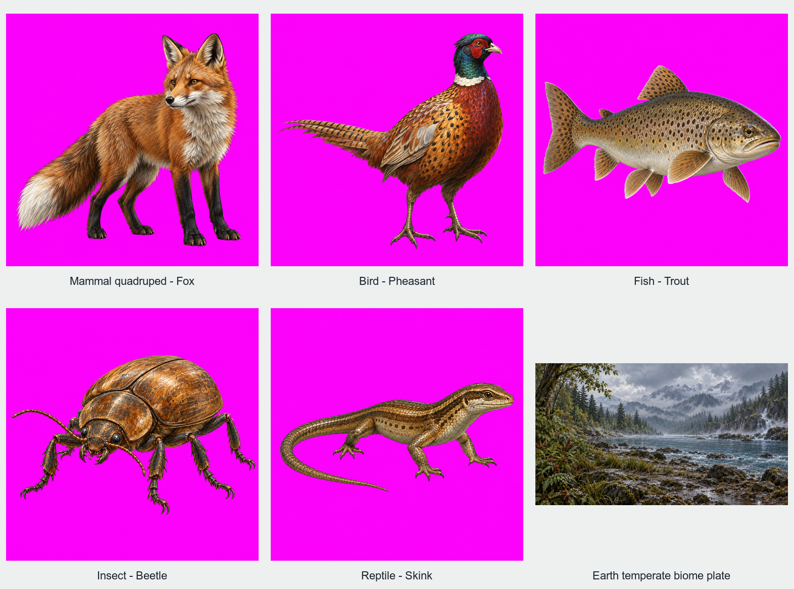

# Approved v4 — first twelve inputs and engine-first handoff

Nick approved the v4 draft at `6f5c396e92e82f64daa1a087c24d0d564c7e69aa`, amended
§9 to put the engine before the full library, and scheduled the Animation and battle
track after acceptance of the first engine painting and before library rollout.
The entire 4E class remains byte-identical; see `turnaround-preserved.json`.
V3 and its two rejected paintings were not used.

## First input batch — review required, not accepted art

Twelve built-in image-generation calls, one per individual master, using the exact
compiler output in `prompts/` and only the class's approved reference. All untouched
outputs are in `masters/`. The labelled sheets are scaled review layouts, not new
paintings or altered masters. `capture-intake.json` binds prompt/master SHA-256,
actual/requested dimensions and approximate non-magenta bounds.

Every cut-out was inspected: **no Atlas frame or dark plate background appeared**.
The conditional background-related v4.1 amendment was not triggered. No kit block was
changed at send time. The separate Effects proposal is inactive and no effect was painted.

Findings to carry into review:

- Civet's head/coat read too raccoon-like; the named identity needs scrutiny.
- Platypus preserves bill, webbed feet and paddle tail; Frog preserves the crouched
  four-limb body. Occluded limbs do not constitute a verified anatomy count.
- Persimmon has orange fruit and simple leaves; Devil's Club has spiny canes,
  palmate leaves and upright red berry cones. Cranberry remains too woody/upright.
- Fox, Pheasant, Trout, Beetle and Skink are named source exemplars of the requested
  five families, not new residents in the canonical Earth landing.
- All eleven cut-outs arrived at 1254×1254, not 1024×1024; the biome plate arrived
  at 1672×941, not 2560×1440. All requested-size checks fail. Most margins also
  miss the kit's 8%/10% targets. No rescaling is hidden as native-size compliance.
- The plate retains a busy rocky foreground and reads colder/flatter than the
  Living Worlds Earth panel. The approved reference also uses detailed natural
  materials; “photographic” is a subjective concern, not an automated verdict.

## Implementation and evidence

`compileEarthArtKitV4` in `port/v2/apps/game/src/landfall-conditioning.ts` is the
one pure authoring interpreter for this bounded adapter. Canonical Earth source
admission remains unchanged; star, planet, climate, weather, biome and full resident
identities come from game owners, named Earth anatomy/pigment from painter diagnostics.
No system card is hand-filled. Other worlds/unlisted family exemplars remain unsupported.
This does not yet replace the old runtime adapter or claim warm sessions/compositing.

`port/v2/tools/landfall-snapshot/kit-export.mjs NEW_DIRECTORY` builds a pure Node
compiler and invokes the real canonical producer, without inference or a game build.
It hashes source files and named painter owners. The final compiler reproduces all
twelve sent prompts byte-for-byte (`prompt-reproduction.json`). Earlier source receipts
record the actual compilation stages; `current-compiler-source-manifest.json` records
final source bindings. Source diagnostics were extended to five named family exemplars;
the already-sent Earth prompts remained unchanged.

Validation: 21 focused Vitest tests pass (including retired-kit, missing/duplicate
block, altered star identity and invented-species negative controls), TypeScript
`tsc --noEmit` passes, root `validate.js` passes with zero boot/render errors and the
identical 50-probe fingerprint. Unit tests take no checkout lock. The authoring exporter
alone takes its normal build lock. Review-sheet generation first failed because the
font alias Helvetica was unavailable; rerunning with the installed Arial font path
produced both sheets. No painting was regenerated to repair that layout-tool failure.

## Next engine work

The exact Civet authoring prompt is 1812 tokens with the pinned local tokenizer before
chat wrapping; the current worker accepts only 512. This is a measured pre-inference
compatibility gap, not a model run. Preserve kit blocks rather than silently truncating.
Rebuild the local adapter, offline pre-fit/hash, per-organism passes and one low-strength
finisher, session reuse/VAE reuse and in-worker expansion; then one measured native
painting with per-organism boxes beside the triptych. All input quality findings remain
visible; no full-library rollout or animation implementation precedes painting acceptance.

The requested Animation and battle track is appended to CODEX_HANDOFF and ROADMAP.
`EFFECTS_CLASS_PROPOSAL.md` proposes the eleven source theme keys and a cut-out row;
Nick must approve it before any effect painting. Keep the 4E turnaround unchanged.

## Local Git boundary

OpenAI/Codex, macOS, `/Users/nick/Projects/celestial-frontier-openai-mac`, `openai/mac`
tracking `origin/openai/mac`. Entry `6f5c396e` was 18 ahead/0 behind upstream and
129 ahead/0 behind cached `origin/develop`; this input-batch commit adds one to each.
No fetch or GitHub write. PR42 remains parked. `.DS_Store` is unrelated and untouched.
Claude Code does not have these local changes and need not be opened now. Only after
an eventual authorized merge into develop should its clean agent branch fetch/merge
origin/develop. No change to develop, main or the live site; no release/deploy.
