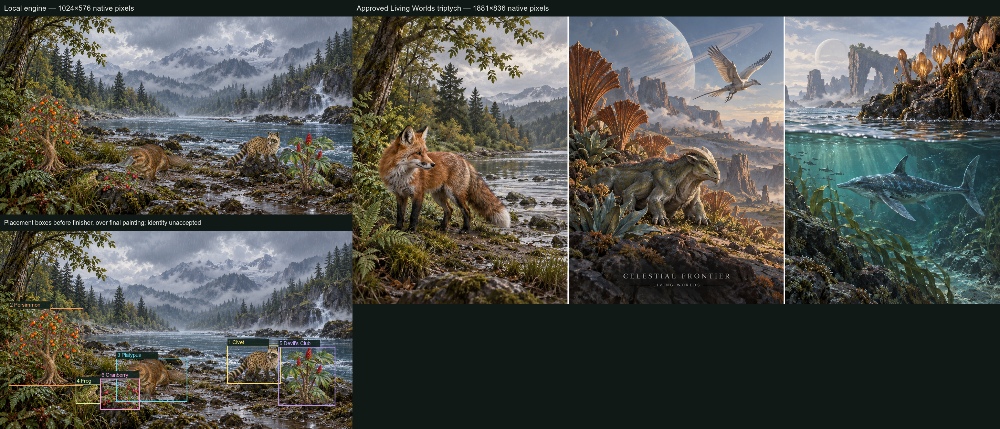

# First Art Kit v4 engine proof — 2026-09-12

Status: the one native run completed on signed source
`30ef7d15e7bbc22d3684bf4b069e616d67288d4a`. Engine execution PASS; painting quality
remains unaccepted. No retry or additional native run was made. Phone performance
and normal-game integration remain unqualified.



[Untouched painting](native-01/painting.png) · [organism boxes](painting-boxes.png) ·
[full native receipt](native-01/result.json) · [compact measurements](review.json)

## Measured outcome

425.707 seconds (7m05.7s) inside the engine; 438.474 seconds including cache verification,
browser setup and cleanup. Output1024×576, six384-square organism passes, four steps each,
one0.08-strength finisher. The four sessions were each created once; encoder load0.491s,
text2.810s, transformer including expansion5.231s, decoder0.343s. Native persistence across
a second landing was not run; simulated two-landing reuse and its bypass mutant were tested.

| Pass | Seconds | Actual tokens | Tensor positions |
| --- | ---: | ---: | ---: |
| Civet | 68.264 | 1824 | 1824 |
| Persimmon | 62.968 | 1738 | 1744 |
| Platypus | 62.494 | 1812 | 1824 |
| Frog | 61.349 | 1792 | 1792 |
| Devil's Club | 59.983 | 1737 | 1744 |
| Cranberry | 60.017 | 1730 | 1744 |
| Finisher | 47.590 | 1860 | 1872 |

Text inference took26.14–28.86s per prompt. This is an absolute measurement, not a
controlled comparison with512 tokens. The largest embedding here was27.422MiB at1872
positions. The configured5120 ceiling remains structurally/unit-tested, not measured
at maximum native length. Edge153.0.4234.32 exposed maxBufferSize4,294,967,292 and shader-f16.
This is the Mac, not Nick's iPhone. Worker memory was unavailable (`null`); renderer heap
observations do not measure worker/native/GPU memory and cannot qualify the phone tier.

All206 pinned operand ranges expanded to347,332,608 bytes from86,833,152 source bytes;
graph and operand hashes matched. Expansion storage writes0. Saved model files and all
served sources were hash-verified; no GPU error event was reported.14 native PNG artifacts
include the untouched scene, pre-finisher composite, six raw passes and six keyed passes.

## Visual review — acceptance remains Nick's

All six expected subjects remain visible at their placement boxes after the finisher;
these boxes are retained compositor geometry, not newly inferred pixel segmentation.
No separate dark Atlas plate or frame appeared. The one low-strength finisher changed
little of the pre-finisher composition. It preserved the input defects as well.

| Organism | Native placement x,y,w,h | Visual finding |
| --- | --- | --- |
| Civet | 660.48,333.66,153.60,109.86 | Spotted fur and ringed tail remain; short muzzle and mask still read raccoon-like. Identity unresolved. |
| Persimmon | 25.60,225.19,215.04,224.09 | One fruiting tree is present; orange fruit reads, but crown merges into the plate's foliage. Fine botany unresolved. |
| Platypus | 337.92,371.49,204.80,123.87 | Bill, four-limb form and flat tail read; shaggy rounded body and oversized prominence need review. |
| Frog | 220.16,445.68,71.68,55.44 | One crouching frog remains, but rock/grass camouflage weakens readability at native size. |
| Devil's Club | 808.96,337.35,163.84,169.53 | One upright plant with broad lobed leaves and red spikes reads; small thorn details remain unqualified. |
| Cranberry | 291.84,428.60,112.64,89.80 | Low red-fruited patch remains, with a woody/upright source habit and weak leaf-level readability. |

Against the unchanged Living Worlds triptych, the broad scene remains colder, rainier
and crowded with foreground texture. The approved triptych gives its creatures clearer
silhouettes and stronger focal scale. Detailed material alone is not the acceptance test.
No auto-acceptance, correction sweep, library expansion or effect painting follows this
receipt. Show Nick the painting and comparison; obtain painting feedback before another
native run or scaling the library. The normal-game V1/V2 action, old OPFS removal and
remaining Part K defects are explicitly pending.

The first twelve masters and review sheets remain in ../ART_KIT_ENGINE_FIRST_20260912.
This directory preserves derived inputs only: source originals remain unchanged.
`prepared-manifest.json` records original/PNG/raw RGBA hashes and offline ImageMagick
fitting operations. `recipe.json` is compiled from canonical Earth data, never a hand-typed
system card. Its SHA-256 is 497dbf701285e6fdb90b8522b712b07a26e054b4c4b72b79807dc2547d13dac9.
`compiler/` retains authoring source provenance; `kit-client.mjs` bundles the app-owned
warm client alone, not the game or a delivery pack.

## Executed run boundary

One native run, no sweep/retry. Settings: 1024×576 painting, 384-square organism passes,
seed133, four steps at strength0.2, one finisher step at0.08. Six exact canonical residents
are placed in depth order on the Earth plate. Atlas conditions each cut-out; triptych
conditions the finisher. Placement boxes are pre-finisher geometry, not automatic
post-finisher segmentation or identity acceptance.

From the repository root, after a signed clean source commit, native browser execution:

```sh
node tools/local-image-generation/run-kit-engine-proof.mjs audits/ART_KIT_ENGINE_PROOF_20260912 audits/ART_KIT_ENGINE_PROOF_20260912/native-01
```

The runner verifies the existing pinned model cache, serves exact local inputs and model
files, records source hashes, progress and renderer heap observations, and saves raw
organism captures even if the isolation-key gate later fails. Four warm sessions and
encoded reference caching belong to the worker. Expanded transformer operands exist
in worker memory only; storage writes for expansion are zero. No old --landfall/--variant
command, integrated chain, pack, GitHub write or native prompt sweep is authorized.

## Text capacity

Nick requested 512→5120 tokens. The complete kit prompt is never truncated. Actual
wrapped token length is padded only to the next16 positions, not always5120. ONNX
input dimensions are dynamic; the executed lengths1730–1860 tokens succeeded, but
maximum5120 native capacity/performance are unqualified. Float16 embeddings alone rise from7.5MiB at512 to75MiB at5120; attention intermediate
memory and time also grow. Historical512-token diagnostic contracts remain unchanged.

## Checks

- worker-tests.log:17 PASS, including two simulated landings with four total session
  creations, one encoder, six organism passes + one finisher each; cache-bypass mutant
  fails the same reuse oracle. Overflow5121, key/background, expansion/hash and shape
  controls cover rejection paths; existing exact first-step diagnostic checks pass.
- compiler-runtime-tests.log:23 PASS, including full kit order/source mapping, warm
  Worker reuse, cancellation/new-worker and wrong output geometry rejection.
- typecheck.log: tsc PASS. validate.log: root validation PASS, exact50-probe baseline.
- These new unit tests do not acquire the checkout lock. Older Part K33 tests remain to fix. Short authoring builds and the actual native
  runner do; test suites exercise isolated fakes and pure compiler data.

These checks do not qualify a native painting. Normal-game V1/V2 action wiring and
replacement/removal of its old OPFS layer remain pending, as do the remaining Part K
integration defects. Input anatomy/style findings remain open. First engine painting
acceptance gates animation proof, then the rest of the library.
