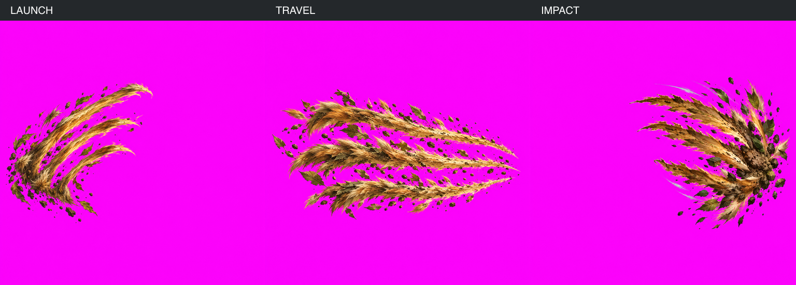
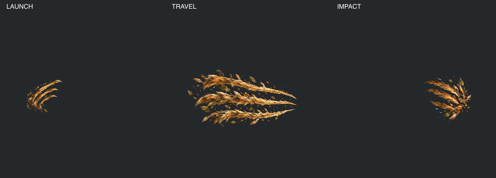

# C1 — Art Kit v4.3 adoption and one Wild repaint

## Current Pack4 intake — 2026-09-13

Pack4 retained verbatim in6b574220. It supersedes the Pack3 intake decision: launch/travel,
registration and retained shapes accepted by Claude; impact requires the two targeted clusters.
Nick owns final visual acceptance. One explicit-target radius8 RGB-only pass changed9pixels
in the lower-right tuft; zero eligible pixels in the top-right rectangle after protecting sheen,
low-saturation pale paint and dark umber. No erosion, alpha change, outside-target change,
travel correction, repaint or generation. The unchanged top-right crop remains visible for review.

Current images, before/after400% crops, classification split, exact changed/source pixel lists,
registration receipt and review prompt are under [targeted-pass](targeted-pass/REVIEW_REQUEST.md).
Both anchor files reference the current derived copies; original image hashes remain attached
to their unchanged original paths, with corrected keyedImageSha256 in the fallback.
The historical110/85 diagnostics are not visual pink counts; the new receipt explicitly splits
pink-band candidates from protected sheen/pale/umber and retains Claude's visual44/31 estimates.
No under40 threshold drives another pass. C1 is not declared visually complete.

The sections below retain prior generation/intake evidence; current status above supersedes
the earlier request for another generic cleanup authorization.

Nick approved e89cb621 with only the two header labels and exact history-clause update.
`adopted-kit.diff` is the final adoption diff; `kit-adoption.json` records its SHA256 and
unchanged frozen style/4E. No game theme hex changed. The Earth compiler now admits4.3;
its retired-v3/missing-block/source-mutation controls pass and engine prompt bytes are unchanged.

Three built-in imagegen calls, one per phase, no reroll, local inference or v3 reference.
`generation.json` binds exact prompts, original outputs and hashes. The compiler-produced
Earth system card is reused verbatim from the accepted contact proof; nobody typed a card.

## September 13 Pack 3: second intake result — target missed

Claude accepts the art, launch, registration and prior MID despill; Nick owns final image acceptance.
One second pass on travel/impact keyed copies used an 8px circular inward search, simultaneous
magenta suppression toward an opaque interior neighbour, then exactly one pixel of alpha erosion.
Travel: 612 contaminated edge targets, 469 corrected, **110 unresolved** after erosion.
Impact: 592 targets, 447 corrected, **85 unresolved** after erosion. Both miss the under40 target.
The initial keyer receipt counted unresolved searches, whereas this pass counts all surviving
contaminated edge pixels; those metrics are explicitly distinct. No threshold was changed.
`second-pass/receipt.json` retains every correction/source index, unresolved index, hashes and
unchanged registration transform. `second-despill.mjs` fails after preserving these candidates.
No additional pass or generation was run. Launch/MID and every master remain unchanged.

[Three phases](second-pass/wild-phases-review.png), [travel at200%](second-pass/travel-fringe-200.png),
[impact at200%](second-pass/impact-fringe-200.png). Fine pink remains visible at200%; these are
candidates, not a claimed clean intake. Registered anchor hashes/paths now identify the new copies;
original per-phase fallback image hashes still bind originals, with a separate corrected keyed hash.
Previous parser inputs are retained in second-pass/*.before. C2 coding continues independently;
effect staging acceptance awaits Nick's direction on the remaining fringe.

## Original generation and first intake evidence

Original 1254-square masters: [launch](wild-launch.png), [travel](wild-travel.png),
[impact](wild-impact.png). All are retained unchanged. New materials are warm ochre/tawny
fur, torn leaves and earth; small cool sheen. No Frost palette was used in the new brief.
Shapes/material quality remain Nick's visual decision.

The generator enlarged the subjects despite explicit1024/common-canvas bounds. Intake keys
copies, uniformly downscales and translates them onto a shared1024-square canvas. No rotation,
warping, repaint, crop or pixel retouch; source masters remain unchanged. Visually measured
launch/travel origin and impact convergence align with common origin(.20,.55) and contact
(.80,.55) within half a pixel after rounding. Empty phase anchors are virtual, not painted.
Common canvas is an intake result, not a claim that the generator obeyed the original bounds
or that an unviewed animation is accepted. See `intake.json` for transforms and source anchors.

`wild-anchors.json` references the registered files using cf.effect-sequence-anchors/v1.
`wild-anchors-master-fallback.json` preserves per-phase anchors for the original keyed masters.
Initial keyer unresolved fine-edge pixels: launch89, travel597, impact529. These remain
recorded; this proof does not claim zero-fringe intake. No extra Wild despill/erosion sweep.

## MID intake

The requested one-pass correction was already applied in07c93945. Reverified that exact
copy here:190 RGB pixels differ, alpha unchanged, accepted FAR/MID/NEAR hashes unchanged.
`mid-verification.json` records no new pass. Corrected image and receipt remain at
[arena acceptance](../ARENA_V1_ACCEPTANCE_20260912/README.md). No arena repaint.

## Verification and boundary

Nine contact/despill tests with negative controls; three Art Kit compiler tests; full v2
TypeScript; root validation. Logs retained here. Initial compiler run refused4.3 before the
version-list update; `compiler-tests-pre-adoption.txt` retains that red. The preceding edit
command used a wrong relative path and changed nothing; the subsequent exact edits admitted
4.3 and updated the retired-version mutant. No failure erased or acceptance threshold softened.
The tests mentioning older erosion experiments exercise existing synthetic math only: no model
or painting experiment was run. Current typecheck/validation logs describe this final source.

C1 images await Nick. Stop before staging. No C2 rig/turn, C3 sound, Claude-owned module edits,
main.ts edits, GitHub action, new branch, LFS migration or history rewrite. PR42 remains parked.
