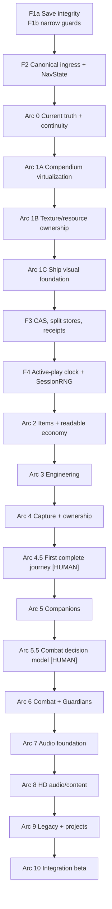

# Celestial Frontier v2 — Complete Program Roadmap

> **Status:** comprehensive planning baseline, created 2026-08-14; implementation state updated
> 2026-08-22.
> **Scope:** the complete approved v2 program—foundation repairs, product Arcs 0–10,
> premium visual/audio production, Gate A–I evidence, and release readiness.
> **Implementation status:** active, one bounded review branch at a time. F1a save integrity is
> integrated in `develop` at merge `a1dabdeb4059292d67d7a89652e92fb317d750c7`; Charter
> SCN-1/SCN-2/SCN-6 is integrated at merge `bd49beb0693b45fdd57d4acad746ade79843a91e`.
> UI-P1 registered panel-chrome dismissal is integrated at merge
> `b5e5d0a3b4bb4057fa6d251816454b370e8b2624`; the truthful WorldGen contract is integrated at
> merge `a50e593e2135f55ae8c37e6ece1f10c52701346b`; audio pre-initialization hardening is integrated at
> merge `44925f62abdfcdf9c17e512dd49a57a183e217ec`; the epoch persistence contract is integrated at
> merge `5171abcdc538938fdf5ac82688d1ab868da6ff48`. F2 canonical ingress and discriminated navigation
> finished at PR #30 head `24bcc3cbf4e76f7bb65a00e810e0eeeeb8d7c837` and is integrated at
> `b091f010011fa16bec457599b41274b7f92bb5e6`. D-TRAIN-1 is integrated through PR #31 at
> `38447019517147319bd08c598202d097ee866874`. Arc 1A then reached terminal-green hosted evidence:
> run `32462323775` tested exact head `c68aee241220dcb720cadb7fc55f7fbf99bde6fb` once without
> retry, and PR #32 merged into `develop` at `d4ab7e671959ab80198bed22bb600a26fc3524cc`.
> Its six-image Compendium `[HUMAN]` review remains open.
>
> Arc 1's automated implementation is locally complete. Arc 1B's exact historical source
> `79c605f9c7ab8b63ad082d852c38d66ad6bb11af`, v1 budget/workflow activation
> `e244c9e2342c6abd79ca4efcd3d26eb46d3d8910`, and one no-retry 40/40 local certificate remain the
> authority for the pre-Shipyard scene-resource boundary. They are preserved as Arc 1B chronology,
> not reused as proof of Arc 1C.
>
> Arc 1C product/ruler source `a4de5007ffc9131b8bc952a0a4cb469d9139039e` adds one pure normalized
> `ShipVisualState` shared by travel and presentation, a responsive read-only Shipyard with one
> code-native SVG/DOM preview owner and zero second renderer/RenderTexture, and the named
> `SurfacePlanetTextureAttachment`. Exact activation/certification source
> `59530da3bf40965adf9c54f169b310e11ccdd0f8` binds `budgets/scene-memory-v2.json` SHA-256
> `3b71d14ca297ec4d536669d2edf960ac4d01671dd7a0c9eb11a2fb76e4fc43f7`. Local no-retry run
> `20260822-arc1-local-certification` passed 42/42 under Edge `151.0.4129.101`, complete lifecycle
> and cleanup, followed by a passing exact named-run verifier; report raw/gzip SHA-256 are
> `e24ceef86d17fb4a47bbb10e58f81d442cac6e3def28923672448f6c47eac3a5` /
> `0d83e6ce339205beb0b5387008ca74ca9b1f95cb22bf61444c439da36405f2a6`. A later documentation
> descendant does not move that exact authority.
>
> The v2 gate drives Universe, Galaxy, Galaxy fine, Sol, Earth Surface, the deterministic 1,500-row
> Compendium, and the real Shipyard on phone and desktop before settling back at Universe. PR #33
> remains draft; hosted evidence, review acceptance, integration, the Arc 1A six-image HUMAN review,
> Arc 1C phone/desktop ship-readability judgment, whole-Gate closure, release, and publication remain
> open.
> This document does not authorize a release, deployment, version bump, or claim that an entire
> Gate is closed.
> **Review provenance:** the accepted PR #23 and HD-audio review inputs are preserved verbatim at
> [`../audits/v2-program-review-2026-08-14/`](../audits/v2-program-review-2026-08-14/).

## 1. Purpose, authority, and status

This is the operational coverage map for the v2 program. It maps approved product direction into
named work packages, dependencies, evidence, human gates, and review questions so no system is
lost between a sweep, a handoff, and a future PR. It does not replace the live session handoff in
`ROADMAP.md`, the source code, or a specialist system reference.

### 1.1 Authority order

When sources disagree, resolve the conflict in this order and record the discrepancy as work:

1. Current source and the live `ROADMAP.md` handoff establish current implementation state.
2. [`../EXPLORATION_SHIPS_LOOT_AND_COMPANIONS.md`](../EXPLORATION_SHIPS_LOOT_AND_COMPANIONS.md)
   owns approved product direction, Arc 0–10 sequence, player promise and acceptance.
3. [`DECISIONS.md`](DECISIONS.md) owns decisions Nick has made; decided does not mean implemented.
4. [`RUBRICS.md`](RUBRICS.md) defines what counts as executable and human completion.
5. [`PORT_MASTER_PLAN_v4.0.md`](PORT_MASTER_PLAN_v4.0.md) owns premium visual/audio architecture,
   data/migration architecture, master phases and Gates A–I.
6. [`v2/README.md`](v2/README.md) and [`v2/DEVIATIONS.md`](v2/DEVIATIONS.md) establish the current
   v2 boundary and the live open/closed delta ledger.
7. [`V2_FULL_SWEEP_2026-08-13.md`](V2_FULL_SWEEP_2026-08-13.md) is an independent findings and
   proposal record. It informs this roadmap; it does not silently amend an approved contract.
8. Historical handoffs and old CI run IDs explain why, never current branch/check/publication state.
   Verify those live.

`ART_DIRECTION.md`, `AUDIO.md`, `AUDIO_LICENSES.md`, the system references, and
`PROCESS_LAWS.md` are binding specialist references within their subject areas.

### 1.2 Status vocabulary

| Label | Meaning |
| --- | --- |
| **[LIVE]** | Available in the current slice and supported by current source/evidence. |
| **[PARTIAL]** | A bounded part is live; all remaining data, ingress, quality, or evidence is named. |
| **[PLANNED]** | Approved direction, not yet player-visible or not yet proven. |
| **[DECISION]** | A product decision is still required before the affected work begins. |
| **[EXEC]** | An executable criterion has current exact-head evidence. |
| **[EXEC-TODO]** | An executable criterion is required but absent or insufficient. |
| **[HUMAN]** | Human review is required; no automated metric can replace it. |

The current v2 application is a playable exploration/survey Phase-4 slice. It is not a finished
v2 product: Inventory, Shipyard build actions, item instances, creature ownership, missions,
combat, Guardians, living previews, and full audio remain planned until their real actions,
persistence/reload, reachability, negative controls, and required human evidence land.

## 2. Product promise and non-negotiable program laws

### 2.1 The loop to build

```text
Discover → Learn → Gather → Build → Raise → Risk → Return → Reach farther
```

The player should feel curiosity, growing competence, attachment, and authorship. Every feature
needs a real choice, visible consequence, and honest next step. The program does **not** rely on
paid randomness, hidden odds, FOMO, expiring rewards, mandatory maintenance, unattended/offline
income, trade markets, global rankings, forced social play, or punishment for leaving.

### 2.2 Canonical ownership and identity

- One capability has one gameplay owner, one persisted authority, and one player-facing Guide
  statement. Presentation never grants progression.
- Gameplay identity, render identity, and audio identity are separate versioned projections.
  Improving visual/audio presentation cannot move worlds, alter stats, change share codes, or
  consume gameplay RNG.
- Catalogue species are not living companions; base items are not rolled item instances; rendered
  thumbnails/caches are never authoritative player state.
- World-bound ownership uses canonically proven galaxy/star/planet/ordinal provenance—not
  caller-supplied coordinates or bare planet seed.
- Destructive/reward mutations need one revisioned transaction and, where appropriate, an immutable
  receipt. Retrying a UI action must not create a second grant.

### 2.3 Evidence and player-truth laws

- Assert outcomes, not code paths. A helper call does not prove a player earned an outcome.
- Every new instrument has bidirectional negative controls and reproduces the reported state or
  geometry—not a convenient substitute.
- Painted is not answerable. Layout, touch, keyboard, focus, answerability, and lifetime require
  real-browser evidence where jsdom cannot observe them.
- A Guide capability becomes available only after its real action exists, persists/reloads, is
  keyboard/touch reachable, has outcome evidence, and fails a deliberate negative control. Human
  sign-off binds the exact body/capability revision.
- One surface has one Close owner. Layering is bounded: one primary workspace, at most one owned
  compare/inspection sidecar, and a true modal above both. Mobile uses push/stack presentation;
  Escape restores focus in modal → sidecar → workspace order.
- Every batch audits readers, writers, importers, exporters, player copy, resource ownership, and
  exploit paths for every value it changes.

### 2.4 Browser, accessibility, and release laws

- Phone is a first-class target: touch floors, safe areas, responsive density, deliberate quality
  tiers, heat/battery measurement, and physical-device evidence are requirements.
- Reduced Motion is visual only. It never slows ecological time, rewards, or readiness, and does
  not imply an audio preference.
- Important audio always has text, icon, animation, caption, or equivalent feedback.
- A DEV preview is a separate noindex exact-commit evidence surface, not a production/release
  signal. `develop` never enters `main` without separate approval.

## 3. Program dependency spine

Foundation packages are not replacements for product Arcs; they make the Arcs safe to build.



Visual and audio production are linked workstreams, not later polish. Their milestones span the
product arcs and have independent Gate E/F/G evidence.

| Program point | Primary purpose | Main exit |
| --- | --- | --- |
| F1a | Save/recovery integrity | Invalid/future data cannot destroy recoverable data. |
| F2 | Canonical world ingress | No unproven route reaches render/reach/Charter/save/Land authority. |
| Arc 0 | Honest current truth and continuity | Guide, imports, and surfaced opportunities are truthful. |
| Arc 1A–C | Bounded catalogue, resource, and ship presentation | Presentation scales without leaks or false ownership. |
| F3–F4 | Transaction, time, and outcome authority | Future mutations are exact-once, active-play based, and replayable. |
| Arc 2–4 | Economy, engineering, and capture | The first safe ownership loop exists. |
| Arc 4.5 | First complete journey | Humans understand and enjoy the first 30–60 minutes. |
| Arc 5–6 | Companions, combat, Guardians | Attachment/challenge are strategic, non-punitive, and exact-once. |
| Arc 7–8 | Audio platform and content | Full mix is distinctive, accessible, lawful, and comfortable. |
| Arc 9–10 | Legacy, projects, integration beta | Complete sustainable product with release evidence. |

## 4. Foundation and current-truth work

### 4.1 F1a — save integrity and recovery contract

**Goal:** eliminate durable-save recovery risk before new systems increase save complexity.

**Required scope:**

- Classify a backup before it can replace a primary. Corrupt, unsupported-future, and transient
  input are never evidence that another stored value is safe to promote.
- Add a direct/exhaustive exporter → boot-envelope contract. Existing smoke covers one real
  export/reload path; it does not prove future exporter/classifier coupling.
- Make reset enumerate and clear every current authoritative store/key, with a control that fails
  if a new store is omitted.
- Cover future-version protection, invalid-primary → valid-backup recovery, invalid backup, fresh
  storage, transient failure/retry, and no-resurrection-after-reset outcomes.
- Preserve exact protected/recovery bytes wherever the save contract promises protection.

**Explicit exclusion:** F1a does not claim multi-tab safety, receipt atomicity, or v5 migration.
Those belong to F3.

**Exit evidence:**

- [EXEC] Unit and real-repository outcomes for every recovery state above.
- [EXEC] Controls that restore pre-classification overwrite, omit a reset store, substitute a
  malformed backup, and force a transient failure.
- [EXEC] Browser reload proof through persisted IndexedDB data.
- [HUMAN] Gate C stays open until a real veteran/current-device save imports, reads back, and its
  original legacy source remains recoverable.

**F1a implementation record (2026-08-14):** `SaveRepository.recover` now accepts the supported
classifier and proves the exact backup before replacement; reset clears the canonical `STORES`
list; and every supported fixture family passes a direct exporter → boot-envelope contract. Unit
test-first controls restored the old overwrite/reset omissions and failed 2 of 36 tests; an omitted
export key failed all 9 direct fixture contracts; and the browser control named both future- and
corrupt-backup overwrite cases. With the repair restored, clean exact head
`f7cf75f69332b88846aa6f19f41e64f888f0531c` passed 296 tests /1 skipped, both TypeScript
configurations, the unused-code type gate, and the full real-browser slice smoke. F3 and the Gate-C
human device/veteran-save criterion remain open.

### 4.2 F1b — narrow, independently reviewable guardrails

F1b prevents the save hotfix from becoming a mixed “quickies” PR. Each item must stay separately
reviewable or join its natural owner:

- failing-closed landfall bounds, frozen canonical Charter data, and protected imported chapter
  advancement;
- epoch persistence documentation/reference correction: persist the advancing `current()` value,
  not an immutable session base;
- lifted declaration/runtime corrections, façade warnings, and audio pre-init guard coverage;
- right-rail/panel structural correction and similarly isolated UI contract work.

**F1b Charter implementation record (2026-08-14):** the active bounded slice makes malformed
chapter positions fail closed without changing progress, deeply freezes canonical Charter data and
projected goal aliases, and separates first-landfall banking from stable-stage reconciliation after
any successful Land. Every consecutive already-complete, reach-backed imported chapter may advance;
the first incomplete/unpowered chapter stops, with no duplicate landing, progress, reward, drive or
reach. A one-shot completion now replaces adjacent ambient feedback politely, and an already-open
Charters board refills from the advanced ledger. Test-first unit controls failed on the
throwing/mutable/missing-helper behavior. The repaired candidate passes the focused 18-test scene
suite and both TypeScript configurations. Its real-browser proof covers an emulated-phone touch on
already-landed Mercury, exact progress/reward/reach preservation, matched unpowered and
powered-incomplete controls, immediate Share→completion replacement, IndexedDB/reload, and a separate
desktop open-panel refill. Clean exact commit `ce6ef639057944447da631bcced74a70da2750cc` passed the full
298-pass/1-skipped unit suite, both TypeScript configurations, unused-art audit, real-browser smoke,
glass selftest and all 12 viewport classes. PR
[#25](https://github.com/TheDakk/Celestial-Frontier/pull/25) test-battery run
[`31813881697`](https://github.com/TheDakk/Celestial-Frontier/actions/runs/31813881697) independently
passed v2 static, root gates, one-attempt smoke, 12-viewport glass, same-commit persona/preview and the
final battery join at that SHA. Claude's exact-diff review was resolved and the final instrument-
repair head `a0ee7666f5fb1edf22a0035acfeb7df1beebefe9` passed test-battery run
[`31858641826`](https://github.com/TheDakk/Celestial-Frontier/actions/runs/31858641826). PR #25 then
merged normally at `bd49beb0693b45fdd57d4acad746ade79843a91e`. WorldGen declaration/runtime
truth and audio pre-initialization are integrated below; epoch is active, while other declaration
items remain separate F1b batches.

**PR #25 final-head CI instrument note (updated 2026-08-15):** the following evidence-only PR head
`a5896dc9a5e98c0f2037bb1cb16905b74e48feb1` did not invalidate
that Charter evidence: run `31815658572` passed static, root, and full glass jobs, then v2 smoke
stopped inside the shared browsercdp selftest before gameplay. Its injected WebSocket-timeout case
had launched real Chrome and could therefore reject on the earlier 10-second cold-start phase. The
bounded correction isolates that control behind one deterministic portable Node child and a valid
owned endpoint, while only the following live provenance launch receives 30 seconds; the generic
15-second default, later warm 10-second launch, command/shutdown bounds, and no-retry law remain.
The repaired final head and review completed as recorded above. The exact merge then passed
`develop` test-battery run
[`31867609188`](https://github.com/TheDakk/Celestial-Frontier/actions/runs/31867609188); mapped
publication run [`31868417305`](https://github.com/TheDakk/Celestial-Frontier/actions/runs/31868417305)
served development build `develop-bd49beb0693b` with that full source SHA. Production remained
skipped and unchanged.

**F1b UI-P1 implementation record (2026-08-15, integrated):** the ported outside-
dismiss handler used a literal left-rail exception but omitted the identical right rail, so a real
pointer in its rendered 8px flex gap closed the active panel. Registered panel roots/openers retain
element identity; stable top-bar, dock, Survey and rail chrome now self-declare one generic
`data-panel-boundary`. Search deliberately retains its parity outside-dismiss/focus behavior, and
modal, Training, coexistence and Escape policy are unchanged. A test-first real-CDP run failed on
the exact right-gap close, missing boundary inventory, asymmetric left/right removal controls,
non-Element document targets and an ignored owned-canvas control. With the repair restored, all
298 tests/1 skip, both TypeScript programs and the complete one-attempt browser smoke pass: both
browser-mouse rail gaps preserve panel/ARIA state, independently removing either marker recreates close,
owned versus genuine-empty canvas points discriminate in both directions, and delegated pointer/
click handlers fail closed on non-`Element` targets. Implementation commit
`d6ccb9b810fc644437ed205e4f6dbed7974cdba1` and the bounded launcher repair culminated in exact PR
head `c1bfc3b7674f5113dd7c9a0c6063fc99737ea1ba`; test-battery run
[`31872279328`](https://github.com/TheDakk/Celestial-Frontier/actions/runs/31872279328) was terminal
green. PR [#26](https://github.com/TheDakk/Celestial-Frontier/pull/26) then merged at
`b5e5d0a3b4bb4057fa6d251816454b370e8b2624`. GitHub records no Claude review or PR comments, so
this history does not claim one. The merge passed exact `develop` test-battery run
[`31884952674`](https://github.com/TheDakk/Celestial-Frontier/actions/runs/31884952674); mapped
publication run [`31885531363`](https://github.com/TheDakk/Celestial-Frontier/actions/runs/31885531363)
served `develop-b5e5d0a3b4bb` with the full source SHA while production stayed skipped. This record
does not close the broader UI preparation.

**PR #26 exact-head CI instrument note (2026-08-15):** head
`ea972a8f43fbe4a3382d1e1c00a2bd46f1606bbc` remains bound to red test-battery run
[`31870103561`](https://github.com/TheDakk/Celestial-Frontier/actions/runs/31870103561). Its
v2-smoke job stopped in `browsercdp --selftest` before gameplay: the first live-provenance launch
found a valid `DevToolsActivePort` inside 30 seconds, then WebSocket opening incorrectly borrowed
the 1,500-millisecond command ceiling and expired before `Browser.getVersion`. This is inherited
instrument coupling, not a UI-P1 product failure; the exact run's static, root and full glass jobs
passed, while persona/preview skipped and the final join was a dependency cascade. The bounded
repair makes startup one monotonic, absolute
spawn → endpoint → socket-open deadline, adds a validated socket cap clipped to remaining startup
time, defaults that cap to startup rather than post-open command time, and retains the exact
startup/command/shutdown budgets and no-retry rule. Portable delayed-open, explicit-cap,
remaining-startup, pre-construction-expiry, guarded CONNECTING constructor-overrun, just-late-open,
never-open and invalid-cap controls prove the phase boundaries and cleanup. Those local controls
still required fresh new-head CI; it later passed, while GitHub records no Claude review before the
external integration described above.
The bounded implementation and synchronized-reference commit is
`cc0900bca0c8f4943bb064cb0d4bb21cad25dfdc`; exact final head
`c1bfc3b7674f5113dd7c9a0c6063fc99737ea1ba` passed run `31872279328` and integrated as recorded
above. The known-red run remains immutable history and was not retried.

**F1b WorldGen truthful-contract implementation record (2026-08-15, integrated):**
the byte-verbatim generator body, generated values, cache keys and call order remain unchanged.
The typed facade exposes required own galaxy-cell `web` metadata and the exact supernova
remnant/birth result, names the second supernova argument as the deterministic epoch key, and states
the transitional `GAL_SPRITES` installation precondition for a first uncached ordinary
generated-galaxy branch. The app consumes those types without local casts. Focused tests pin empty,
special-only and ordinary-populated `web`, the exact baseline plus same-key cache identity,
cross-epoch change, bounded
site/birth shape, declaration semantics, and both missing-hook failure and installed-hook success.
This closes DOM-2, DOM-3's missing-warning obligation, and only the WorldGen `.web` half of DOM-11.
It does not remove the hook dependency, fix `_sanitizeSavedGenome`, install the live epoch bridge,
close CF1/F2, change generation, or close a Gate. Bounded implementation commit
`29601e478e99b2a114720e23b696e8fb7d79d33c` passes 299 tests /1 skip, both TypeScript programs,
`artunused`, `git diff --check`, and the complete one-attempt real-browser slice smoke with zero
console errors. Three independent read-only source, test and documentation audits are clean after
their findings were resolved. The first two pushed heads are preserved as separate immutable red
records below; the final repaired head and integration are recorded after them.

**PR #27 exact-head CI sentinel note (2026-08-15):** draft PR
[#27](https://github.com/TheDakk/Celestial-Frontier/pull/27) reached exact head
`fe37753d66b52d66c08df878cd315cc7168dcb2e`. Test-battery run
[`31886401312`](https://github.com/TheDakk/Celestial-Frontier/actions/runs/31886401312) completed with
the full `v2 parity and complete TypeScript surface` step, `root-gates`, `v2-smoke` and `v2-glass`
all green. The only red primary job was `v2-static`, which failed closed at the audited `apphooks.ts`
authority-hash sentinel inside the art-routing/coverage step; `v2-persona-preview` skipped and
`battery` failed only as the dependency cascade. The changed bytes were comment-only historical
wording in a deliberately byte-pinned
catalog wrapper. This is a provenance failure, not a WorldGen behavior, type, generation, route,
coverage or browser finding; the head must not be retried and the sentinel must not be re-pinned.

The bounded repair restores `packages/domain/descriptors/src/apphooks.ts` exactly to audited
SHA-256 `c7544344733ce0efe0c08762b96bfa3d1ca8451e38b7617ef67aa8fde9a1329a`
and pre-batch blob `ba95d19349f3ae911f41a2903080c03816489767`. Corrected dependency truth
remains in WorldGen-owned facade/declaration/tests and current references. On the restored bytes,
`overridecheck` passes 1,014/1,014 routes with zero dead and 1,010/1,010 Earth coverage; every
`overridecontrol` leg passes including the wrapper-byte and restored-clean controls; `artaudit`
passes 23 sources/zero findings; `coveragegap` passes 1,010/1,010 with zero remaining; and
`speccheck` passes 454/zero unread/zero inert. All 299 tests /1 skip, both TypeScript programs,
`artunused` and `git diff --check` also pass.

**PR #27 shared-launcher publication note (2026-08-15):** the byte-restored exact head
`1a0839a95e595673409436bae27962e999f256a0` is a second immutable red and must not be retried.
Test-battery run
[`31887203990`](https://github.com/TheDakk/Celestial-Frontier/actions/runs/31887203990) completed with
`v2-static`, `root-gates`, and `v2-smoke` green. `v2-glass` passed its report selftest, then emitted
an honest `instrument-fail` artifact with zero product findings and zero retries after its ninth
fresh matrix browser (`desktop`) observed `DevToolsActivePort has an invalid port` in 364
milliseconds; all eight earlier and all three later matrix rows passed with the same pinned Chrome
151 provenance. `v2-persona-preview` skipped and `battery` failed only as the dependency cascade.
This finding occurred before page creation and does not change the bounded WorldGen product scope.

The shared launcher had treated `DevToolsActivePort` path existence as proof that Chromium had
finished publishing both lines. Its bounded repair keeps one process and the existing monotonic
startup deadline, but accepts an endpoint only after two consecutive identical, fully valid raw
snapshots. Parser-invalid regular-file content is treated as potentially incomplete inside that
deadline;
wrong file types, symbolic links, and unexpected filesystem errors remain immediate failures. A
persistent malformed file reaches the unchanged deadline with its last parse diagnosis, constructs
no WebSocket, then cleans the one child and owned profile. Permanent portable controls cover a
syntactically valid-looking prefix, a port-only file with its endpoint line missing, and invalid
endpoint syntax that later become complete, plus persistent malformed content and unsafe file
types. The old implementation fails the staged-prefix
fixture; the strengthened local `browsercdp --selftest` passes. This adds no relaunch, retry, sleep,
browser reuse, fallback change, or timeout expansion. The Glass report selftest, full 12-viewport
Glass matrix, one-attempt v2 smoke, root preflight/selftest, root layout selftest, sealed
787-outcome layout gate, 299 tests /1 skip, both TypeScript programs, `artunused`, syntax and diff
hygiene all pass locally on the same working diff; local preflight also records a successful Edge
151 launch and the expected non-blocking revision-drift warning against the Edge 150 baseline.
Three independent final read-only source, control, caller and documentation audits are clean after
their findings were resolved.

**PR #27 final integration record (2026-08-15):** exact final head
`ce98236083f0f71df8b71013f502a6dc54321a31` passed every job and final join in test-battery run
[`31889798455`](https://github.com/TheDakk/Celestial-Frontier/actions/runs/31889798455). GitHub
recorded no Claude review or PR comments. Nick explicitly authorized marking that exact head Ready
and merging without waiting for Claude feedback after three independent Codex audits were clean.
PR #27 merged normally at `a50e593e2135f55ae8c37e6ece1f10c52701346b`; the merge passed every
job and final join in `develop` run
[`31892937375`](https://github.com/TheDakk/Celestial-Frontier/actions/runs/31892937375). Mapped
publication run [`31893693225`](https://github.com/TheDakk/Celestial-Frontier/actions/runs/31893693225)
passed development and skipped production; the public manifest serves build
`develop-a50e593e2135` from that full merge SHA. This closes the bounded WorldGen batch, not
CF1/F2, F4, `_sanitizeSavedGenome`, an entire Gate, production or release authority.

**F1b audio pre-initialization implementation record (2026-08-15, integrated):**
the lifted sting bodies call the application-owned free `ac()` seam before their local synthesis
`try`, so the old direct package exports could throw when called before `initAudio()`. The current
application calls audio initialization synchronously after assigning the save during the awaited
save-load and before later playable scene/input publication; no ordinary current pre-init action
route was reproduced. The bounded facade keeps the exact five public exports, makes every sting and
`applySfxGain()` inert until successful initialization, then delegates without an added facade
catch. Initialization remains allocation-free; Sound-off remains mute-before-create; the first
enabled call lazily reuses one context. Standard
`AudioContext` wins, with `webkitAudioContext` used only when standard is absent; missing or
throwing constructors fail silent. Focused controls prove raw-defect reproduction, all four
non-initializer public operations, post-init dispatch for all three stings, live mute/gain,
constructor precedence/failure, singleton reuse and contained suspended-resume rejection. This
slice does not edit the verbatim bodies or application boot order and does not implement Arc 7/8
content, mixer, ownership, budgets, rights, device listening or Gate G. No
Guide, Training, draft-release, version, production or deployment change follows from it.

The bounded candidate passed the focused 12-test package suite and deliberate controls
that restore early dispatch, reverse/remove WebKit selection, add a facade catch, or fall back after
a present standard constructor throws. The combined v2 suite passes 26 files with 311 passed /1
skip; both TypeScript programs, `artunused`, diff hygiene and the complete one-attempt real-browser
slice smoke are green with zero console errors. Two independent final audits are clean after their
findings were resolved. Exact PR #28 head
`f2f6b5b4c42eaace78ad45e3ed2ee9e345b4c8ba` passed approved-branch-flow run
`31897329792` and every job/final join in test-battery run `31897329813`. GitHub recorded no review
or PR comments, so this record does not claim Claude review. PR #28 then merged normally at
`44925f62abdfcdf9c17e512dd49a57a183e217ec`. That merge passed every job/final join in exact-
`develop` run [`31901215076`](https://github.com/TheDakk/Celestial-Frontier/actions/runs/31901215076).
Mapped publication run [`31902113008`](https://github.com/TheDakk/Celestial-Frontier/actions/runs/31902113008)
passed development, skipped production, and serves public DEV build `develop-44925f62abdf` from the
full merge SHA. This closes only DOM-12's bounded package contract; Arc 7/8 and Gate G remain open.

**F1b epoch persistence-contract implementation record (2026-08-15, active bounded candidate):**
DOM-1 is confirmed as a HIGH future-wiring hazard rather than a reproduced current-player save
defect. `EpochClock.base()` is the immutable sanitized construction origin, but its public JSDoc
told consumers to persist it; following that instruction would freeze all elapsed progress. The
current app already constructs once from imported `EPOCH_BASE` and a fresh monotonic page-residence
segment, snapshots advancing `current()` before ordinary export, and constructs a new clock from
the serialized snapshot after reload. The repair changes no executable clock math, balance, schema,
bytes, importer/exporter behavior, or player-facing capability. It corrects the API/persistence
contract, removes the false every-cooldown/foreground-play implication, and adds a two-session
package test. The synchronized legacy codebase reference also corrects its stale `HARVEST_CD`
description: that millisecond cadence is a retired display-stamp floor, while live harvest
readiness has used `HARVEST_EPOCHS` against `COSMIC_EPOCH` since v1.8.8.

The previous browser check only required a numeric epoch and would stay green if persistence used
`base()`. The active smoke candidate now advances the real app source by one exact 1,200-second
epoch, calls `persistView()`, reads the raw IndexedDB primary, reloads through a fresh document token,
and requires the advancing snapshot to survive; stored-base and stale-reload substitutions are
separate controls. This does not prove automatic epoch-edge saves, hidden-tab policy, live global-
read timing, cross-tab safety, the separate leased `activePlayMs`, or SessionRNG. Focused progression
tests pass 10/10; the complete v2 suite passes 26 files /312 tests with one skip, both TypeScript
programs and `artunused` pass, and the final complete browser run is green with live/stored/reloaded
epoch `1`. Deliberately restoring the old production `base()` write turns that same run red with
`before:0, after:1, stored:0, reloaded:0`; restoring `current()` returns it to green without retry or
timeout change. Three independent read-only source, harness/control and documentation/handoff audits
are clean after their findings were resolved. The exact final-head and integration evidence follows.

**PR #29 final integration record (2026-08-15):** exact final head
`f6d89b01600effd04599326d0e024c7ad2ee3a4d` passed every required job and final join in test-battery
run [`31908610283`](https://github.com/TheDakk/Celestial-Frontier/actions/runs/31908610283).
PR #29 merged normally into `develop` at
`5171abcdc538938fdf5ac82688d1ab868da6ff48`; that exact merge passed every job and final join in
`develop` test-battery run
[`31919155384`](https://github.com/TheDakk/Celestial-Frontier/actions/runs/31919155384). Mapped
publication run [`31919904024`](https://github.com/TheDakk/Celestial-Frontier/actions/runs/31919904024)
passed development, skipped production, and serves public DEV build `develop-5171abcdc538` from the
full merge SHA. This integrates only the bounded DOM-1 epoch persistence contract; it does not close
F2, F3, F4, any product Arc, a Gate, production versioning, release, or deployment authority.

**Amendment:** do not implement the sweep’s DOM-10 wording literally. Eleven legacy outcome call
sites do not prove there should be eleven semantic RNG domain keys. F4 first owns a complete
call-site → semantic-domain inventory.

### 4.3 F2 — canonical ingress and discriminated navigation

**Status (2026-08-16): [LIVE] the bounded F2 canonical-ingress implementation finished at PR #30
head `24bcc3cbf4e76f7bb65a00e810e0eeeeb8d7c837` and is integrated in `develop` at merge
`b091f010011fa16bec457599b41274b7f92bb5e6`. This closes the F2 identity seam, not Arc 0,
Gate D, a human gate, or any release.**

**Goal:** close the forged star/galaxy CF1 bypass and establish one provenance boundary for every
current and future world-bound action.

**Scope:**

1. Replace nullable/alias-prone navigation with an immutable discriminated `NavState`, validating
   smart constructors, normalized copies, and legal transition rules.
2. Resolve galaxy, star, and planet hierarchy from deterministic sources. A resolver returns proven
   hierarchy/provenance; callers never supply authoritative parent coordinates.
3. Route every ingress through it: external planet shares, galaxy-only CF1, star-only CF1,
   saved-view boot, Atlas rows, generated descents, and future receipt/ownership targeting.
4. Feed resolver results—not unproven caller fields—to rendering, reach, Charter, persistence,
   custom names, Land, sharing, and future world registries.
5. Use canonical galaxy + star + planet + ordinal world keys. Fail closed on malformed, ambiguous,
   missing, and source-throwing values; stale saved state degrades to a neutral home state.

**Required controls:** galaxy-A/star-B forgery, coordinate mismatch, NaN, coarse/fine duplicate,
ambiguous source, source exception, stale boot state, and every ingress class must prove it cannot
render foreign content, land, bank Charter credit, persist, or award.

**Hard no-go:** no world-bound ownership, reward, or receipt writer before F2 closes.

**Current implementation/evidence record (2026-08-15):** the working candidate carries tiered
runtime provenance; immutable discriminated `NavState`; strict galaxy/star/planet CF1 parsing;
raw, non-serializing saved-view/Atlas/Training ingress evidence; source-order planet ordinal;
resolver → authorization → commit ordering across generated, Search, boot, Atlas, current one-key
Training, legacy-slice, and diagnostic ingress; and a canonical render receipt recorded only after
the scene draw tail. The complete static suite is green at **27 files / 340 passed / 1 skipped**;
focused ingress controls, both TypeScript programs, `artunused`, and the production build are green.

The first complete local `npm run smoke` remained red and is preserved as evidence. It exposed a
real integration defect: lifted `galaxyStats` memoizes by mutating its argument, while a
`ProvenGalaxy` is deliberately frozen. The repair passes a disposable mutable presentation copy to
that helper and retains only frozen `{stars, planets}` in an app-owned WeakMap keyed by the proven
galaxy. The same run also exposed harness drift: its stage-0 Charter setup selected Sol, its fixture
names ignored the established 24-character import normalization, and its saved-route, Training, and
Records expectations ignored the established first-export union of landed, conquered, and mined
census worlds. The repaired controls use real Arrow/Enter input to select a generated non-Sol star,
apply the fixed name contract, and compare the later persistence/Records stages to the normalized
save without relaxing navigation, progress, raw-IDB, or render-receipt outcomes.

Final audit added exact held-route Training Restart success/rollback and non-null provenance-key
controls. The first CI-format rendered-copy run then failed closed on its own title predicate:
required phrases were all present and contradiction guards were false, but icon-prefixed Guide
headings were compared to bare titles. The contained-title identity fix preserves the cross-topic
failure direction. The next diagnosed one-attempt `npm run smoke:ci` passed with zero findings,
zero automatic retries, Edge `151.0.4129.86`, 138,305 ms, ten run-id-bound screenshots, and dirty
working-tree digest `7dfa649eb7de017424b7ba1ba0b11ba1fd00dc02a5b99b6848e0f3c347acba9e`.
Browser-path, CDP, smoke-report, and Glass-report selftests passed. The complete 12-viewport Glass
Matrix binds that same digest/browser, passed in 55,065 ms, and recorded zero findings, zero
instrument failures, and zero retries.

That was mutable-working-tree candidate evidence at the time it was recorded. PR
[#30](https://github.com/TheDakk/Celestial-Frontier/pull/30) subsequently finished at exact head
`24bcc3cbf4e76f7bb65a00e810e0eeeeb8d7c837` and merged normally into `develop` at
`b091f010011fa16bec457599b41274b7f92bb5e6`. The repository and synchronized agent refs were at
that merge before D-TRAIN-1 began. This integration closes only the bounded F2 identity seam; it
does not close Gate D, any other Gate, a release, versioning, or deployment authority.

### 4.4 Arc 0 completion — current truth, imports, and continuity

F2 is the identity seam of Arc 0, not all of it. These items remain named sub-batches:

The dependency spine shows Arc 0's critical path, not a blanket serial barrier. Each row's own
placement rule determines what it blocks: later-bound decisions such as `D-CFB-1` and
`D-IMPORT-1` remain open and visible, but do not mechanically block unrelated Arc 1A–1C work.

| Item | Required outcome | Placement rule |
| --- | --- | --- |
| `D-TRAIN-1` | Imported exact eleven-key `{st, ps, ac, es, c, ca, cx, it, eq, ea, e}` checkpoint restores only its owned surfaces before clear; current one-key `{view}` and legacy no-view route semantics stay distinct; completion, skip, and failure preserve every surrounding expedition field. | Before Training can claim full migration. |
| `D-CFB-1` | Explicit compatibility decision and normalized parent-tuple round trip with reverse-parent/matchup controls. | Before companions, combat, or audio identity rely on it. |
| `D-IMPORT-1` | Map/Set semantics reconstruct; malformed rows are contained; valid genome/size values do not drift. | Before import becomes a broad player promise. |
| Charter/opportunity truth | Every surfaced opportunity maps to a live action; stale chapters cannot claim unbuilt systems. | Before new ownership/reward writers. |
| Guide/Training/tooltip truth | Capability sign-off, real-system-only bodies, deep links, and Advanced Briefing placement. | Before an affected capability becomes available. |
| Remaining open deltas | Biome fauna timing, locale, descriptor/state seam, domain haze ownership, and notification time source each receive named ownership. | Never leave a known delta as unowned “later.” |
| `PER-5` imported strings | Decide and record validation for `lastAnomKey`/`frontierEnding`; do not silently change verbatim parity. | Before either value is rendered or trusted as authority. |
| `DOM-5` package cycle | Assign and remove the `combatcore` ⇄ `strays` dependency cycle at an owned package seam. | Before stricter bundling or dependency enforcement relies on an acyclic graph. |
| `MAIN-3` roster boundary | Separate the full canonical world roster from the eight-row Planetside preview/paging cap. | Before Arc 4 capture consumes roster identity. |

**D-TRAIN-1 implementation/evidence record (2026-08-16): [PARTIAL], local working tree only.**
The mature checkpoint is classified by its exact eleven keys, detached/frozen, bounded, and kept
distinct from current `{view}` and unknown evidence. A genuine action-derived v1.8.9 fixture
replaces the old synthetic object as positive evidence; genuine `tut:1` is rescued to incomplete,
while unsafe/unknown/future evidence stays fail-closed. Restoration starts from the surrounding
imported v4 state, replaces only those eleven owned surfaces, regenerates and source-proves Earth,
and uses the optional independently versioned
`ever:{v:1,hybrids,best,maxGen,scanhits[,arrivals]}` carrier for cumulative facts. Outer save
version remains 4, but the carrier is an additive v4-envelope extension rather than “no schema
change.”

Finish/Skip claims replacement ownership before its first await, holds focus/busy state, stops the
ticker, cancels/drains ordinary persistence, constructs a detached proven candidate, writes the
primary exactly once, and publishes only after durability. Pre-durable refusal is retryable with
byte-stable source; post-durable failure reloads committed state without a second write. Legacy
Skip ends at proven Sol and full Finish after Land ends at proven Earth; only current `{view}`
returns to the exact pre-Training route. Pending/no-snapshot loaded drills are write-held. Unknown
or route-unavailable evidence opens a persistent inert-background, focus-trapped, nonclosable
recovery modal with trusted complete import and reload/retry.

The browser chronology remains diagnostic evidence, not a scrubbed success story. The first broad
Slice run mixed expected harness drift (new Sol start, normalized six-row census, real
keyboard/phone ascent, direct-write versus re-export Atlas defaults) with one real product defect:
a DOM mutation could strip `inert`/`aria-hidden` while recovery stayed open. The repaired product
re-enforces the exact top-level background lock through a body observer, and the repaired control
removes those attributes and requires their restoration. Later keyboard, pinch, route/ordinal,
release-queue, and Atlas-default reds were instrument assumptions repaired while retaining real
input, native IndexedDB counts, canonical render receipts, outer-field comparison, and negative
controls. The first full Glass run then failed only because its instrument still expected Skip to
return to Cosmos; it now releases the real selected keyboard target and ascends Sol → galaxy →
universe through real Escape input before the unchanged universe/Charter checks.

Two later player-copy checks also stayed honestly instrument-red until repaired. Slice Smoke's
legacy Skip contradiction regexp crossed the valid comma in “Skip … Sol, while … Earth” and
misattributed Finish's Earth to Skip; comma/semicolon is now a hard clause boundary. Glass injected
capitalized `Completing … Sol` against a lower-case forbidden literal; forbidden rendered-copy
comparison is now case-insensitive while required copy remains exact. Both reds were instrument-only
and remained visible; each repair was followed by a fresh one-attempt run, never an automatic retry.

Current local static evidence is 3 focused files / 26 passed and 30 files / 366 passed / 1 skipped;
both TypeScript programs, `artunused`, and the action-derived fixture check pass. Ignored Slice run
`20260816195736683-4852-27b5c876410a` is terminal PASS on Edge `151.0.4129.86` in
154,788 ms with zero findings/retries and ten run-bound screenshots. Its report-file SHA-256 is
`33953319124590ced0cebc16888cfb2b8cbe2879cbcb3c225e061d0d7a817027` and it binds dirty-tree
SHA-256 `465adef3606b0b06dd285eb049662e5b5ee659bb6dc0b53430568a3df9cf9104`; its 4,163-byte raw-log
SHA-256 is `b060af3aaa8454a5d9813b2e5f8e6eba0ec2b7f5d3090e991154c1664a132670`, source-change detection
is false, and the Git-status digest is
`c195873a910c3bce42db222560c9bc70b8763df330d0454036388e4e398faa6d`. The separately
captured full-certifying Glass report passes 12/12 viewports/reload rows and 57/57 planned negative
controls in 57,476 ms with zero findings/instrument failures/retries. Its report-file SHA-256 is
`fe32fe802460a61ec4337c373276de8601196ead530ae8184c36970247545254` and it binds the later
dirty-tree SHA-256 `4f266568aacdb98c7a6e9cfc8571fc60e0bfc140762540dd844a2714fc0836f5` plus the same Git-status
digest.
This documentation update postdates both distinct snapshots; neither report certifies the exact
current diff. Committed exact-head CI/integration, D-TRAIN-2's other fifteen lessons, real-save
Gate C, human play, production versioning, release, and deployment all remain open.

**Arc 0 exit:** fresh saves receive no impossible live goal; surfaced opportunities map to real
actions; continuity required by every capability reached so far is preserved; Guide truth is
current; no ownership writer precedes canonical proof.

`D-CFB-1` is a minimum lineage-compatibility bridge, not proof that both parents' complete audible
traits survive. Arc 7/8 must either persist a bounded versioned parent-audio projection or use the
documented deterministic fallback; an ordered two-seed tuple alone cannot promise an exact blend of
both parent voices.

### 4.5 Arc 1A — Compendium virtualization and thumbnail leasing

**Goal:** make the 1,500-entry catalogue bounded on phone and desktop without degrading identity,
accessibility, or approved static art.

**Current state (2026-08-21): automated implementation and integration complete.** Product
virtualization, serviced-turn scheduling, compact-phone layout, displayed-demand texture ownership,
bounded static-server shutdown, and the repaired ruler are present. Exact changed-head run
`32462323775` passed the complete battery once on `c68aee2…`; its approval label was removed and
PR #32 merged at `d4ab7e6…`. The earlier false-greens, wrong-browser carriers, calibration history,
and no-retry reds below remain preserved because they explain the final ruler. The separate six-image
phone/desktop `[HUMAN]` review remains open. The runnable, fail-closed
`compendiummem` gate drives a deterministic 1,500-row
Compendium through a spacer-preserved virtual window, focus pinning and native keyboard traversal,
filter/clear, detail/Back, Close cleanup, and Planetside hide/release/reacquire. The product path
owns real 132px thumb leases with one bounded producer, queued-work cancellation, dedupe, disposal,
and cold-error publication plus recovery; list traffic neither mounts nor cache-pollutes through the
440px full-portrait compatibility path. Heavy painter import, 440px scratch paint, 132px downsample,
and PNG encoding run in at most one serial dedicated module worker at a time. After app wiring,
every default broker pump crosses one rendering opportunity and then one later task before dispatch.
The renderer has no synchronous fallback. The worker terminates after active work settles and its
queue is empty; each later genuinely new producer burst owns a fresh
instance/import. Protocol messages carry document/producer/instance/job/phase identity into
fail-closed evidence. A pump-generation token invalidates callbacks armed before bfcache suspension
or disposal; resume schedules a fresh serviced turn. Capability,
import, protocol, and worker failures terminate once and settle active plus queued owners without an
automatic retry loop; paint and content-specific encode failures remain per-job. Selected detail
uses the same owner asynchronously at 440px.

The Planetside globe separately derives cold backing demand from its fitted 420px diameter, scene
scale, and DPR. Standard phone/desktop boot demand is 609/420px and selects the existing 512 tier.
One exact surface-generation plus planet seed/ordinal owner re-reads the asynchronous bake, swaps
only current settled content, rejects stale completion, and suppresses duplicate-tier work. Real
zoom/DPR demand still upgrades through 768 to 1024; maximum tested phone/desktop demand is
1,248/1,280px. This preserves supported sharpness without front-loading the largest tier.

The earlier exact-3844701/e4e8d1d calibration remains historical evidence only. Exact committed
repair `dea03913014bc58134ebb06ca5b36892210a7571` passes the full 12-row Glass matrix; its following
exact Compendium run `20260817150005919-93781-b6643ba7a6` truthfully reports 75/76, solely red at
`desktop/warm-plateau`. That result proves neither a product leak nor a clean plateau because the old
sequence destructively trimmed the desktop cache before the warm observation and measured refill,
while the old page-heap ruler excluded embedder/backing ownership.

Da0's historical `v2/budgets/compendium-memory-v1.json` authority embedded paired
broken-baseline run `20260820-arc1a-baseline3-21af3fa` and independent candidate runs
`20260820-arc1a-candidate2-21af3fa`, `20260820-arc1a-candidate3-21af3fa`, and
`20260820-arc1a-candidate4-21af3fa`. Baseline3 was collected by `21af3fa2…` against legacy product
`3844701…`; candidate2/3/4 use clean committed `21af3fa2…` collector/product source and bind producer
`291b794e…`. The repaired
seam observes the complete native cache before destructive cap control; records used, embedder,
backing-store, and aggregate heap; proves stable unique keys and unchanged job/disposal/worker
counters over the last three cycles of one retained window; retains a post-cap restored snapshot;
embeds compact replayable raw capsules; and binds measurement authority `bb03a3af…`, the complete
input set, and the exact built owner-to-worker-to-painter graph for producer `291b794e…`.
Strict ceilings exceeded every three-run maximum. The paired baseline retained all four sealed faults
and breached 14 phone and 13 desktop ceiling fields. Commit
`da0de20bcd78271d6bd4a2ff2f5ca2ca5a6c55e3` locally certified that ruler under Edge .86 and passed
its no-retry Chrome Smoke, full Glass, persona, root-layout, and nonpublishable-preview gates.

PR run `32334254714`, attempt 1, then retained a terminal phone `product-unanswerable` report with
zero retries. Clean detached test-merge `88b9c7b0aa90b860a5474bd099cfab48b125a3f5` matched the Edge,
budget, and old producer; Planetside thumb settlement missed the unchanged 2,000 ms target bound at
2,001.723 ms while the root heartbeat answered in 0.872 ms. The repaired default pump now services a
rendering opportunity plus later task between jobs, changing built producer authority to
`1c8200d7a5ab71341be0f808c242f250b529a3ead4c8cf551cbdf99bebd405c2`.

Clean seam commit `f47cd381…` collected paired baseline4 against legacy product `3844701…`; that
baseline carries no candidate producer field. The three independent one-attempt candidate5/6/7
runs use `f47cd381…` as clean collector/product source and bind producer `1c8200d7…`. All four
share measurement `bb03a3af…` and exact Edge .86; every candidate completed all 78 outcomes with
zero retries. The
historical `bb03a3af…` budget replayed their raw capsules and set every profile ceiling strictly above
the three-run maximum. Baseline4 retained all four faults and breached 14 phone / 13 desktop fields.
The frozen shared-timer repair moves measurement authority to `f9710bdf…`. Paired baseline5 plus
independent candidate8/9/10 historically activated budget/test `8ffd0d8e…` / `121ab8cd…` for
producer `1c8200d7…`; all were one-attempt/no-retry, every candidate replayed 78/78, all 40 ceilings
exceeded their maxima, and the four-fault baseline breached 14 phone / 13 desktop fields. Those raw
capsules remain truthful only for that exact producer.

Exact clean `c095500…` passed Compendium run
`20260820-arc1a-absolute-deadline-active-cert-c095500` (report SHA-256 `55dba448…`) and one-attempt
Chrome Smoke `20260820104231234-94067-7f954ca9942e` (report `6d4f00f8…`). The first full Glass run
then stopped without retry at one product finding: Chrome 152, 12/12 rows, 58/58 controls, zero
instrument failures, and a 12.5px compact-phone Survey/Planetside overlap. Persona, layout, preview,
push, and CI did not run.

The bounded product repair retains a 44px Survey floor, 72px scrollable Planetside floor, and their
existing 8px gap by deriving the lower cap from the shared bottom anchor. Its revised development-
release bullet changes producer authority to `e59685b1…` (index `ca76da4c…`, owner
`assets/main-Ccq4RHJt.js` / `9260e359…`, worker/painter unchanged); measurement was `f9710bdf…`
before the later cold-start transition. Clean committed source
`2a105d51397eef97542d856ed3b1bb23edf2b028` collected paired
baseline6 against legacy `3844701…` and independent candidate11/12/13 under exact Edge .86. All four
were one-attempt/no-retry; candidates replay 78/78. Historical budget/test `ebe5b5c3…` / `ec956b8a…`
place all 40 ceilings above the three-run maxima; the four-fault baseline breaches 14 phone / 13
desktop fields. Browser-free focused 11/11, selftest 222/222, and semantic validation pass. The
targeted compact-phone Glass diagnostic at `13efb5fa…` is non-certifying. Exact pushed head
`f9ae372…` then passed the complete local battery once: Compendium 78/78, Smoke, Glass 12/12 and
58/58, personas, root layout 787/787, and preview packaging/smoke. Corresponding GitHub run
`32367902426` / job `96421452463` stopped before `Browser.getVersion` or product measurement on its
single Edge cold launch: endpoint discovery consumed `23657.701415` ms, leaving `6342.262417` ms of
the 30-second window for a 15-second socket phase. No Compendium report/outcome or retry exists.

At the `32367902426` transition, only that real cold selftest caller changed to 45 seconds startup;
socket/command/shutdown remained 15/1.5/2 seconds, generic and candidate startup remain 15 seconds,
and product observation remains
2 seconds. Portable controls pass at 38,657 ms and reject exact/late 38,658/38,659 ms with one child
and cleanup. That caller change itself added no warmup, relaunch, retry, fallback, workflow change,
or game optimization.
Launcher `6892dea6…` changes measurement to `6ba58522…`; producer then stayed `e59685b1…`, and
budget/test `bb4da2bf0b…` / `d242705ad9…` were activated browser-free from clean source `374049536e…`.
Exact-c49 then passed one complete local battery; corresponding run `32375329693` preserved three
no-retry instrument reds. Root layout's first Chrome launch stopped before endpoint at 30 seconds.
Exact Edge opened under 45 seconds but the generic selftest's 1.5-second `Runtime.enable` expired
before Compendium. Smoke's immediate detail read retained only `src length 0`, without image state
or worker phase, then Back released the asynchronous owner; that does not adjudicate final 440px
settlement. The bounded repair gives root layout one captured 45/15/30/5-second caller contract,
uses `tools/compendiummem-browser-preflight.mjs` for one exact-Edge fresh-target 45/15/sealed-5/2-
second proof outside the hashed measurement graph, and binds pre-open document/generation/logical
owner plus the opened generation + 1 before requiring semantic decoded 440×440 detail
publication under one 30-second Smoke deadline. Those repairs left product and authority bytes
unchanged. Exact-139 then passed its complete local battery, while corresponding run `32383320206`
matched exact Edge .86 and all then-active authorities before preserving a phone
`product-unanswerable` red: 29 completed stages, target `Runtime.evaluate` at `2001.132592` ms under
the unchanged 2,000 ms bound, timely root heartbeat at `10.401960` ms, zero outcomes, 78 blocked,
no review PNG, and no retry.

The displayed-demand/zoom-owner product and development-copy repair changes built producer to
`d3223177…` (index `dee9af3a…`, owner `assets/main-Da536xWA.js` / `28382873…`; worker/painter
unchanged). Historical measurement was `6ba58522…`. Clean committed collector/candidate source
`75a996af…` produced one no-retry baseline8 against legacy `3844701…` and independent no-retry
candidate17/18/19 under exact Edge .86; all candidates replayed 78/78, while baseline8 retained all
four faults and breached 14 phone / 13 desktop ceilings. Then-active budget/test `74e88c2b…` /
`485be9da…` (79,614 / 20,782 bytes) reused all 40 strict ceilings above the three-run maxima. This
activation was browser-free and non-certifying. Exact activation head `96464d5…` then passed the
complete local battery. Corresponding run `32394244417`, attempt 1, tested synthetic merge
`63665b6…`; root, static, Chrome Smoke, and Chrome Glass passed, while the exact-Edge job
`96507263338` stopped before product. On runner image `ubuntu24/20260816.277`, the downloaded .86
package and SHA, installed version, and executable all matched, but apt reported already-newest / 0
upgraded and did not unpack or configure it. Browser-path and portable preflight controls passed;
the one live Edge launch then published no CDP endpoint inside the unchanged 45-second allowance,
with repeated DBus-address stderr. No candidate ran, so verifier/upload errors are cascades and
there is no product verdict, report, outcome, or PNG. Historical exact-Edge jobs are 4/4 ready on
`20260810.271` when apt replaced resident .78 with .86, versus 0/3 ready on `20260816.277` when .86
was already resident and apt did no package work; region evidence does not isolate image from host
pool. Both workflows now request `apt-get install --reinstall --yes "$edge_package"`. The preflight
selftest statically requires the unique owned step's ordered URL/SHA/download/hash/reinstall/version/
executable chain followed by preflight, and rejects per-workflow removal and outside-step decoys.
That green browser-free control proves workflow bytes, not the live hypothesis. Exact local
`89bfa05…` later completed 78/78 plus six PNGs, then owned shutdown exited 2 after its report and
verifier had already published PASS. Terminal log `b0bb8abc…` makes that a post-measurement
instrument red; report/verifier `66ba1366…` / `98664dca…` are false-green. Browser CDP
`6da9e2ef…` and collector/selftest `f4ad842c…` / `2713ed10…` separate process exit from stdio
close, defer samples and terminal success until cleanup plus lock release, and enforce lifecycle at
verification. Clean `c49e525…` candidate20 later reached 78/78 and complete lifecycle on self-
updated Edge `.93`; quarantine `175fac5e…` / `916dd12a…` / `7462144b…` as wrong-browser instrument
evidence. Candidate21/22/23 plus paired baseline9 then completed once each without retry under exact
`.86` and complete lifecycle; candidates replayed 78/78 with zero findings and baseline9 retained
all four faults. Their fresh path/UA provenance differed, exposing an overstrict shared-identity
check; they are individually clean diagnostic history but cannot cross corrected contract
`e7dfea1d…`. Clean exact source `fb321f2…` then collected candidate24/25/26 plus paired baseline10,
each once with zero retries and distinct fresh `.86` paths. Active budget/test `70145575…` /
`0fa2e89d…` historically embedded 3/3 samples per profile, measured 1/1 baseline, and strict ceilings with 14 phone /
13 desktop breaches under measurement `2318f57b…`, producer `d3223177…`, and browser CDP
`6da9e2ef…`. Focused activation is 13/13 after matching synthetic desktop identities corrected the
initial phone-only 12/13 control; browser evidence did not change. No package, launch argument,
workflow, product, timing, producer, or retry-policy change occurred. Exact `731b2e2…` passed the
complete local battery; hosted run `32420327368` was consumed at its 40-minute incomplete-evidence
ceiling and left PR #32 blocked at that historical boundary. Later changed-head run `32462323775`
passed once without retry and PR #32 merged at `d4ab7e6…`. The Arc-local Edge authority still does
**not** repin Gate-A/global Edge `150.0.4078.83`.

Arc 1A's automated criterion is integrated. Human judgment of a fresh certifying run's six
phone/desktop list, detail, and focus-pinned images remains outstanding. Arc 1B's historical local
resource certificate and Arc 1C's locally certified real-Shipyard extension are recorded separately
below; neither supplies HUMAN judgment or closes Gate D.

**Scope:**

- Window approximately two viewports plus overscan with spacer-preserved scrollbar. Pin focused
  rows so keyboard focus cannot unmount under the player.
- Preserve filter, count, detail, Back/Close, focus carry, and logical row identity.
- Add typed `leaseThumb(genome)`: only a real 132px cache hit returns synchronously; a miss shows a
  neutral placeholder, takes a refcounted/cancellable/deduplicated job lease, and never mounts a
  440px image as a list thumbnail.
- Release on row unmount/panel close, cancel dropped queued work, handle errors, and do not rerender
  a closed panel.
- Keep complete-genome/set-qualified visual identity; a bare seed is insufficient for bred or
  lineage-sensitive portraits.
- Keep identity, canvas allocation, portable painting, and lease/cache ownership separate. Run the
  painter's import, 440px scratch work, 132px downsample, and encoding only in the dedicated worker;
  reject a renderer-reachable legacy synchronous species-art facade in the production build graph.
- Activate the worker only after the owning document/shell is fully wired. Before every default
  broker pump, service one rendering opportunity and one later task; invalidate a pending pump across
  persisted suspension/disposal and schedule a fresh turn on resume. Terminate the worker after active work settles and its queue is empty, on persisted suspension,
  fatal protocol/capability/import failure, or final disposal; never synchronously fall back or
  automatically retry the failed work from a broken instance.
- Budget decoded pixels/bytes, cache entries, jobs, and leases; trim correctly as phone caps shrink.
- Move Planetside chips to the lease path without changing their structural semantics.

**Exit evidence:** a standalone workspace-locked `compendiummem` gate uses a deterministic
1,500-row catalogue and proves mounted-row bound; every accepted image is ready with nonempty `src`,
`complete === true`, and exact 132×132 natural dimensions; queue/active work drains; released worker
identity, phase, error, and disposal equations reconcile; and decoded resources, jobs/leases,
populated surface, warm plateau, focus/detail/filter reachability, and close cleanup hold on
phone/desktop. Independent negative controls reintroduce unwindowed rows, 440px mounting,
missing lease release, and missing disposal. [HUMAN] review validates 132px list art and 440px
Compendium detail art, text hierarchy, and focus behavior; the separate 300px surface remains
art-review-packet evidence, not a Compendium delivery tier.

### 4.6 Arc 1B — Pixi/canvas resource ownership and plateaus

**Goal:** give ordinary scene lifetime the same explicit ownership discipline as intentional
replacement-document teardown.

**Historical exact state (2026-08-21): locally implementation-complete at the pre-Shipyard
boundary; later extended by Arc 1C.** Product/ruler source
`79c605f9c7ab8b63ad082d852c38d66ad6bb11af`
routes ordinary non-backdrop Canvas/Pixi textures through document-owned, refcounted scene scopes;
rolls a failed whole-scene build back to a cleared diagnosed state; keeps fine-layer replacement
transactional; releases local caches and Graphics contexts;
detaches destroyed scene text from shared styles; compacts Pixi managed-resource and batch UID
tombstones only at release boundaries; and preserves the live application across persisted
`pagehide`/`pageshow`.

Three clean, independent exact-Edge-151.0.4129.93 calibration runs at `79c605f…` used four warm-up
and four measured cycles per phone/desktop profile and each passed all 40 outcomes. Tracked budget
SHA-256 `78a9e81a121d2598b8d83bbbd0c8311e503470dcd88083f959fc82c181ee5afb` was activated at
`e244c9e2342c6abd79ca4efcd3d26eb46d3d8910`; one no-retry local exact-budget run then passed
40/40, complete lifecycle, and independent verification. Descendant `b30b6d49a8ff1745f33be9a329d421309b96b5e3`
retains that evidence and its validation control, but is not a second certification and does not
move exact certification beyond `e244c9e…`. This remains local Arc 1B history, not hosted,
integration, HUMAN, or Arc 1C evidence.

**Implemented scope:** own/acquire/release/evict galaxy haze, planet texture tiers, render/canvas
caches, `_rgCache`, transient ring geometry, and scene-owned managed-resource proxies. The standalone
raw-CDP gate drives Universe → Galaxy → Galaxy fine → Sol → Earth Surface → a deterministic
1,500-row Compendium, then proves BFCache survival, answerability, exact route inventories, balanced
texture scopes, stable per-hash managed resources, bounded heap/DOM/proxy ceilings, and cleanup on
phone and desktop.

**Historical Shipyard boundary:** the v1 report correctly carried
`shipyardStatus: 'future-arc-1c'` because Shipyard did not exist at that exact Arc 1B source. Arc 1C
now implements and separately certifies the real Shipyard leg below. Never cite the 40/40 v1
certificate as proof of the later travel → Compendium → Shipyard loop.

**bfcache law:** ordinary `pagehide` must not unconditionally destroy the application. A pagehide
signal may notify an owner only with an explicit persisted/pageshow plan; renderer destruction stays
with its owned replacement transaction.

**Explicit exclusion:** this establishes shared vocabulary for future AudioBuffers/nodes but does
not complete audio lifecycle. Arc 7 owns that work.

### 4.7 Arc 1C — ship visual foundation and HD planet attachment

**Goal:** make capability visually legible without allowing art to become a second gameplay owner.

**Current state (2026-08-22): automated implementation locally complete; HUMAN readability,
review, hosted evidence, and integration remain open.** Product/ruler source
`a4de5007ffc9131b8bc952a0a4cb469d9139039e` owns the product and its negative-controlled browser
route. Exact activation/certification source `59530da3bf40965adf9c54f169b310e11ccdd0f8`
binds scene-memory-v2 budget SHA-256
`3b71d14ca297ec4d536669d2edf960ac4d01671dd7a0c9eb11a2fb76e4fc43f7`; local run
`20260822-arc1-local-certification` passed 42/42 once without retry under Edge
`151.0.4129.101`, complete lifecycle/cleanup and exact named verification. Report raw/gzip SHA-256
are `e24ceef86d17fb4a47bbb10e58f81d442cac6e3def28923672448f6c47eac3a5` /
`0d83e6ce339205beb0b5387008ca74ca9b1f95cb22bf61444c439da36405f2a6`.

**Implemented scope:**

- One pure normalized `ShipVisualState`, derived from canonical saved capability/reach state.
  Travel, Shipyard captions, chassis, hardpoints, and preview consume it; it is not separately saved.
- Prove Scout/Chemical, Jump/Interstellar, Survey Cruiser, and Frontier/IG chassis roles. Hardpoints
  `array`, `autoext`, and `cscoop` appear only when truly owned; veteran legacy data receives an
  honest generic-refit fallback.
- The responsive read-only Shipyard owns exactly one code-native SVG/DOM preview. It creates no
  second Pixi renderer, RenderTexture, filter, particle system, build writer, or inventory writer.
- `SurfacePlanetTextureAttachment` gives the existing HD surface tier swap one named,
  identity-safe acquire/publish/release lifetime.

**Automated exit evidence:** four stages, all hardpoint permutations, legacy fallback,
reload-shaped reconstruction, travel/visual-selector agreement, deliberately mismatched-selector
controls, the real visible Shipyard opener and owned Close, one open preview, and zero retained or
pending preview work after Close and settled Universe. The scene-memory-v2 route adds one Shipyard
lifecycle outcome per phone/desktop profile for 42 total outcomes.

**Still open:** phone/desktop HUMAN silhouette and caption readability; Arc 1A's six Compendium
images; PR review, hosted CI and integration; true GPU bytes and physical heat/battery; and the
actual Fabricator, Research Bench, Cargo spending, fabrication, research, and ship-upgrade writers.
No whole Gate, production release, version bump, deployment, or publication is claimed.

### 4.8 F3 — persistence authority, split stores, and receipts

**Goal:** make future ownership/reward mutations exact-once and safe against stale writers.

**Scope:**

- Revision/CAS semantics in memory and IndexedDB, with explicit stale-writer outcomes.
- Real-browser upgrade/onupgradeneeded/versionchange evidence before irreversible schema migration.
- Separate stores for metadata/schema, player/progression, creatures/genomes, catalogue/Atlas/log,
  inventory/equipment/materials, settings/accessibility/audio, recovery/migration journal, and
  disposable generated-asset caches. Authoritative data never embeds Pixi/DOM/render/audio buffers.
- Immutable receipts keyed by save-lifetime RNG ordinal and written in the same transaction as the
  mutation they witness.
- v4 → v5 migration with pre-migration snapshot; failure leaves v4 intact. Preserve v4 codec as a
  supported migration reader/writer while v5 grows.
- Tab lease for F4 active-play-clock ownership.

**Exit evidence:** memory, IndexedDB, and browser controls cover stale tabs, same-parent breeding,
same-world settlement, duplicate receipts, capture spend, migration/recovery failure, corrupt/future
rows, and double action. F3 is the first point at which persistence may be called concurrency-safe.

**Hard no-go:** no item/creature instance mutation, capture spend, craft/salvage, companion dispatch,
Guardian settlement, or receipt-backed reward before F3.

### 4.9 F4 — active-play clock and SessionRNG

**Goal:** separate ecology epoch, active-play readiness, and replayable player outcomes without a
wall-clock exploit or a change to universe determinism.

**Scope:**

- Install live epoch getter before ecology/worldgen use. Persist/rebuild its advancing current value
  exactly once at an edge and settle hidden-tab behavior explicitly.
- Add a persisted visible/answerable active-play millisecond clock under F3’s tab lease. It is neither
  device wall-clock nor capped ecology epoch.
- Migrate Auto-Extractor/harvest accrual from wall-clock time, including absent-field migration and
  clock-wind forward/back/reload controls.
- Mint/persist SessionRNG seed and per-domain counters atomically before the first outcome roll.
  Map every legacy roll through an audited semantic call-site inventory.
- Add real outcome tests/counter-perturbation controls for every migrated roll and persist state in
  all save paths plus diagnostics export.

**Hard no-go:** new extraction, missions, readiness, capture/reward, or anti-reroll loops do not
use `Date.now()` or bare `Math.random()`. Reduced Motion never slows progress.

## 5. Product Arc delivery plan

**Charter co-delivery law:** when an Arc makes a system such as mining, fabrication, bioscan,
capture, conquest, or breeding real, that same Arc ports and outcome-tests the system's Charter
writer before exposing its goal. Arc 9A is the closure audit for cross-system chains, weeklies,
rewards, ranks, and endings—not the first delivery point for every earlier system writer.

### 5.1 Arc 2 — item instances and readable economy

**Player promise:** a found or built item is a readable, stable object with provenance, honest
comparison, and visible ways to earn, improve, salvage, or target it.

**Build scope:**

- Introduce `GearInstance` and exact-instance Inventory separate from catalogue/base-item
  definitions and material Cargo.
- Add schema/migration, fixed-point import/export, equip/unequip, inspect, salvage, overflow/
  pending-reward handling, comparison, filters, and build tags.
- Implement deterministic loot tables, item level/quality/affix grammar, and compatibility caps.
  Rolls receive their entropy as an argument or SessionRNG receipt—not a hidden global random call.
- Publish an inspectable source/sink/pacing ledger: sources, ranges, targeted crafting, salvage,
  expected time-to-upgrade, recovery from a bad allocation, and no dominant farm.
- Apply the panel coexistence, focus, Escape, and Close law before dense Inventory/compare/vendor
  UI expands. Static DOM thumbnails remain bounded; do not build a grid of unowned Pixi scenes.

**Dependencies:** F2 canonical targeting, F3 transactions/receipts, F4 RNG/clock, and Arc 1
portrait/Shipyard foundations.

**Exit evidence:** fixed-point migration; exact-instance mutation; no duplicate/reroll/overflow loss;
stale-tab/double-click controls; readable source/range/targeted-craft paths; mobile/desktop comparison
review; current Guide/Training truth.

### 5.2 Arc 3 — engineering loop

**Player promise:** surveyed worlds reveal finite, understandable opportunities. Gathering and
engineering visibly improve what the player can build, see, and reach.

**Build scope:**

- Truthful opportunity map plus mining, skimming, research, and fabrication actions.
- Finite veins/limits, active-play extraction, clear worked-out state, and no idle-income fiction.
- Material sources/sinks joined to Arc 2 economy; research/fabrication produce visible capability,
  ship, and reach changes rather than invisible counters.
- Deterministic opportunity/resource selection and receipt-backed settlement.
- Player wording, tooltips, Training, Charter, and visuals agree with actual availability.

**Exit evidence:** real-action rewards; finite extraction; no wall-clock accrual; save/reload/two-tab
protection; reach/visual/Guide agreement; economy simulation; phone/desktop human comprehension.

### 5.3 Arc 4 — capture and ownership

**Player promise:** discovery becomes meaningful ownership through finite, legible actions—not by
opening a page or replaying a roll.

**Build scope:**

- Separate `CatalogSpecies`, `CreatureInstance`, specimens/resources, and discovered records.
- Implement finite Tame, Scavenge, and Sample actions plus Biosphere Yield. Fauna Tame may create a
  living creature; Scavenge/Sample never silently create companions.
- Model attempt spend, success/failure, recovery, depleted/worked-out state, provenance, and
  receipt-backed settlement.
- Give survey/discovery/capture outcomes clear visual and caption paths without claiming rewards
  before the transaction succeeds.

**Dependencies:** Arc 2 item/storage model, Arc 3 world opportunity/reach, F2 canonical identity,
F3 transactions, and F4 time/RNG.

**Exit evidence:** a real action creates the correct catalogue page/specimen/creature; no free page,
reroll, double spend, duplicate creature, or stale-tab grant; reload/write-failure controls; Guide
remains unavailable until those outcomes exist.

### 5.4 Arc 4.5 — first complete journey [HUMAN]

**Goal:** prove the solo product loop before broadening companion, combat, project, or social
content.

**Journey:** fresh-start Survey → understood opportunity → Gather → Build → Tame → visible ship
upgrade → farther reach → meaningful Return.

**Required evidence:**

- [HUMAN] First 30–60 minutes: a new player can explain where to go, what the opportunity means,
  and the next useful choice without external instruction.
- [HUMAN] First three sessions: discovery, ship change, comparison, and creature ownership create
  anticipation/attachment rather than confusion, grinding, or fear of missing out.
- [HUMAN] Long session: visual density, audio, menus, accessibility, and heat remain comfortable
  while meaningful choices continue.
- [EXEC] Economy simulations cover time-to-upgrade, source/sink coverage, recovery, and absence of
  dominant farms. Automation never substitutes for comprehension or delight.

Arc 4.5 is a hard product gate. It is not optional polish and cannot be passed by a scripted reward,
retention metric, or technically green demo.

### 5.5 Arc 5 — companions

**Player promise:** a companion is an owned creature with care, history, and recoverable stakes—not
a disposable loot roll or unattended-income machine.

**Build scope:**

- Nonlethal breeding, feeding, injury/care, bond, recovery, and Chronicle presentation.
- Apply the approved lower-parent 50% `fed` inheritance rule and preserve chosen lineage semantics
  across save/share/CFB.
- Use bounded canonical memories/read models. Chronicle never becomes a second event authority.
- Add active-play companion missions with away/recovery locks, explicit return timing, transaction
  receipts, safe settlement, and no background reward minting.
- Add bounded selected living previews only after Arc 1 resource contracts and creature identity are
  stable.

**Dependencies:** Arc 4 ownership split, F3/F4, CFB/import continuity work, and Arc 4.5 proof.

**Exit evidence:** fed inheritance; recovery/away locks; return exactly once; save failure/reload/
two-tab controls; no silent bonded-creature loss; honest Guide/Training; human attachment review.

### 5.6 Arc 5.5 — combat decision model [HUMAN]

**Goal:** decide the game of battle before expanding battle screens, effects, or damage numbers.

**Scope:** roles, preparation, telegraphs, timing, costs, counterplay, retreat, defeat/injury/
recovery, Guardian stakes, and settlement rules are specified and scenario-proven. The model gives
players understandable responses rather than opaque hard counters or stat-only outcomes.

**Exit evidence:** [HUMAN] players can choose and explain viable responses in representative
scenarios. [EXEC] fixtures show state, telegraph, choices, and settlement consequences.

### 5.7 Arc 6 — combat and Guardians

**Player promise:** duels, conquest, and Guardians are readable decisions with memorable stakes,
not visual noise around a hidden roll.

**Build scope:**

- Transcript-driven duel/conquest/Guardian presentation. Simulation settles first; visuals/audio
  consume the finished transcript and never create outcome RNG.
- Party/role preparation, action/retreat presentation, damage/condition/ability feedback, and
  non-punitive recovery.
- One post-combat receipt settles XP, injury, loot, Guardian reward, and conquest state.
- Guardian visual/audio identity derives from deterministic world/ability data; reward tables,
  affix compatibility, and conquest-loss corrections remain inspectable.

**Exit evidence:** every reward, injury, and settlement is outcome-tested through a real action;
receipt/stale-tab controls prevent duplicate settlement; telegraphs read on phone/desktop; [HUMAN]
Guardian encounters are memorable and strategically legible.

### 5.8 Arc 7 — audio foundation

**Goal:** build the platform that can deliver premium, distinctive audio safely before broad sound
content is added.

**Current truth:** v2 currently has stings only. It does not have creature calls, ambience, music,
recorded assets, a category mixer, a concurrency manager, or complete audio package tests.

**Build scope:**

- Pure deterministic `AudioSignature` → `AudioIdentityProfile` → `CreatureCallPlan`/cue-plan
  modules. Identity uses exact catalogue owner, selected immutable phenotype, and surviving lineage;
  mutable XP, injury, feeding, assignment, bond, and brood do not change a signature.
- Pure `DistantEcologyHintPlan` and `CreatureExpressionCue` seams. Hint plans bind canonical world,
  an already surfaced approach/survey lead or roster and resolver version; expression selection
  binds an immutable call plan to one settled event identity without changing the
  signature/profile/plan or consuming SessionRNG.
- Typed event boundary and Web Audio engine: master → music, ambience, creature, combat/gameplay,
  and UI buses; limiter; real category routing; truthful blocked/suspended state.
- Voice manager with priorities, cooldowns, concurrency groups, stealing, and exact stop/disconnect
  ownership.
- Gesture-safe activation, mute-before-create, hidden-tab shutdown, visibility restart policy,
  context-loss recovery, explicit dispose, and settings only for real buses.
- Audio lab, diagnostics, profile fixtures, cache/node/voice budgets, and rights-manifest tooling.
- Captions, mono, dynamic range, and reduced-intensity controls. No meaningful state is audio-only.

**Exit evidence:** deterministic profile/cue-plan vectors; full set-qualified catalogue join;
collision/mutable-field controls; lifecycle/mute/resume/context-loss tests; cache plateau;
concurrency/stealing proof; deliberate failing controls; [HUMAN] listening on headphones, phone
speaker, mono, low volume, and reduced-intensity settings.

**Initial budget policy:** measure before locking encoded/decoded byte caps. The approved starting
full-mix active-voice targets are 20–28 low/mobile, 28–40 standard mobile/tablet, 40–56 desktop
standard, and 56–72 desktop high. Gate G begins with at most eight creature emitters and 120 live
nodes; these counts are distinct scopes, not interchangeable limits.

### 5.9 Arc 8 — HD audio and content

**Goal:** turn the proven audio platform into a full local, distinctive, legally safe soundscape.

**Build scope:**

- Intentionally map all 1,010 Earth identities / 1,014 set-qualified routes. Flora, fungi, and
  microbes receive environmental/scientific sonification or correct palettes—not mammal fallbacks.
- Add Earth, procedural, and hybrid creature voices; keep `legacy` fallback-only and tune pitch soft
  saturation after listening evidence.
- Add an intentional Compendium detail-card audition action with the same stable voice used in
  travel, return, and combat. List mount, focus, filtering, or virtualization never auto-plays it.
- Add presentation-only distant biosphere calls during approach or survey, after that owning surface
  has presented the matching lead. They key on canonical world identity, resolver version, and the
  already player-visible opportunity/survey projection. A call cannot reveal an unsurfaced species,
  create a discovery, or consume new gameplay RNG; its visual equivalent carries the same
  information granularity, and the layer ducks under UI/combat while honoring audio reduced
  intensity.
- Add event-owned hurt/fed/care/bond/greeting expression cues selected from an immutable call-plan
  repertoire. Expression may change articulation, never serialized signature/profile/plan, and may
  not become an absence or attendance-pressure signal.
- Add adaptive music; universe, celestial, planet, biome, ship, material, crafting, capture,
  combat, and Guardian layers; animation-linked foley; selective spatialization/reverb.
- Use only local project-owned, public-domain/CC0, or explicitly commercially redistributable media.
  Add machine-readable rights manifest, proof, hashes, processing chain, loop/loudness data, and
  validator in the same asset PR.
- Enforce decoded-buffer byte LRU, fetch/decode deduplication, and device heat/battery testing.

**Exit evidence:** complete route/rights coverage; family distinction; no non-fauna fallback;
audio/memory/node plateaus; transcript-to-cue coverage; human listening/repetition/comfort; phone
heat and speaker/headphone/mono acceptance.

### 5.10 Arc 9 — progression, legacy, projects, and records

Arc 9 closes player history and remaining current-system progression rather than leaving it between
“feature parity” and optional projects.

**9A — progression/records closure:** audit and close the per-system Charter writers delivered with
their owning Arcs; complete cross-system rewards, accepted chains, weeklies, ranks, achievements,
Ascent, Prime Codex, events, Stardust, endings, Atlas/share closure, Records, collections, Binder,
and Paragons. Every record has a real action owner and outcome proof.

**9B — Chronicle/projects/share expression:** build Chronicle/museum, ship/discovery/Guardian
history, share cards, and optional finite frontier projects/outposts only after identity, ownership,
and privacy boundaries hold. Projects have visible inputs/outcomes and no decay, forced maintenance,
idle income, or social pressure.

**Exit evidence:** human review confirms history feels meaningful rather than a score wall; every
legacy/project record maps to an action; bounded input/output and privacy rules hold.

### 5.11 Arc 10 — integration beta and release readiness

**Goal:** integrate the complete product without hiding state, resource, or human-experience debt.

**Scope:**

- Living previews/travel reuse, full Guide/Training/tooltip/Advanced Briefing coverage, balance and
  economy simulations, real UI-path outcome tests, and content/localization validation.
- Long-session texture/render/audio/actor plateaus, answerability, accessibility, and heat profiling
  across phone/tablet/desktop.
- Save migration stress, export/recovery, PWA/offline/update rollback, cross-browser/device matrix,
  release candidate evidence, monitoring, and rollback plan.

**Exit evidence:** full applicable battery; Gate C real save; Gates D–I criterion-by-criterion
evidence; multi-lens human play; no P0/P1 defects; separately approved production release decision.
DEV preview never substitutes for release authority.

## 6. Premium visual-production track

Top-tier graphics are a first-class production lane. This is not a promise of indiscriminate
repainting; it is a deliberate path from deterministic static identity to convincing living worlds
within browser and mobile budgets.

### 6.1 Visual quality charter

The target is a premium animated 2D/2.5D browser universe with strong silhouettes, recognizable
behavior, coherent materials, ecological atmosphere, and player-readable upgrades. It retains
Celestial Frontier’s alien, painterly, mature identity rather than copying another game’s designs.

Quality means all of these together:

- **Identity:** a planet, species, or ship remains recognizably itself across list, inspector,
  world, encounter, save, and share contexts.
- **Readability:** silhouette, material, rarity, and owned-vs-catalogue state are legible before
  decorative detail competes with information.
- **Life:** creatures and biomes have purposeful motion, personality, and environment response—not
  generic idle loops.
- **Craft:** anatomy, rig attachment, LOD, occlusion, seam, crop, and material behavior survive
  fixed-seed and human review.
- **Performance:** art yields to interactive UI, resources plateau, Reduced Motion is respected,
  and phone/tablet/desktop quality tiers are intentional rather than accidental degradation.

### 6.2 Visual milestones

| Lane | Program placement | Required proof |
| --- | --- | --- |
| Static portrait delivery | Arc 1A/1B | 132/300/440px review, full-genome identity, bounded decoded resources, and no list-scale 440px mounts. |
| Ship visual grammar | Arc 1C | One ShipVisualState, stage/hardpoint readability, honest veteran fallback, static/bounded preview proof. |
| Living-species pilot | Alongside Arcs 5–6 / Master Phase 5 | Three radically different procedural archetypes plus representative Earth species are commercially convincing on phone/desktop without anatomy failures. |
| Universe/biome production | Master Phase 6 / integrated with Arcs 3–6 | Galaxies, systems, planets, moons/rings, descent, 43 biome scenes, weather, ecology, materials, and ship/gear presentation meet fixed-seed art/performance review. |
| Integration polish | Arc 10 | LOD, reuse, visual fatigue, answerability, GPU/heat, and physical-device evidence. |

### 6.3 Static work already protected

The Platinum-reviewed static portrait set remains frozen for delivery. Arc 1 changes how art is
requested, sized, cached, and disposed; it does not authorize a blanket repaint. The next genuine
visual ceiling is a separately proven living-rig/animation pipeline and then full biome/universe
production. Existing scoped art review is valuable but does not substitute for all-catalogue
certification, Gate E creature proof, or Gate F universe proof.

### 6.4 Living species and ecosystem production

Before broad content scale, prove this production pipeline:

- genome → phenotype → rig → sockets/materials → animation/behavior;
- rig-family/anatomical compatibility validation;
- idle, locomotion, interaction, care, combat, damage, defeat, taming, and emotional states;
- eye/face/personality and material response legible at intended sizes;
- Earth overrides plus coherent procedural alien families;
- artist-readable source masters, stable manifests, generator/render-profile versioning, and
  fixed-seed review fixtures;
- creature/biome interaction that changes presentation only, never roster, simulation, or outcome
  RNG without an explicit game-system decision.

Gate E is [HUMAN]: hashes, counts, or a generated proof sheet cannot certify that a creature feels
alive, lovable, anatomically believable, or commercially finished.

### 6.5 Universe, biome, and planet production

The visual world track explicitly includes galaxies, nebulae, stars, black holes, wormholes,
quasars, anomalies, planets, moons, rings, atmospheres, clouds, weather, oceans, emissions,
auroras, descent/landing, material reveals, and all 43 biome profiles. One versioned `BiomeProfile`
bridges visual/ecological/audio presentation so separate classifiers cannot drift.

The current executable 43-biome key coverage does not yet prove that cross-modal binding. Arc 8
adds the audio join, inventories every biome-presenting runtime consumer, and requires deliberately
mismatched-profile plus alternate-classifier/bypass controls before it may be called complete.

Gate F is [HUMAN] plus fixed-seed/device evidence: no LOD blotches, seams, incorrect occlusion,
procedural repetition, detached visual action, or mobile heat regression.

## 7. Premium audio-production track

### 7.1 Audio quality charter

Audio is a full local identity system, not an afterthought or generic stock loop. It makes the
universe more legible and emotionally specific without becoming tiring, invasive, networked, or
necessary for comprehension.

```text
immutable phenotype + exact catalogue owner + surviving lineage + resolver version
  → AudioSignature → AudioIdentityProfile + CreatureCallPlan
```

The same creature retains audible palette, register, phrase grammar, rhythm, and event plan across
devices/saves. Browser PCM can differ by hardware and implementation; that is not an identity
failure. Audio never changes gameplay RNG, stats, rarity, genetics, or share codes.

### 7.2 Platform before content scale

Arc 7 owns pure profiles/cue plans, typed events, bus mixer, limiter, concurrency/stealing,
node/buffer ownership, lifecycle, settings/accessibility, audio lab, and rights-manifest tooling.
Broad music, biome, creature, and combat content waits until that platform has parity, cleanup,
budget, and listening evidence.

```text
master → music | ambience | creature | combat/gameplay | UI
```

A narration bus stays reserved until narration exists; an empty slider is not a feature.

### 7.3 Event ownership and content grammar

- Survey, discovery, capture, build, combat, and Guardian cues consume completed game events; they
  never add a second roll or change a settled outcome.
- Combat audio reads the deterministic transcript. Guardian motifs derive from stable world/ability
  data and have visual/caption counterparts.
- Fauna may use curated family palettes and exact licensed overrides. Flora, fungi, and microbes
  use appropriate environmental/scientific sonification and never fall through to mammal calls.
- Animation foley attaches to stable event markers; not every ambient element creates a spatial
  node. Distant ecology uses clustered/premixed layers when appropriate.
- Distant ecology hints consume the canonical, already surfaced approach/survey lead or roster. They
  are presentation-only, never advertise a hidden species, carry a same-granularity visual cue,
  duck under UI/combat, and honor audio reduced intensity.
- Care, injury, feeding, bond, selection, and companion-mission-return expressions consume completed
  typed events and resolve a transient cue from the stable call-plan repertoire; the plan itself
  remains byte-stable, its palette/register/phrase grammar remain recognizable, and no idle poll or
  absence-triggered distress loop exists.
- Silence is an intentional layer for vacuum, caves, and abyssal spaces.

### 7.4 Rights, privacy, and delivery

No recorded asset lands without a machine-readable rights manifest and human-readable ledger. Accept
only project-owned work, public-domain/CC0 material with retained evidence, or media with explicit
commercial, derivative, and redistribution rights compatible with offline shipping.

Never use scraped/ripped media, vague “fair use,” unclear uploads, celebrity/human voice cloning,
biometric voices, microphone capture without consent, remote TTS/generative audio, telemetry, or a
network request that discloses genome/share identity. Runtime stays local/offline or same-origin with
a silent/local fallback.

Each asset records stable ID, source/creator, license snapshot/proof, rights flags, acquisition and
processing history, original/derivative hashes, version, codec, duration, loop points, loudness,
peak, and tags. CI fails closed on missing/orphaned/changed/incompatible rows and proves its
validator with missing-row, hash-drift, license-drift, and orphan controls.

### 7.5 Audio acceptance

Gate G needs more than deterministic profile uniqueness:

- resolver/profile/cue-plan parity and full route mapping;
- canonical-world/surfaced-lead-or-roster hint vectors, wrong/hidden-species and silent/non-fauna
  controls, gameplay-RNG equality, same-granularity visual information, UI/combat ducking, audio
  reduced-intensity behavior, and route/visibility cleanup;
- event-owned expression vectors with invariant signature/profile/call-plan bytes, plus
  state-polling, absence-trigger, signature-drift, and missing-caption controls;
- current voice identity preservation;
- gesture activation, mute-before-create, hidden-tab cleanup, restart/resume, and context-loss
  recovery;
- bounded encoded/decoded bytes, sources, creature emitters, and AudioNodes with warm plateaus;
- captions, mono, dynamic range, reduced intensity/high-frequency comfort, and no audio-only state;
- [HUMAN] listening on headphones, phone speaker, mono, low volume, and long sessions, including
  blinded specimen-to-call matching for Earth/procedural/hybrid examples and same-creature matching
  across different expression states, distant-call anticipation-versus-noise judgment, and
  expression warmth-versus-fatigue judgment;
- [HUMAN] music/ambience transition, repetition, fatigue, and device-heat acceptance.

## 8. Gate A–I coverage ledger

No Gate is a one-bit label. Record individual criteria as `[EXEC]`, `[EXEC-TODO]`, or `[HUMAN]` in
the live gate ledger and bind evidence to exact head/device/artifact.

| Gate | Program contributors | Closure evidence |
| --- | --- | --- |
| **A — baseline integrity** | Baseline fixtures, decisions, docs, visual/audio profiles, all batches | Immutable v1.8.9 evidence, golden seeds/screens/profiles, negative controls, documented intentional deviations. |
| **B — domain parity** | Domain facades, F4, Arc 2 manifests/economy, Arc 5 lineage | No DOM/clock/randomness in domains, explicit rarity conversion, genome/combat/economy parity. F4 alone cannot close it. |
| **C — save safety** | F1a, Arc 0 import/continuity, F3, Arc 2/5 migrations | Real veteran/iPhone save import/readback, legacy preservation, migration/recovery scenarios. |
| **D — engine proof** | F2, Arc 1A–C, performance work | Desktop/phone universe → Earth → land → leave → save/reload, answerability, repeated-travel plateau. |
| **E — creature quality** | Living-species visual lane, Arcs 5–6 | Representative Earth plus three radically different procedural archetypes pass anatomy/motion/personality/mobile/human review. |
| **F — universe quality** | Universe/biome visual lane, Arcs 3–6 | Galaxy through landing, 43 biome/LOD/occlusion/material review, fixed-seed art and physical-device performance. |
| **G — audio quality** | Arcs 7–8 | Profile parity, mixer/lifecycle/budgets/rights, route coverage, human listening/device mix. |
| **H — feature-complete beta** | Arcs 2–10 | Real UI-path outcomes, complete Training, migrations, product play studies, no P0/P1 defects. |
| **I — release** | Arc 10 | Physical iOS/iPadOS/Android/desktop, accessibility, heat/performance, PWA/rollback, export/recovery, monitoring plan. |

## 9. Cross-cutting work required in every arc

### 9.1 Data and manifest architecture

Content-heavy arcs add versioned, validated manifests rather than renderer/UI-owned truth:

- organisms, phenotype/rig/material/behavior data, and biome compatibility;
- worlds/celestial phenomena, materials, recipes, gear, affixes, and abilities;
- Charter/achievement/ending, Training/Guide/tooltip, and localization data;
- visual profiles, render identities, rig/animation/socket rules;
- audio profiles/families/ambience/music states, asset rights, and accessibility descriptions.

Validation rejects duplicate/unstable IDs, broken references, missing rig/animation/audio mappings,
impossible anatomy, invalid rarity conversion, recipe/reward errors, migration gaps, deterministic
drift, and rights/master-asset gaps.

### 9.2 Guide, Training, accessibility, and panels

Each player-visible arc updates in the same batch:

- its capability-aware Guide current/unavailable body;
- relevant Training, tooltip, and Advanced Briefing path;
- before the first new-system lesson, a capability-gated lesson definition over a typed event
  boundary, selector-evaluated allow-scope at event time, resize/rotation geometry refresh, and
  adjacent in-scope Tab behavior;
- release draft text only for actually usable outcomes;
- keyboard, touch, screen-reader, focus, Escape, Close-owner, and Reduced Motion behavior;
- stale-wording negative control plus browser proof of rendered wording and real outcome.

No planned system is advertised as live, and no live system is silently absent from the Guide.
Outside-dismiss behavior also belongs to this law: panel content/openers use manager identity,
stable non-dismiss chrome declares one root boundary, both desktop rail gaps receive browser-mouse
hit-test/removal controls, and genuine unmarked canvas still closes. Do not infer preservation from
`.glass`, ARIA role, or broad top chrome—Search intentionally remains an outside action until the
later coexistence/Escape decision.

### 9.3 Performance, lifecycle, and evidence discipline

- New UI: type checks, smoke, real-browser layout/reachability, and applicable phone checks.
- New memory/resource work: populated surfaces, warm plateau, raw counters where available, and
  deliberate unbounded/no-disposal controls.
- New declarations: compile-time probes plus runtime consumer shapes.
- New persistence: exporter/importer/migration/readback/failure/two-tab outcomes.
- New art/audio: fixed-seed proof, phone/desktop review, and required [HUMAN] acceptance.
- Browser/preview evidence comes from a clean exact commit with manifest/tree/lock/byte binding.
  Mutating negative-control tools never overlap browser/build/evidence processes.

**Recurring code-health, optimization, and balance rail:**

- Every batch audits all readers, writers, callers, exports and resource owners around the touched
  seam. Remove dead/defunct code only after static search plus runtime/fixture evidence proves zero
  supported consumers and the compatibility/migration horizon permits removal; record what was
  removed and which control would catch an accidental live-path deletion.
- Optimize measured player or resource outcomes—answerability, frame/task time, allocation/decoded
  bytes, active resources, network/build weight, heat or battery—not aesthetics of the source alone.
  Keep before/after measurements, representative populated scenarios, regression budgets, and a
  control that makes the bottleneck return. Refactoring for ownership remains behavior-preserving
  until an approved product deviation says otherwise.
- Balance changes require deterministic simulation vectors, faucet/sink and reachability analysis,
  disclosed player-facing odds/costs/rewards, old-vs-new outcome comparison, exploit controls, and
  [HUMAN] fun/clarity evidence where feel matters. Never hide grind, dynamic punishment, FOMO, or
  retention pressure inside a tuning pass.
- At every Arc boundary, run package/dependency-cycle, unused-export, unreachable-route, orphaned-
  asset, stale-capability-copy and manifest-reference audits. Findings become named work in the
  owning batch; unrelated cleanup does not hitchhike into a high-risk fix.

### 9.4 Human experience cadence

At meaningful milestones, record three different sessions:

1. **First 30 minutes:** comprehension of place, opportunity, and next choice.
2. **First three sessions:** anticipation, ownership, discovery, ship/companion attachment, and
   absence of pressure/grind.
3. **Long session:** comfort, fatigue, visual/audio density, accessibility, device heat, and still
   meaningful choices.

Record comprehension, delight, attachment, agency, fatigue/confusion, and accessibility—not
retention pressure or session-length targets.

## 10. Hard no-go rules

1. No world-bound ownership, reward, or receipt writer before F2 canonical provenance.
2. No instance/receipt/destructive mutation before F3 revision/CAS and transactional stores.
3. No wall-clock/bare-randomness reward, mission, extraction, or anti-reroll loop before F4.
4. No Guide availability before action, persistence/reload, reachability, outcome test, and
   capability/body-revision sign-off.
5. No broad Inventory/compare/vendor UI before layered panel/focus/Escape/Close policy, bounded
   catalogue/resource behavior, and a behavior-preserving split of `apps/game/src/main.ts` into
   owned scene-draw, chrome, panel-content, replacement/boot-instrumentation, and search/travel
   modules before Arc 2 UI expansion.
6. No generic destructive `pagehide` renderer teardown; preserve bfcache.
7. No blanket repaint of frozen static portraits as a substitute for living visual production proof.
8. No broad HD audio scale before deterministic profile/mixer/lifecycle/budgets and human listening.
9. No baseline re-pin, stale DOM, empty surface, dirty working copy, or blind retry used as evidence.
10. No production/main/release assertion from a DEV preview or planning document.
11. No speculative optimization, balance rewrite, or dead-code deletion without an owner, measured
    before/after outcome, supported-consumer audit, rollback-safe scope, and negative control.

## 11. Work ownership and review protocol

### 11.1 Required batch card

Every future batch proposal states:

1. named program item(s), authority references, and explicit exclusions;
2. canonical owner(s), fields read/written, importer/exporter/migration effect;
3. player-visible outcome and Guide/Training/release-copy implications;
4. executable tests and deliberate negative controls;
5. browser/device/human evidence;
6. resource/lifecycle owner and budget; and
7. exact exit condition and the next item unblocked.

### 11.2 Codex and Claude review checklist

Reviewers verify that:

- every approved Arc 0–10 has named placement and exit evidence;
- every open deviation has an owner or explicit deferred reason;
- no content arc bypasses identity, persistence, or time/RNG prerequisites;
- visual/audio work remains a real production lane with human quality gates;
- no current-state claim relies on historical commit/run prose; and
- no requirement contradicts the approved contract, decisions, rubrics, or process laws.

### 11.3 Integration boundary

Planning changes use the normal agent branch → draft PR → `develop` path. Review or merge of a
planning document never authorizes `develop` → `main`, a release, a version bump, a manual Pages
write, or implementation outside a separately scoped batch.

## 12. Final coverage checklist

- [x] Foundation integrity, canonical ingress, resources, persistence, and clock/RNG work have
  named placement before ownership/content scale.
- [x] Every approved product Arc 0–10 has purpose, dependencies, and exit evidence.
- [x] Arc 4.5 and Arc 5.5 retain their non-substitutable human gates.
- [x] Visual work includes static delivery, Shipyard grammar, living species, universe/biomes, and
  integration quality—not only thumbnails.
- [x] Audio includes deterministic identity, runtime/lifecycle, rights, HD content, and human
  listening—not only one-shot effects.
- [x] Gate A–I has a mapped program owner and criterion-by-criterion evidence discipline.
- [x] `tsnap`, CFB, malformed data, Training/Guide truth, Charter/records, and deferred projects
  remain named instead of disappearing from the plan.
- [x] The product remains browser-native, deterministic, mobile-first, accessible, save-safe, and
  respectful of player time.

## 13. Source map

- [`PORT_MASTER_PLAN_v4.0.md`](PORT_MASTER_PLAN_v4.0.md): premium browser architecture, visual/audio
  target, data architecture, migration, master phases, and Gates A–I.
- [`RUBRICS.md`](RUBRICS.md): executable/human closure criteria for each Gate.
- [`DECISIONS.md`](DECISIONS.md): settled exploration, loot, companion, ship, and audio decisions.
- [`V2_FULL_SWEEP_2026-08-13.md`](V2_FULL_SWEEP_2026-08-13.md): independent findings and F1/F2/Arc 1
  technical proposals.
- [`v2/README.md`](v2/README.md) and [`v2/DEVIATIONS.md`](v2/DEVIATIONS.md): current slice boundary
  and open implementation ledger.
- [`../EXPLORATION_SHIPS_LOOT_AND_COMPANIONS.md`](../EXPLORATION_SHIPS_LOOT_AND_COMPANIONS.md):
  approved product contract and Arc acceptance.
- [`../ART_DIRECTION.md`](../ART_DIRECTION.md): visual direction, frozen/static art state,
  deterministic art, and biome/rig production rules.
- [`../AUDIO.md`](../AUDIO.md) and [`../AUDIO_LICENSES.md`](../AUDIO_LICENSES.md): audio architecture,
  lifecycle/accessibility, quality, and rights rules.
- [`DEVELOPMENT_PREVIEW.md`](DEVELOPMENT_PREVIEW.md) and `PROCESS_LAWS.md`: exact-head preview,
  instrument, evidence, and current-truth discipline.

`ROADMAP.md` stays lean: it records the active batch, current branch/evidence, and next action. This
document is the durable full-program map that the live handoff points to.
