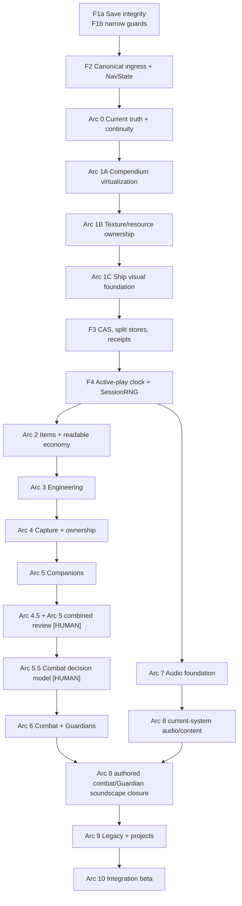

# Celestial Frontier v2 — Complete Program Roadmap

> **2026-08-31 current terminal-green develop-admission overlay (canonical handoff in
> `../ROADMAP.md`):** exact clean signed source
> `580c99a952c4e06acb776c852b6c5c0edba4722e` passed tracked-input develop at **255 files /
> 2,576 passed / 1 skipped** and every TypeScript/art/route/specification owner. On unchanged bytes,
> Compendium passed **78/78**, Slice passed with zero findings and ten screenshots, and
> predecessor-bound Glass passed **12/12** viewports plus **104/104** controls with zero findings or
> instrument failures. Every stage ran once/no-retry and every exact named verifier passed.
>
> The bounded testing repair covers all eight fixture-staging paths with stable document authority,
> exact persistence polarity, one atomic invocation and zero-call-only rebind. No roadmap feature,
> product/save/gameplay/art/creature structure, EXEC history or HUMAN status changed; historical
> certificates are not rebound. Four exact PASS carriers in the signed evidence/docs descendant
> certify 580c99a only. No push, hosted attempt, merge, release or deploy is authorized.

> **2026-08-31 historical local a046 repair overlay (superseded above while
> preserving its dated evidence):** exact clean SSH-signed source
> `a0460c6aca37ca923768828cde876e449a76cff8` passed Compendium **78/78** once/no-retry in
> **64,166 ms** as `20260831155807329-24237-1c6d2e89d5`; exact named verification passed. Its
> exact-source develop Slice `20260831155943782-24588-a98f13f2c7b7` stopped terminal red
> once/no-retry after **359,647 ms** with exactly **1 finding / 1 scope**
> (`world-identity-collision-controls-failed`). Named verification correctly exited 2; Glass did
> not run and a0460c6 will not be retried or relabelled.
>
> The complete collision product outcome was green. The sole red was an inert evidence mutant:
> newest-first Atlas rows were **[Beta, Alpha]**, while measured Travel receipts were fixture-ordered
> **[Alpha, Beta]**; row index 1 therefore assigned Alpha back to Alpha. Exact SSH-signed repair
> `23eb6dabeaf40cf0bc7878272b4f4893ad422113` takes the distinct measured sibling identity,
> guards missing/equal/no-op carriers, causal-stops after a genuine collision failure, and
> executable-tests the reversed row order. It changes no product, creature, genome, painter,
> organism, plant, biome or art structure, gameplay, reward, save schema, timeout, retry, ruler or
> Edge baseline. Focused coverage is **1 file / 6 tests**, all three TypeScript programs pass, diff
> hygiene is clean, and independent review is **CLEAR**. **A New Foundation** remains **77** bullets
> with rendered ordered SHA-256
> `11483b3d1e9c2760a00354e6511a27889e62a4f092ee6847589dc1b7a0bfb2c1`.
>
> The complete develop profile is green at **253 files / 2,561 passed / 1 skipped**, **34** art
> sources, **1,014/1,014** routes and **454** non-inert fields. Current Compendium producer/budget
> authority remains `8d0600bbe98ff786818f05d3dff4f1b8da7dd9703863a9575df026b91755ca2b` /
> `e9c978bfdb885da8cbc6002c0f9af416d96120ca26a617b3758b898652b85a01`. A clean signed
> documentation descendant and one unchanged-source **Compendium → Slice → Glass** develop chain
> remain. SceneMemory is production-only. No hosted attempt, push, merge, release, version bump,
> publication or deployment is authorized.

> **Historical local PR #35 battery/right-sizing and Arc 4 shared-ledger boundary (2026-08-30;
> supersedes the historical current overlays below):** exact clean signed source
> `d611d18ad12bb8587863846ef3799300d2396e6a` first passed Layout 787/787, SceneMemory 44/44 and
> Compendium 78/78 before a five-scope Slice oracle red. Signed successor
> `7f89bb2a70604da5b79673bd22d25786cab468d2` passed the right-sized tracked profile, conditional
> heap/launcher controls, SceneMemory 44/44 and Compendium 78/78 once/no-retry. Its unchanged-source
> Slice stopped after 159,754 ms at exactly one causal Tame-audio fixture scope; Glass and Recovery
> did not run. This proves the earlier causal-stop repair worked. Every Tame/audio/action/classifier/
> mutation/reload result was green. Pertar action readiness owns boot receipt 0, Survey 1 and Landing
> 2; first Sample owns Capture receipt 3 / revision `R+1` followed by required Arc 9 progression
> receipt 4 / final revision `R+2`, adding `rare` and `legend` while best rank remains 3.
>
> The sole 7f red was another overfit evidence term: Sample and Tame have byte-identical invariant
> Landing facts, but their different complete source states legitimately derive different
> `stateSuccessorSeal` values. The current contract requires the full witness bytes to match one
> invariant template after substituting only one canonical lowercase SHA-256. Both retained real
> variants pass; malformed seals and changed causal fields fail. It neither allowlists observed
> hashes nor duplicates the private product codec. That repair changed no product/app, schema,
> creature/genome, art/audio, timeout, retry, numeric ruler or Edge-version baseline. Signed successor
> `961d1071d059e0f73e14a6a4ead61f5e4696535b` then passed the same tracked profile, SceneMemory
> 44/44 and Compendium 78/78 once/no-retry. Slice reached Arc 4 Storage and stopped after 171,033 ms
> with exactly one generic timeout scope; Glass and Recovery did not run. Because the old runner
> discarded its arm/target/coordinator/product/raw/UI state before classification, this proves
> neither a product failure nor valid setup. Signed successor
> `656c85e43a59fe775efac102b21a7530c033e5ff` passed the same tracked profile, SceneMemory 44/44
> and Compendium 78/78 once/no-retry. Its Slice stopped after 160,092 ms at exactly one
> `arc-4-storage-precondition` scope; Glass and Recovery did not run. The repaired runner proved
> native
> target/focus/coordinator readiness before arming, requires both the hook return and visible latch
> before input, focus-gates dispatch, retains ordered pre-arm/post-arm/post-press/deadline state plus
> terminal durable/UI/interaction evidence, supplies real wait/capture errors to the existing
> assessor, and fail-stops later Arc 4 work. It retained Sample + Arc 9 durable at revisions
> 108/109, 15/16 Yield, current Arc 4/5 and idle coordinator/card/hold/fault state, then stopped
> before hook arm or input because Tame remained model-disabled. This is no storage verdict.
>
> Source tracing isolated one presentation race: Capture repainted read-only while the queued Arc 9
> follow-up legitimately owned the coordinator, but Arc 9 released without republishing the still-
> open card. Pertar still had nine eligible fauna and canonical next action Tame. The bounded local
> successor releases product/coordinator/persistence authority first, then republishes only the same
> current visible writable non-Training Capture surface; replacement, convergence, ecology,
> Training and publication faults remain fail-closed. Focused source/mutation plus immutable replay
> evidence is **3 files / 7 PASS** and all three TypeScript programs pass. Capture pools, Yield,
> RNG, ownership, creature/genome, save schema, art/audio, timeout, retry and browser rulers do not
> change. **A New Foundation** now has 75 unique bullets with rendered ordered SHA-256
> `52db4f0084c100980d98ae6b847af2ffc0cbbd7430758b77a14b56bb83eac6e1`. The exact 656 right-sized
> develop profile is green at **253 files / 2,510 passed / 1 skipped** plus all three TypeScript
> programs, art/route/spec gates; its 2,510 assertions are one roughly 23-second process, not
> thousands of jobs. Compendium's 591 ruler mutations are conditional on production or changed
> instrument inputs, specification controls are folded into the normal command, and Recovery plus
> package smoke are production-only. The classifier closure now includes the directly imported
> sealed-worker graph helper, so its rare changes cannot skip the conditional Compendium controls
> while ordinary gameplay work remains on the smaller path. A changed clean successor still requires one fresh unchanged-
> source SceneMemory → Compendium → Slice → Glass develop chain. No HUMAN, hosted, merge, release,
> version or deployment
> authority follows; exact carriers and hashes are in `audits/README.md`.

> **Historical exact-`8bdf474…` Arc 0 publication-oracle boundary:** exact clean signed source
> `8bdf474e92467652729a6980f706ca3a2813682c` passed Compendium 78/78 once/no-retry, then its
> unchanged-source Slice stopped terminal red once/no-retry with one impossible Landing oracle:
> the held product correctly retained the open post-Survey card while the stale predicate also
> required it closed. Its immutable FAIL and missing historical held capture remain preserved;
> Glass and Recovery did not run. The later repair changed no product, timeout, retry or ruler.

> **Historical signed universe-polish + bounded Arc 5 Feed automated certificate (2026-08-29):** exact
> signed source `3f69e88ea8e34fdb8d9913276601b426ada783ae` (tree
> `df10355a81c21fc6a553c7fa5684b08399bce6d8`, parent `916d921ebf78…`) stayed committed, clean
> and unchanged through one serial **Layout → SceneMemory → Compendium → Slice → Glass →
> Recovery** campaign on Edge `151.0.4129.107` / CDP `1.3`. Layout passed 787/787 in 76,603 ms;
> SceneMemory input-v4 passed 44/44 in 10,561 ms; Compendium passed 78/78 in 46,239 ms; Slice
> passed in 434,263 ms with zero findings (`33aa30b3…`); Glass consumed that exact Slice and passed
> all 12 viewport classes in 85,823 ms with zero findings or instrument failures (`2a67a258…`);
> Recovery consumed both exact predecessors and passed all ten stages in 1,290,953 ms with a real
> uninterrupted 1,200,297.5 ms active-browser observation (`b78e8a52…`). Every stage ran once with
> zero automatic retries and passed its exact source/predecessor-bound verifier. At that checkpoint,
> the full v2 battery was 163 files / 1,712 passed + one skipped, and all TypeScript configurations were green.
>
> For that exact source, this is the complete historical automated certificate for the universe-wide visual treatment and
> bounded Arc 5 Feed scope. It is not HUMAN visual, listening, screen-reader or first-journey
> judgment; physical-device heat/battery/true-GPU evidence, Gate G distant playback and D-9e remain
> open, as do whole Gates A–I. It grants no hosted attempt, merge, release/version or deployment
> authority. Exact carriers, sizes and hashes are preserved in `audits/README.md`. Edge point
> version is provenance only; compatible updates never trigger rebaseline or recalibration.
> Earlier Final13/Final12/Final11/Final10 wording below is historical where superseded.
>
> **Earlier local Arc 4 checkpoint (later than `3f69e88…`):** first durable successful capture on
> each exact source-proven world beyond Sol can bank one Chapter 2 life-discovery tick atomically;
> all non-qualifying paths leave Charter state and chapter reconciliation untouched. Parent-aware
> reach rejects same-seed/wrong-coordinate galaxy or star collisions in capture and Search travel.
> At that checkpoint, the final full browser-free battery was 230 files / 2,315 passed + one skipped
> with all three TypeScript programs green. `compendiummem:selftest` passed 222 independent controls;
> the authority printer exited 0 and then-current-authority tests passed 45/45. Producer bindings at
> that checkpoint were current without changing numeric rulers or historical
> samples. Fresh exact-source browser evidence and HUMAN acceptance of the deliberate D-ARC4-BIOSCAN
> deviation remain open.
>
> **Current local Arc 5/6/8/9 successor (later than `3f69e88…`):** Arc 5's successful Breed now
> grants the child +2 XP and, for the first successful canonical unordered species pair, another +5.
> Stable species identity and imported v1 pair-claim evidence prevent rename, parent order, reload or
> archive rollover from re-arming the claim. The exact verified Arc 6 settlement
> now opens one accessible timed Combat Chronicle with named transcript rows, two native HP meters,
> statistics/result, silent Skip completion and plain-text Share/fallback. The complete registered
> transcript cue inventory uses the master-Sound-governed combat bus; Creature Voices does not gate
> it. Recorded assets and authored ambience/music remain absent. Live captured Guardians/Titans now re-enter that same
> combat forecast/settlement/Chronicle/audio path through a separate `arc6.guardian-companions`
> XP/injury/tombstone overlay rather than Arc 5. Fatal defeat is permanent; tombstones remain absent
> from the combat roster and composite Compendium across reload/Training/capture reconciliation,
> while Prime claims stay independent. Settings also owns identity-only Explorer self-rename;
> valid-world Share and accepted-CF1 Follow add the `share`/`wayfarer` event owners and exact
> compatibility counters/routes. Survey adds twelve source-derived joins; direct/accepted arrival
> and wormhole traversal add `quasar`, `dwarfg`, and `worm`; explicit Atlas Favorite adds `curator`.
> Accepted Follow folds route, Jumps, galaxy visit, `wayfarer`, and any proved galaxy-kind event into
> its one receipt. Twenty-three event rows are now live; exactly `daily`, `decade`, `survivor`,
> `fieldmedic`, and `gambler` remain owner-blocked. The Charters board now owns two progressive
> Starter chains with one next-link reveal, explicit Accept and a three-active cap; live Landing,
> Mine, fixed Fabricator, Field Scout and verified Conquest deeds settle their established 10–25
> Stardust and supported gear atomically, while bioscan and weekly authority remain protected.
> Records now owns six Binder type pages and seven current-proof 25–150-Stardust Set claims, while
> the Fifty Paragons remain visible/protected. Achievement and rank-promotion ceremonies present
> only after exact committed publication and stay silent during boot, replay, Training, convergence
> and refusal without writing or rewarding. Prime Codex presents all nine established Signature
> rows and the five established Frontier endings; Balance keeps its three-conquest, Electric-
> Signature and 40-species predicate, choices cannot be overwritten, and unknown imported endings
> remain protected. These
> successors have focused browser-free evidence only; they do not relabel the older signed browser
> certificate or close HUMAN/whole-Gate work.
>
> The signed SceneMemory input-v4 contract requires 44 outcomes. Its two new
> phone/desktop `surface-vista-lifecycle` outcomes bind worker-active, mounted, cache-entry and
> cache-pixel diagnostics through cold, surface/ascent, BFCache and reload-clear/replacement cleanup
> at a fixed one-entry / 412,800-pixel ceiling. Exact run
> `20260829-universe-polish-3f69e88ea8e3-scenemem` passed 44/44 with complete cleanup inside the
> historical serial certificate. Every Final13 42/42 statement remains exact historical evidence for
> its older source/schema.
>
> **Current-local PR #35 repair and signed-evidence chronology (2026-08-30; later than the signed
> certificate above):** consumed hosted
> run `33278630671` tested exact head `017fa6decbc41809188768ccdb98ab86ef1b9ebc`; every predecessor
> and SceneMemory control passed before the one-attempt phone product stage stopped at **Earth
> planetfall was rejected**. Compendium, Slice, Glass and later browser stages correctly did not run,
> the run is not retryable, and no replacement attempt is authorized. The local repair makes the
> one-call Survey → Landing handoff drain the pre-existing route barrier, start Survey once, drain
> Survey's replacement barrier, require that exact settlement to return true, then invoke Landing
> once. A synchronous refusal or later durable false stops before Landing. F4 now compares committed state with an
> owner-minted canonical prediction using the exact registry snapshot and checked `codecNow` that
> the same commit uses. PWA worker/shared-worker entry fetches inherit their initiating document's
> exact build through `resultingClientId`; retention scans all client types and confirms omitted
> clients with `clients.get()` before pruning a pin. SceneMemory records bounded biome-vista fault
> causes, fails closed on malformed diagnostics, distinguishes stale replies from current authority
> mismatches, and navigates to a minimal ephemeral second origin for BFCache so the product service
> worker cannot capture the fixture. The SceneMemory contract remains **44 outcomes**, all numeric
> rulers and historical evidence remain unchanged, and every `[HUMAN]` criterion remains open. At
> that earlier hosted-stop boundary this was current-local repair state, not a clean exact-source
> certificate; see
> `../audits/PR35_SCENEMEM_FAILURE_DIAGNOSIS_2026-08-29.md`.
>
> The same repair batch now closes the fixed browser-resource roots exposed after that product-path
> repair. Route-invalid Survey presentation destroys its controller model, listeners and DOM;
> Compendium, Capture, Combat and ecology controllers own listeners only while attached; and all
> registered panel openers share one capture owner plus one bubble-toggle owner. Guide and release
> archives are lazy chunks with loading/failure/retry UI and both request-generation and visible-
> panel publication fences. The 132px species worker result remains immutable data-URL evidence,
> then becomes a window-owned revocable Blob URL before broker caching; 440px portraits remain data
> URLs. Live leases protect visible art, every reject/drop/duplicate/evict/final-dispose exit releases
> external ownership exactly once, and at most the 17 most-recent unleased thumbnails remain warm.
> The earlier dirty exact-budget diagnosis has since advanced to clean signed evidence. Exact source
> `2046000873f98318c767db53d2ffb2abac71cc94` ran SceneMemory once, with zero retries, as
> `20260830-pr35-fixed-second-2046000-scenemem-certification`; all **44/44** outcomes and its named
> exact-source verifier passed. Its immediately following Compendium run
> `20260830-pr35-2046000-compendium-certification` stopped once without retry at **76/78**. Only the
> phone and desktop `warm-precondition` outcomes were red: the truthful settled state held eight live
> Planetside leases plus 17 unleased warm thumbnails, 25 total, rather than filling the obsolete
> 96/256 cache-capacity assumption. The result is immutable diagnosis, not a pass.
>
> Signed child `3fb958f859ff0ea28b4e8bb720adaea98ad3c001` then ran exact Compendium attempt
> `20260830-pr35-quiescent-3fb958f-compendium-certification` once with zero retries on Edge
> `152.0.4191.53` / CDP `1.3`. It stopped terminal `instrument-fail` at phone Planetside settlement
> after 32,946 ms: 585 ledger observations included 577 on-time value observations and timely
> heartbeats, but the old collector collapsed the terminal observation to generic `null`. Therefore
> all 78 outcomes were blocked, only one partial phone profile exists, and no desktop profile or
> outcome/review PNG exists. No successor stage ran. This is instrument evidence only, not a game,
> Edge-version, numeric-ruler, HUMAN, merge, release or deployment verdict.
>
> Signed source `b2eecfbd9379f50c25208ca8bcd72501b07e303c` then exercised the structured
> foreground/settlement-history instrument once with no retry as
> `20260830-pr35-settlement-evidence-b2eecfbd9379-compendium-certification`. On Edge
> `152.0.4191.53` / CDP `1.3`, it stopped terminal `instrument-fail` after **33,041 ms** at phone
> veteran-Earth Planetside settlement. Eight distinct rows were ready, decoded and exactly 132×132;
> only their `visualKey` projections were `null` because a generic 512-character v1 projector
> rejected the real 766–779-character canonical identities. Zero outcomes were judged, all 78 were
> blocked, and desktop and all successors remained not-run. Its exact carrier and historical
> `326d3b…` / `7ac505…` / `ece4ed…` / `c272a1…` authorities remain bound to that red.
>
> The current browser-free repair binds each foreground turn to exact target/session/document
> authority, activates and focuses that attachment, and accepts only a real animation-frame to later-
> task turn within one 5,000 ms phase deadline. Versioned receipts retain exact phase timing,
> expected/observed identity and successful document-global cleanup; complete measurements add
> independent lazy/main page authorities. A failed foreground claim cleans its globals/listeners and
> disables focus emulation for the attempted attachment without replacing the primary classification.
> Structured thumbnail observations retain raw and diagnostic identity, image/source/decode/
> dimensions, art/lazy/worker/broker and page state while Node recomputes bounded readiness reasons;
> null or non-object page output cannot mutate the settlement record. One exact **85-phase** plan per
> profile covers **75 list** and **10 Planetside** phases. Every accepted semantic invocation is
> appended with contiguous attempt and exact token/page/browser/command/timing authority before the
> 85-entry latest projection is inserted or replaced; each latest entry must equal its plan group's
> final history receipt. Partial schema v6 retains diagnosis, full accepted history and the latest
> completed prefix plus an active next-phase or latest-phase-retry tail. Terminal verification rejects
> omission/reorder and coordinated attempt/token/history/page/browser/command/timing laundering.
> Partial lazy/main page authorities are independently bound and distinct whenever both exist; each
> semantic deadline group retains exactly one terminal poll command. The command ledger fails closed
> above **2,048 entries or 2 MiB**, tokens cap at **256 characters**, and a ready-but-unreceipted tail
> requires the exact receipt-assembly instrument diagnosis.
>
> Signed implementation commit `d9d79025794c95d5491ab9c9e1139b66eea7be5e` (tree
> `d4bc3a04bec6243045a6941feadd9074a7722e79`, parent
> `b2eecfbd9379f50c25208ca8bcd72501b07e303c`) changes no product byte. Observation v2 validates
> each complete opaque key only in the page realm and serializes bounded key length plus exact
> indices into independently produced leased/cache inventories. Both inventories cap at exactly 256
> before `indexOf`/`Set`; each image must satisfy membership/distinctness, each inventory length must
> equal its live lease/cache count, and each inventory must satisfy internal distinctness. A literal 256-entry inventory passes, a 257-entry inventory
> errors explicitly, and realistic
> 768–831-character keys pass. At that historical observation-v2 repair boundary, the commit owned
> the authority tuple: capability SHA-256
> `35eb09daa39f211b8e9015f59b77a983b5870611322d673c47f7ff4f2b61e341`, measurement
> `87d6782ad7d4ceaed3222eef8d2740dfe964db6d02b628fa2c3e125eaea6d06d`, contract
> `abedc70f6ffcd3130445f4a5e1681ba7a2607210fbb9e6f3522ac8a7ab752138`, collector
> `b75f426541982bc431c01f127c3410a1030ef0fd51f849e1833d492313025f4e`, budget
> `7efe9fa86075e33518020d41e7cc48bf9b2bc75ecb7ed9c0e074bd84c4d74200`, and unchanged producer
> `0de7dc1a95ceeb35738d4cb17e7ccd464aab947848a9fe643e7c69355836bf13`. Browser-free closure was
> green at **565** `compendiummem:selftest` controls, focused **35/35**, **237 files / 2,413 passed +
> one skipped** for the full v2 suite, all three TypeScript programs and the producer-authority
> printer with both budget matches true; independent review was clear. Those browser-free checks
> certified no browser result. At that boundary the next evidence action remained exactly one fresh
> clean exact-source Compendium run with no retry and named verification.
>
> Exact signed source `830e601b8f16092d6f9193ecde329cfefd279bcd` then ran
> `20260830-pr35-visualkey-v2-830e601b8f16-compendium-certification` exactly once with no retry on
> Edge `152.0.4191.53` / CDP `1.3`. All long visual keys worked, so the prior observation-v2 key-
> evidence repair succeeded. The run stopped terminal `instrument-fail` after **33,217 ms** at
> phone `veteran-earth-planetside`, with zero outcomes, all **78** blocked and no successor. Its
> structured evidence identified the first lazy painter import as failed, but the old v1 worker
> diagnostics discarded the exact error code/message; none is invented here. Immutable carrier
> `audits/ARC1C_COMPENDIUM_PR35_WORKER_IMPORT_INSTRUMENT_FAILURE_20260830_830E601.json.gz` is
> **7,357 gzip bytes** / SHA-256
> `90d61baeee297041a2afc7bf776fb504c5ac803140cf0613785859714c5f2aa9` and **54,172 raw bytes** /
> SHA-256 `ef3cec79cf181323705d8a9eff82d9bb8023275590a23a0589515248e626d6b5`; independent replay lives
> in `port/v2/tests/compendium-worker-import-failure-carrier.test.ts`.
>
> Deterministic harness evidence reproduces the code-supported first-activation claim gap and exact
> 503 `This document has no retained Celestial Frontier build.` The local product repair re-runs
> all-client pin reconciliation inside the post-claim activation barrier. Species diagnostics v2
> retains bounded trusted `lastError`; a later adapter protocol/external fatal clears stale
> `lastError`, while a replacement producer clears both `lastEvent` and `lastError` and trusted
> worker-fatal evidence remains. Compendium
> observation v3 immediately classifies a current trusted product error as `product-fail` with no
> retry only when broker, art, lazy-worker and worker diagnostics are complete and the art/lazy
> schemas are exact. Malformed worker-error ownership is rejected unless `jobId`, `kind` and `key`
> are either all null or all present; recovered cumulative telemetry remains nonterminal.
>
> The exact `d33abdfd…` terminal-red input's independent review closure made Compendium producer
> authority history-safe schema v2. It bound generated `service-worker.js` plus index, owner, worker
> and painter; a service-worker mutant changed that authority; and historical v1 reports replayed
> unchanged. Its measurement / outcome contract / collector / producer-v2 SHA-256 was
> `e6aba53d75c17669f4bc8893770023c849d4ed23edb6be36eb938f4491e17e97` /
> `2c751b866ca40fc8e4593dda82d19eb62ca4ff804caffc7531228128b480af21` /
> `2a74e941abbe701ca5c1d3952a7451ccd11ce3284d794f9e22aa0a79c0315237` /
> `2ef58ea042d2d5ecb97715642efeac14e013dfb8b375406cfb47c090cf072e39`; generated service-worker
> SHA-256 was `81dca3977138d0973b52e85c0c82b6636674088546463edb136ec64640b78a14`.
> SceneMemory build authority at that boundary was
> `49bc3ce0529eab7af1dff496c09fb79f08d5ad9e7ab4f1b7a05fc8d2e0d13dfc`; its exact `2046000…`
> certificate remains immutable historical evidence.
>
> Browser-free closure at that boundary passed **589** Compendium selftest controls, worker **20/20**, the
> focused authority/PWA/worker/budget/carrier run **96/96**, and all three TypeScript programs. This
> preserved the canonical **73-bullet** release inventory; the full browser-free suite passed **238
> files / 2,423 passed / 1 skipped**. This was local input closure only,
> not a fresh Compendium certificate. The fixed Compendium ruler,
> numeric ceilings, historical samples and thresholds remain unchanged.

> Exact signed descendant `d33abdfd513236e72294b81e3bb46b1362f810e1` then ran
> `20260830-pr35-first-install-d33abdfd5132-compendium-certification` once with zero retries on Edge
> `152.0.4191.53` / CDP `1.3`. The complete run judged all 78 outcomes at **74 pass / four fail**:
> phone/desktop `cap-shrink` and `settled-jobs`. Both profiles in fact proved exact 256 → 96 cache
> shrink, 6,690,816 decoded bytes, 160 disposals, four sealed warm cycles, restored device class and
> released/balanced worker lifecycles. The shared false clause required the deliberately induced
> paint fault's non-null `lastError` to remain after replacement recovery. The report remains
> immutable red and was not retried; no Slice, Glass or Recovery successor ran.
>
> Current released-worker acceptance requires `lastError === null` on every selected current-v2
> released/recovered snapshot, including non-final and post-cap samples, while exact cumulative
> paint/phase/result arithmetic continues to prove the induced fault. A terminal current product
> error still requires its exact non-null trusted receipt; historical v1 remains replayable. The
> immutable 451,743-byte gzip / 10,813,681-byte raw carrier has SHA-256
> `4e714e115ca7f4b5d1d32ba118241ca8b78055596438a4dd22bbb1c1d471ffab` /
> `e4eb2aba1079a1d42b1da5e7f97d236105917fd497035937b1f6855d63a4289e` and passes independent
> replay 8/8.
>
> At that recovered-worker repair boundary, measurement / outcome-contract / collector / producer-v2 SHA-256 was
> `fc54f822dc7f93481fbb1402b7c7940bc9a618b836112fd5514e8130de9f29ed` /
> `f756bc7557613dd6c61ecb35acd9de752d54a7d0e51a52e192f361dca3f4ab29` /
> `2a74e941abbe701ca5c1d3952a7451ccd11ce3284d794f9e22aa0a79c0315237` /
> `2ef58ea042d2d5ecb97715642efeac14e013dfb8b375406cfb47c090cf072e39`; generated service-worker
> SHA-256 was `81dca3977138d0973b52e85c0c82b6636674088546463edb136ec64640b78a14`.
> That repair coverage passed **591** Compendium selftest controls, independent **8/8** carrier
> replay, the full **239 files / 2,431 passed / 1 skipped** suite, all three TypeScript programs and
> the green authority printer. Fixed rulers, numeric ceilings and the 78-outcome inventory remain unchanged.
> It remained uncertified and required a materially changed signed source for any new no-retry
> Compendium attempt.
>
> Exact signed source `38d8848c984089d33f4bafa1043e36c2cbb2ce9e` then ran
> `20260830-pr35-recovered-oracle-38d8848c9840-compendium-certification` exactly once with zero
> retries on Edge `152.0.4191.53` / CDP `1.3`. It stopped terminal `product-fail` after **3,115 ms**
> at phone `veteran-earth-planetside`, with zero outcomes, all **78** blocked, no desktop profile,
> no review PNG and no Slice/Glass/Recovery successor. The immutable carrier
> `audits/ARC1C_COMPENDIUM_PR35_PAINTER_IMPORT_PRODUCT_FAILURE_20260830_38D8848.json.gz` is
> **6,053 gzip bytes** / SHA-256
> `e45b2f65cc93ad717524d52ebddfdd504e2abedf5296d6d5aa287e949be968aa` and **37,825 raw bytes** /
> SHA-256 `63014b6dfea3790fe3618344bdf8d5b31de68e1ac54798f5fe80b5a41092ccf5`; independent replay is
> **4/4**.
>
> The first repair treated that failure as an execution-late first-install realm omitted by both
> `matchAll` and claim, then attempted to adopt an unpinned lazy request only when `clients.get()`
> resolved its `clientId` to a live worker/sharedworker under the sole active build. Unknown clients,
> windows, prior pins and wrong-active states retained exact 503 refusal. At that adoption boundary,
> focused closure passed **4 files / 74 tests**, typecheck was green, and the full browser-free suite
> passed **240 files / 2,437 passed / 1 skipped**. Those results remain historical browser-free
> evidence; they did not certify the repair in a browser.
>
> Exact signed descendant `dc6004cf4426df72bea141ac77b0be927f36886c` then ran
> `20260830-pr35-execution-late-dc6004cf4426-compendium-certification` exactly once with zero retries.
> It stopped terminal `product-fail` after **3,112 ms** at phone veteran-Earth Planetside: zero of 78
> outcomes ran, all **78** were blocked, and no desktop profile, review PNG or successor browser gate
> ran. Immutable carrier
> `audits/ARC1C_COMPENDIUM_PR35_EXECUTION_LATE_PAINTER_IMPORT_PRODUCT_FAILURE_20260830_DC6004C.json.gz`
> retains raw / gzip SHA-256
> `c48e48a5385799bdf4535bf97b7bacf545b24182998978067b68c9bb08f27a38` /
> `2e65494085d46cf4b68b62d3df58884b22b9d5a5c9ad1378c018a73c036f6b53`; replay is **4/4**. This
> exact result falsified fetch-time `clients.get()` adoption as a complete product repair. It remains
> historical red evidence and must not be retried unchanged.
>
> Current repair removes fetch-time adoption rather than broadening it. Species-art and biome-vista
> `Worker` construction remains lazy at the Window boundary, but each production entry seals its
> complete module graph into one exact content-hashed JavaScript response. Production rejects any
> runtime `import()` or external static JavaScript import edge. Exact owner pins, worker-entry
> `resultingClientId` pinning, post-claim reconciliation and cache-only selection remain; an unpinned
> non-navigation request still fails closed instead of inheriting or guessing a build.
>
> Current measurement / outcome-contract / collector authority is
> `5c408472b808f09e9f31133905635f08b7ef3588fad151f5f68e2a67ff68b1d0` /
> `9fc43fe4d29453ec4b546a53a2e62bc874499c67bae9f0f0f4c33e8063c41828` /
> `0af0f5884c0eec67cea7c6696c20a2c691c669fa93ee255fd1c54d17b56d5010`. Final derived changed-head
> producer / index / owner / service-worker authority is
> `f2f1629a98962801a740d0448d955d08c1ccd9157149edb42169bf0a317e43f3` /
> `45fc756d924fabd03b3b214e0fd80697e463c59a686a190fcee2b076d05de27c` /
> `assets/main-BYnoCcc9.js` (`13afe063806bca9b829866070c08741ea0749ca07c1d7dcecf3175c1dae9bfa5`) /
> `5a968f36984021e39a0cb9e70b2ec37b607563c08a29240b078b828f3d0607d3`. Scene build / game-main is
> `9351f6fc2311365a5dfc8a4c0b0629d862d7c91f6cd00a83e236b1ce824a6e17` /
> `07bdf8aac9bd8224870f2749df18461576d733c55555698dd247ddeffb83f831`; Compendium / Scene budget
> files are `c4f6dddffdf88e42819c567c26132a66f3924a7423002cbfca4564e2defb9d0b` /
> `670f8ecc2c0bc5715fb92b263820db577a70c3faf254151ff11f45de8fe645f7`. The unchanged worker/painter
> remains `25519cabdf0963bdc722b591855e7c7fdaaecbead63fdfa2d499bf35382f7172`; the green printer binds a
> **964-module / 52-file** build.
> Fixed rulers, ceilings and 78 outcomes remain unchanged. The current **74-row release inventory**
> adds the Engineering keyboard-focus repair note and retains the CF1 row's sequencing truth.
>
> Exact clean signed successor `941ba45a96e5baabadc255d53db86fa935cefe81` then ran
> `20260830-pr35-sealed-worker-941ba45a96e5-compendium-certification` once/no-retry on Edge
> `152.0.4191.53` / CDP `1.3`. Compendium passed **78/78** in **65,731 ms**, completed both
> profiles, emitted all six review PNGs and passed exact named verification. Immutable report gzip/
> raw sizes are **452,127 / 10,881,302 bytes** with SHA-256
> `e6f2aa4dfcbf94830f3c0059a8e64239956ac0d2e0685c8e267a338faba2f6f8` /
> `d4b2b2aa07f3b1f4a70903d4d8ae82abe1eaf755523a51d7ecc85d1e610c109b`.
>
> The exact-source Slice `20260830115041916-36220-7ed2dd2ef398` ran next exactly once with no
> retry and stopped terminal red after **63,106 ms**, with **63 findings / 42 scopes** and six
> partial screenshots. The first **62** are Guide/Release instrument drift from both synchronous
> reads of the preceding DOM before deliberate microtask publication and stale
> 26-partial/15-unavailable plus player-copy expectations rather than current 9/41/34/7 authority.
> The independent final finding is product-red named-CF1 Follow starvation after accepted custom-
> world naming.
> Glass and Recovery did not run. The immutable Slice JSON is **40,180 gzip / 522,130 raw bytes**,
> SHA-256 `c7b314352c65e5dd24120eb5982a78e87a899f488a78e3c205156a2e134eedad` /
> `65917019eeb8c74d258b89ab793ad13db2fc2619da1f21d7b0b2b6550e44c07d`; its log is **19,473
> gzip / 253,140 raw bytes**, SHA-256
> `d5321f9ea85d949f32f6b688ddbc11b8638ae6e776a97feb6502b7ca392416f9` /
> `c54bd170a95eedf884bf591dd4c17241a1460cfcde7dc3a79cfa32bcdc56113c`.
>
> The bounded current repair makes Guide/Release probes await exact requested DOM identity and binds
> the canonical **9 categories / 41 unique topics / 34 partial / 7 unavailable** mapping with
> bidirectional publication, mapping, stale and mutation/restore controls plus current gameplay
> copy. Product-side, the custom-world name transaction no longer starts aggregate catch-up before
> the route. Direct Travel owns its accepted route/arrival and source-proved galaxy-event aggregate;
> Follow additionally owns Follow/Jumps/wayfarer. A post-name route that refuses or does
> not join progression queues exactly one catch-up after naming settles. A synchronous reservation
> defers/coalesces ordinary save checkpoints and re-arms one after the route/catch-up enqueue; exact
> heartbeat/lifecycle owners retain their private boundary. Timeout remains diagnostic; no sleep/
> retry was added. No
> unrelated gameplay system, creature, genome or save-schema structure changed. That historical changed head had
> no complete browser certificate,
> so Slice → Glass → Recovery, HUMAN, hosted, merge, release/version and deployment remain open.
> Edge point version is provenance only and never triggers rebaseline or threshold movement.

> **Historical exact `e4f5af4…` successor evidence and bounded F4 instrument repair:** exact signed clean source
> `e4f5af4bf628ee2f0b2485077e46dc0ff86b2b0c` passed Compendium run
> `20260830-pr35-slice-oracle-e4f5af4bf628-compendium-certification` 78/78 once/no-retry. Its
> unchanged-source Slice `20260830-pr35-slice-oracle-e4f5af4bf628-slice-certification` then stopped
> terminal red once/no-retry with four ordered scopes: F4 replacement, derivative Arc 3 Mine,
> derivative Mine controls, and the continued Survey harness timeout. Glass and Recovery did not run
> and have no successor authority. The three immutable gzip carriers and focused browser-free
> `pr35-e4f5-slice-oracle-evidence-replay.test.ts` retain that exact chronology; the earlier
> `ae2a002…` eight-scope evidence remains historical.
>
> That changed-source F4 repair uses native trace-v3 to inventory every readwrite first observed
> before replacement completion and require exactly one settled eight-store IndexedDB replacement;
> it then freezes before the required later lease-release CAS. It observes every
> available object-store request method and index access, then requires the exact 13-call
> get/clear/put/delete ledger, keys, argument/store
> shape, empty index inventories, native request results, revision/lease fences, replacement rows
> and journals; hidden add/cursor/index work and successful pre-completion subset/superset side
> transactions are red, while the post-completion lease-release control stays green. Independent
> expectation-v2 retains the current/ready boot split and binds strict production-codec projection
> SHA-256 `e40a542553ab61a1f9c5800e856a8f1e3c5efd341fdb73dec776d622258bd31c` while allowing only
> the bounded export anchor and exact conquest/mined-world ages to move; route, Atlas and unrelated
> product state remain exact. Red setup stops before import, red prefix stops before its diagnostic
> outcome, and red outcome/control stops hide and Arc 3. Focused F4 contract and evidence-replay
> tests also bind a stopped/settled exact-document heartbeat before staging/arming. No sleep, retry,
> timeout increase, rebaseline or
> product behavior change is introduced, and no Slice/Glass/Recovery, `[HUMAN]`, hosted, merge,
> release/version or deployment gate closes.

> **Status:** comprehensive planning baseline, created 2026-08-14; implementation state updated
> 2026-08-30.
> **Scope:** the complete approved v2 program—foundation repairs, product Arcs 0–10,
> premium visual/audio production, Gate A–I evidence, and release readiness.
> **Implementation status:** active, one bounded review branch at a time. F1a save integrity is
> integrated in `develop` at merge `a1dabdeb4059292d67d7a89652e92fb317d750c7`; Charter
> SCN-1/SCN-2/SCN-6 is integrated at merge `bd49beb0693b45fdd57d4acad746ade79843a91e`.
> UI-P1 registered panel-chrome dismissal is integrated at merge
> `b5e5d0a3b4bb4057fa6d251816454b370e8b2624`; the truthful WorldGen contract is integrated at
> merge `a50e593e2135f55ae8c37e6ece1f10c52701346b`; audio pre-initialization hardening is integrated at
> merge `44925f62abdfcdf9c17e512dd49a57a183e217ec`; the epoch persistence contract is integrated at
> merge `5171abcdc538938fdf5ac82688d1ab868da6ff48`. F2 canonical ingress and discriminated navigation
> finished at PR #30 head `24bcc3cbf4e76f7bb65a00e810e0eeeeb8d7c837` and is integrated at
> `b091f010011fa16bec457599b41274b7f92bb5e6`. D-TRAIN-1 is integrated through PR #31 at
> `38447019517147319bd08c598202d097ee866874`. Arc 1A then reached terminal-green hosted evidence:
> run `32462323775` tested exact head `c68aee241220dcb720cadb7fc55f7fbf99bde6fb` once without
> retry, and PR #32 merged into `develop` at `d4ab7e671959ab80198bed22bb600a26fc3524cc`.
> Its six-image Compendium `[HUMAN]` review remains open.
>
> Arc 1's automated implementation is locally complete. Arc 1B's exact historical source
> `79c605f9c7ab8b63ad082d852c38d66ad6bb11af`, v1 budget/workflow activation
> `e244c9e2342c6abd79ca4efcd3d26eb46d3d8910`, and one no-retry 40/40 local certificate remain the
> authority for the pre-Shipyard scene-resource boundary. They are preserved as Arc 1B chronology,
> not reused as proof of Arc 1C.
>
> Arc 1C product/ruler source `a4de5007ffc9131b8bc952a0a4cb469d9139039e` adds one pure normalized
> `ShipVisualState` shared by travel and presentation, a responsive read-only Shipyard with one
> code-native SVG/DOM preview owner and zero second renderer/RenderTexture, and the named
> `SurfacePlanetTextureAttachment`. Source `59530da3bf40965adf9c54f169b310e11ccdd0f8`, budget
> SHA-256 `3b71d14ca297ec4d536669d2edf960ac4d01671dd7a0c9eb11a2fb76e4fc43f7`, and local run
> `20260822-arc1-local-certification` are retained only as the historical Mac-derived 250 ms
> certificate. Hosted attempt 4, run `32618995487`, reproduced all 42 lifecycle/memory/ownership
> checks but finished terminal-red at 40/42: only phone and desktop answerability exceeded that old
> ruler on Linux, at 618–647 ms and 493–507 ms respectively.
>
> Historical cross-host SLA repair source `7d8dc380cd89ef53aac5a11c3850316e19e1aae9` binds
> `budgets/scene-memory-v2.json` SHA-256
> `5c8a6e7568e02d4e31501e4188dba57d3ac6e6ad183882b98ff9c68170771501` to the existing fixed,
> strict `<1000 ms` product answerability contract. Local no-retry run
> `20260823-pr33-cross-host-sla-certification` passed 42/42 under Edge `151.0.4129.101`, complete
> lifecycle/cleanup and exact named verification; report raw/gzip SHA-256 are
> `d16d40cd4d07f96683490eab920072fb9f3b42e0d0ee54434ffd4d312223f960` /
> `7c4100244abef8d50f93178aab7c8579ae93fa0b6bef76422cc5c0523edac55a`. Product, collector, and
> verdict-contract bytes are unchanged. That historical guarded battery installed exact Edge
> `.101`; the current ruler instead binds Microsoft Edge-family identity, CDP protocol/capabilities
> and complete per-run version/path/UA provenance. Compatible Edge updates do not trigger
> rebaselining. The workflow runs SceneMemory before Compendium and permits no retry. This local
> repair first gained hosted integration in terminal-green PR #33 run `32646110946`; later PR #34
> run `32681394532` also passed the same SceneMemory chain. No new hosted attempt is authorized.
>
> The v2 gate drives Universe, Galaxy, Galaxy fine, Sol, Earth Surface, the deterministic 1,500-row
> Compendium, and the real Shipyard on phone and desktop before settling back at Universe. PR #33
> passed terminal-green battery run `32646110946` and merged as
> `8998ffb77ca5b1f3123d7ea776c41db6e23bd24e`. The Arc 1A six-image HUMAN review, Arc 1C
> phone/desktop ship-readability judgment, whole-Gate closure, release, and publication remain open.
> This document does not authorize a release, deployment, version bump, or claim that an entire
> Gate is closed.
>
> **Historical PR #34 Compendium ruler boundary (2026-08-23):** runs `32665404776` and
> `32677088518` subsequently exposed two Compendium native-input ruler boundaries. The second proves
> the first activation/receipt repair worked, but after Close/reopen a one-shot owned row point moved
> across a deferred ResizeObserver/render turn. A
> passive wait issued 112 observations and ended on a clipped 51 ms command with a timely root
> heartbeat. Exact report raw/gzip hashes are `544015e9…` / `cc5ed778…`. Collector `6d681d19…`
> now repositions only through native scroll and requires the same exact owned point before and
> after a double-render plus thumbnail-settlement boundary before its one click. Measurement at
> that checkpoint was `6a961df8…`; former budget `208af955…`, samples, baseline and certificate are
> historical. Clean repair `a95889d…` produced three 78/78 candidates and the paired legacy baseline;
> activation
> `d21ba26…` selects active budget `faa160b3…` without numeric-ceiling widening and retains the
> 14-phone/13-desktop breach inventory. Exact-budget run
> `20260823-pr34-render-stable-row-certification` passed 78/78 plus named verification on clean
> `d21ba26…` (raw/gzip `42753d5e…` / `a2ff5b00…`). The repaired exact head then passed
> terminal-green no-retry run `32681394532` and merged normally in PR #34 as `7a9f4c1…`.
> A new hosted attempt still requires explicit changed-head authorization.
> **Review provenance:** the accepted PR #23 and HD-audio review inputs are preserved verbatim at
> [`../audits/v2-program-review-2026-08-14/`](../audits/v2-program-review-2026-08-14/).
>
> **2026-08-28 evidence boundary — signed Final10 reached offline reopen, whose phase-blind status
> oracle stopped instrument-only:** signed clean source
> `4405fb2b4ba7ef6898eb334330d7ef4300b5266c` passed Layout
> `20260828-phase4-final10-4405fb2b4ba7-layout` at 787/787, source-bound SceneMemory `…-scenemem`
> at 42/42, source-bound Compendium `…-compendium` at 78/78 with all six review PNGs, Slice
> `…-slice` with zero findings/scopes and ten PNGs, and full 12-viewport Glass `…-glass` with zero
> findings or instrument failures. Every green stage ran once and passed named verification.
> Recovery `…-recovery` then ran once with zero retry. Fixture, the complete 16-attempt burn-down,
> exhausted disabled-suppression, close/checkpoint and closed/offline proof passed before
> `offline-reopened` stopped terminal `instrument-fail` after 110,549 ms. Active observation,
> boundary crossing and recovered-state judgment did not run.
>
> The bounded product repair stacks Inventory rows into one min-width-safe column only at `<=360px`
> while preserving every field and 44px target. Compendium list mode retains the bounded virtual
> scroller and 58px sticky-Close gutter, but its heading no longer clears that already-reserved Close
> float. Its hostile-row oracle requires the exact logical row to be mounted and fully contained;
> overscan-only mounting stays red, and geometry is accepted only with that same reveal witness.
>
> Settings Sound and Creature voices are now independently revealed and natively activated. Two
> fresh node/geometry samples bind control, panel, bounds, Close, both scroll owners, containment,
> overlap and centre owner. Preparation, dispatch-time target and trusted touch/mouse receipt form
> one coordinate chain; exact state/focus follows the receipt; phase and outer restoration run in
> `finally`. Malformed, unsettled, transport or restoration evidence is instrument failure, while
> stable wrong geometry/ownership/state/focus is product failure. Stable missing Close is product-
> red; incoherent absence or node replacement is instrument-red. Viewport completion is credited
> only after four activations and restored-off settlement, separately from product-blocked coverage.
>
> Final8 remains immutable historical evidence for its green predecessor chain and fixture-order
> stop; Final9 remains immutable historical evidence through the complete 16-attempt burn-down and
> exhausted-control stop. Final10 historically superseded both, and Final11 historically superseded
> Final10; Final12 remains the latest immutable stored browser FAIL. Signed evidence checkpoint
> `2bf99bd…` preserves it; signed harness-only repair `5ab4d3e…` corrected its stale expectation.
> Exact signed Final13 source `7cb0969…` then completed the full once-only named-verified chain and
> real Recovery certificate, establishing the stable local Phase-4 automated checkpoint. Final10's last
> coherent reopened same-document UI → state sample observed the exhausted 16/16/0 cycle-0 budget
> while all three read-only/ineligible actions rendered `unavailable`; the old phase-blind oracle
> wrongly required the eligible active surface's `empty`/`depleted` vocabulary and stopped before
> the later durable-parity assertion. This is an instrument status-oracle defect, not a Recovery
> product verdict, offline durable-parity result or recovery claim.
>
> The local successor gives offline/ineligible and active/exhausted phases distinct predicates and
> binds each to exact document, authority, budget, row, disabled-semantics and runtime evidence. A
> candidate PASS retains schema-bound full Pertar receipts at the original active-exhausted,
> offline-reopened and reactivated active-exhausted phases. Terminal finalization and named
> verification independently replay and cross-bind their phase, document, cycle, facts, SessionRNG,
> state/UI and first-active-sample evidence; missing, swapped, coherently retokened, reversed-
> chronology or coherently recomputed route/card/runtime/pending receipts are red. Before
> observation, `active-observation:running` is persisted and must survive later failure. Each Pertar
> wait receipts the strict remaining share of one absolute 20-second deadline; clipping or exceeding
> it is red. The exhausted raw/live-state chain and reactivated→first-service binding require at most
> 20 seconds, the same cycle/RNG and revision delta at most one. Internally assessment-green
> retiming, +2-revision and next-cycle mutants remain terminal-red.
>
> Its exact six-region SHA-256/UTF-8-byte inventory is: full collector
> source `c1b4798eb21bad961d1dd984b515ca1cc884101ce28405c09613c1e361118f84` (217,578 B); production
> boundary `a96138cc33ace145c77e64de584f4062d0860d4e418c8d3c19d06a1293db56be` (91,758 B); dedicated
> helper→assessment→wait span `f568a7bb95a49d7dfb9839d2d11cc68743f87cf3af6eb52776f5551dba0e6045`
> (10,442 B); phase assessment `c5a76e70c096a33df9bc12ba9a044c7d7bfddc1dc082d61e8365f5d7c99b35f5`
> (6,184 B); offline-reopened→reactivated phase span
> `b661d676f1679e9fc92590bf7849ee319ea0b8c78f444a91f46b06eccff29b6e` (7,125 B); and disabled-
> suppression preparation/collector
> `22e8704122103323d0dd0079ce0d2821d69f249a860f31e4062f51b9f8e68771` (13,190 B). The production
> seal rejects dead-wrapping/comment-shadowing the sole operative span; the full seal rejects late
> helper rebinding, while swapped calls/predicates, missing reactivation and dead copies stay red.
> Browser-free current-byte checks at locally signed implementation/evidence commit
> `3fbfcd5eba3d39e46a3e3e954e6eb5134a5f698e` (verified embedded SSH signature; parent Final10
> `4405fb2…`) are 138 Vitest files / 1,494 passed / one skip, typecheck, `artunused`, focused Recovery
> 5/5, Recovery selftest, root validate at 1,010 renders / 50 probes and independent review CLEAR.
> This assessor/tests/docs-only repair changed source identity and independently replayed Final11's
> unchanged carrier green without altering Final11's stored FAIL. Its synchronized signed clean
> descendant `7cb0969…` then passed **Layout → SceneMemory → Compendium → Slice → Glass →
> Recovery** once with every named verifier, establishing the exact-source local Recovery
> certificate. No whole-Gate, publication, hosted, HUMAN, release, deployment, version-bump or
> external authority exists. Edge `151.0.4129.107` / CDP `1.3` is Final13 provenance only and never triggers a rebaseline or
> threshold change. Exact carriers, sizes and hashes are inventoried in `audits/README.md`.
>
> **Historical signed universe-wide visual checkpoint (current implementation retained; HUMAN/physical review open):** the shared
> deterministic treatment now crosses galaxies, systems, planets, all 43 live biomes, creatures,
> plants, fungi, microbes and the current ship without changing seeds, identities, anatomy,
> silhouettes, proportions, scale, authored structure, interaction geometry or gameplay readability.
> Normal landings use the preserved full `960×430` compositor through a lazy identity-fenced,
> fail-soft worker, and Visual effects/Screen shake now resolve bounded live policies. Focused
> browser-free authority, route, policy and fault controls are present. At that historical source,
> the 163-file / 1,712-pass + one-skip battery and exact signed `3f69e88…` Layout → SceneMemory →
> Compendium → Slice → Glass → Recovery chain were green. Fixed-seed images remain inputs to HUMAN judgment rather than a
> substitute for it; HUMAN visual/accessibility review and physical-device frame/heat/battery/true-
> GPU evidence remain open. This is bounded automated evidence, not whole-Gate or release proof.
>
> Within that boundary, Gate
> B recursively seals an exact 63-file domain inventory against DOM, storage, `navigator`, network,
> wall/monotonic clock and uncontrolled randomness. Its only two waivers are the exact CombatCore
> `document.createElement('')` expressions for the legacy avatar painters. D-HAZE moved
> byte-verbatim from WorldGen into app-owned `GalaxyArt`. `search-travel.ts` and `app-chrome.ts` now
> own Search/CF1 travel and topbar/dock/context/hint/viewport lifecycle, with Main acting only as their
> rendering/persistence adapter.
>
> F4 owns the active-play ecology-epoch stage/commit/reject edge and committed-only projection
> refresh. Persistence fixed-points injected-clock notification stamps, missing/clamped `conq[].e`,
> and XP-first authority beyond the legacy 4,000-key window through paired v4 `xpa` plus the v5
> overflow carrier. Its authority-loss path latches exactly one replacement before fallible repaint;
> an already-open full Shipyard immediately becomes one read-only preview with zero Engineering
> actions and exact app/DOM/diagnostic identity, and repaint failure cannot cancel reload. Deep
> Scanners has a live Survey consumer for the exact eligible scanned,
> registered lifeless non-Earth world: one ordinary-deposit **Mineral veins** row and biome marker,
> with cosmic/exceptional veins, grade, reserves, progress and Mine withheld. A strict projector maps
> raw rarity integers 0–14 to player-facing 0–9 and returns null for malformed input.
>
> Arc 5's compact model enforces the approved child-care rule exactly once and symmetrically:
> `0.5 * min(clampedLeftFed, clampedRightFed)`. One real-fauna Compendium detail now owns four
> exact-instance writers: Feed consumes one flora specimen, Breed retains both parents and admits one
> nonlethal child with +2 XP and active-play Recovery, with another +5 child XP only for the first
> successful canonical unordered species pair. Stable species identity plus imported v1 pair-claim
> evidence prevents rename, order, reload or archive rollover from re-arming that bonus. Rename
> changes only the chosen companion nickname, and
> Field Scout changes only the exact role assignment. Each uses the compact exact-five ownership and
> F4 receipt/CAS path without retry or optimistic publication. Broader care, injury interception,
> assignment beyond Field Scout, mission and dispatch systems remain unavailable. Arc 7/8 has six intentionally
> narrow live audio surfaces. An exact registered current-owned-creature
> projector, app-owned five-bus fail-closed lifecycle, persisted Creature Voices setting and bounded
> asset-free renderer allow one accessible greeting only after a native Tame gesture and the exact
> committed durable nonconverging fauna result. That result retains the global F3 transaction
> `revision` separately from the Arc 4/5 `ownershipRevision`; the two ownership projections must
> agree before publication, and the audio stale fence consumes only `ownershipRevision`. All
> miss/refusal/stale/reload/replay/lifecycle and counterpart-loss paths remain silent. A native Feed
> gesture may likewise emit one contented expression only after its exact durable successor and
> settled accessible status agree. A real owned-fauna Compendium detail may explicitly audition the
> exact companion's stable `selected` / `contact` expression; list/filter/focus/navigation never
> auto-play it. Orbital Survey and inhabited Planetside each explicitly play the same generic
> biosphere pulse only after their distinct exact current-world lead is visible; they reveal and
> award nothing and write no state. After exact combat durability, the accessible timed Combat
> Chronicle owns every already-modelled registered cue, including Guardian/Titan motifs, dodge,
> stun, impacts/criticals/abilities, burn, regeneration, defeat and resolution, on the master-Sound-
> governed combat bus; Creature Voices does not gate it, and Skip completes remaining rows silently.
> Recorded assets, authored continuous ambience/music, broader or more-specific expressions/ecology,
> device plateaus and HUMAN listening remain open.
>
> Current execution law is an immutable Slice → Glass → recovery chain on one unchanged clean
> committed source: named-verify the exact Slice run, pass that ID to full Glass and named-verify the
> exact Glass/Slice pair, then pass both IDs to recovery and named-verify its exact three-report
> chain. Any nonzero, red or instrument result stops the chain; no successor or automatic retry is
> permitted.
> Guarded hosted artifact workflows enforce and retain the exact Slice → Glass prefix; a bare Glass
> command is invalid and cannot replace terminal evidence. The development-preview workflow remains
> artifact-only and does not claim the separate uninterrupted Recovery certificate.
> Exact signed source `3f69e88…` satisfied that law once with zero retries: zero-finding Slice
> (`33aa30b3…`), 12-viewport zero-finding/zero-instrument Glass (`2a67a258…`) and ten-stage Recovery
> (`b78e8a52…`) with a real 1,200,297.5 ms active-browser observation. This certifies the bounded
> Arc 5 Feed scope, not broader companions, Gate G distant playback, HUMAN review or a whole Gate.
>
> Final11 completed the uninterrupted real 20-minute observation and recovered UI, but its final
> assessor was red. The earlier first clean committed attempt,
> `20260826024124548-13172-6286d5212e` at `35a22b1…`, is preserved as a complete-lifecycle,
> one-attempt/zero-retry `instrument-fail`: fixture and 16-step burn-down passed before a stale
> all-`depleted` poll rejected the valid mixed Tame `empty` plus Scavenge/Sample `depleted` surface.
> Active observation/recovery did not run and no PASS was claimed; its repaired bounded classifier
> is historical. Final10 is also historical: fixture, 16-step burn-down, exhausted
> suppression, close/checkpoint and closed/offline proof passed before the `offline-reopened` status
> oracle stopped instrument-only on truthful read-only `unavailable` rows. Active observation,
> boundary crossing and recovered judgment remained not-run. Signed implementation/evidence repair
> `3fbfcd5…` separated that offline vocabulary from active `empty`/`depleted`; its signed clean docs
> descendant `1ca67156…` supplied immutable Final11. Final11 completed the full observation and
> recovered UI before the final temporal assessor stopped red. The historical assessor/tests/docs-
> only repair replayed Final11's unchanged carrier green and supplied Final12; Final11 stays an
> immutable stored FAIL, while Final12's distinct immutable Slice control stop is recorded above. The former
> Compendium ruler under measurement
> `cb5cd9f86ac99435028f98af800bc0d89de96bd7db88694214d832eed83fb15d` and producer
> `587d3bdfab471370e625c71d1658e391067881fe824ce14ccfaf7200eb6e4d73` is historical. Clean source
> `6d8f184…` supplied selected candidate3/5/6 plus paired baseline1; signed activation
> `d33e540…` retains exact 14-phone/13-desktop baseline discrimination. Its
> version-tolerant v2 browser authority binds Microsoft Edge family, CDP `1.3`, and sealed capability
> contract `cf-v2-compendium-cdp-capabilities/v1` / SHA-256
> `6eed33ed9784f7c7774c4b1bf8d4e880986e31667324d9a1aa7b8dd62fe5a476`. Exact product version,
> revision, JavaScript version, executable and user agent are mandatory per-run provenance; phone
> and desktop evidence for one run binds one exact tuple. Edge auto-update alone never triggers
> rebaselining or threshold changes, while a real budget breach stays red. Exact-budget run
> `20260826-phase4-certification` passed 78/78 plus its named verifier from signed activation
> `d33e540…`; exact Edge `151.0.4129.107` is provenance only. Report raw/gzip SHA-256 are
> `3afe41034c78c11e1e59eeeff542e00f21a155f99bfc752afea8736a0eddffcd` /
> `5677d9ed26cef8be087a87b61fca49aa0ef22d1dd273ed1993a5880079173d70`. Real
> product-owner/built-producer drift—not Edge `.107`—required the then-current calibration. Signed
> source `8ffd2e2b4a8ba070cb93d3df6a8f4a91a245f527` supplied independent
> `20260826-slice-repair-candidate1`, `20260826-slice-repair-candidate2` and `20260826-slice-repair-candidate3` plus paired `20260826-slice-repair-baseline1`, each one
> attempt and zero retries. Historical budget SHA-256
> `6284a394664c1039c9aca3f3c6d6dc5caf55295a58f4ac1e361974d3b519de52` binds the same measurement,
> former producer `f7c87f2263bdac4014e5f56be5efc5ceeca7fbd2e32e25549a6b9e0260354224`, all four sealed baseline
> faults and exact 14-phone/13-desktop discrimination. Only the phone warm ceiling changed to
> `524288`; every other numeric ceiling is unchanged. Historical clean signed activation source
> `91f4e04410b893c43ee5d261ebfc1fa3be127c29` passed exact-budget run
> `20260826-slice-repair-certification` 78/78 with complete lifecycle and named verification in one
> attempt/zero retries (44,847 ms; raw/gzip SHA-256 `81c27ed5…` / `6f3deb0f…`). Those exact bytes
> remain historical for that producer; Edge `.107` is provenance only.
> The historical activation battery was green at 134 Vitest files / 1,469 passed / one intentional
> skip / zero failures, plus all TypeScript programs, `artunused` and the 887-module Vite build. The
> explicitly historical signed-red browserless checkpoint was green at the same 134 files / 1,458
> passed / one intentional skip / zero failures, with syntax/import selftests. Prior implementation/
> code and release-note audits are CLEAR for their reviewed input, and focused checks cover the current closed-surface and
> diagnostic repair. Signed `bb5dc7c7f4372f712778af67ace2b5f81b71b99d` remains the preserved
> protected-preview red predecessor. Signed successor
> `862a75b316142348636abea442dab15e87393642` passed named Layout
> `20260827-phase4-successor-layout` 787/787, then named SceneMemory
> `20260827-phase4-successor-scenemem` ran once with zero retries and complete cleanup on Edge
> `.107` / CDP `1.3` before stopping the chain at 40/42. Only phone/desktop `heap-dom-budget`
> failed: phone maxima were 11,580,536 V8 / 17,758,550 aggregate heap bytes / 898 nodes / 90
> listeners; desktop maxima were 11,635,116 / 17,687,678 / 895 / 89. Exact raw/gzip carrier
> hashes are `3197ca65a1011bf386067d73515a0bcefd17ab91752a2d9d36af5e5dd055dfd7` /
> `dc6c149341323912f410bd32498cf4eec3128b5f13f2bbad16ba3a72f495cb47`. Signed evidence source
> `7362a0e…` subsequently passed source-bound standalone and serial SceneMemory 42/42 plus
> Compendium 78/78 before its preserved Slice harness red stopped the chain. The associated Layout
> carrier is 787/787 and verifier-green but lacks standalone source binding, as that historical
> boundary recorded.
>
> The bounded repair retains Inventory data/filter/page state while closed but unmounts its hidden
> row tree and six open-lifetime subscriptions; late action settlement cannot remount closed DOM,
> and disposal cannot reacquire. One delegated focus-capture owner replaces per-opener closures and
> restores the exact registered opener even for nested clicks. SceneMemory now reports every failed
> field, value and ceiling instead of one generic heap/DOM reason. Dirty non-certifying diagnostic
> `20260827165427809-91398-352d7132df` reduced nodes to 676/673 and listeners to 71/70, green
> under unchanged 704/80 ceilings, while fixed V8/aggregate growth remained. That diagnostic is not
> a candidate or certificate. The preserved `862a75b…` report is the paired broken baseline and must
> remain red on nodes/listeners after any heap-only activation. Signed calibration source
> `6c9ad85577bd90d6af883dd7b3f13556d24eb3ad` (tree
> `a389646081f9fb5246825d1ac187eeb06504a8e4`) supplied exactly
> `20260827-phase4-repair-candidate1`, `20260827-phase4-repair-candidate2`, and
> `20260827-phase4-repair-candidate3`. Each ran once with zero retries and complete browser/server/
> workspace-lock cleanup on Edge `.107` / CDP `1.3`. Across them, phone/desktop V8 maxima were
> 11,566,152 / 11,630,936 bytes, aggregate maxima were 17,681,258 / 17,636,682 bytes, and
> nodes/listeners stayed 676/71 and 673/70. Signed activation `4a54c0d7473a5cec2c155be2cf8eb57e6fd28a93`
> (tree `ff11158a…`, parent `6c9ad855…`) changes only V8 to
> 12 MiB (`12,582,912`) and aggregate heap to 18 MiB (`18,874,368`), providing exact phone/desktop
> headroom of 1,016,760 / 951,976 V8 bytes and 1,193,110 / 1,237,686 aggregate bytes. Every other
> ceiling stays unchanged, and the paired red retains its node/listener failures. A compatible Edge
> point update is provenance only and never triggers this calibration or any threshold change.
> Its budget SHA-256 is `e6c4aeea…`; the 134-file /1,469-pass /one-skip activation battery and
> tracked Compendium/SceneMemory bindings were green. At that checkpoint fresh certificate IDs were
> still pending; signed `7362a0e…` later supplied both SceneMemory 42/42 results and serial
> Compendium 78/78. Previous exact-input certificates remain historical. The historical sixth Slice
> red came from signed-clean
> `1e0141be418ca20a37dd82f1115c00b1a005e090` supplied sixth run
> `20260827085237038-27561-1f8e3c1771b7` on Edge `.107`: 397,101 ms, 23 findings /
> 16 scopes, required false, null `ok`/ledger and no Arc 4 success marker/line. Glass and recovery
> correctly did not run.
>
> Those five independent Slice roots were repaired with negative controls: Guide/Glass bind the exact
> 55-bullet draft and 54-bullet removal; stable comparison excludes both ecology diagnostic clocks
> while independently bounding and mutating ecology movement; blocked contextless audio accepts
> either boolean mute state but no created runtime resources; epoch proof distinguishes the private
> candidate from real persistence and committed stored/reloaded values; and Survey rebinds Training
> locks/focus after DOM replacement. Signed `7362a0e…` then exposed a seventh, preserved harness red
> after the three serial green stages: parked-development Guide wording, imported-tint restore
> domains, Arc 4 lifecycle/audio evidence, canonical Training Earth identity and rejected-bootstrap
> lazy Inventory were product-correct but measured by stale assumptions. Their repaired oracles and
> focused controls were signed in `b206cf0…`, whose final2 Layout, SceneMemory and Compendium stages
> passed before an eighth terminal Slice red retained six findings across five scopes. Exact Edge build is Slice provenance only; Slice and Glass
> judge fresh behavior/geometry rather than a version pin, so a browser update alone never
> rebaselines or moves ceilings. Compendium and SceneMemory own separate sealed Edge-family + CDP
> `1.3` capability/profile authorities; version tolerance changed no numeric budget in either ruler.
> Signed `5ddddbf…` contains that second repair: it joins and exact-receipts every direct v4 fixture
> stage (primary, backup and absent-primary variants), corrects the Arc 4 owned-release read oracle,
> and updates player truth copy. Final3 Layout passed, then SceneMemory stopped before measurement
> because the budget still named the prior build and `main.ts`; browser-free derivation also found
> Compendium's built index/owner producer stale. The bounded then-current pre-Final4 repair rebinds only live
> producer records and makes `npm test` compare both against independently built current bytes with
> directional mutants. Historical rulers/samples and every numeric ceiling remain unchanged. Its
> full browser-free battery is green and three independent final binding/test, whole-diff, and
> documentation/evidence reviews are CLEAR. That repair became signed clean `041d1cf…`; Final4 then
> passed Layout, SceneMemory, Compendium and Slice before the preserved Glass instrument stop. Its
> bounded repair became signed `39e4f20…`; Final5 passed Layout and SceneMemory before the preserved
> Compendium membership-oracle instrument stop. Its repair became signed Final6 source `ea845d7…`,
> which passed Layout, SceneMemory and Compendium before the preserved causal Inventory instrument
> stop. Signed causal repair `53d030b…` supplied Final7 green Layout, SceneMemory, Compendium and
> Slice predecessors before Glass stopped terminal-red with 25 findings and zero report-classified instrument
> failures. Recovery did not run. Signed repair `c133c89…` then supplied Final8 green Layout,
> SceneMemory, Compendium, Slice and full Glass before Recovery stopped terminal `fail` at its sole
> `runtimeCaptureOrder` precondition. Post-run diagnosis identified the collector's state→UI capture
> chronology being judged as UI→state; no burn-down, 20-minute observation or Recovery product
> judgment occurred. The chronology repair became signed Final9 source `a85e0ed…`, which repeated
> the five green predecessors and passed Recovery fixture plus the complete 16-attempt burn-down
> before its exhausted-control geometry oracle stopped. Its shared suppression repair became signed
> Final10 source `4405fb2…`, which again passed Layout, SceneMemory, Compendium, Slice and full Glass,
> then passed Recovery through closed/offline proof before the phase-blind `offline-reopened` oracle
> rejected truthful read-only `unavailable` rows. Active observation, boundary crossing and recovered
> judgment did not run in Final10. Signed implementation/evidence repair `3fbfcd5…` and signed docs
> descendant `1ca67156…` then supplied immutable Final11, which passed the full observation, exact
> next cycle and recovered UI before the final temporal assessor stopped red. The historical
> assessor/tests/docs-only repair replayed Final11's unchanged carrier green and supplied Final12;
> Final11 stays immutable stored FAIL, while Final12's three green predecessors and distinct Slice
> control stop are recorded above.
> Root Gate A separately accepts
> compatible Chromium family + CDP `1.3` only after exercising its source-derived `uilayout` +
> `bootperf` capability inventory and retaining complete per-run provenance; point version alone
> never repins, rebaselines or moves a root threshold. Post-start audio remains unproved; exact
> signed Final13 source `7cb0969…` supplies the later named-verified real Recovery certificate. At
> that historical Final10 boundary, full Glass was exact-source green but no successor browser PASS
> or Recovery/HUMAN
> whole-Gate, release/version, preview/publication or deployment authority exists.
>
> **2026-08-25 local campaign boundary — historical checkpoint, still foundational where the
> 2026-08-27 candidate above does not supersede it. Product work then included Arc 3, player-facing
> Arc 4 capture and infrastructure-only Arc 5A authority; every program Arc remains bounded by its open evidence:** canonical
> full-CF1 resource/star opportunities, finite active-play Mine/Skim, the Engineering panel, shared
> product-action coordination and committed-only Charter mining/fabrication banking are live locally.
> Six research rows are displayed but only Deep Scanners is purchasable; its pure orbital-reveal
> policy existed while that checkpoint's Survey rendered no orbital mineral rows. All 62 fixed
> recipes were listed, but only connected-effect outputs with exact costs/preconditions and
> capacity/revision headroom were actionable; fully exceptional slotted outputs and
> disconnected-effect rows remained unavailable. Arc 4 then bootstrapped its strict 18-namespace
> ownership authority in the shared receipt-free boot CAS. Arc 5A then derived or loaded its exact
> source-bound V2 manifest plus exactly four fixed generic delta shards in that same commit; protected
> evidence cancelled staged work and restored the durable saved view,
> Atlas routes and Arc 2 `items` / `equip` / `equipAff` mirror. Genuine legacy Training joins one
> Arc 2 row, all 18 Arc 4 rows and all five Arc 5 carriers under exact source/delta/target/shard
> evidence. Its native Survey-card Tame/Scavenge/Sample action bound the full production
> roster and current epoch, certifies every miss/hit capacity scenario before two persisted F4
> draws, spends on hit or miss, and settles ownership, compatibility projection, all five Arc 5
> carrier replacements, one receipt and the next revision in one CAS. Pre-CAS retains only a
> private pending payload of registered plan/settlement identities and prepared fingerprint. The
> committed path alone minted the evidence token and performed its sole WeakMap registration,
> binding that payload to the exact transaction/kind/
> revision; the verifier then requires the full prepared save before targeted publication. The
> presentation is a source-bound uniform random eligible pool—not targeted species selection—and
> exposes preview/full counts, aggregate and individual odds, shared hit-or-miss Biosphere Yield,
> active-play recovery, pending non-optimism, native Close/reopen and reload convergence. Guide is
> 24 partial/17 unavailable, **A New Foundation** had 54 draft bullets at that checkpoint, and Training retained six
> lessons plus graduation with no Capture lesson. That checkpoint's exact-input Slice passed the
> exact nine-stage capture ledger (336,913 ms, report `4cc6fe02…`, 14 burn steps,
> `recoveryClaimed:false`); Glass passed 12 viewports/36 Arc 4 outcomes with all planned controls and
> no omissions (71,713 ms,
> report `03a14ce5…`). Both bind exact-input dirty tree `b83ccef5…`. Final11 later passed the
> uninterrupted 20-minute recovery observation and recovered UI; exact signed Final13 source
> `7cb0969…` completed the repaired final-assessor certificate. HUMAN review remains open. Arc 5A has an app-active,
> receipt-bound compact V2 authority across boot, Training and every Arc 4 hit/miss. Aligned legacy-v1
> upgrades through one receipt-free CAS; aligned current-v2 is zero-write. The manifest and shards
> fixed-point source/delta/target and each shard, while source-only Arc 4 growth leaves all four
> canonical empty-shard bytes unchanged. The internal V2-only successor emits exactly five carriers,
> but no public mutation writer or companion action existed. Arc 7 then had package-only identity/runtime/lab/rights
> foundations, including the committed absolute eight-emitter/120-node configuration caps. Arc 3
> Guide/release/Training guidance and the product/browser-tool repair batch are committed locally
> through `c4a02be`. One no-retry Slice run passed in 253,181 ms with 0 findings/10 screenshots; the
> following full Glass Matrix passed in 64,222 ms with 12/12 viewports, 78/78 controls, none blocked
> or omitted, and no findings, instrument failures, or retries. Both reports name base `768fb32` but
> bind distinct dirty snapshots—Slice `29d54731…`, Glass `d9b51284…`—so each is bounded local
> exact-input evidence, not exact-head `c4a02be`, hosted, integration, full-battery, HUMAN, preview,
> release, or deployment authority. No Charter bioscan or targeted preview is claimed. The final
> Compendium measurement reseal remained deferred at that checkpoint because the multi-Arc
> dependency graph had not frozen.
> Retained Arc 4 browser reports predate compact Arc 5 V2. That checkpoint's exact-input evidence
> was terminal green: the focused compact-v2 gate passed 109/109; root/app/worker/noUnused TypeScript,
> `artunused` and the 876-module Vite build passed; syntax, contract/Glass/reporter selftests, imports
> and diff checks were clean. Its historical full run recorded 102 passing files/one failing file
> and 1,218 passed/one failed/one skipped tests; focused Compendium was 18 passed/one failed and its
> selftest
> passed 222 controls. The sole red at that checkpoint was the deferred Compendium measurement seal (`6a961df8…` stored
> versus `2ab18865…` live), exact drift `packageLock+appPackage`; the dependency graph is not frozen.
> Slice `20260825213041239-98104-c96d3b2d0652` passed on Edge `151.0.4129.101` in 363,053 ms
> with zero findings/retries/source change, one exact nine-stage/14-burn/`recoveryClaimed:false`/`ok`
> ledger plus PASS and 10 hashed PNGs (report/log SHA-256
> `b19ba6f749cb12e5c8fe23bdc1e779fce8fb04ebbb47653e65313ef2f47784ad` /
> `5a5be42cea5a67401472fe214f663ce8ca1bed7b3c6dbccd29b83fd8d1ea9225`). Glass passed on the same
> Edge in 71,449 ms with 12/12 viewport plus reload rows, 95/95 controls, 36/36 Arc 4 outcomes and
> zero blocked/omitted/findings/instrument failures/retries; Arc 5 `targetDigest` corruption and its
> durable projection were non-vacuous (report SHA-256
> `c46b81fbac123c1df22b03949e64589bf1d8d52898613efe01c809b840df177e`). Both bind source commit
> `48ce0b1662a59b21070667be339a1e59503e1f19`, status
> `729e139b14a978c39457ed9ab24990b7e1fd3f3bb63fef3efeeca24b45e4fb9f` and working tree
> `a375f64327e00f9aeaa4e7f46b8f5b4af271aad5230ba301484114520ec8e361`; audits are CLEAR.
>
> **2026-08-29 current Arc 2/3 Pureforged overlay:** eligible fixed slotted recipes paid
> entirely from exceptional direct materials now settle one deterministic namespaced modifier on
> the exact generated item. It is bound to the fixed-recipe owner, receipt, generation vector and
> `GearInstance`, persists through the strict Arc 2 carrier/F3/F4 reload path, and participates in
> inspect/compare/search plus its live capability consumer. Mixed or ordinary payment remains
> ordinary. Policy v1 selects only mining yield, rich-strike chance, or capture-contact points;
> effects without a connected gameplay consumer cannot roll as paid-but-dormant rewards. Natural
> affix/drop tables, drawbacks, upgrades, sockets, vendors and general variable crafting remain
> open. Historical Arc 2/3 blocks retain their checkpoint wording and are superseded only for this
> narrow fully exceptional fixed-gear path.
>
> **Arc 2 implementation slice — historical foundation, still current where not superseded:**
> F3/F4 supply the app's v5 revision/lease, protected active-play +
> SessionRNG carrier, immutable receipts, and one checked product transaction. Random plans retain
> their draw across a failed write; Equip, Unequip, Salvage and pending-claim reserve only the global
> receipt ordinal and do not advance a domain counter. `inventory/arc2.loot` v1 is the strict
> all-or-nothing exact-instance carrier, with a lossless `legacy-protected` alternative when truthful
> expansion exceeds capacity or extension bytes. Its v4 `items` / `equip` / `equipAff` projection is
> compatibility only, including coherent legacy-Training replacement.
>
> The implemented loot foundation covers all 62 legacy definitions (20 stackable, 42 slotted across
> nine slots), all six legacy affixes, exact fixed recipes/salvage/legacy-imbue evidence, stable
> `GearInstance` identity and provenance, exact-instance inventory transitions, inspect/compare/
> filter models, and a source-neutral economy trace. The real Inventory is available from desktop
> rail and the 260px 5×2 ten-control phone dock with bounded pages, focus-owned detail, conditional
> comparison, salvage confirmation, pending claims, and durable action publication.
>
> For the recorded pre-current-WIP Arc 2 candidate, focused checks, all TypeScript programs, Vite,
> one local no-retry Slice Smoke and one local full-certifying Glass Matrix were terminal green.
> Both browser reports bind that candidate's dirty inputs. In that recorded candidate, the full
> suite's sole deliberate red was the Compendium measurement-authority mismatch scheduled for one
> final multi-Arc reseal. This is not final evidence for the current moving working tree.
> Authored new-loot occurrence/rates and affix compatibility, crafted modifier/drawback, upgrades,
> sockets, authored random-loot/variable-craft writers, pacing/source recovery, and HUMAN item/compare
> readability remain open. No hosted run, PR/integration, preview/publication, release, version bump,
> deployment, or whole-Gate authority follows.

## 1. Purpose, authority, and status

This is the operational coverage map for the v2 program. It maps approved product direction into
named work packages, dependencies, evidence, human gates, and review questions so no system is
lost between a sweep, a handoff, and a future PR. It does not replace the live session handoff in
`ROADMAP.md`, the source code, or a specialist system reference.

### 1.1 Authority order

When sources disagree, resolve the conflict in this order and record the discrepancy as work:

1. Current source and the live `ROADMAP.md` handoff establish current implementation state.
2. [`../EXPLORATION_SHIPS_LOOT_AND_COMPANIONS.md`](../EXPLORATION_SHIPS_LOOT_AND_COMPANIONS.md)
   owns approved product direction, Arc 0–10 sequence, player promise and acceptance.
3. [`DECISIONS.md`](DECISIONS.md) owns decisions Nick has made; decided does not mean implemented.
4. [`RUBRICS.md`](RUBRICS.md) defines what counts as executable and human completion.
5. [`PORT_MASTER_PLAN_v4.0.md`](PORT_MASTER_PLAN_v4.0.md) owns premium visual/audio architecture,
   data/migration architecture, master phases and Gates A–I.
6. [`v2/README.md`](v2/README.md) and [`v2/DEVIATIONS.md`](v2/DEVIATIONS.md) establish the current
   v2 boundary and the live open/closed delta ledger.
7. [`V2_FULL_SWEEP_2026-08-13.md`](V2_FULL_SWEEP_2026-08-13.md) is an independent findings and
   proposal record. It informs this roadmap; it does not silently amend an approved contract.
8. Historical handoffs and old CI run IDs explain why, never current branch/check/publication state.
   Verify those live.

`ART_DIRECTION.md`, `AUDIO.md`, `AUDIO_LICENSES.md`, the system references, and
`PROCESS_LAWS.md` are binding specialist references within their subject areas.

### 1.2 Status vocabulary

| Label | Meaning |
| --- | --- |
| **[LIVE]** | Available in the current slice and supported by current source/evidence. |
| **[PARTIAL]** | A bounded part is live; all remaining data, ingress, quality, or evidence is named. |
| **[PLANNED]** | Approved direction, not yet player-visible or not yet proven. |
| **[DECISION]** | A product decision is still required before the affected work begins. |
| **[EXEC]** | Criterion type: automatable and backed by a runnable pass/fail check; candidate evidence status is separate. |
| **[EXEC-TODO]** | An executable criterion is required but its check is absent or insufficient. |
| **[HUMAN]** | Human review is required; no automated metric can replace it. |

Executable evidence status uses the same separate vocabulary as `RUBRICS.md`:
`[CURRENT-EXACT]`, `[HISTORICAL]`, `[DIRTY-DIAGNOSTIC]`, `[RED]`, and `[OPEN]`. Therefore
`[EXEC]` never means “green on the present candidate” without an accompanying
`[CURRENT-EXACT]` source/input binding.

The current v2 application is a playable exploration/survey Phase-4 slice with bounded Arc 2
exact-instance Inventory, Arc 3 Engineering actions and Arc 4 finite acquisition writers. It is not
a finished v2 product: authored variable construction/new loot policy, upgrades/sockets, companion writers, missions,
combat, Guardians, living previews, and full app-owned audio remain planned until their real
actions, persistence/reload, reachability, negative controls, and required human evidence land.

## 2. Product promise and non-negotiable program laws

### 2.1 The loop to build

```text
Discover → Learn → Gather → Build → Raise → Risk → Return → Reach farther
```

The player should feel curiosity, growing competence, attachment, and authorship. Every feature
needs a real choice, visible consequence, and honest next step. The program does **not** rely on
paid randomness, hidden odds, FOMO, expiring rewards, mandatory maintenance, unattended/offline
income, trade markets, global rankings, forced social play, or punishment for leaving.

### 2.2 Canonical ownership and identity

- One capability has one gameplay owner, one persisted authority, and one player-facing Guide
  statement. Presentation never grants progression.
- Gameplay identity, render identity, and audio identity are separate versioned projections.
  Improving visual/audio presentation cannot move worlds, alter stats, change share codes, or
  consume gameplay RNG.
- Catalogue species are not living companions; base items are not rolled item instances; rendered
  thumbnails/caches are never authoritative player state.
- World-bound ownership uses canonically proven galaxy/star/planet/ordinal provenance—not
  caller-supplied coordinates or bare planet seed.
- Destructive/reward mutations need one revisioned transaction and, where appropriate, an immutable
  receipt. Retrying a UI action must not create a second grant.

### 2.3 Evidence and player-truth laws

- Assert outcomes, not code paths. A helper call does not prove a player earned an outcome.
- Every new instrument has bidirectional negative controls and reproduces the reported state or
  geometry—not a convenient substitute.
- Painted is not answerable. Layout, touch, keyboard, focus, answerability, and lifetime require
  real-browser evidence where jsdom cannot observe them.
- A Guide capability becomes available only after its real action exists, persists/reloads, is
  keyboard/touch reachable, has outcome evidence, and fails a deliberate negative control. Human
  sign-off binds the exact body/capability revision.
- One surface has one Close owner. Layering is bounded: one primary workspace, at most one owned
  compare/inspection sidecar, and a true modal above both. Mobile uses push/stack presentation;
  Escape restores focus in modal → sidecar → workspace order.
- Every batch audits readers, writers, importers, exporters, player copy, resource ownership, and
  exploit paths for every value it changes.

### 2.4 Browser, accessibility, and release laws

- Phone is a first-class target: touch floors, safe areas, responsive density, deliberate quality
  tiers, heat/battery measurement, and physical-device evidence are requirements.
- Reduced Motion is visual only. It never slows ecological time, rewards, or readiness, and does
  not imply an audio preference.
- Important audio always has text, icon, animation, caption, or equivalent feedback.
- A DEV preview is a separate noindex exact-commit evidence surface, not a production/release
  signal. `develop` never enters `main` without separate approval.

## 3. Program dependency spine

Foundation packages are not replacements for product Arcs; they make the Arcs safe to build.



Visual and audio production are linked workstreams, not later polish. Their milestones span the
product arcs and have independent Gate E/F/G evidence.

| Program point | Primary purpose | Main exit |
| --- | --- | --- |
| F1a | Save/recovery integrity | Invalid/future data cannot destroy recoverable data. |
| F2 | Canonical world ingress | No unproven route reaches render/reach/Charter/save/Land authority. |
| Arc 0 | Honest current truth and continuity | Guide, imports, and surfaced opportunities are truthful. |
| Arc 1A–C | Bounded catalogue, resource, and ship presentation | Presentation scales without leaks or false ownership. |
| F3–F4 | Transaction, time, and outcome authority | Future mutations are exact-once, active-play based, and replayable. |
| Arc 2–4 | Economy, engineering, and capture | The first safe ownership loop exists. |
| Arc 4.5 | First complete journey | Humans understand and enjoy the first 30–60 minutes. |
| Arc 5–6 | Companions, combat, Guardians | Attachment/challenge are strategic, non-punitive, and exact-once. |
| Arc 7–8 | Audio platform and content | Full mix is distinctive, accessible, lawful, and comfortable. |
| Arc 9–10 | Legacy, projects, integration beta | Complete sustainable product with release evidence. |

## 4. Foundation and current-truth work

### 4.1 F1a — save integrity and recovery contract

**Goal:** eliminate durable-save recovery risk before new systems increase save complexity.

**Required scope:**

- Classify a backup before it can replace a primary. Corrupt, unsupported-future, and transient
  input are never evidence that another stored value is safe to promote.
- Add a direct/exhaustive exporter → boot-envelope contract. Existing smoke covers one real
  export/reload path; it does not prove future exporter/classifier coupling.
- Make reset enumerate and clear every current authoritative store/key, with a control that fails
  if a new store is omitted.
- Cover future-version protection, invalid-primary → valid-backup recovery, invalid backup, fresh
  storage, transient failure/retry, and no-resurrection-after-reset outcomes.
- Preserve exact protected/recovery bytes wherever the save contract promises protection.

**Explicit exclusion:** F1a does not claim multi-tab safety, receipt atomicity, or v5 migration.
Those belong to F3.

**Exit evidence:**

- [EXEC] Unit and real-repository outcomes for every recovery state above.
- [EXEC] Controls that restore pre-classification overwrite, omit a reset store, substitute a
  malformed backup, and force a transient failure.
- [EXEC] Browser reload proof through persisted IndexedDB data.
- [HUMAN] Gate C stays open until a real veteran/current-device save imports, reads back, and its
  original legacy source remains recoverable.

**F1a implementation record (2026-08-14):** `SaveRepository.recover` now accepts the supported
classifier and proves the exact backup before replacement; reset clears the canonical `STORES`
list; and every supported fixture family passes a direct exporter → boot-envelope contract. Unit
test-first controls restored the old overwrite/reset omissions and failed 2 of 36 tests; an omitted
export key failed all 9 direct fixture contracts; and the browser control named both future- and
corrupt-backup overwrite cases. With the repair restored, clean exact head
`f7cf75f69332b88846aa6f19f41e64f888f0531c` passed 296 tests /1 skipped, both TypeScript
configurations, the unused-code type gate, and the full real-browser slice smoke. F3 and the Gate-C
human device/veteran-save criterion remain open.

### 4.2 F1b — narrow, independently reviewable guardrails

F1b prevents the save hotfix from becoming a mixed “quickies” PR. Each item must stay separately
reviewable or join its natural owner:

- failing-closed landfall bounds, frozen canonical Charter data, and protected imported chapter
  advancement;
- epoch persistence documentation/reference correction: persist the advancing `current()` value,
  not an immutable session base;
- lifted declaration/runtime corrections, façade warnings, and audio pre-init guard coverage;
- right-rail/panel structural correction and similarly isolated UI contract work.

**F1b Charter implementation record (2026-08-14):** the active bounded slice makes malformed
chapter positions fail closed without changing progress, deeply freezes canonical Charter data and
projected goal aliases, and separates first-landfall banking from stable-stage reconciliation after
any successful Land. Every consecutive already-complete, reach-backed imported chapter may advance;
the first incomplete/unpowered chapter stops, with no duplicate landing, progress, reward, drive or
reach. A one-shot completion now replaces adjacent ambient feedback politely, and an already-open
Charters board refills from the advanced ledger. Test-first unit controls failed on the
throwing/mutable/missing-helper behavior. The repaired candidate passes the focused 18-test scene
suite and both TypeScript configurations. Its real-browser proof covers an emulated-phone touch on
already-landed Mercury, exact progress/reward/reach preservation, matched unpowered and
powered-incomplete controls, immediate Share→completion replacement, IndexedDB/reload, and a separate
desktop open-panel refill. Clean exact commit `ce6ef639057944447da631bcced74a70da2750cc` passed the full
298-pass/1-skipped unit suite, both TypeScript configurations, unused-art audit, real-browser smoke,
glass selftest and all 12 viewport classes. PR
[#25](https://github.com/TheDakk/Celestial-Frontier/pull/25) test-battery run
[`31813881697`](https://github.com/TheDakk/Celestial-Frontier/actions/runs/31813881697) independently
passed v2 static, root gates, one-attempt smoke, 12-viewport glass, same-commit persona/preview and the
final battery join at that SHA. Claude's exact-diff review was resolved and the final instrument-
repair head `a0ee7666f5fb1edf22a0035acfeb7df1beebefe9` passed test-battery run
[`31858641826`](https://github.com/TheDakk/Celestial-Frontier/actions/runs/31858641826). PR #25 then
merged normally at `bd49beb0693b45fdd57d4acad746ade79843a91e`. WorldGen declaration/runtime
truth and audio pre-initialization are integrated below; epoch is active, while other declaration
items remain separate F1b batches.

**PR #25 final-head CI instrument note (updated 2026-08-15):** the following evidence-only PR head
`a5896dc9a5e98c0f2037bb1cb16905b74e48feb1` did not invalidate
that Charter evidence: run `31815658572` passed static, root, and full glass jobs, then v2 smoke
stopped inside the shared browsercdp selftest before gameplay. Its injected WebSocket-timeout case
had launched real Chrome and could therefore reject on the earlier 10-second cold-start phase. The
bounded correction isolates that control behind one deterministic portable Node child and a valid
owned endpoint, while only the following live provenance launch receives 30 seconds; the generic
15-second default, later warm 10-second launch, command/shutdown bounds, and no-retry law remain.
The repaired final head and review completed as recorded above. The exact merge then passed
`develop` test-battery run
[`31867609188`](https://github.com/TheDakk/Celestial-Frontier/actions/runs/31867609188); mapped
publication run [`31868417305`](https://github.com/TheDakk/Celestial-Frontier/actions/runs/31868417305)
served development build `develop-bd49beb0693b` with that full source SHA. Production remained
skipped and unchanged.

**F1b UI-P1 implementation record (2026-08-15, integrated):** the ported outside-
dismiss handler used a literal left-rail exception but omitted the identical right rail, so a real
pointer in its rendered 8px flex gap closed the active panel. Registered panel roots/openers retain
element identity; stable top-bar, dock, Survey and rail chrome now self-declare one generic
`data-panel-boundary`. Search deliberately retains its parity outside-dismiss/focus behavior, and
modal, Training, coexistence and Escape policy are unchanged. A test-first real-CDP run failed on
the exact right-gap close, missing boundary inventory, asymmetric left/right removal controls,
non-Element document targets and an ignored owned-canvas control. With the repair restored, all
298 tests/1 skip, both TypeScript programs and the complete one-attempt browser smoke pass: both
browser-mouse rail gaps preserve panel/ARIA state, independently removing either marker recreates close,
owned versus genuine-empty canvas points discriminate in both directions, and delegated pointer/
click handlers fail closed on non-`Element` targets. Implementation commit
`d6ccb9b810fc644437ed205e4f6dbed7974cdba1` and the bounded launcher repair culminated in exact PR
head `c1bfc3b7674f5113dd7c9a0c6063fc99737ea1ba`; test-battery run
[`31872279328`](https://github.com/TheDakk/Celestial-Frontier/actions/runs/31872279328) was terminal
green. PR [#26](https://github.com/TheDakk/Celestial-Frontier/pull/26) then merged at
`b5e5d0a3b4bb4057fa6d251816454b370e8b2624`. GitHub records no Claude review or PR comments, so
this history does not claim one. The merge passed exact `develop` test-battery run
[`31884952674`](https://github.com/TheDakk/Celestial-Frontier/actions/runs/31884952674); mapped
publication run [`31885531363`](https://github.com/TheDakk/Celestial-Frontier/actions/runs/31885531363)
served `develop-b5e5d0a3b4bb` with the full source SHA while production stayed skipped. This record
does not close the broader UI preparation.

**PR #26 exact-head CI instrument note (2026-08-15):** head
`ea972a8f43fbe4a3382d1e1c00a2bd46f1606bbc` remains bound to red test-battery run
[`31870103561`](https://github.com/TheDakk/Celestial-Frontier/actions/runs/31870103561). Its
v2-smoke job stopped in `browsercdp --selftest` before gameplay: the first live-provenance launch
found a valid `DevToolsActivePort` inside 30 seconds, then WebSocket opening incorrectly borrowed
the 1,500-millisecond command ceiling and expired before `Browser.getVersion`. This is inherited
instrument coupling, not a UI-P1 product failure; the exact run's static, root and full glass jobs
passed, while persona/preview skipped and the final join was a dependency cascade. The bounded
repair makes startup one monotonic, absolute
spawn → endpoint → socket-open deadline, adds a validated socket cap clipped to remaining startup
time, defaults that cap to startup rather than post-open command time, and retains the exact
startup/command/shutdown budgets and no-retry rule. Portable delayed-open, explicit-cap,
remaining-startup, pre-construction-expiry, guarded CONNECTING constructor-overrun, just-late-open,
never-open and invalid-cap controls prove the phase boundaries and cleanup. Those local controls
still required fresh new-head CI; it later passed, while GitHub records no Claude review before the
external integration described above.
The bounded implementation and synchronized-reference commit is
`cc0900bca0c8f4943bb064cb0d4bb21cad25dfdc`; exact final head
`c1bfc3b7674f5113dd7c9a0c6063fc99737ea1ba` passed run `31872279328` and integrated as recorded
above. The known-red run remains immutable history and was not retried.

**F1b WorldGen truthful-contract implementation record (2026-08-15, integrated):**
the byte-verbatim generator body, generated values, cache keys and call order remain unchanged.
The typed facade exposes required own galaxy-cell `web` metadata and the exact supernova
remnant/birth result, names the second supernova argument as the deterministic epoch key, and states
the transitional `GAL_SPRITES` installation precondition for a first uncached ordinary
generated-galaxy branch. The app consumes those types without local casts. Focused tests pin empty,
special-only and ordinary-populated `web`, the exact baseline plus same-key cache identity,
cross-epoch change, bounded
site/birth shape, declaration semantics, and both missing-hook failure and installed-hook success.
This closes DOM-2, DOM-3's missing-warning obligation, and only the WorldGen `.web` half of DOM-11.
It does not remove the hook dependency, fix `_sanitizeSavedGenome`, install the live epoch bridge,
close CF1/F2, change generation, or close a Gate. Bounded implementation commit
`29601e478e99b2a114720e23b696e8fb7d79d33c` passes 299 tests /1 skip, both TypeScript programs,
`artunused`, `git diff --check`, and the complete one-attempt real-browser slice smoke with zero
console errors. Three independent read-only source, test and documentation audits are clean after
their findings were resolved. The first two pushed heads are preserved as separate immutable red
records below; the final repaired head and integration are recorded after them.

**PR #27 exact-head CI sentinel note (2026-08-15):** draft PR
[#27](https://github.com/TheDakk/Celestial-Frontier/pull/27) reached exact head
`fe37753d66b52d66c08df878cd315cc7168dcb2e`. Test-battery run
[`31886401312`](https://github.com/TheDakk/Celestial-Frontier/actions/runs/31886401312) completed with
the full `v2 parity and complete TypeScript surface` step, `root-gates`, `v2-smoke` and `v2-glass`
all green. The only red primary job was `v2-static`, which failed closed at the audited `apphooks.ts`
authority-hash sentinel inside the art-routing/coverage step; `v2-persona-preview` skipped and
`battery` failed only as the dependency cascade. The changed bytes were comment-only historical
wording in a deliberately byte-pinned
catalog wrapper. This is a provenance failure, not a WorldGen behavior, type, generation, route,
coverage or browser finding; the head must not be retried and the sentinel must not be re-pinned.

The bounded repair restores `packages/domain/descriptors/src/apphooks.ts` exactly to audited
SHA-256 `c7544344733ce0efe0c08762b96bfa3d1ca8451e38b7617ef67aa8fde9a1329a`
and pre-batch blob `ba95d19349f3ae911f41a2903080c03816489767`. Corrected dependency truth
remains in WorldGen-owned facade/declaration/tests and current references. On the restored bytes,
`overridecheck` passes 1,014/1,014 routes with zero dead and 1,010/1,010 Earth coverage; every
`overridecontrol` leg passes including the wrapper-byte and restored-clean controls; `artaudit`
passes 23 sources/zero findings; `coveragegap` passes 1,010/1,010 with zero remaining; and
`speccheck` passes 454/zero unread/zero inert. All 299 tests /1 skip, both TypeScript programs,
`artunused` and `git diff --check` also pass.

**PR #27 shared-launcher publication note (2026-08-15):** the byte-restored exact head
`1a0839a95e595673409436bae27962e999f256a0` is a second immutable red and must not be retried.
Test-battery run
[`31887203990`](https://github.com/TheDakk/Celestial-Frontier/actions/runs/31887203990) completed with
`v2-static`, `root-gates`, and `v2-smoke` green. `v2-glass` passed its report selftest, then emitted
an honest `instrument-fail` artifact with zero product findings and zero retries after its ninth
fresh matrix browser (`desktop`) observed `DevToolsActivePort has an invalid port` in 364
milliseconds; all eight earlier and all three later matrix rows passed with the same pinned Chrome
151 provenance. `v2-persona-preview` skipped and `battery` failed only as the dependency cascade.
This finding occurred before page creation and does not change the bounded WorldGen product scope.

The shared launcher had treated `DevToolsActivePort` path existence as proof that Chromium had
finished publishing both lines. Its bounded repair keeps one process and the existing monotonic
startup deadline, but accepts an endpoint only after two consecutive identical, fully valid raw
snapshots. Parser-invalid regular-file content is treated as potentially incomplete inside that
deadline;
wrong file types, symbolic links, and unexpected filesystem errors remain immediate failures. A
persistent malformed file reaches the unchanged deadline with its last parse diagnosis, constructs
no WebSocket, then cleans the one child and owned profile. Permanent portable controls cover a
syntactically valid-looking prefix, a port-only file with its endpoint line missing, and invalid
endpoint syntax that later become complete, plus persistent malformed content and unsafe file
types. The old implementation fails the staged-prefix
fixture; the strengthened local `browsercdp --selftest` passes. This adds no relaunch, retry, sleep,
browser reuse, fallback change, or timeout expansion. The Glass report selftest, full 12-viewport
Glass matrix, one-attempt v2 smoke, root preflight/selftest, root layout selftest, sealed
787-outcome layout gate, 299 tests /1 skip, both TypeScript programs, `artunused`, syntax and diff
hygiene all pass locally on the same working diff; local preflight also records a successful Edge
151 launch and the expected non-blocking revision-drift warning against the Edge 150 baseline.
Three independent final read-only source, control, caller and documentation audits are clean after
their findings were resolved.

**PR #27 final integration record (2026-08-15):** exact final head
`ce98236083f0f71df8b71013f502a6dc54321a31` passed every job and final join in test-battery run
[`31889798455`](https://github.com/TheDakk/Celestial-Frontier/actions/runs/31889798455). GitHub
recorded no Claude review or PR comments. Nick explicitly authorized marking that exact head Ready
and merging without waiting for Claude feedback after three independent Codex audits were clean.
PR #27 merged normally at `a50e593e2135f55ae8c37e6ece1f10c52701346b`; the merge passed every
job and final join in `develop` run
[`31892937375`](https://github.com/TheDakk/Celestial-Frontier/actions/runs/31892937375). Mapped
publication run [`31893693225`](https://github.com/TheDakk/Celestial-Frontier/actions/runs/31893693225)
passed development and skipped production; the public manifest serves build
`develop-a50e593e2135` from that full merge SHA. This closes the bounded WorldGen batch, not
CF1/F2, F4, `_sanitizeSavedGenome`, an entire Gate, production or release authority.

**F1b audio pre-initialization implementation record (2026-08-15, integrated):**
the lifted sting bodies call the application-owned free `ac()` seam before their local synthesis
`try`, so the old direct package exports could throw when called before `initAudio()`. The current
application calls audio initialization synchronously after assigning the save during the awaited
save-load and before later playable scene/input publication; no ordinary current pre-init action
route was reproduced. The bounded facade keeps the exact five public exports, makes every sting and
`applySfxGain()` inert until successful initialization, then delegates without an added facade
catch. Initialization remains allocation-free; Sound-off remains mute-before-create; the first
enabled call lazily reuses one context. Standard
`AudioContext` wins, with `webkitAudioContext` used only when standard is absent; missing or
throwing constructors fail silent. Focused controls prove raw-defect reproduction, all four
non-initializer public operations, post-init dispatch for all three stings, live mute/gain,
constructor precedence/failure, singleton reuse and contained suspended-resume rejection. This
slice does not edit the verbatim bodies or application boot order and does not implement Arc 7/8
content, mixer, ownership, budgets, rights, device listening or Gate G. No
Guide, Training, draft-release, version, production or deployment change follows from it.

The bounded candidate passed the focused 12-test package suite and deliberate controls
that restore early dispatch, reverse/remove WebKit selection, add a facade catch, or fall back after
a present standard constructor throws. The combined v2 suite passes 26 files with 311 passed /1
skip; both TypeScript programs, `artunused`, diff hygiene and the complete one-attempt real-browser
slice smoke are green with zero console errors. Two independent final audits are clean after their
findings were resolved. Exact PR #28 head
`f2f6b5b4c42eaace78ad45e3ed2ee9e345b4c8ba` passed approved-branch-flow run
`31897329792` and every job/final join in test-battery run `31897329813`. GitHub recorded no review
or PR comments, so this record does not claim Claude review. PR #28 then merged normally at
`44925f62abdfcdf9c17e512dd49a57a183e217ec`. That merge passed every job/final join in exact-
`develop` run [`31901215076`](https://github.com/TheDakk/Celestial-Frontier/actions/runs/31901215076).
Mapped publication run [`31902113008`](https://github.com/TheDakk/Celestial-Frontier/actions/runs/31902113008)
passed development, skipped production, and serves public DEV build `develop-44925f62abdf` from the
full merge SHA. This closes only DOM-12's bounded package contract; Arc 7/8 and Gate G remain open.

**F1b epoch persistence-contract implementation record (2026-08-15, active bounded candidate):**
DOM-1 is confirmed as a HIGH future-wiring hazard rather than a reproduced current-player save
defect. `EpochClock.base()` is the immutable sanitized construction origin, but its public JSDoc
told consumers to persist it; following that instruction would freeze all elapsed progress. The
current app already constructs once from imported `EPOCH_BASE` and a fresh monotonic page-residence
segment, snapshots advancing `current()` before ordinary export, and constructs a new clock from
the serialized snapshot after reload. The repair changes no executable clock math, balance, schema,
bytes, importer/exporter behavior, or player-facing capability. It corrects the API/persistence
contract, removes the false every-cooldown/foreground-play implication, and adds a two-session
package test. The synchronized legacy codebase reference also corrects its stale `HARVEST_CD`
description: that millisecond cadence is a retired display-stamp floor, while live harvest
readiness has used `HARVEST_EPOCHS` against `COSMIC_EPOCH` since v1.8.8.

The previous browser check only required a numeric epoch and would stay green if persistence used
`base()`. The active smoke candidate now advances the real app source by one exact 1,200-second
epoch, calls `persistView()`, reads the raw IndexedDB primary, reloads through a fresh document token,
and requires the advancing snapshot to survive; stored-base and stale-reload substitutions are
separate controls. This does not prove automatic epoch-edge saves, hidden-tab policy, live global-
read timing, cross-tab safety, the separate leased `activePlayMs`, or SessionRNG. Focused progression
tests pass 10/10; the complete v2 suite passes 26 files /312 tests with one skip, both TypeScript
programs and `artunused` pass, and the final complete browser run is green with live/stored/reloaded
epoch `1`. Deliberately restoring the old production `base()` write turns that same run red with
`before:0, after:1, stored:0, reloaded:0`; restoring `current()` returns it to green without retry or
timeout change. Three independent read-only source, harness/control and documentation/handoff audits
are clean after their findings were resolved. The exact final-head and integration evidence follows.

**PR #29 final integration record (2026-08-15):** exact final head
`f6d89b01600effd04599326d0e024c7ad2ee3a4d` passed every required job and final join in test-battery
run [`31908610283`](https://github.com/TheDakk/Celestial-Frontier/actions/runs/31908610283).
PR #29 merged normally into `develop` at
`5171abcdc538938fdf5ac82688d1ab868da6ff48`; that exact merge passed every job and final join in
`develop` test-battery run
[`31919155384`](https://github.com/TheDakk/Celestial-Frontier/actions/runs/31919155384). Mapped
publication run [`31919904024`](https://github.com/TheDakk/Celestial-Frontier/actions/runs/31919904024)
passed development, skipped production, and serves public DEV build `develop-5171abcdc538` from the
full merge SHA. This integrates only the bounded DOM-1 epoch persistence contract; it does not close
F2, F3, F4, any product Arc, a Gate, production versioning, release, or deployment authority.

**Amendment:** do not implement the sweep’s DOM-10 wording literally. Eleven legacy outcome call
sites do not prove there should be eleven semantic RNG domain keys. F4 first owns a complete
call-site → semantic-domain inventory.

### 4.3 F2 — canonical ingress and discriminated navigation

**Status (2026-08-16): [LIVE] the bounded F2 canonical-ingress implementation finished at PR #30
head `24bcc3cbf4e76f7bb65a00e810e0eeeeb8d7c837` and is integrated in `develop` at merge
`b091f010011fa16bec457599b41274b7f92bb5e6`. This closes the F2 identity seam, not Arc 0,
Gate D, a human gate, or any release.**

**Goal:** close the forged star/galaxy CF1 bypass and establish one provenance boundary for every
current and future world-bound action.

**Scope:**

1. Replace nullable/alias-prone navigation with an immutable discriminated `NavState`, validating
   smart constructors, normalized copies, and legal transition rules.
2. Resolve galaxy, star, and planet hierarchy from deterministic sources. A resolver returns proven
   hierarchy/provenance; callers never supply authoritative parent coordinates.
3. Route every ingress through it: external planet shares, galaxy-only CF1, star-only CF1,
   saved-view boot, Atlas rows, generated descents, and future receipt/ownership targeting.
4. Feed resolver results—not unproven caller fields—to rendering, reach, Charter, persistence,
   custom names, Land, sharing, and future world registries.
5. Use canonical galaxy + star + planet + ordinal world keys. Fail closed on malformed, ambiguous,
   missing, and source-throwing values; stale or unauthorized saved state degrades field-locally
   to Cosmos (`NAV_HOME`, the universe tier).

**Required controls:** galaxy-A/star-B forgery, coordinate mismatch, NaN, coarse/fine duplicate,
ambiguous source, source exception, stale boot state, and every ingress class must prove it cannot
render foreign content, land, bank Charter credit, persist, or award.

**Hard no-go:** no world-bound ownership, reward, or receipt writer before F2 closes.

**Current implementation/evidence record (2026-08-15):** the working candidate carries tiered
runtime provenance; immutable discriminated `NavState`; strict galaxy/star/planet CF1 parsing;
raw, non-serializing saved-view/Atlas/Training ingress evidence; source-order planet ordinal;
resolver → authorization → commit ordering across generated, Search, boot, Atlas, current one-key
Training, legacy-slice, and diagnostic ingress; and a canonical render receipt recorded only after
the scene draw tail. The complete static suite is green at **27 files / 340 passed / 1 skipped**;
focused ingress controls, both TypeScript programs, `artunused`, and the production build are green.

The first complete local `npm run smoke` remained red and is preserved as evidence. It exposed a
real integration defect: lifted `galaxyStats` memoizes by mutating its argument, while a
`ProvenGalaxy` is deliberately frozen. The repair passes a disposable mutable presentation copy to
that helper and retains only frozen `{stars, planets}` in an app-owned WeakMap keyed by the proven
galaxy. The same run also exposed harness drift: its stage-0 Charter setup selected Sol, its fixture
names ignored the established 24-character import normalization, and its saved-route, Training, and
Records expectations ignored the established first-export union of landed, conquered, and mined
census worlds. The repaired controls use real Arrow/Enter input to select a generated non-Sol star,
apply the fixed name contract, and compare the later persistence/Records stages to the normalized
save without relaxing navigation, progress, raw-IDB, or render-receipt outcomes.

Final audit added exact held-route Training Restart success/rollback and non-null provenance-key
controls. The first CI-format rendered-copy run then failed closed on its own title predicate:
required phrases were all present and contradiction guards were false, but icon-prefixed Guide
headings were compared to bare titles. The contained-title identity fix preserves the cross-topic
failure direction. The next diagnosed one-attempt `npm run smoke:ci` passed with zero findings,
zero automatic retries, Edge `151.0.4129.86`, 138,305 ms, ten run-id-bound screenshots, and dirty
working-tree digest `7dfa649eb7de017424b7ba1ba0b11ba1fd00dc02a5b99b6848e0f3c347acba9e`.
Browser-path, CDP, smoke-report, and Glass-report selftests passed. The complete 12-viewport Glass
Matrix binds that same digest/browser, passed in 55,065 ms, and recorded zero findings, zero
instrument failures, and zero retries.

That was mutable-working-tree candidate evidence at the time it was recorded. PR
[#30](https://github.com/TheDakk/Celestial-Frontier/pull/30) subsequently finished at exact head
`24bcc3cbf4e76f7bb65a00e810e0eeeeb8d7c837` and merged normally into `develop` at
`b091f010011fa16bec457599b41274b7f92bb5e6`. The repository and synchronized agent refs were at
that merge before D-TRAIN-1 began. This integration closes only the bounded F2 identity seam; it
does not close Gate D, any other Gate, a release, versioning, or deployment authority.

### 4.4 Arc 0 completion — current truth, imports, and continuity

F2 is the identity seam of Arc 0, not all of it. These items remain named sub-batches:

The dependency spine shows Arc 0's critical path, not a blanket serial barrier. Each row's own
placement rule determines what it blocks. The bounded `D-CFB-1`, `D-IMPORT-1`, `PER-5` and `DOM-5`
kernels are now implemented; their explicitly later product, evidence and premium-audio surfaces
remain open without mechanically blocking unrelated work.

| Item | Required outcome | Placement rule |
| --- | --- | --- |
| `D-TRAIN-1` | Imported exact eleven-key `{st, ps, ac, es, c, ca, cx, it, eq, ea, e}` checkpoint restores only its owned surfaces before clear; current one-key `{view}` and legacy no-view route semantics stay distinct; completion, skip, and failure preserve every surrounding expedition field. | Before Training can claim full migration. |
| ★ `D-CFB-1` | Implemented `CFB2-` compatibility boundary round-trips one normalized ordered uint32 parent tuple with reverse-parent/matchup and malformed/future/mismatch controls; legacy `CFB-` stays exact. | Minimum lineage seam is satisfied. Companion/share writers and any premium parent-audio projection remain later. |
| ★ `D-IMPORT-1` | Implemented importer rebuilds duplicate-prone Map/Set owners, contains irreparable rows, clones before the mutating genome hardener and preserves valid unwrapped `size` as a fixed point. | Named kernel is satisfied; real-save Gate C and later carrier/writer migrations remain open. |
| Charter/opportunity truth | Every surfaced opportunity maps to a live action; stale chapters cannot claim unbuilt systems. | Before new ownership/reward writers. |
| Guide/Training/tooltip truth | Capability sign-off, real-system-only bodies, deep links, and Advanced Briefing placement. | Before an affected capability becomes available. |
| Remaining named deltas | D-NAV and D-ST are complete through provenance-bound discriminated navigation and explicit descriptor state/name inputs. D-LOC now deterministically groups generated civilization years through the hand-owned Ecology facade without changing lifted RNG chronology. Gameplay-changing `D-9e` remains explicitly decision-gated. | Never leave a known delta as unowned “later.” |
| ★ `PER-5` imported strings | Implemented bounded inert compatibility parsing: anomaly keys accept only a non-negative safe integer or 1–64-character safe token; ending strings accept only a bounded lowercase slug and require `isKnownFrontierEndingId` before authority use. | Validation seam is satisfied; unknown bounded endings remain round-trippable evidence, never authority. |
| ★ `DOM-5` package cycle | Implemented shared `cleanName` and `STAT_KEYS` owners remove CombatCore's reverse dependency on Strays; exact lifted-byte/parity checks and an injected historical-edge control seal the acyclic workspace graph. | Named cycle is removed; later package work must preserve the one-way edge. |
| ★ `MAIN-3` roster boundary | Implemented `world-roster.ts` owns one detached, frozen full canonical roster and a separately bounded eight-row Planetside preview. Planetside renders only `view.preview`; Arc 4 consumes the source-proven full roster and its fingerprint, including rows hidden from preview. Focused tests bind the real Earth roster, hidden-row mutations/reordering, source failure, app wiring and the preview limit. | Named boundary was satisfied before player-live Arc 4 capture consumed roster identity. |

**Current Arc 0 durable-action closure (2026-08-29, local moving source):** Land, canonical
world naming and Atlas each own a single receipt-bearing F4 mutation; the generic route/epoch
checkpoint uses only the runtime's exact durable parent and cannot serialize their product fields.
A held Training replacement/quarantine allows the explicit lesson's live route/event behavior only
while Training is active; otherwise Land and Atlas refuse both before and after their heartbeat.
An `already-durable` Atlas observation rebinds the exact existing saved row into the app's private
proven route sidecar, or latches a read-only convergence reload if it cannot. No automatic retry,
optimistic publication or second checkpoint is permitted. Focused Arc 0 wiring/action/projector
tests and all TypeScript configurations pass; a full-suite producer-byte rebind remains deliberately
deferred until the moving source is frozen.

**D-TRAIN-1 historical implementation/evidence record (2026-08-16): [PARTIAL], local working tree only.**
The mature checkpoint is classified by its exact eleven keys, detached/frozen, bounded, and kept
distinct from current `{view}` and unknown evidence. A genuine action-derived v1.8.9 fixture
replaces the old synthetic object as positive evidence; genuine `tut:1` is rescued to incomplete,
while unsafe/unknown/future evidence stays fail-closed. Restoration starts from the surrounding
imported v4 state, replaces only those eleven owned surfaces, regenerates and source-proves Earth,
and uses the optional independently versioned
`ever:{v:1,hybrids,best,maxGen,scanhits[,arrivals]}` carrier for cumulative facts. Outer save
version remains 4, but the carrier is an additive v4-envelope extension rather than “no schema
change.”

Finish/Skip claims replacement ownership before its first await, holds focus/busy state, stops the
ticker, cancels/drains ordinary persistence, constructs a detached proven candidate, writes the
primary exactly once, and publishes only after durability. Pre-durable refusal is retryable with
byte-stable source; post-durable failure reloads committed state without a second write. Legacy
Skip ends at proven Sol and full Finish after Land ends at proven Earth; only current `{view}`
returns to the exact pre-Training route. Pending/no-snapshot loaded drills are write-held. Unknown
or route-unavailable evidence opens a persistent inert-background, focus-trapped, nonclosable
recovery modal with trusted complete import and reload/retry.

The browser chronology remains diagnostic evidence, not a scrubbed success story. The first broad
Slice run mixed expected harness drift (new Sol start, normalized six-row census, real
keyboard/phone ascent, direct-write versus re-export Atlas defaults) with one real product defect:
a DOM mutation could strip `inert`/`aria-hidden` while recovery stayed open. The repaired product
re-enforces the exact top-level background lock through a body observer, and the repaired control
removes those attributes and requires their restoration. Later keyboard, pinch, route/ordinal,
release-queue, and Atlas-default reds were instrument assumptions repaired while retaining real
input, native IndexedDB counts, canonical render receipts, outer-field comparison, and negative
controls. The first full Glass run then failed only because its instrument still expected Skip to
return to Cosmos; it now releases the real selected keyboard target and ascends Sol → galaxy →
universe through real Escape input before the unchanged universe/Charter checks.

Two later player-copy checks also stayed honestly instrument-red until repaired. Slice Smoke's
legacy Skip contradiction regexp crossed the valid comma in “Skip … Sol, while … Earth” and
misattributed Finish's Earth to Skip; comma/semicolon is now a hard clause boundary. Glass injected
capitalized `Completing … Sol` against a lower-case forbidden literal; forbidden rendered-copy
comparison is now case-insensitive while required copy remains exact. Both reds were instrument-only
and remained visible; each repair was followed by a fresh one-attempt run, never an automatic retry.

At that historical boundary, local static evidence was 3 focused files / 26 passed and 30 files / 366 passed / 1 skipped;
both TypeScript programs, `artunused`, and the action-derived fixture check pass. Ignored Slice run
`20260816195736683-4852-27b5c876410a` is terminal PASS on Edge `151.0.4129.86` in
154,788 ms with zero findings/retries and ten run-bound screenshots. Its report-file SHA-256 is
`33953319124590ced0cebc16888cfb2b8cbe2879cbcb3c225e061d0d7a817027` and it binds dirty-tree
SHA-256 `465adef3606b0b06dd285eb049662e5b5ee659bb6dc0b53430568a3df9cf9104`; its 4,163-byte raw-log
SHA-256 is `b060af3aaa8454a5d9813b2e5f8e6eba0ec2b7f5d3090e991154c1664a132670`, source-change detection
is false, and the Git-status digest is
`c195873a910c3bce42db222560c9bc70b8763df330d0454036388e4e398faa6d`. The separately
captured full-certifying Glass report passes 12/12 viewports/reload rows and 57/57 planned negative
controls in 57,476 ms with zero findings/instrument failures/retries. Its report-file SHA-256 is
`fe32fe802460a61ec4337c373276de8601196ead530ae8184c36970247545254` and it binds the later
dirty-tree SHA-256 `4f266568aacdb98c7a6e9cfc8571fc60e0bfc140762540dd844a2714fc0836f5` plus the same Git-status
digest.
This documentation update postdates both distinct snapshots; neither report certifies the exact
current diff. Committed exact-head CI/integration, D-TRAIN-2's other fifteen lessons, real-save
Gate C, human play, production versioning, release, and deployment all remain open.

**Arc 0 exit:** fresh saves receive no impossible live goal; surfaced opportunities map to real
actions; continuity required by every capability reached so far is preserved; Guide truth is
current; no ownership writer precedes canonical proof.

`D-CFB-1` is a minimum lineage-compatibility bridge, not proof that both parents' complete audible
traits survive. Arc 7/8 must either persist a bounded versioned parent-audio projection or use the
documented deterministic fallback; an ordered two-seed tuple alone cannot promise an exact blend of
both parent voices.

### 4.5 Arc 1A — Compendium virtualization and thumbnail leasing

**Goal:** make the 1,500-entry catalogue bounded on phone and desktop without degrading identity,
accessibility, or approved static art.

**Current state (2026-08-30): Arc 1A product integration is complete. Signed PR #35 sources
`d33abdfd…`, `38d8848c…` and `dc6004cf…` retain the recovered-worker oracle red and two
execution-late painter-import product stops. The dc600 result falsified fetch-time `clients.get()`
adoption; exact clean signed `941ba45…` then passed Compendium 78/78 once/no-retry before its exact-
source Slice stopped terminal red at 63 findings / 42 scopes, so no Glass or Recovery ran. Current
local repair seals each production worker graph while keeping construction lazy. The later derived-
authority changed head remains browser-uncertified; no unchanged retry is allowed.** Product
virtualization, serviced-turn scheduling, compact-phone layout,
displayed-demand texture ownership, bounded static-server shutdown, and the repaired ruler are
present. Exact changed-head run
`32462323775` passed the complete battery once on `c68aee2…`; its approval label was removed and
PR #32 merged at `d4ab7e6…`. The earlier false-greens, wrong-browser carriers, calibration history,
and no-retry reds below remain preserved because they explain the final ruler. The separate six-image
phone/desktop `[HUMAN]` review remains open. The runnable, fail-closed
`compendiummem` gate drives a deterministic 1,500-row
Compendium through a spacer-preserved virtual window, focus pinning and native keyboard traversal,
filter/clear, detail/Back, Close cleanup, and Planetside hide/release/reacquire. The product path
owns real 132px thumb leases with one bounded producer, queued-work cancellation, dedupe, disposal,
and cold-error publication plus recovery; list traffic neither mounts nor cache-pollutes through the
440px full-portrait compatibility path. Worker construction stays lazy; its complete painter graph,
440px scratch paint, 132px downsample and PNG encoding run in at most one serial dedicated module
worker at a time. Production entries reject runtime `import()` and external static JavaScript edges.
After app wiring,
every default broker pump crosses one rendering opportunity and then one later task before dispatch.
The renderer has no synchronous fallback. The worker terminates after active work settles and its
queue is empty; each later genuinely new producer burst owns a fresh instance and asynchronous
painter-acquisition phase. Protocol messages carry document/producer/instance/job/phase identity into
fail-closed evidence. A pump-generation token invalidates callbacks armed before bfcache suspension
or disposal; resume schedules a fresh serviced turn. Capability,
painter-acquisition, protocol, and worker failures terminate once and settle active plus queued owners without an
automatic retry loop; paint and content-specific encode failures remain per-job. Selected detail
uses the same owner asynchronously at 440px.

The Planetside globe separately derives cold backing demand from its fitted 420px diameter, scene
scale, and DPR. Standard phone/desktop boot demand is 609/420px and selects the existing 512 tier.
One exact surface-generation plus planet seed/ordinal owner re-reads the asynchronous bake, swaps
only current settled content, rejects stale completion, and suppresses duplicate-tier work. Real
zoom/DPR demand still upgrades through 768 to 1024; maximum tested phone/desktop demand is
1,248/1,280px. This preserves supported sharpness without front-loading the largest tier.

The earlier exact-3844701/e4e8d1d calibration remains historical evidence only. Exact committed
repair `dea03913014bc58134ebb06ca5b36892210a7571` passes the full 12-row Glass matrix; its following
exact Compendium run `20260817150005919-93781-b6643ba7a6` truthfully reports 75/76, solely red at
`desktop/warm-plateau`. That result proves neither a product leak nor a clean plateau because the old
sequence destructively trimmed the desktop cache before the warm observation and measured refill,
while the old page-heap ruler excluded embedder/backing ownership.

Da0's historical `v2/budgets/compendium-memory-v1.json` authority embedded paired
broken-baseline run `20260820-arc1a-baseline3-21af3fa` and independent candidate runs
`20260820-arc1a-candidate2-21af3fa`, `20260820-arc1a-candidate3-21af3fa`, and
`20260820-arc1a-candidate4-21af3fa`. Baseline3 was collected by `21af3fa2…` against legacy product
`3844701…`; candidate2/3/4 use clean committed `21af3fa2…` collector/product source and bind producer
`291b794e…`. The repaired
seam observes the complete native cache before destructive cap control; records used, embedder,
backing-store, and aggregate heap; proves stable unique keys and unchanged job/disposal/worker
counters over the last three cycles of one retained window; retains a post-cap restored snapshot;
embeds compact replayable raw capsules; and binds measurement authority `bb03a3af…`, the complete
input set, and the exact built owner-to-worker-to-painter graph for producer `291b794e…`.
Strict ceilings exceeded every three-run maximum. The paired baseline retained all four sealed faults
and breached 14 phone and 13 desktop ceiling fields. Commit
`da0de20bcd78271d6bd4a2ff2f5ca2ca5a6c55e3` locally certified that ruler under Edge .86 and passed
its no-retry Chrome Smoke, full Glass, persona, root-layout, and nonpublishable-preview gates.

PR run `32334254714`, attempt 1, then retained a terminal phone `product-unanswerable` report with
zero retries. Clean detached test-merge `88b9c7b0aa90b860a5474bd099cfab48b125a3f5` matched the Edge,
budget, and old producer; Planetside thumb settlement missed the unchanged 2,000 ms target bound at
2,001.723 ms while the root heartbeat answered in 0.872 ms. The repaired default pump now services a
rendering opportunity plus later task between jobs, changing built producer authority to
`1c8200d7a5ab71341be0f808c242f250b529a3ead4c8cf551cbdf99bebd405c2`.

Clean seam commit `f47cd381…` collected paired baseline4 against legacy product `3844701…`; that
baseline carries no candidate producer field. The three independent one-attempt candidate5/6/7
runs use `f47cd381…` as clean collector/product source and bind producer `1c8200d7…`. All four
share measurement `bb03a3af…` and exact Edge .86; every candidate completed all 78 outcomes with
zero retries. The
historical `bb03a3af…` budget replayed their raw capsules and set every profile ceiling strictly above
the three-run maximum. Baseline4 retained all four faults and breached 14 phone / 13 desktop fields.
The frozen shared-timer repair moves measurement authority to `f9710bdf…`. Paired baseline5 plus
independent candidate8/9/10 historically activated budget/test `8ffd0d8e…` / `121ab8cd…` for
producer `1c8200d7…`; all were one-attempt/no-retry, every candidate replayed 78/78, all 40 ceilings
exceeded their maxima, and the four-fault baseline breached 14 phone / 13 desktop fields. Those raw
capsules remain truthful only for that exact producer.

Exact clean `c095500…` passed Compendium run
`20260820-arc1a-absolute-deadline-active-cert-c095500` (report SHA-256 `55dba448…`) and one-attempt
Chrome Smoke `20260820104231234-94067-7f954ca9942e` (report `6d4f00f8…`). The first full Glass run
then stopped without retry at one product finding: Chrome 152, 12/12 rows, 58/58 controls, zero
instrument failures, and a 12.5px compact-phone Survey/Planetside overlap. Persona, layout, preview,
push, and CI did not run.

The bounded product repair retains a 44px Survey floor, 72px scrollable Planetside floor, and their
existing 8px gap by deriving the lower cap from the shared bottom anchor. Its revised development-
release bullet changes producer authority to `e59685b1…` (index `ca76da4c…`, owner
`assets/main-Ccq4RHJt.js` / `9260e359…`, worker/painter unchanged); measurement was `f9710bdf…`
before the later cold-start transition. Clean committed source
`2a105d51397eef97542d856ed3b1bb23edf2b028` collected paired
baseline6 against legacy `3844701…` and independent candidate11/12/13 under exact Edge .86. All four
were one-attempt/no-retry; candidates replay 78/78. Historical budget/test `ebe5b5c3…` / `ec956b8a…`
place all 40 ceilings above the three-run maxima; the four-fault baseline breaches 14 phone / 13
desktop fields. Browser-free focused 11/11, selftest 222/222, and semantic validation pass. The
targeted compact-phone Glass diagnostic at `13efb5fa…` is non-certifying. Exact pushed head
`f9ae372…` then passed the complete local battery once: Compendium 78/78, Smoke, Glass 12/12 and
58/58, personas, root layout 787/787, and preview packaging/smoke. Corresponding GitHub run
`32367902426` / job `96421452463` stopped before `Browser.getVersion` or product measurement on its
single Edge cold launch: endpoint discovery consumed `23657.701415` ms, leaving `6342.262417` ms of
the 30-second window for a 15-second socket phase. No Compendium report/outcome or retry exists.

At the `32367902426` transition, only that real cold selftest caller changed to 45 seconds startup;
socket/command/shutdown remained 15/1.5/2 seconds, generic and candidate startup remain 15 seconds,
and product observation remains
2 seconds. Portable controls pass at 38,657 ms and reject exact/late 38,658/38,659 ms with one child
and cleanup. That caller change itself added no warmup, relaunch, retry, fallback, workflow change,
or game optimization.
Launcher `6892dea6…` changes measurement to `6ba58522…`; producer then stayed `e59685b1…`, and
budget/test `bb4da2bf0b…` / `d242705ad9…` were activated browser-free from clean source `374049536e…`.
Exact-c49 then passed one complete local battery; corresponding run `32375329693` preserved three
no-retry instrument reds. Root layout's first Chrome launch stopped before endpoint at 30 seconds.
Exact Edge opened under 45 seconds but the generic selftest's 1.5-second `Runtime.enable` expired
before Compendium. Smoke's immediate detail read retained only `src length 0`, without image state
or worker phase, then Back released the asynchronous owner; that does not adjudicate final 440px
settlement. The bounded repair gives root layout one captured 45/15/30/5-second caller contract,
uses `tools/compendiummem-browser-preflight.mjs` for one exact-Edge fresh-target 45/15/sealed-5/2-
second proof outside the hashed measurement graph, and binds pre-open document/generation/logical
owner plus the opened generation + 1 before requiring semantic decoded 440×440 detail
publication under one 30-second Smoke deadline. Those repairs left product and authority bytes
unchanged. Exact-139 then passed its complete local battery, while corresponding run `32383320206`
matched exact Edge .86 and all then-active authorities before preserving a phone
`product-unanswerable` red: 29 completed stages, target `Runtime.evaluate` at `2001.132592` ms under
the unchanged 2,000 ms bound, timely root heartbeat at `10.401960` ms, zero outcomes, 78 blocked,
no review PNG, and no retry.

The displayed-demand/zoom-owner product and development-copy repair changes built producer to
`d3223177…` (index `dee9af3a…`, owner `assets/main-Da536xWA.js` / `28382873…`; worker/painter
unchanged). Historical measurement was `6ba58522…`. Clean committed collector/candidate source
`75a996af…` produced one no-retry baseline8 against legacy `3844701…` and independent no-retry
candidate17/18/19 under exact Edge .86; all candidates replayed 78/78, while baseline8 retained all
four faults and breached 14 phone / 13 desktop ceilings. Then-active budget/test `74e88c2b…` /
`485be9da…` (79,614 / 20,782 bytes) reused all 40 strict ceilings above the three-run maxima. This
activation was browser-free and non-certifying. Exact activation head `96464d5…` then passed the
complete local battery. Corresponding run `32394244417`, attempt 1, tested synthetic merge
`63665b6…`; root, static, Chrome Smoke, and Chrome Glass passed, while the exact-Edge job
`96507263338` stopped before product. On runner image `ubuntu24/20260816.277`, the downloaded .86
package and SHA, installed version, and executable all matched, but apt reported already-newest / 0
upgraded and did not unpack or configure it. Browser-path and portable preflight controls passed;
the one live Edge launch then published no CDP endpoint inside the unchanged 45-second allowance,
with repeated DBus-address stderr. No candidate ran, so verifier/upload errors are cascades and
there is no product verdict, report, outcome, or PNG. Historical exact-Edge jobs are 4/4 ready on
`20260810.271` when apt replaced resident .78 with .86, versus 0/3 ready on `20260816.277` when .86
was already resident and apt did no package work; region evidence does not isolate image from host
pool. Both workflows now request `apt-get install --reinstall --yes "$edge_package"`. The preflight
selftest statically requires the unique owned step's ordered URL/SHA/download/hash/reinstall/version/
executable chain followed by preflight, and rejects per-workflow removal and outside-step decoys.
That green browser-free control proves workflow bytes, not the live hypothesis. Exact local
`89bfa05…` later completed 78/78 plus six PNGs, then owned shutdown exited 2 after its report and
verifier had already published PASS. Terminal log `b0bb8abc…` makes that a post-measurement
instrument red; report/verifier `66ba1366…` / `98664dca…` are false-green. Browser CDP
`6da9e2ef…` and collector/selftest `f4ad842c…` / `2713ed10…` separate process exit from stdio
close, defer samples and terminal success until cleanup plus lock release, and enforce lifecycle at
verification. Clean `c49e525…` candidate20 later reached 78/78 and complete lifecycle on self-
updated Edge `.93`; quarantine `175fac5e…` / `916dd12a…` / `7462144b…` as wrong-browser instrument
evidence. Candidate21/22/23 plus paired baseline9 then completed once each without retry under exact
`.86` and complete lifecycle; candidates replayed 78/78 with zero findings and baseline9 retained
all four faults. Their fresh path/UA provenance differed, exposing an overstrict shared-identity
check; they are individually clean diagnostic history but cannot cross corrected contract
`e7dfea1d…`. Clean exact source `fb321f2…` then collected candidate24/25/26 plus paired baseline10,
each once with zero retries and distinct fresh `.86` paths. Active budget/test `70145575…` /
`0fa2e89d…` historically embedded 3/3 samples per profile, measured 1/1 baseline, and strict ceilings with 14 phone /
13 desktop breaches under measurement `2318f57b…`, producer `d3223177…`, and browser CDP
`6da9e2ef…`. Focused activation is 13/13 after matching synthetic desktop identities corrected the
initial phone-only 12/13 control; browser evidence did not change. No package, launch argument,
workflow, product, timing, producer, or retry-policy change occurred. Exact `731b2e2…` passed the
complete local battery; hosted run `32420327368` was consumed at its 40-minute incomplete-evidence
ceiling and left PR #32 blocked at that historical boundary. Later changed-head run `32462323775`
passed once without retry and PR #32 merged at `d4ab7e6…`. At that historical closure the Arc-local
Edge authority did **not** repin the then-active v1.8.9 Gate-A point-version authority; the current
root compatibility authority is recorded in the 2026-08-27 overlay above.

Arc 1A's automated criterion is integrated. Human judgment of a fresh certifying run's six
phone/desktop list, detail, and focus-pinned images remains outstanding. Arc 1B's historical local
resource certificate and Arc 1C's locally certified real-Shipyard extension are recorded separately
below; neither supplies HUMAN judgment or closes Gate D.

**Scope:**

- Window approximately two viewports plus overscan with spacer-preserved scrollbar. Pin focused
  rows so keyboard focus cannot unmount under the player.
- Preserve filter, count, detail, Back/Close, focus carry, and logical row identity.
- Add typed `leaseThumb(genome)`: only a real 132px cache hit returns synchronously; a miss shows a
  neutral placeholder, takes a refcounted/cancellable/deduplicated job lease, and never mounts a
  440px image as a list thumbnail.
- Release on row unmount/panel close, cancel dropped queued work, handle errors, and do not rerender
  a closed panel.
- Keep complete-genome/set-qualified visual identity; a bare seed is insufficient for bred or
  lineage-sensitive portraits.
- Keep identity, canvas allocation, portable painting, and lease/cache ownership separate. Run the
  painter's import, 440px scratch work, 132px downsample, and encoding only in the dedicated worker;
  reject a renderer-reachable legacy synchronous species-art facade in the production build graph.
- Activate the worker only after the owning document/shell is fully wired. Before every default
  broker pump, service one rendering opportunity and one later task; invalidate a pending pump across
  persisted suspension/disposal and schedule a fresh turn on resume. Terminate the worker after active work settles and its queue is empty, on persisted suspension,
  fatal protocol/capability/import failure, or final disposal; never synchronously fall back or
  automatically retry the failed work from a broken instance.
- Budget decoded pixels/bytes, cache entries, jobs, and leases; trim correctly as phone caps shrink.
- Move Planetside chips to the lease path without changing their structural semantics.

**Exit evidence:** a standalone workspace-locked `compendiummem` gate uses a deterministic
1,500-row catalogue and proves mounted-row bound; every accepted image is ready with nonempty `src`,
`complete === true`, and exact 132×132 natural dimensions; queue/active work drains; released worker
identity, phase, error, and disposal equations reconcile; and decoded resources, jobs/leases,
populated surface, warm plateau, focus/detail/filter reachability, and close cleanup hold on
phone/desktop. Independent negative controls reintroduce unwindowed rows, 440px mounting,
missing lease release, and missing disposal. [HUMAN] review validates 132px list art and 440px
Compendium detail art, text hierarchy, and focus behavior; the separate 300px surface remains
art-review-packet evidence, not a Compendium delivery tier.

### 4.6 Arc 1B — Pixi/canvas resource ownership and plateaus

**Goal:** give ordinary scene lifetime the same explicit ownership discipline as intentional
replacement-document teardown.

**Historical exact state (2026-08-21): locally implementation-complete at the pre-Shipyard
boundary; later extended by Arc 1C.** Product/ruler source
`79c605f9c7ab8b63ad082d852c38d66ad6bb11af`
routes ordinary non-backdrop Canvas/Pixi textures through document-owned, refcounted scene scopes;
rolls a failed whole-scene build back to a cleared diagnosed state; keeps fine-layer replacement
transactional; releases local caches and Graphics contexts;
detaches destroyed scene text from shared styles; compacts Pixi managed-resource and batch UID
tombstones only at release boundaries; and preserves the live application across persisted
`pagehide`/`pageshow`.

Three clean, independent exact-Edge-151.0.4129.93 calibration runs at `79c605f…` used four warm-up
and four measured cycles per phone/desktop profile and each passed all 40 outcomes. Tracked budget
SHA-256 `78a9e81a121d2598b8d83bbbd0c8311e503470dcd88083f959fc82c181ee5afb` was activated at
`e244c9e2342c6abd79ca4efcd3d26eb46d3d8910`; one no-retry local exact-budget run then passed
40/40, complete lifecycle, and independent verification. Descendant `b30b6d49a8ff1745f33be9a329d421309b96b5e3`
retains that evidence and its validation control, but is not a second certification and does not
move exact certification beyond `e244c9e…`. This remains local Arc 1B history, not hosted,
integration, HUMAN, or Arc 1C evidence.

**Implemented scope:** own/acquire/release/evict galaxy haze, planet texture tiers, render/canvas
caches, `_rgCache`, transient ring geometry, and scene-owned managed-resource proxies. The standalone
raw-CDP gate drives Universe → Galaxy → Galaxy fine → Sol → Earth Surface → a deterministic
1,500-row Compendium, then proves BFCache survival, answerability, exact route inventories, balanced
texture scopes, stable per-hash managed resources, bounded heap/DOM/proxy ceilings, and cleanup on
phone and desktop.

**Historical Shipyard boundary:** the v1 report correctly carried
`shipyardStatus: 'future-arc-1c'` because Shipyard did not exist at that exact Arc 1B source. Arc 1C
now implements and separately certifies the real Shipyard leg below. Never cite the 40/40 v1
certificate as proof of the later travel → Compendium → Shipyard loop.

**bfcache law:** ordinary `pagehide` must not unconditionally destroy the application. A pagehide
signal may notify an owner only with an explicit persisted/pageshow plan; renderer destruction stays
with its owned replacement transaction.

**Explicit exclusion:** this establishes shared vocabulary for future AudioBuffers/nodes but does
not complete audio lifecycle. Arc 7 owns that work.

### 4.7 Arc 1C — ship visual foundation and HD planet attachment

**Goal:** make capability visually legible without allowing art to become a second gameplay owner.

**Current state (2026-08-23): automated implementation and hosted integration complete; HUMAN
readability remains open.** PR #33 merged as `8998ffb77ca5b1f3123d7ea776c41db6e23bd24e` after
terminal-green battery run `32646110946`. Product/ruler source
`a4de5007ffc9131b8bc952a0a4cb469d9139039e` owns the product and its negative-controlled browser
route. Source `59530da3bf40965adf9c54f169b310e11ccdd0f8`, budget SHA-256
`3b71d14ca297ec4d536669d2edf960ac4d01671dd7a0c9eb11a2fb76e4fc43f7`, and local run
`20260822-arc1-local-certification` are historical 250 ms Mac-local evidence only. Hosted attempt
4, run `32618995487`, was terminal-red at 40/42 solely because phone and desktop answerability on
Linux measured 618–647 ms and 493–507 ms against that old ruler; all liveness, memory, ownership,
route, and cleanup outcomes were green.

Historical cross-host SLA repair source `7d8dc380cd89ef53aac5a11c3850316e19e1aae9` binds
scene-memory-v2 budget SHA-256
`5c8a6e7568e02d4e31501e4188dba57d3ac6e6ad183882b98ff9c68170771501` to the fixed strict
`<1000 ms` product SLA. Local no-retry run `20260823-pr33-cross-host-sla-certification` passed
42/42 under Edge `151.0.4129.101`, complete lifecycle/cleanup and exact named verification. Report
raw/gzip SHA-256 are `d16d40cd4d07f96683490eab920072fb9f3b42e0d0ee54434ffd4d312223f960` /
`7c4100244abef8d50f93178aab7c8579ae93fa0b6bef76422cc5c0523edac55a`. Product, collector, and
verdict-contract bytes were unchanged. The current SceneMemory ruler binds Microsoft Edge family,
CDP `1.3`, its sealed capability/profile contract and complete per-run provenance; compatible
point-version updates do not rebaseline or move unchanged numeric ceilings. The ordinary battery
runs SceneMemory first and Compendium second with no retry. No new hosted attempt is authorized,
and the retained `.101` local certificate must never be described as current or hosted green.

**Implemented scope:**

- One pure normalized `ShipVisualState`, derived from canonical saved capability/reach state.
  Travel, Shipyard captions, chassis, hardpoints, and preview consume it; it is not separately saved.
- Prove Scout/Chemical, Jump/Interstellar, Survey Cruiser, and Frontier/IG chassis roles. Hardpoints
  `array`, `autoext`, and `cscoop` appear only when truly owned; veteran legacy data receives an
  honest generic-refit fallback.
- The responsive read-only Shipyard owns exactly one code-native SVG/DOM preview. It creates no
  second Pixi renderer, RenderTexture, filter, particle system, build writer, or inventory writer.
- `SurfacePlanetTextureAttachment` gives the existing HD surface tier swap one named,
  identity-safe acquire/publish/release lifetime.

**Automated exit evidence:** four stages, all hardpoint permutations, legacy fallback,
reload-shaped reconstruction, travel/visual-selector agreement, deliberately mismatched-selector
controls, the real visible Shipyard opener and owned Close, one open preview, and zero retained or
pending preview work after Close and settled Universe. The scene-memory-v2 route adds one Shipyard
lifecycle outcome per phone/desktop profile for 42 total outcomes.

**Still open:** phone/desktop HUMAN silhouette and caption readability; Arc 1A's six Compendium
images; PR review, hosted terminal-green CI and integration; true GPU bytes and physical heat/battery; and the
actual Fabricator, Research Bench, Cargo spending, fabrication, research, and ship-upgrade writers.
No whole Gate, production release, version bump, deployment, or publication is claimed.

**2026-08-24 superseding current note:** PR #33 integrated this historical Arc 1C boundary and PR
#34 integrated its bounded Compendium repair. Arc 3 later implemented only the fixed Engineering
subset described in §5.2; broader upgrades, variable construction and all current open evidence remain.

**2026-08-27 protected-inspection correction:** Arc 3 authority never owns the independent
`ShipVisualState` preview. The panel now publishes the capability-derived ship atomically beside
nullable Engineering facts: protected/read-only/unverified states retain exactly one read-only
preview and its installed-system facts, publish a precise unavailable reason and expose zero
Engineering action controls. Full Engineering must carry the same ship key. The immutable veteran
carrier remains unchanged; SceneMemory derives its input by changing only the existing `view` field
to `null` and preserving every other field, then certifies only the Arc 1C preview/resource
lifecycle. It does not inherit a loaded-Arc-3 requirement. Signed predecessor `bb5dc7c…` exposed
this coupling and remains preserved terminal-red. Signed successor `862a75b…` reached the separate
40/42 heap/DOM red. Signed `6c9ad855…` supplied the three clean repair-calibration candidates and
selected the 12 MiB V8 /18 MiB aggregate ceilings; signed `4a54c0d…` activated them. Exact signed
Final13 source `7cb0969…` later supplied fresh current certificate IDs without changing any ruler.

### 4.8 F3 — persistence authority, split stores, and receipts

**Goal:** make future ownership/reward mutations exact-once and safe against stale writers.

**Scope:**

- Revision/CAS semantics in memory and IndexedDB, with explicit stale-writer outcomes.
- Real-browser upgrade/onupgradeneeded/versionchange evidence before irreversible schema migration.
- Separate stores for metadata/schema, player/progression, creatures/genomes, catalogue/Atlas/log,
  inventory/equipment/materials, settings/accessibility/audio, recovery/migration journal, and
  disposable generated-asset caches. Authoritative data never embeds Pixi/DOM/render/audio buffers.
- Immutable receipts keyed by save-lifetime RNG ordinal and written in the same transaction as the
  mutation they witness.
- v4 → v5 migration with pre-migration snapshot; failure leaves v4 intact. Preserve v4 codec as a
  supported migration reader/writer while v5 grows.
- Tab lease for F4 active-play-clock ownership.

**Exit evidence:** memory, IndexedDB, and browser controls cover stale tabs, same-parent breeding,
same-world settlement, duplicate receipts, capture spend, migration/recovery failure, corrupt/future
rows, and double action. F3 is the first point at which persistence may be called concurrency-safe.

**Hard no-go:** no item/creature instance mutation, capture spend, craft/salvage, companion dispatch,
Guardian settlement, or receipt-backed reward before F3.

**Current local implementation (2026-08-28):** v4 remains the supported compatibility codec while
v5 partitions it into owner-named rows, preserves the exact pre-migration snapshot/journal, and
brackets complete reads/writes with a revision. The lease-fenced mutation owner atomically commits
product rows, immutable receipt, and next revision, returning explicit stale, duplicate, lost-lease,
storage and revision-exhausted outcomes without automatic retry. The exact safe-integer ceiling is
readable; a write at that ceiling changes no product row, receipt, F4 state or revision and moves the
runtime into protected convergence instead of overflowing or rebasing. Portable v5 replacement carries extension namespaces
without flattening them into v4. This authority is exercised by Arc 2 Inventory/Training, Arc 3
Engineering, the player-live Arc 4 capture writer and Arc 5A's source-bound compact five-carrier
authority. Arc 5A joins boot and genuine legacy Training without a second CAS, and every Arc 4
successor advances all five carriers in the same receipt transaction. Arc 4 has focused plus native-browser
stale/storage/publication/reload controls. Exact signed source `3f69e88…` supplies the historical exact-source clean
real-browser F3 seven-stage proof: native IndexedDB v1→v2 upgrade, v4→v5 migration, two-backend CAS,
checked-transaction rollback, external v3 `versionchange`, and disposable-database cleanup all passed
inside its zero-finding Slice run. The wider F3 exit still awaits representative distinct-tab coverage
for mission/combat and other later writers; real-save Gate C remains open. This historical exact-source
certificate is not relabelled as evidence for the current dirty Arc 4 successor.

### 4.9 F4 — active-play clock and SessionRNG

**Goal:** separate ecology epoch, active-play readiness, and replayable player outcomes without a
wall-clock exploit or a change to universe determinism.

**Scope:**

- Install live epoch getter before ecology/worldgen use. Persist/rebuild its advancing current value
  exactly once at an edge and settle hidden-tab behavior explicitly.
- Add a persisted visible/answerable active-play millisecond clock under F3’s tab lease. It is neither
  device wall-clock nor capped ecology epoch.
- Migrate Auto-Extractor/harvest accrual from wall-clock time, including absent-field migration and
  clock-wind forward/back/reload controls.
- Mint/persist SessionRNG seed and per-domain counters atomically before the first outcome roll.
  Map every legacy roll through an audited semantic call-site inventory.
- Add real outcome tests/counter-perturbation controls for every migrated roll and persist state in
  all save paths plus diagnostics export.

**Hard no-go:** new extraction, missions, readiness, capture/reward, or anti-reroll loops do not
use `Date.now()` or bare `Math.random()`. Reduced Motion never slows progress.

**Current local implementation (2026-08-24):** `player/f4.authority` v1 persists the injected
visible/answerable/lease-owned active-play total and SessionRNG seed, isolated domain counters, and
one save-lifetime ordinal. One shared writer assembles product extensions first, rejects any attempt
to shadow the protected F4 namespace, then commits state + product + next F4 authority + receipt in
one F3 CAS. Random plans replay the same value after a failed write. Arc 2's deterministic actions
use the sibling no-RNG path: they advance only the receipt ordinal. Arc 3 now settles
Auto-Extractor accrual from the prior active-play cursor, caps it by finite reserves, rejects wall
time as authority and reanchors newly fabricated extractors. The remaining legacy outcome call
sites still belong to their own Arcs and cannot be claimed migrated by Inventory or Engineering.

**Current Slice replacement-evidence semantics (2026-08-30):** trace-v3 proves the complete native
replacement transaction from transaction lifecycle plus its exact request ledger; it publishes
only on settlement and rejects split, duplicate, reordered, aborted, failed or malformed evidence.
Expectation-v2 independently selects the current/ready prefix. Production import/export fixed-point
tests bind strict codec-clock projection SHA-256
`e40a542553ab61a1f9c5800e856a8f1e3c5efd341fdb73dec776d622258bd31c`: only `at` and the exact
`conq`/`minedw` ages relative to `at` may advance inside the measured codec window, while saved-route,
Atlas and every other product field remain exact. The focused
`slicesmoke-f4-replacement-contract.test.ts` and immutable e4f5 evidence replay are green; red setup
stops before import, red prefix before its diagnostic outcome, and red outcome/control before hide
and Arc 3. Nothing is retried.

### 4.10 Approved 2026-08-24 campaign sequencing

Nick authorizes one local, commit-preserving campaign through F3, F4, the remaining Arc 0 dependency
closures, Arcs 2–5, and Arc 7 plus Arc 8's current-system audio/content work. It uses no intermediate
push or hosted battery; one complete reviewed head is the next integration milestone.

Arc 4.5's HUMAN review moves from the Arc 4→5 handoff to a combined post-Arc-5 review. This does not
waive the first-journey criterion, the Arc 5 attachment criterion, or any related accessibility and
comfort evidence; it merely lets the player review encounter the whole ownership-and-companion loop.
Arc 5.5 remains a separate HUMAN combat-model gate before Arc 6.

Arc 7 may begin after F4 because deterministic identity, lifecycle, audio-state persistence, and
outcome boundaries require the same authority foundation. Arc 8 may deliver profiles, rights-bound
assets, Compendium audition, current-world ambience/music, and non-combat expression for implemented
systems during this campaign. Its combat, Guardian, conquest, and post-combat layers remain unfulfilled
Arc 6 integrations and cannot be marked complete or used to claim Arc 8's full exit before Arc 6 exists.

All existing F3/F4 no-go rules, per-Arc Charter co-delivery, outcome tests, resource budgets, migration
evidence, HUMAN evidence, and production/release boundaries remain unchanged.

## 5. Product Arc delivery plan

**Charter co-delivery law:** when an Arc makes a system such as mining, fabrication, bioscan,
capture, conquest, or breeding real, that same Arc ports and outcome-tests the system's Charter
writer before exposing its goal. Arc 9A is the closure audit for cross-system chains, weeklies,
rewards, ranks, and endings—not the first delivery point for every earlier system writer.

### 5.1 Arc 2 — item instances and readable economy

**Player promise:** a found or built item is a readable, stable object with provenance, honest
comparison, and visible ways to earn, improve, salvage, or target it.

**Build scope:**

- Introduce `GearInstance` and exact-instance Inventory separate from catalogue/base-item
  definitions and material Cargo.
- Add schema/migration, fixed-point import/export, equip/unequip, inspect, salvage, overflow/
  pending-reward handling, comparison, filters, and build tags.
- Implement deterministic loot tables, item level/quality/affix grammar, and compatibility caps.
  Rolls receive their entropy as an argument or SessionRNG receipt—not a hidden global random call.
- Publish an inspectable source/sink/pacing ledger: sources, ranges, targeted crafting, salvage,
  expected time-to-upgrade, recovery from a bad allocation, and no dominant farm.
- Apply the panel coexistence, focus, Escape, and Close law before dense Inventory/compare/vendor
  UI expands. Static DOM thumbnails remain bounded; do not build a grid of unowned Pixi scenes.
  A closed Inventory retains semantic data/filter/page state, not its bounded row DOM or open-only
  subscriptions; asynchronous durable settlement while closed must not remount hidden content.

**Dependencies:** F2 canonical targeting, F3 transactions/receipts, F4 RNG/clock, and Arc 1
portrait/Shipyard foundations.

**Exit evidence:** fixed-point migration; exact-instance mutation; no duplicate/reroll/overflow loss;
stale-tab/double-click controls; readable source/range/targeted-craft paths; mobile/desktop comparison
review; current Guide/Training truth.

**2026-08-24 implementation status — `[PARTIAL]`, active batch locally gated:** all 62 canonical
definitions, fixed recipe graph and sink coverage; stable exact `GearInstance` identity/provenance;
strict inventory/carrier codecs; all-or-nothing legacy migration; overflow protection; deterministic
salvage; pending claim; exact inspect/filter/conditional compare; and the four durable Inventory
actions are implemented. Legacy earned-affix routes are preserved as pure evidence and are not
misrepresented as authored natural prefix/suffix policy. Training replacement keeps the carrier and
legacy projection coherent under the same checked transaction. Slice Smoke and 12-viewport Glass
exercise the real opener, exact carrier/raw/runtime/DOM parity, real action publication, reload,
modal/focus/Close, conditional wording, controls, and fail-safe mutations.
Production now mounts the Inventory row tree and six panel/detail subscriptions only while open,
accepts authoritative state while closed without repaint, and cannot reacquire through a stale
registration after disposal. All registered panel openers share one delegated focus-capture owner
and restore the exact nested-click opener rather than retaining one closure per control.

Arc 2 is not marked program-complete: its source-neutral economy ledger deliberately reports
`arc3-deferred` instead of inventing world faucets or ETAs. Arc 3 now owns the separate live
Mine/Skim, eligible Deep-Scanner and eligible fixed-Fabrication path; authored new-loot tables/rates, natural-affix
compatibility, crafted modifier/drawback,
upgrade/socket policy, source-to-upgrade recovery/pacing, and HUMAN phone/desktop item/compare review
remain open. Candidate3/5/6 plus baseline1, signed activation `d33e540…`, exact
14-phone/13-desktop discrimination and certificate `20260826-phase4-certification` remain
historical evidence for former producer `587d3bdf…`. Signed historical source `8ffd2e2…` supplied the
former `f7c87f22…` ruler's candidate1/2/3 plus paired baseline1, each one attempt/zero retries;
budget `6284a394…` retains all four faults and the exact 14/13 inventory, changing only phone warm
to `524288`. Clean signed activation `91f4e044…` passed that historical exact-budget certificate
`20260826-slice-repair-certification` 78/78 plus named verification with complete lifecycle in one
attempt/zero retries (44,847 ms; raw/gzip SHA-256 `81c27ed5…` / `6f3deb0f…`). Signed
`7362a0e…` and then `b206cf0…` each passed serial Compendium 78/78 before Slice stopped on a
preserved harness red; no numeric ceiling changed. Signed second repair `5ddddbf…` reached final3
Layout green, but SceneMemory stopped before product measurement on stale live source/dist binding,
so Compendium did not run. The then-current source-derived repair bound Compendium producer `4b5aa3a3…`
under budget `f0bedb67…3c64` without changing its measurement authority, fixed ruler, samples or
ceilings. That rebind became signed source `041d1cf…`, whose Final4 Compendium stage passed 78/78
after green Layout and SceneMemory predecessors. Slice then passed; Glass stopped on preserved
instrument evidence. Signed repair source `39e4f20…` supplied Final5 Layout 787/787 and SceneMemory
42/42 before Compendium stopped at 0/78 on the cardinality oracle, without a product verdict. The
exact-membership repair became signed Final6 source `ea845d7…`; Final6 passed Layout, SceneMemory
and Compendium before Slice stopped on the pre-reveal Inventory row oracle. Signed reachability/
causal-prefix repair `53d030b…` then passed Final7 Slice after green predecessors. Glass stopped
terminal-red with 25 findings and zero report-classified instrument failures; post-run review
separated the narrow Inventory/Compendium product defects from the Settings and hostile-row oracle
artifacts. Recovery did not run. The repaired bytes became signed successor `c133c89…`, which
passed Final8 Layout, SceneMemory, Compendium, Slice and full Glass before Recovery stopped at the
`runtimeCaptureOrder` precondition. The diagnosed chronology repair became signed Final9
`a85e0ed…`; it repeated the five predecessor greens and reached the complete 16-attempt burn-down
before the exhausted-control oracle stopped. Its repair became signed Final10 `4405fb2…`; it
repeated the five greens and reached closed/offline proof before the `offline-reopened` oracle
rejected the correct read-only `unavailable` vocabulary. Final10 made no Recovery product or
recovery judgment. Historical signed implementation/evidence repair `3fbfcd5…` has the current-
state overlay's retained/replayed phase receipts, six-region source seals and adversarial controls
browser-free green; its descendants supplied immutable Final11 and then Final12, whose three green
predecessors and distinct Slice control stop are recorded above.

### 5.2 Arc 3 — engineering loop

**Implementation status (2026-08-26): `[PARTIAL]`, product actions plus the live Deep-Scanner
projection are implemented locally.** The
canonical opportunity projections, finite active-play Mine/Skim, Engineering panel, shared action
coordinator and committed-only Charter banking are implemented. Six research rows are displayed,
but only Deep Scanners is purchasable. Its pure reveal policy now feeds one honest Survey row on the
exact eligible scanned, registered lifeless non-Earth world: deterministic ordinary **Mineral
veins** plus the biome marker, with cosmic/exceptional veins, grade, reserves, progress and grounded
Mine action withheld. All 62 fixed recipes are listed, but only connected-effect outputs
with exact costs/preconditions and capacity/revision headroom are actionable; fully exceptional
slotted outputs and disconnected-effect rows remain unavailable. Local commit `c4a02be` records the
product/browser-tool batch after the no-retry Slice and Glass passes described in the current-state
overlay; their distinct dirty-snapshot provenance keeps them historical. Exact signed Final13
source `7cb0969…` now supplies current-input exact-head/full-chain browser evidence. Economy
simulation, HUMAN comprehension, authored variable construction/new loot and later progression
depth remain open; therefore the Arc and its exit evidence are not declared complete.

Current focus ownership is explicit: a trusted Research/Fabricator settlement parks focus on its
stable semantic row before disabling the exact action, survives delayed native Enter blur and
restores the replacement action only while lineage remains. Later user focus movement wins;
Mine/Skim retain their separate disable-to-BODY behavior. Historical exact `20d8598…` preserves the prior
failure as terminal red, so this local repair still needs fresh exact-source browser evidence.

**Player promise:** surveyed worlds reveal finite, understandable opportunities. Gathering and
engineering visibly improve what the player can build, see, and reach.

**Build scope:**

- Truthful opportunity map plus mining, skimming, research, and fabrication actions.
- Finite veins/limits, active-play extraction, clear worked-out state, and no idle-income fiction.
- Material sources/sinks joined to Arc 2 economy; research/fabrication produce visible capability,
  ship, and reach changes rather than invisible counters.
- Deterministic opportunity/resource selection and receipt-backed settlement.
- Player wording, tooltips, Training, Charter, and visuals agree with actual availability.

**Exit evidence:** real-action rewards; finite extraction; no wall-clock accrual; save/reload/two-tab
protection; reach/visual/Guide agreement; economy simulation; phone/desktop human comprehension.

### 5.3 Arc 4 — capture and ownership

**Implementation status (2026-08-29): `[PARTIAL]`, player-facing durable writer, one narrow
capture-backed Charter deed, and a narrow Tame-audio outcome.** Full epoch-bound
rosters, contact capability, 18 ownership namespaces, strict ownership-v1/import codecs, canonical
acquisition snapshots and the pure capture planner are committed. The app bootstraps an absent
ownership carrier—or reconciles a projectable compatibility mirror—in the shared receipt-free boot
CAS while protecting future, corrupt, unrepresentable and Training-deferred evidence. Genuine
legacy Training couples one Arc 2 write with all 18 Arc 4 writes and exact migrated source evidence
in its single replacement transaction. Arc 5A now derives or loads its exact-source compact
manifest/four-shard authority in the same boot CAS; the genuine legacy path adds five Arc 5 writes
to make 24 product writes.

The native Survey-card Tame/Scavenge/Sample front door captures the exact current surface, canonical
address, production full roster and current epoch; pre-certifies the miss and every eligible hit
against complete-save capacity before reading `captureCandidate` and `captureSuccess`; and settles
attempt spend, first-only catalogue/reward facts, repeat fauna individuals or specimen lots, all 18
Arc 4 replacements, all five Arc 5 carrier replacements, F4, one receipt and one
revision in a single fenced CAS. Before durability it retains only the private
pending registered plan/settlement identities and prepared fingerprint. The committed path alone
mints the evidence token and performs the sole WeakMap registration, binding that payload to the
exact transaction/kind/revision. The verifier then requires the full prepared save before targeted
publication of V1/V2 together or read-only reload convergence. Its source-bound uniform random eligible pool exposes
preview/full counts, aggregate and individual odds, one shared hit-or-miss Biosphere Yield and the
active-play recovery countdown without implying targeted selection. Pending, storage, stale and
publication outcomes remain non-optimistic and converge without reroll or second write; native
Close/reopen, focus and reload retain historical browser proof. Current local source additionally
prepares one Chapter 2 life-discovery tick inside every eligible hit scenario before either F4 draw.
Only the first durable successful Tame, Scavenge, or Sample on one exact source-proven world beyond
Sol can publish it; ownership discovery provenance supplies world uniqueness, so a miss, Sol,
unreachable/past-chapter source, later success on that world, stale tab or failed write banks
nothing. The Charter transition, capture ownership/reward, F4 authority, receipt and revision share
the same fenced CAS, and the committed verifier publishes the Charter fields with the ownership
successor or reload-converges without retry. This is a documented v2 replacement for v1.8.9's
separate Discover Life control—not restoration of Survey Records or accepted/weekly bioscan
Charters—and intentionally leaves the legacy survey ledger unchanged. Current local source also
arms one asset-free fauna greeting from the native Tame gesture, but emits only after the exact
committed durable nonconverging result, its independent global transaction and ownership successor
revisions, current ownership/acquisition/identity evidence and its
accessible status counterpart agree. Guide Capture/Discover copy is live/partial within
the 25-partial/16-unavailable inventory; Training remains six lessons plus graduation with no
Capture lesson. Final11 passed the uninterrupted 20-minute recovery observation and recovered UI;
exact signed Final13 source `7cb0969…` later passed the repaired final assessor and named verifier.
HUMAN review and later capability remain open, so the Arc remains `[PARTIAL]`. The dedicated real-time/no-forged-clock recovery collector and its
mutation-sensitive selftest are ready, but it is non-standalone: recovery requires the exact
named-verified terminal-green Slice ID and the exact named-verified full Glass ID bound to that Slice,
all from the same unchanged clean commit, and its result must pass named verification with both IDs.
Stop on any failure and do not retry automatically. Signed Final10 satisfied the five predecessor
stages and Recovery through closed/offline proof, then stopped instrument-only at
`offline-reopened`; at that historical Final10 boundary, active observation, boundary crossing and
recovered judgment did not run. Its
signed implementation/evidence repair `3fbfcd5…` has the current-state overlay's retained/replayed phase
receipts and six-region source seals browser-free green. Its signed docs descendant supplied
Final11, which passed the uninterrupted real 20-minute observation and recovered UI. Final11 stays
an immutable stored FAIL; the repaired assessor replay was green and supplied Final12, whose
distinct immutable Slice control stop remains preserved. Exact signed Final13 source `7cb0969…`
then completed the full once-only named-verified chain and earned the real local Recovery
certificate.
The retained Arc 5A Slice/Glass pair and its exact hashes/provenance are historical evidence for
their 2026-08-25 inputs, not current-input browser proof.

**Player promise:** discovery becomes meaningful ownership through finite, legible actions—not by
opening a page or replaying a roll.

**Build scope:**

- Separate `CatalogSpecies`, `CreatureInstance`, specimens/resources, and discovered records.
- Keep the implemented finite Tame, Scavenge and Sample settlement authoritative: fauna
  Tame may create a living creature; Scavenge/Sample create specimen lots, never companions.
- Preserve attempt spend on hit or miss, recovery/depletion, provenance, first-only discovery reward
  and receipt-backed exact-once settlement through all later presentation work.
- Preserve the implemented presentation-semantics fence, accessible controls, pending copy, native
  Close/reopen/focus paths and committed-only outcome publication.

**Dependencies:** Arc 2 item/storage model, Arc 3 world opportunity/reach, F2 canonical identity,
F3 transactions, and F4 time/RNG.

**Exit evidence:** focused controls prove hit/miss, spend, first-only/repeat, capacity, stale/CAS,
receipt, committed-state and publication boundaries. The retained historical Slice adds the exact nine-stage
native-action ledger through refusal, stale and reload convergence; Glass executes 36 Arc 4 outcomes
across 12 viewports with every planned control. No free page, reroll, double spend, duplicate
creature or stale-tab grant was observed. Final13 completed the real uninterrupted 20-minute
next-cycle observation and earned the exact-source local Recovery certificate; the combined HUMAN
first-journey/ownership review remains required. That historical certificate does not claim the
later Charter writer. The current local Charter implementation has focused browser-free evidence;
fresh exact-source Slice/Glass/Recovery evidence and HUMAN review remain open. Neither boundary
claims targeted preview, a hosted run, production release or whole-Gate closure.

### 5.4 Arc 4.5 — first complete journey [HUMAN]

**Goal:** prove the solo product loop before broadening companion, combat, project, or social
content.

**Journey:** fresh-start Survey → understood opportunity → Gather → Build → Tame → visible ship
upgrade → farther reach → meaningful Return.

**Required evidence:**

- [HUMAN] First 30–60 minutes: a new player can explain where to go, what the opportunity means,
  and the next useful choice without external instruction.
- [HUMAN] First three sessions: discovery, ship change, comparison, and creature ownership create
  anticipation/attachment rather than confusion, grinding, or fear of missing out.
- [HUMAN] Long session: visual density, audio, menus, accessibility, and heat remain comfortable
  while meaningful choices continue.
- [EXEC] Economy simulations cover time-to-upgrade, source/sink coverage, recovery, and absence of
  dominant farms. Automation never substitutes for comprehension or delight.

Arc 4.5 is a hard product gate. It is not optional polish and cannot be passed by a scripted reward,
retention metric, or technically green demo.

### 5.5 Arc 5 — companions

**Implementation status (2026-08-29): `[PARTIAL]`; compact authority and four bounded exact-instance
companion writers are player-live: Feed, nonlethal Breed with active-play Recovery, Rename, and
Field Scout designation. The fed inheritance invariant and exact Feed expression are implemented;
broader tastes/care/bond, injury healing, missions, Scout consequences, friendly duels, Chronicle
and HUMAN attachment evidence remain open.**

Feed consumes one exact flora specimen for one exact eligible fauna companion and advances its
bounded meal history. Breed pages two exact parent instances, uses the published legacy rarity plus
lifetime-Stardust chance, preserves both parents, creates one deterministic child only on success,
and assigns eight active-play Recovery minutes after success or two after failure; its successful
complete save also banks `c3-breed`. Rename changes only one stable instance nickname through the
shipped sanitizer/24-character cap. Field Scout names, switches or stands down one exact companion
by changing only `scoutCreatureId`; assigned, recovering and injured companions remain eligible
because designation itself changes no care, injury, mission, genome, lineage or bond state. Each
writer claims the shared product coordinator, holds/rechecks its source and heartbeat, settles one
receipt/exact-five/F4 CAS with no retry or optimism, independently verifies the committed fixed
point and reload-converges on durable ambiguity. Breed and Rename additionally join their true
`bredlegend` and `namer` achievement events; every durable Scout result schedules the same bounded
Arc 9 aggregate follow-up as the other product owners.

Ownership-v2 defines receipt-bound acquisition, deterministic fauna-only child successors, ordered
parent evidence, dispositions and tombstones. The app now activates
`player/arc5.ownership.migration` as the version-2 manifest plus exactly four fixed generic
`creatures/arc5.ownership.delta.0`–`.3` shards. The manifest binds exact Arc 4 source, canonical
delta and reconstructed V2 target evidence; each shard has its own digest/range/count fixed point and
contains only changed or V2-exclusive rows. Boot derives all five from the exact final Arc 4 source
in the sole receipt-free CAS, upgrades an aligned legacy-v1 certificate there, and writes nothing for
aligned current-v2. Genuine legacy Training composes one Arc 2, 18 Arc 4 and five Arc 5 writes; every
Arc 4 hit or miss pre-certifies 18+5 and advances them in one receipt transaction. Protected boot
rolls all staged route, Atlas and Arc 2 compatibility projections back to durable input. Postcommit
verification binds the five committed bytes and source/delta/target/shard fixed points before V1/V2
publication or one read-only convergence reload. Source-only Arc 4 growth leaves all four canonical
empty-shard bytes invariant, explicitly preventing a second Arc 4 mirror and keeping unchanged-state
growth O(1). The internal source-successor and V2-only successor bridges each produce exact
five-carrier authority and are not exported from the public package root. No broader companion
mission, care/healing, bond or Chronicle owner exists.

The current evidence assessor treats `state().ownershipV2` v3 as one exact schema: base migration
fields plus Feed, Breed, Rename and Scout diagnostic subtrees, including each controller's exact
schema and fields. Wrong, missing and extra-field controls exist for every subtree. Historical v2
base-only evidence is accepted only through the explicit legacy-replay option; this is assessor
parity with an existing product schema, not a new Arc 5 schema version.

The pure model now applies the approved care inheritance during new-child construction: exactly
`0.5 * min(clampedLeftFed, clampedRightFed)` over the bounded 0–200 parent inputs, symmetrically and
once; later child `fed` remains independently mutable. Focused tests cover that invariant. The
headless Feed foundation accepts only one owner-minted preflight for one exact unassigned living
creature and one exact owned flora lot. It increments bounded `fed` by one, consumes exactly one
specimen (tombstoning the final unit), advances ownership once, and binds the exact successor to one
deterministic F4 receipt transaction and the five compact carriers. Refusal, cap, assignment,
wrong-kind, stale/storage/duplicate and durable readback behavior are covered browser-free. The
player app owns the real-fauna detail control/pickers, exact status counterpart and native Feed
expression. One receipt/CAS publishes the current successor without retry or optimism; refusal,
stale/converging state, replay and lost detail/route/counterpart remain silent. Exact signed
`3f69e88…` Slice passed the bounded real native Feed transaction, accessible-status/visual-toast
split, same-context oscillator→destination route, reload fixed point and two-native-click stale
race; exact Slice-bound Glass and predecessor-bound Recovery then passed. HUMAN care/listening and
broader companion evidence remain open. The
retained Arc 5A Slice/Glass reports above certify only their 2026-08-25 inputs. Compendium
certificate `20260826-phase4-certification` is historical green evidence for signed activation
`d33e540…` and former producer `587d3bdf…`; former producer `f7c87f22…` was certified under budget
`6284a394…`, and clean signed activation `91f4e044…` passed its historical certificate
`20260826-slice-repair-certification` 78/78 plus named verification with complete lifecycle in one
attempt/zero retries (44,847 ms; raw/gzip SHA-256 `81c27ed5…` / `6f3deb0f…`). Signed
`7362a0e…` supplied source-bound standalone/serial SceneMemory and Compendium greens plus an
associated verifier-green Layout result carrier without standalone source binding before its one
Slice attempt stopped on preserved stale harness assumptions. Signed `b206cf0…` then repeated all
three serial green predecessors before final2 Slice stopped terminal-red with six findings across
five scopes; version tolerance changed no numeric ceiling. The first five Slice reds remain
preserved diagnosis and bounded outcome evidence.
Signed-clean sixth source `1e0141be…` supplied
`20260827085237038-27561-1f8e3c1771b7`, which retained 23 findings / 16 scopes with no Arc 4
success marker or ledger. Its five independent harness/ownership roots were repaired: 55-bullet
Guide/Glass authority, paired ecology diagnostic clocks, contextless blocked audio, committed-only
epoch timing and Survey's post-replacement Training refresh. The seventh `7362a0e…` Slice red led to
the signed first repair in `b206cf0…`; its final2 eighth red exposed unchecked v4 staging plus a stale
Arc 4 owned-release read oracle. Signed `5ddddbf…` exact-receipts primary, backup and absent-primary
staging and owns zero stale / one publication release read. Its final3 Layout passed before
SceneMemory stopped pre-measurement on stale live producer binding; the browser-free repair now
rebinds SceneMemory budget `47d24080…775b` and Compendium budget `f0bedb67…3c64` and adds the
source-derived regression. Signed `041d1cf…` then passed Final4 Layout, SceneMemory, Compendium and
Slice before Glass stopped once with 46 findings and five instrument failures. Its repair became
signed `39e4f20…`, whose Final5 Layout and SceneMemory reports passed before Compendium stopped on
the cardinality-oracle instrument defect. Its repair became signed Final6 source `ea845d7…`, which
passed Layout, SceneMemory and Compendium before Slice's ninth one-attempt red stopped at the
Inventory pre-reveal/causal-prefix instrument defect. Signed repair `53d030b…` then passed Final7
Slice after green Layout/SceneMemory/Compendium predecessors, before Glass stopped with 25 findings
and zero report-classified instrument failures. Recovery did not run. The post-Final7 Settings and bounded
layout/oracle repair became signed Final8 source `c133c89…`, which passed Layout, SceneMemory,
Compendium, Slice and full Glass. Recovery then stopped at its sole `runtimeCaptureOrder`
precondition; post-run diagnosis proved the collector judged its actual state→UI snapshots in the
reverse order. No Recovery behavior was judged. Signed Final9 `a85e0ed…` repeated the five greens
and reached the complete burn-down before its exhausted-control oracle stop. Signed Final10
`4405fb2…` again repeated the five greens and reached closed/offline proof before its phase-blind
`offline-reopened` oracle rejected truthful read-only `unavailable` rows. Active observation,
boundary crossing and recovered judgment did not run. Signed implementation/evidence repair
`3fbfcd5…` has the current-state overlay's retained/replayed phase receipts and six-region source
seals browser-free green; the synchronized signed clean docs-only descendant supplied immutable
Final11. The historical assessor/tests/docs-only repair replayed that unchanged carrier green and
supplied Final12, which restarted from Layout, passed the three predecessors and stopped at the
distinct immutable Slice control described in the current boundary above.

**Player promise:** a companion is an owned creature with care, history, and recoverable stakes—not
a disposable loot roll or unattended-income machine.

**Build scope:**

- Preserve the implemented compact manifest/four-shard carrier and its exact-five successor,
  fixed-point, capacity, protection and O(1) anti-duplication laws when later player actions arrive.
- Preserve the implemented Feed, nonlethal Breed/active-play Recovery, Rename and role-only Field
  Scout coordinators, exact-instance paged UI, committed-only publication, accessible status and
  reload convergence while adding later taste/care/bond, healing, mission and Chronicle semantics.
- Preserve the implemented lower-parent 50% `fed` construction invariant when the public writer
  lands, and preserve chosen lineage semantics across save/share/CFB.
- Use bounded canonical memories/read models. Chronicle never becomes a second event authority.
- Add active-play companion missions with away/recovery locks, explicit return timing, transaction
  receipts, safe settlement, and no background reward minting.
- Add bounded selected living previews only after Arc 1 resource contracts and creature identity are
  stable.

**Dependencies:** Arc 4 ownership split, F3/F4, CFB/import continuity work, and Arc 4.5's implemented
journey criteria. Under the approved 2026-08-24 campaign sequencing, its HUMAN proof occurs immediately
after Arc 5 as the combined ownership-and-companion review; that timing change does not waive the proof.

**Exit evidence:** fed inheritance; recovery/away locks; return exactly once; save failure/reload/
two-tab controls; no silent bonded-creature loss; honest Guide/Training; human attachment review.

### 5.6 Arc 5.5 — combat decision model [HUMAN]

**Goal:** decide the game of battle before expanding battle screens, effects, or damage numbers.

**Scope:** roles, preparation, telegraphs, timing, costs, counterplay, retreat, defeat/injury/
recovery, Guardian stakes, and settlement rules are specified and scenario-proven. The model gives
players understandable responses rather than opaque hard counters or stat-only outcomes.

**Exit evidence:** [HUMAN] players can choose and explain viable responses in representative
scenarios. [EXEC] fixtures show state, telegraph, choices, and settlement consequences.

### 5.7 Arc 6 — combat and Guardians

**Implementation status (2026-08-29): `[PARTIAL]`, one bounded player-live landed combat and
Guardian/Prime settlement.** A non-Training Surface offers the explorer, each exact eligible Arc 5
fauna companion or each live captured Guardian/Titan against the world's deterministic Elemental Titan, Apex Guardian or strongest
canonical fauna, with one exact 160-run forecast before commitment. One immutable receipt and one
revision/tab-lease CAS settle one deterministic transcript with no retry, reroll or optimistic
result. Verified wins award tier-scaled Stardust and champion XP, conquer a world once and persist
injury/loss rules; player defeat retains the 1 HP mercy floor. Defeated Guardians/Titans join the
Compendium through their additive acquisition carrier with battlefield-only modifiers stripped; a
new Titan Prime Signature is claimed once and the ninth distinct Signature unlocks the Frontier.
The acquisition record remains immutable and independent. A separate registered
`arc6.guardian-companions` overlay projects captured champions without inserting an Arc 5 row;
existing forecast, Chronicle/audio, exact win/loss XP and injury settlement apply. XP/injury reload,
while `legacyBredLineage:false` makes defeat permanent through one receipt-bound last-live tombstone.
The roster and composite Compendium omit tombstones through boot, Training restore and capture
reconciliation, and Prime claims remain independent of later champion use. No care, breeding,
mission, party, tactics, retreat or Recovery field is invented.
Chapter 2 conquest, first-settlement `settle1`, player-at-1–19-HP `brink`, and an accepted one-time
`st-conq` completion/+25 current-and-lifetime Stardust/honored-Charter increment share that exact
combat transaction and are independently reprojected before publication.

Accepted weekly `wk-conq` still refuses before combat because its deterministic wall-week slate,
acceptance and rollover lifecycle have no owner. The legacy 40% conquest-imbue branch refuses when
selected until its relationship to natural and Pureforged modifiers is decided, and no authored
extra Guardian cache is invented. The verified settlement now feeds an accessible timed Combat
Chronicle with native HP meters, deterministic transcript/statistics/result, silent Skip and exact
plain-text Share/fallback. Its master-Sound-governed combat/gameplay bus owns every already-modelled
registered cue, including Guardian/Titan motifs, dodge, stun, impacts/criticals/abilities, burn,
regeneration, defeat and resolution; Creature Voices does not gate it. Party roles, tactics, retreat,
broader Guardian care/breeding/mission/Recovery, broader reward tables, recorded/authored audio,
browser/HUMAN combat review and the final Arc 5.5 decision gate remain open.

**Player promise:** duels, conquest, and Guardians are readable decisions with memorable stakes,
not visual noise around a hidden roll.

**Build scope:**

- Transcript-driven duel/conquest/Guardian presentation. Simulation settles first; visuals/audio
  consume the finished transcript and never create outcome RNG.
- Party/role preparation, action/retreat presentation, damage/condition/ability feedback, and
  non-punitive recovery.
- One post-combat receipt settles XP, injury, loot, Guardian reward, and conquest state.
- Guardian visual/audio identity derives from deterministic world/ability data; reward tables,
  affix compatibility, and conquest-loss corrections remain inspectable.

**Exit evidence:** every reward, injury, and settlement is outcome-tested through a real action;
receipt/stale-tab controls prevent duplicate settlement; telegraphs read on phone/desktop; [HUMAN]
Guardian encounters are memorable and strategically legible.

### 5.8 Arc 7 — audio foundation

**Campaign placement:** after F4 and alongside Arcs 2–5 under §4.10; it is no longer deferred behind
combat. The bounded Arc 6 settlement and complete already-modelled registered Chronicle cue
integration are player-live, while recorded assets and broad authored content remain Arc 6/8
obligations.

**Goal:** build the platform that can deliver premium, distinctive audio safely before broad sound
content is added.

**Current truth (2026-08-29; six-surface app partial):** compatibility survey/navigation stings remain,
and `@cf/audio` still owns resolver-v1 signature/profile/call plans, the 1,014-route/1,010-identity
coarse witness, distant-ecology/settled-expression plans, the five-category runtime, lab and empty
rights authority. The app now adds a strict canonical bridge for the exact current registered owned
creature, excluding mutable XP/hurt/fed/bond/assignment/brood fields; constructs the fail-closed
five-bus runtime; persists **Creature Voices**; and renders deterministic asset-free fauna, generic
ecology and registered Combat Chronicle cue graphs. Fauna/ecology remain one-oscillator/one-gain
paths; combat has its own bounded legacy-shaped graph and at-most-two-voice concurrency.

The first player-live creature event is a greeting armed by the native Tame gesture and admitted
after the exact committed durable nonconverging fauna result, matching world/species, the global F3
transaction revision, the distinct Arc 4/5 ownership successor revision, current ownership,
acquisition record, identity projection and accessible status counterpart. Its
one key is `arc4:taming-succeeded:${recordId}`. Mute/voices-off, hidden or unanswerable play,
miss/refusal, stale/reload convergence, replay, route/counterpart loss, replacement and disposal are
silent. The second is one contented acknowledgement armed by a native Feed gesture and admitted only
after the exact committed durable nonconverging one-meal successor, current creature/revision and
polite/atomic status counterpart agree. Its key binds global revision, receipt ordinal and creature
ID, and it resolves `feed-completed` / `accepted`. Runtime tests bind synchronous mute/stop, allocation-free unmute, cancellation-aware
resume/teardown, retained fail-closed context state, hostile close/reentry safety and exact cleanup.

The third path is an explicit real-fauna Compendium **detail** audition. It projects only exact
current owned companions whose catalogue genome and immutable audio identity agree, then selects
the existing `selected` / `contact` phrase after a native Listen click and polite/atomic status
counterpart. List mount, focus, filtering, virtualization and navigation never auto-play; fixtures,
non-fauna, unowned/mismatched/protected identities and lifecycle loss remain silent. The fourth is
an explicit pre-landing Survey **Listen to biosphere** action. Main projects only the generic living-
biosphere lead from one production canonical target-world roster; its exact current system-route
card/world/epoch and visible 44px control must agree before an `approach-lead` plan is constructed.
Landing, card presentation and navigation have no playback path. The fifth is an explicit inhabited-
Planetside **Listen to biosphere** action. Main proves the same exact canonical
world/roster/environment/epoch and literal visible biosphere lead before the existing pure plan can
be constructed. The renderer recanonicalizes and accepts only a generic biosphere ambience plan
with null kingdom/family/identity, so it reveals no species, consumes no SessionRNG, awards nothing
and writes no save. Render, landing, roster fill and navigation have no playback path.

The sixth path is the exact post-settlement Combat Chronicle. A trusted native Challenge may arm the shared
runtime, but Main claims a session only after the exact committed, non-converging Arc 6 outcome and
registered cue plan agree. The accessible Chronicle emits one same-granularity counterpart for each
visible registered row; deterministic synthesis covers the complete already-modelled initiative,
dodge, stun-skipped, impact/critical/ability, burn, regeneration, defeat, resolution and Guardian/
Titan motif set. Master Sound governs the combat/gameplay bus and Creature Voices does not. Skip/
Close/replace, hidden/unanswerable state, route/counterpart loss, Sound Off, context loss and
disposal cancel playback; Skip renders the rest silently.

Each runtime voice now carries one exact immutable versioned category-mix intent. Active intents
combine by per-category minimum against the saved music/ambience/creature/combat-gameplay/UI base
gains, and their ownership is released on every completion, stop, steal, mute, hide, context-loss and
dispose path. Prospective policy is installed behind an inaudible candidate before victim stealing;
partial writes roll back, and irrecoverable or non-settling reentrant adapters quarantine and close
within a 12-pass bound. Diagnostics/lab evidence carries exact owners, factors and effective gains.
All six current surfaces use the neutral intent, so no audible mix, category setting, save
field or extra bus write changes yet. Product-authored non-neutral ducking and HUMAN listening remain
open Arc 7/8 work.

Compatibility stings remain outside that runtime's accounting. Compendium audition, both generic
biosphere controls and the Combat Chronicle have focused browser-free domain/app/Main controls only;
they do not inherit the older exact-source browser certificate. Broader or more-specific creature/
ecology expressions, authored continuous ambience/music, recorded assets, UI/combat ducking,
reduced-intensity behavior,
browser/device plateau, complete accessibility and HUMAN listening remain open. Exact signed
`3f69e88…` Slice passed only the bounded Tame/Feed live-expression evidence, including the Feed
source→destination graph and replay/stale controls; it does not prove these later paths or broader
audio. This partial
does not close Arc 7 or Gate G and grants no release/version authority.

**Build scope:**

- Pure deterministic `AudioSignature` → `AudioIdentityProfile` → `CreatureCallPlan`/cue-plan
  modules. Identity uses exact catalogue owner, selected immutable phenotype, and surviving lineage;
  mutable XP, injury, feeding, assignment, bond, and brood do not change a signature.
- Pure `DistantEcologyHintPlan` and `CreatureExpressionCue` seams. Hint plans bind canonical world,
  an already surfaced approach/survey lead or roster and resolver version; expression selection
  binds an immutable call plan to one settled event identity without changing the
  signature/profile/plan or consuming SessionRNG.
- Typed event boundary and Web Audio engine: master → music, ambience, creature, combat/gameplay,
  and UI buses; limiter; real category routing; truthful blocked/suspended state.
- Voice manager with priorities, cooldowns, concurrency groups, stealing, and exact stop/disconnect
  ownership. The versioned per-voice mix-intent owner, deterministic minimum aggregation,
  transactional admission, reentrancy fencing, bounded rollback/quarantine and truthful diagnostics
  are implemented; current live callers remain neutral.
- Gesture-safe activation, mute-before-create, hidden-tab shutdown, visibility restart policy,
  context-loss recovery, explicit dispose, and settings only for real buses.
- Audio lab, diagnostics, profile fixtures, cache/node/voice budgets, and rights-manifest tooling.
- Captions, mono, dynamic range, and reduced-intensity controls. No meaningful state is audio-only.

**Exit evidence:** deterministic profile/cue-plan vectors; full set-qualified catalogue join;
collision/mutable-field controls; lifecycle/mute/resume/context-loss tests; cache plateau;
concurrency/stealing proof; deliberate failing controls; [HUMAN] listening on headphones, phone
speaker, mono, low volume, and reduced-intensity settings.

**Initial budget policy:** measure before locking encoded/decoded byte caps. The approved starting
full-mix active-voice targets are 20–28 low/mobile, 28–40 standard mobile/tablet, 40–56 desktop
standard, and 56–72 desktop high. Gate G begins with at most eight creature emitters and 120 live
nodes; these counts are distinct scopes, not interchangeable limits. The committed package policy
defaults the injected package runtime to eight creature emitters and 96 nodes and rejects caller
overrides above eight/120 before
context creation. Compatibility stings and the player application remain outside that accounting,
so app/browser/device plateau evidence is still required.

### 5.9 Arc 8 — HD audio and content

**Campaign placement:** current-system audio/content may proceed after Arc 7 under §4.10. The bounded
combat, Guardian, conquest and post-combat state owner is now live. Its accessible timed Combat
Chronicle and complete already-modelled registered cue synthesis are also live; recorded assets,
music, foley and broader authored content remain explicit Arc 6/8 work whose absence must stay
visible in manifests and player copy.

**Current truth (2026-08-29):** bounded synthesized fauna Tame, accepted Feed and explicit
Compendium selection expressions, distinct orbital Survey and Planetside generic biosphere pulses,
and the complete registered post-settlement Combat Chronicle cue set are player-live through the
Arc 7 owner described above. Combat
sound is governed by master Sound rather than Creature Voices and is cancelled by Skip/Close,
replacement, route/counterpart loss, hidden state, Sound Off, context loss and disposal. These are
asset-free platform sounds, not recorded assets or a broad Arc 8 content pass. The machine-readable
rights authority remains empty and the coarse sound witness remains an intake/design foundation;
there is no broader authored route-family coverage, media-file integrity, authored continuous
ambience/music or real-device evidence.

**Goal:** turn the proven audio platform into a full local, distinctive, legally safe soundscape.

**Build scope:**

- Intentionally map all 1,010 Earth identities / 1,014 set-qualified routes. Flora, fungi, and
  microbes receive environmental/scientific sonification or correct palettes—not mammal fallbacks.
- Add Earth, procedural, and hybrid creature voices; keep `legacy` fallback-only and tune pitch soft
  saturation after listening evidence.
- The bounded Compendium detail-card audition is implemented for exact current owned fauna and
  uses its stable call plan; list mount, focus, filtering and virtualization never auto-play it.
  Travel/return/combat reuse and broader catalogue-only audition policy remain open.
- The bounded current orbital Survey and Planetside implementations each add the same presentation-
  only generic biosphere pulse after their distinct exact visible lead. They key on canonical world/
  roster/environment evidence, cannot reveal an unsurfaced species, create a discovery or consume
  gameplay RNG, and carry the same biosphere granularity in their status counterparts. Recognizable
  kingdom/family/species content, UI/combat ducking and audio reduced intensity remain open.
- The bounded current Combat Chronicle maps every visible registered row to its exact cue only after
  settlement is durable. It includes Guardian/Titan motifs, dodge, stun, impacts/criticals/abilities,
  burn, regeneration, defeat and resolution; no authored combat asset or broader score is implied.
- Add event-owned hurt/fed/care/bond/greeting expression cues selected from an immutable call-plan
  repertoire. Expression may change articulation, never serialized signature/profile/plan, and may
  not become an absence or attendance-pressure signal.
- Add adaptive music; universe, celestial, planet, biome, ship, material, crafting, capture,
  combat, and Guardian layers; animation-linked foley; selective spatialization/reverb.
- Use only local project-owned, public-domain/CC0, or explicitly commercially redistributable media.
  Populate the pinned empty machine-readable rights manifest and add proof, hashes, processing
  chain, loop/loudness data, real file/media observations, and any necessary validator extension in
  the same asset batch.
- Enforce decoded-buffer byte LRU, fetch/decode deduplication, and device heat/battery testing.

**Exit evidence:** complete route/rights coverage; family distinction; no non-fauna fallback;
audio/memory/node plateaus; transcript-to-cue coverage; human listening/repetition/comfort; phone
heat and speaker/headphone/mono acceptance.

### 5.10 Arc 9 — progression, legacy, projects, and records

Arc 9 closes player history and remaining current-system progression rather than leaving it between
“feature parity” and optional projects.

**9A — progression/records closure:** audit and close the per-system Charter writers delivered with
their owning Arcs; complete cross-system rewards, accepted chains, weeklies, ranks, achievements,
Ascent, Prime Codex, events, Stardust, endings, Atlas/share closure, Records, collections, Binder,
and Paragons. Every record has a real action owner and outcome proof.

**2026-08-29 implementation status — `[PARTIAL]`, player-live Charters, rank, Records, Binder,
Prime and ending authority:** the exact ten-rank/3,000-point-prestige ladder, score weights and permanent nameplate
rewards have one strict pure v2 owner. The complete ordered 96-achievement manifest is executable:
68 bounded aggregate projections and 28 explicitly event-owned rows, with unknown compatibility
ids exposed rather than promoted. The app maps sanitized canonical save owners into that domain;
Records renders the six score factors, current/next rank and all 96 rows across 13 native shelves,
while AppChrome shows the current rank and saved unlocked nameplate hue/foil.

Settings now exposes the saved choice through one accessible native selector: Auto follows the
current rank, and only colors through the durable best-rank index are offered. The native tentative
value is synchronously restored before one product claim, heartbeat recheck, receipt and F4 CAS;
no retry or optimistic AppChrome publication is allowed. Locked/future/malformed choices refuse,
unconfirmable durability reload-converges, and compatible older saved choices remain readable.
Settings also exposes identity-only Explorer self-rename through the shipped sanitizer and
24-character cap. Cleaned-empty or unchanged input writes nothing; one receipt and one F4 CAS settle
without retry or optimistic publication, and durable ambiguity reload-converges. This path changes
only `explorerName` and deliberately does not grant the discovery-name `namer` achievement.

After each receipt-bearing product owner settles, one coalesced follow-up may append newly proved
aggregate ids and raise the historical best-rank mirror through the generic F4 deterministic
product transaction: existing event/unknown ids preserved, one receipt, one tab-lease/revision CAS,
no retry or optimistic publication, and exact committed-save fixed-point verification. Main
publishes only the detached canonical `unlocked` list and `stats.bestRank`. After exact committed
publication, every newly appended supported achievement may announce its authored name/description
with a tier-3 sting, while a newly raised best rank may announce a tier-5 promotion with at most 40
budgeted gold particles. Boot catch-up, replay, already-durable recovery, Training, convergence and
refusal are silent; ceremonies evaluate no rule, write no save and grant no reward. The existing v4
`ach`/`br` fields remain the only carriers; no save migration or parallel authority was added.

Twenty-three distinct event rows now share their exact true transaction owner: canonical Earth landing →
`home`; world and companion Rename → `namer`; successful Legendary-plus-pair Breed →
`bredlegend`; verified first settlement → `settle1`; player combat ending at 1–19 HP → `brink`;
valid-world Share → `share`; and accepted CF1 Follow → `wayfarer`. A valid-world Share first commits
its Shares counter and `share` in one receipt/CAS, independently of the later clipboard result. A
submitted CF1 earns Follow only when the source-proven, reach-authorized route is accepted; the
route, Jumps counter, galaxy visit, `wayfarer`, and any proved `quasar`/`dwarfg` join commit together,
while ordinary navigation earns none of Follow's records. Canonical Survey owns twelve observation
events; ordinary Search/Atlas/direct arrival and wormhole traversal own `quasar`, `dwarfg`, and
`worm` through the travel transaction; explicit Atlas Favorite owns `curator` while preserving the
row's route identity in place. Every join protects the same 146-id capacity, preserves compatibility
ids, never retries or publishes optimistically, and independently reprojects the committed catalogue.
Exactly `daily`, `decade`, `survivor`, `fieldmedic`, and `gambler` remain blocked on dormant or
unported true owners; none may be inferred from adjacent counters.

The Charters board now projects the two established progressive Starter chains, includes accepted
work, and reveals only the next incomplete link in each chain. Explicit Accept uses one F4
receipt/CAS, enforces the three-active cap and can atomically settle a deed already proved by
canonical state. Exact full-address Landing and Mine, fixed Fabricator, Field Scout and verified
Conquest action owners attach progress/completion, 10–25 current/lifetime Stardust, honored count,
supported gear, achievements and rank to their existing transaction without retry or optimism.
`st-conq` therefore remains part of combat's one verified fixed point. **Discover life** remains
visible but unavailable; accepted bioscan and every weekly wall-week/slate/acceptance/rollover owner
stay protected.

Records now appends the Binder's six established type pages—Spectrum, Sixteen Realms, Body Plans,
Ability Themes, Flora Flavors and Size Classes—and seven current-proof Set rows. A completed,
unclaimed Set pays its authored 25–150 Stardust into current/lifetime totals, records the claim and
refreshes achievements/rank through one F4 receipt/CAS; incomplete, duplicate, stale or ambiguous
claims never pay twice. The Fifty Paragons remain visible but unavailable, and an imported Paragon
claim stays protected evidence rather than becoming a button.

Prime Codex now projects all nine canonical Signature rows with Titan, lore, hunt, reach and exact
claim state. The ninth claim opens five established Frontier choices. Prismatic Pathfinder/Balance
additionally requires three conquered worlds, the Electric Signature and 40 catalogued species.
One choice changes only `frontierEnding` through one receipt/CAS, cannot be overwritten and preserves
unknown imported ending authority instead of repairing it. Remaining 9A work includes accepted
bioscan/weeklies, the five blocked event owners, achievement reward claims, Paragon acquisition,
broader Ascent/Legacy consequences and browser/HUMAN progression review. No adjacent aggregate or
counter is evidence for an unported event or reward path.

**9B — Chronicle/projects/share expression:** build Chronicle/museum, ship/discovery/Guardian
history, share cards, and optional finite frontier projects/outposts only after identity, ownership,
and privacy boundaries hold. Projects have visible inputs/outcomes and no decay, forced maintenance,
idle income, or social pressure. The post-settlement Battle Combat Chronicle is already live
presentation and owns no durable history store; it does not satisfy this still-open Expedition
Chronicle/Museum, long-term history, share-card or project scope.

**Exit evidence:** human review confirms history feels meaningful rather than a score wall; every
legacy/project record maps to an action; bounded input/output and privacy rules hold.

### 5.11 Arc 10 — integration beta and release readiness

**Goal:** integrate the complete product without hiding state, resource, or human-experience debt.

**Current local automated PWA boundary (2026-08-29):** emitted builds now own one exact
SHA-256-verified final-byte runtime inventory plus an automatic worker-template revision,
completion-marker-last install and current-plus-one-prior retention. Exact per-document pins survive
activation/rollback until explicit reload; successors do not claim existing pages, stale pins prune
only after their clients disappear, navigation pins the selected build and subresources have no
cross-build/network fallback. A third build refuses while a prior-pinned tab lives. Exact-worker
active status reveals the accessible Reload action, whose Main-owned boundary refuses conflicts,
joins active persistence and checkpoints/rearms a canceled debounce before teardown/navigation.
Rollback changes app assets only; incomplete candidates fail closed and development registers
nothing. VM/JSDOM/static, built-output and TypeScript proof is green. Physical install/offline
reopen/update/rollback across the device/browser/assistive-technology matrix remains Gate-I/HUMAN
work; no publication is implied.

**Scope:**

- Living previews/travel reuse, full Guide/Training/tooltip/Advanced Briefing coverage, balance and
  economy simulations, real UI-path outcome tests, and content/localization validation.
- Long-session texture/render/audio/actor plateaus, answerability, accessibility, and heat profiling
  across phone/tablet/desktop.
- Save migration stress, export/recovery, physical PWA/offline/update/rollback acceptance, cross-browser/device matrix,
  release candidate evidence, monitoring, and rollback plan.

**Exit evidence:** full applicable battery; Gate C real save; Gates D–I criterion-by-criterion
evidence; multi-lens human play; no P0/P1 defects; separately approved production release decision.
DEV preview never substitutes for release authority.

## 6. Premium visual-production track

Top-tier graphics are a first-class production lane. This is not a promise of indiscriminate
repainting; it is a deliberate path from deterministic static identity to convincing living worlds
within browser and mobile budgets.

### 6.1 Visual quality charter

The target is a premium animated 2D/2.5D browser universe with strong silhouettes, recognizable
behavior, coherent materials, ecological atmosphere, and player-readable upgrades. It retains
Celestial Frontier’s alien, painterly, mature identity rather than copying another game’s designs.

Quality means all of these together:

- **Identity:** a planet, species, or ship remains recognizably itself across list, inspector,
  world, encounter, save, and share contexts.
- **Readability:** silhouette, material, rarity, and owned-vs-catalogue state are legible before
  decorative detail competes with information.
- **Life:** creatures and biomes have purposeful motion, personality, and environment response—not
  generic idle loops.
- **Craft:** anatomy, rig attachment, LOD, occlusion, seam, crop, and material behavior survive
  fixed-seed and human review.
- **Performance:** art yields to interactive UI, resources plateau, Reduced Motion is respected,
  and phone/tablet/desktop quality tiers are intentional rather than accidental degradation.

### 6.2 Visual milestones

| Lane | Program placement | Required proof |
| --- | --- | --- |
| Static portrait delivery | Arc 1A/1B | 132/300/440px review, full-genome identity, bounded decoded resources, and no list-scale 440px mounts. |
| Ship visual grammar | Arc 1C | One ShipVisualState, stage/hardpoint readability, honest veteran fallback, static/bounded preview proof. |
| Living-species pilot | Alongside Arcs 5–6 / Master Phase 5 | Three radically different procedural archetypes plus representative Earth species are commercially convincing on phone/desktop without anatomy failures. |
| Universe/biome production | Master Phase 6 / integrated with Arcs 3–6 | Galaxies, systems, planets, moons/rings, descent, 43 biome scenes, weather, ecology, materials, and ship/gear presentation meet fixed-seed art/performance review. |
| Integration polish | Arc 10 | LOD, reuse, visual fatigue, answerability, GPU/heat, and physical-device evidence. |

### 6.3 Static work already protected

The Platinum-reviewed static portrait set remains frozen for delivery. Arc 1 changes how art is
requested, sized, cached, and disposed; it does not authorize a blanket repaint. The next genuine
visual ceiling is a separately proven living-rig/animation pipeline and then full biome/universe
production. Existing scoped art review is valuable but does not substitute for all-catalogue
certification, Gate E creature proof, or Gate F universe proof.

### 6.4 Living species and ecosystem production

Before broad content scale, prove this production pipeline:

- genome → phenotype → rig → sockets/materials → animation/behavior;
- rig-family/anatomical compatibility validation;
- idle, locomotion, interaction, care, combat, damage, defeat, taming, and emotional states;
- eye/face/personality and material response legible at intended sizes;
- Earth overrides plus coherent procedural alien families;
- artist-readable source masters, stable manifests, generator/render-profile versioning, and
  fixed-seed review fixtures;
- creature/biome interaction that changes presentation only, never roster, simulation, or outcome
  RNG without an explicit game-system decision.

Gate E is [HUMAN]: hashes, counts, or a generated proof sheet cannot certify that a creature feels
alive, lovable, anatomically believable, or commercially finished.

### 6.5 Universe, biome, and planet production

The visual world track explicitly includes galaxies, nebulae, stars, black holes, wormholes,
quasars, anomalies, planets, moons, rings, atmospheres, clouds, weather, oceans, emissions,
auroras, descent/landing, material reveals, and all 43 biome profiles. One versioned `BiomeProfile`
bridges visual/ecological/audio presentation so separate classifiers cannot drift.

The current executable boundary has a dependency-neutral exact 43-key `BiomeProfileV1` authority
with pinned schema/content digest, one current-world roster environment fingerprint, vista protocol
binding and distinct pure `approach-lead` / `survey-roster` audio-plan joins. Both bounded explicit
controls are live with same-granularity visible counterparts; deliberately mismatched-profile,
alternate-classifier, wrong-source, autoplay and gameplay-writer/RNG controls cover those paths.
Full inventory of every biome-presenting runtime consumer, authored profile-specific audio,
ducking/reduced-intensity/device lifecycle and HUMAN listening remain open; this partial does not
close Arc 8, Gate F or Gate G.

Gate F is [HUMAN] plus fixed-seed/device evidence: no LOD blotches, seams, incorrect occlusion,
procedural repetition, detached visual action, or mobile heat regression.

## 7. Premium audio-production track

### 7.1 Audio quality charter

Audio is a full local identity system, not an afterthought or generic stock loop. It makes the
universe more legible and emotionally specific without becoming tiring, invasive, networked, or
necessary for comprehension.

```text
immutable phenotype + exact catalogue owner + surviving lineage + resolver version
  → AudioSignature → AudioIdentityProfile + CreatureCallPlan
```

The same creature retains audible palette, register, phrase grammar, rhythm, and event plan across
devices/saves. Browser PCM can differ by hardware and implementation; that is not an identity
failure. Audio never changes gameplay RNG, stats, rarity, genetics, or share codes.

### 7.2 Platform before content scale

Arc 7 owns pure profiles/cue plans, typed events, bus mixer, limiter, concurrency/stealing,
node/buffer ownership, lifecycle, settings/accessibility, audio lab, and rights-manifest tooling.
Broad music, biome, creature, and combat content waits until that platform has parity, cleanup,
budget, and listening evidence.

```text
master → music | ambience | creature | combat/gameplay | UI
```

A narration bus stays reserved until narration exists; an empty slider is not a feature.

### 7.3 Event ownership and content grammar

- Survey, discovery, capture, build, combat, and Guardian cues consume completed game events; they
  never add a second roll or change a settled outcome.
- Combat audio reads the deterministic transcript. Guardian motifs derive from stable world/ability
  data and have visual/caption counterparts.
- Fauna may use curated family palettes and exact licensed overrides. Flora, fungi, and microbes
  use appropriate environmental/scientific sonification and never fall through to mammal calls.
- Animation foley attaches to stable event markers; not every ambient element creates a spatial
  node. Distant ecology uses clustered/premixed layers when appropriate.
- Distant ecology hints consume the canonical, already surfaced approach/survey lead or roster. They
  are presentation-only, never advertise a hidden species, carry a same-granularity visual cue,
  duck under UI/combat, and honor audio reduced intensity.
- Care, injury, feeding, bond, selection, and companion-mission-return expressions consume completed
  typed events and resolve a transient cue from the stable call-plan repertoire; the plan itself
  remains byte-stable, its palette/register/phrase grammar remain recognizable, and no idle poll or
  absence-triggered distress loop exists.
- Silence is an intentional layer for vacuum, caves, and abyssal spaces.

### 7.4 Rights, privacy, and delivery

No recorded asset lands without a machine-readable rights manifest and human-readable ledger. Accept
only project-owned work, public-domain/CC0 material with retained evidence, or media with explicit
commercial, derivative, and redistribution rights compatible with offline shipping.

Never use scraped/ripped media, vague “fair use,” unclear uploads, celebrity/human voice cloning,
biometric voices, microphone capture without consent, remote TTS/generative audio, telemetry, or a
network request that discloses genome/share identity. Runtime stays local/offline or same-origin with
a silent/local fallback.

Each asset records stable ID, source/creator, license snapshot/proof, rights flags, acquisition and
processing history, original/derivative hashes, version, codec, duration, loop points, loudness,
peak, and tags. CI fails closed on missing/orphaned/changed/incompatible rows and proves its
validator with missing-row, hash-drift, license-drift, and orphan controls.

### 7.5 Audio acceptance

Gate G needs more than deterministic profile uniqueness:

- resolver/profile/cue-plan parity and full route mapping;
- canonical-world/surfaced-lead-or-roster hint vectors, wrong/hidden-species and silent/non-fauna
  controls, gameplay-RNG equality, same-granularity visual information, UI/combat ducking, audio
  reduced-intensity behavior, and route/visibility cleanup;
- event-owned expression vectors with invariant signature/profile/call-plan bytes, plus
  state-polling, absence-trigger, signature-drift, and missing-caption controls;
- current voice identity preservation;
- gesture activation, mute-before-create, hidden-tab cleanup, restart/resume, and context-loss
  recovery;
- bounded encoded/decoded bytes, sources, creature emitters, and AudioNodes with warm plateaus;
- captions, mono, dynamic range, reduced intensity/high-frequency comfort, and no audio-only state;
- [HUMAN] listening on headphones, phone speaker, mono, low volume, and long sessions, including
  blinded specimen-to-call matching for Earth/procedural/hybrid examples and same-creature matching
  across different expression states, distant-call anticipation-versus-noise judgment, and
  expression warmth-versus-fatigue judgment;
- [HUMAN] music/ambience transition, repetition, fatigue, and device-heat acceptance.

## 8. Gate A–I coverage ledger

No Gate is a one-bit label. Record individual criteria as `[EXEC]`, `[EXEC-TODO]`, or `[HUMAN]` in
the live gate ledger and bind evidence to exact head/device/artifact.

| Gate | Program contributors | Closure evidence |
| --- | --- | --- |
| **A — baseline integrity** | Baseline fixtures, decisions, docs, visual/audio profiles, all batches | Immutable v1.8.9 evidence, golden seeds/screens/profiles, negative controls, documented intentional deviations. |
| **B — domain parity** | Domain facades, F4, Arc 2 manifests/economy, Arc 5 lineage | No DOM/clock/randomness in domains, explicit rarity conversion, genome/combat/economy parity. F4 alone cannot close it. |
| **C — save safety** | F1a, Arc 0 import/continuity, F3, Arc 2/5 migrations | Real veteran/iPhone save import/readback, legacy preservation, migration/recovery scenarios. |
| **D — engine proof** | F2, Arc 1A–C, performance work | Desktop/phone universe → Earth → land → leave → save/reload, answerability, repeated-travel plateau. |
| **E — creature quality** | Living-species visual lane, Arcs 5–6 | Representative Earth plus three radically different procedural archetypes pass anatomy/motion/personality/mobile/human review. |
| **F — universe quality** | Universe/biome visual lane, Arcs 3–6 | Galaxy through landing, 43 biome/LOD/occlusion/material review, fixed-seed art and physical-device performance. |
| **G — audio quality** | Arcs 7–8 | Profile parity, mixer/lifecycle/budgets/rights, route coverage, human listening/device mix. |
| **H — feature-complete beta** | Arcs 2–10 | Real UI-path outcomes, complete Training, migrations, product play studies, no P0/P1 defects. |
| **I — release** | Arc 10 | Physical iOS/iPadOS/Android/desktop, accessibility, heat/performance, PWA/rollback, export/recovery, monitoring plan. |

## 9. Cross-cutting work required in every arc

### 9.1 Data and manifest architecture

Content-heavy arcs add versioned, validated manifests rather than renderer/UI-owned truth:

- organisms, phenotype/rig/material/behavior data, and biome compatibility;
- worlds/celestial phenomena, materials, recipes, gear, affixes, and abilities;
- Charter/achievement/ending, Training/Guide/tooltip, and localization data;
- visual profiles, render identities, rig/animation/socket rules;
- audio profiles/families/ambience/music states, asset rights, and accessibility descriptions.

Validation rejects duplicate/unstable IDs, broken references, missing rig/animation/audio mappings,
impossible anatomy, invalid rarity conversion, recipe/reward errors, migration gaps, deterministic
drift, and rights/master-asset gaps.

### 9.2 Guide, Training, accessibility, and panels

Each player-visible arc updates in the same batch:

- its capability-aware Guide current/unavailable body;
- relevant Training, tooltip, and Advanced Briefing path;
- before the first new-system lesson, a capability-gated lesson definition over a typed event
  boundary, selector-evaluated allow-scope at event time, resize/rotation geometry refresh, and
  adjacent in-scope Tab behavior;
- release draft text only for actually usable outcomes;
- keyboard, touch, screen-reader, focus, Escape, Close-owner, and Reduced Motion behavior;
- stale-wording negative control plus browser proof of rendered wording and real outcome.

No planned system is advertised as live, and no live system is silently absent from the Guide.
Outside-dismiss behavior also belongs to this law: panel content/openers use manager identity,
stable non-dismiss chrome declares one root boundary, both desktop rail gaps receive browser-mouse
hit-test/removal controls, and genuine unmarked canvas still closes. Do not infer preservation from
`.glass`, ARIA role, or broad top chrome—Search intentionally remains an outside action until the
later coexistence/Escape decision. Registered openers share one delegated capture owner; exact-one
controls must treat `true` and `{capture:true}` as the same capture mode and prove nested-click focus
restoration without allocating per-opener closures.

### 9.3 Performance, lifecycle, and evidence discipline

- New UI: type checks, smoke, real-browser layout/reachability, and applicable phone checks.
- New memory/resource work: populated surfaces, warm plateau, raw counters where available, and
  deliberate unbounded/no-disposal controls.
- A heap/DOM red names every exact field, observed value and ceiling. Remove avoidable owners before
  considering calibration; a dirty diagnostic is never a sample. Any fixed-growth activation uses
  exactly three independent clean candidates from one unchanged signed producer, raw replay, strict
  headroom and a paired broken baseline, and changes only fields those samples justify. Compatible
  Edge point updates are provenance only and never trigger calibration or threshold movement.
- New declarations: compile-time probes plus runtime consumer shapes.
- New persistence: exporter/importer/migration/readback/failure/two-tab outcomes.
- New art/audio: fixed-seed proof, phone/desktop review, and required [HUMAN] acceptance.
- Browser/preview evidence comes from a clean exact commit with manifest/tree/lock/byte binding.
  Mutating negative-control tools never overlap browser/build/evidence processes.
- Whole-save replacement evidence must bind one complete settled native transaction and its exact
  request ledger, then compare an independently selected expectation-v2 prefix against the strict
  codec-clock product projection. Each red boundary stops before its dependent mutation; historical
  PASS/red carriers remain immutable, and no sleep, retry or version-triggered rebaseline may turn
  them green.

**Recurring code-health, optimization, and balance rail:**

- Every batch audits all readers, writers, callers, exports and resource owners around the touched
  seam. Remove dead/defunct code only after static search plus runtime/fixture evidence proves zero
  supported consumers and the compatibility/migration horizon permits removal; record what was
  removed and which control would catch an accidental live-path deletion.
- Optimize measured player or resource outcomes—answerability, frame/task time, allocation/decoded
  bytes, active resources, network/build weight, heat or battery—not aesthetics of the source alone.
  Keep before/after measurements, representative populated scenarios, regression budgets, and a
  control that makes the bottleneck return. Refactoring for ownership remains behavior-preserving
  until an approved product deviation says otherwise.
- Balance changes require deterministic simulation vectors, faucet/sink and reachability analysis,
  disclosed player-facing odds/costs/rewards, old-vs-new outcome comparison, exploit controls, and
  [HUMAN] fun/clarity evidence where feel matters. Never hide grind, dynamic punishment, FOMO, or
  retention pressure inside a tuning pass.
- At every Arc boundary, run package/dependency-cycle, unused-export, unreachable-route, orphaned-
  asset, stale-capability-copy and manifest-reference audits. Findings become named work in the
  owning batch; unrelated cleanup does not hitchhike into a high-risk fix.

### 9.4 Human experience cadence

At meaningful milestones, record three different sessions:

1. **First 30 minutes:** comprehension of place, opportunity, and next choice.
2. **First three sessions:** anticipation, ownership, discovery, ship/companion attachment, and
   absence of pressure/grind.
3. **Long session:** comfort, fatigue, visual/audio density, accessibility, device heat, and still
   meaningful choices.

Record comprehension, delight, attachment, agency, fatigue/confusion, and accessibility—not
retention pressure or session-length targets.

## 10. Hard no-go rules

1. No world-bound ownership, reward, or receipt writer before F2 canonical provenance.
2. No instance/receipt/destructive mutation before F3 revision/CAS and transactional stores.
3. No wall-clock/bare-randomness reward, mission, extraction, or anti-reroll loop before F4.
4. No Guide availability before action, persistence/reload, reachability, outcome test, and
   capability/body-revision sign-off.
5. No broad Inventory/compare/vendor UI before layered panel/focus/Escape/Close policy, bounded
   catalogue/resource behavior, and a behavior-preserving split of `apps/game/src/main.ts` into
   owned scene-draw, chrome, panel-content, replacement/boot-instrumentation, and search/travel
   modules before Arc 2 UI expansion.
6. No generic destructive `pagehide` renderer teardown; preserve bfcache.
7. No blanket repaint of frozen static portraits as a substitute for living visual production proof.
8. No broad HD audio scale before deterministic profile/mixer/lifecycle/budgets and human listening.
9. No baseline re-pin, stale DOM, empty surface, dirty working copy, or blind retry used as evidence.
10. No production/main/release assertion from a DEV preview or planning document.
11. No speculative optimization, balance rewrite, or dead-code deletion without an owner, measured
    before/after outcome, supported-consumer audit, rollback-safe scope, and negative control.

## 11. Work ownership and review protocol

### 11.1 Required batch card

Every future batch proposal states:

1. named program item(s), authority references, and explicit exclusions;
2. canonical owner(s), fields read/written, importer/exporter/migration effect;
3. player-visible outcome and Guide/Training/release-copy implications;
4. executable tests and deliberate negative controls;
5. browser/device/human evidence;
6. resource/lifecycle owner and budget; and
7. exact exit condition and the next item unblocked.

### 11.2 Codex and Claude review checklist

Reviewers verify that:

- every approved Arc 0–10 has named placement and exit evidence;
- every open deviation has an owner or explicit deferred reason;
- no content arc bypasses identity, persistence, or time/RNG prerequisites;
- visual/audio work remains a real production lane with human quality gates;
- no current-state claim relies on historical commit/run prose; and
- no requirement contradicts the approved contract, decisions, rubrics, or process laws.

### 11.3 Integration boundary

Planning changes use the normal agent branch → draft PR → `develop` path. Review or merge of a
planning document never authorizes `develop` → `main`, a release, a version bump, a manual Pages
write, or implementation outside a separately scoped batch.

## 12. Final coverage checklist

- [x] Foundation integrity, canonical ingress, resources, persistence, and clock/RNG work have
  named placement before ownership/content scale.
- [x] Every approved product Arc 0–10 has purpose, dependencies, and exit evidence.
- [x] Arc 4.5 and Arc 5.5 retain their non-substitutable human gates.
- [x] Visual work includes static delivery, Shipyard grammar, living species, universe/biomes, and
  integration quality—not only thumbnails.
- [x] Audio includes deterministic identity, runtime/lifecycle, rights, HD content, and human
  listening—not only one-shot effects.
- [x] Gate A–I has a mapped program owner and criterion-by-criterion evidence discipline.
- [x] `tsnap`, CFB, malformed data, Training/Guide truth, Charter/records, and deferred projects
  remain named instead of disappearing from the plan.
- [x] The product remains browser-native, deterministic, mobile-first, accessible, save-safe, and
  respectful of player time.

## 13. Source map

- [`PORT_MASTER_PLAN_v4.0.md`](PORT_MASTER_PLAN_v4.0.md): premium browser architecture, visual/audio
  target, data architecture, migration, master phases, and Gates A–I.
- [`RUBRICS.md`](RUBRICS.md): executable/human closure criteria for each Gate.
- [`DECISIONS.md`](DECISIONS.md): settled exploration, loot, companion, ship, and audio decisions.
- [`V2_FULL_SWEEP_2026-08-13.md`](V2_FULL_SWEEP_2026-08-13.md): independent findings and F1/F2/Arc 1
  technical proposals.
- [`v2/README.md`](v2/README.md) and [`v2/DEVIATIONS.md`](v2/DEVIATIONS.md): current slice boundary
  and open implementation ledger.
- [`../EXPLORATION_SHIPS_LOOT_AND_COMPANIONS.md`](../EXPLORATION_SHIPS_LOOT_AND_COMPANIONS.md):
  approved product contract and Arc acceptance.
- [`../ART_DIRECTION.md`](../ART_DIRECTION.md): visual direction, frozen/static art state,
  deterministic art, and biome/rig production rules.
- [`../AUDIO.md`](../AUDIO.md) and [`../AUDIO_LICENSES.md`](../AUDIO_LICENSES.md): audio architecture,
  lifecycle/accessibility, quality, and rights rules.
- [`DEVELOPMENT_PREVIEW.md`](DEVELOPMENT_PREVIEW.md) and `PROCESS_LAWS.md`: exact-head preview,
  instrument, evidence, and current-truth discipline.

`ROADMAP.md` stays lean: it records the active batch, current branch/evidence, and next action. This
document is the durable full-program map that the live handoff points to.
